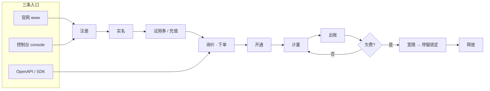

# 欧拉算力平台 · Euler Platform (Alpha)


**一句话**：自研公有云平台——面向中小企业、开发者团队与需要私有化交付的客户，
提供计算 / 存储 / 网络 / 数据库 / 中间件 / 监控六大类 14 款在售产品，
并把「注册 → 实名 → 充值/下单 → 开通 → 计量 → 出账 → 欠费治理 → 释放」做成一条可运营、可对账、可解释的商业闭环。

站点 `https://euler.emoera.com/` · 模块 `github.com/qifalab/euler-platform` · 架构规格（约束性事实源）见 `docs/architecture/`（00–11 章）

---

## 目录

- [产品定位](#产品定位)
- [产品目录](#产品目录)
- [客户旅程与入口](#客户旅程与入口)
- [计费与商业规则](#计费与商业规则)
- [可靠性与透明度](#可靠性与透明度)
- [开发者与生态](#开发者与生态)
- [平台名片](#平台名片)
- [仓库导航](#仓库导航)
- [快速开始](#快速开始)
- [验证状态](#验证状态)
- [Alpha 已知边界](#alpha-已知边界)
- [对客承诺（平台不变量）](#对客承诺平台不变量)
- [文档](#文档)

## 产品定位

**卖给谁**：中小企业、开发者团队、有私有化诉求的行业客户，以及上架商品的伙伴（云市场）。

**卖什么**：先把 IaaS 最小可售闭环做扎实——云服务器 + 块存储 + 对象存储 + 专有网络 + 托管数据库 + 公网 IP + 监控；
再在其上补齐负载均衡、弹性伸缩、容器实例、快照备份、缓存 / Kafka / 日志等经营型产品。不追求第一天复刻头部云的 300+ 产品。

**凭什么选我们**（差异化定位见 `docs/architecture/00-overview.md` §1.3）：

| 差异化 | 对客户意味着什么 |
|---|---|
| 计费完全透明 | 计量项、单价、抵扣规则全部可查、可导出；计费起点（首次 RUNNING）永不回拨；欠费状态机对客全透明 |
| 开发者体验优先 | API First：每个产品上线前必须先有 OpenAPI + SDK + 文档 + 在线调试，宁缺产品不缺 API |
| 可私有化交付的同构架构 | 全栈候选池不依赖任何公有云托管服务，同一份架构可从公有云平移进客户机房（第二增长曲线） |

## 产品目录

14 款在售产品 + 1 项账号能力（RAM 子账号），合 15 个售卖口径；另有云市场承载伙伴商品。

| 品类 | 产品 | 一句话定位 | 计费形态 |
|---|---|---|---|
| 计算 | **EUECS** 辰云服务器 | 云上虚拟服务器，一切资源的基础算力载体 | 包年包月 / 按量（按秒计量） |
| 计算 | **EUECI** 弹性容器实例 | 秒级拉起的容器实例，弹性计算的轻量搭档 | 按量（按秒） |
| 计算 | **EUAS** 弹性伸缩 | 伸缩组策略引擎，基于 ECS/ECI 自动扩缩容 | 按量（伸缩组·小时） |
| 存储 | **EUBS** 辰云块存储 | 挂载云服务器的高性能云盘 + 快照 | 包年包月 / 按量（容量） |
| 存储 | **EUOSS** 辰云对象存储 | S3 兼容海量非结构化存储，存储/请求/流量三流计量 | 按量 |
| 存储 | **EUBACKUP** 云备份 | 定时快照与跨可用区备份，保留期自动清理 | 按量（容量） |
| 网络 | **EUVPC** 辰云专有网络 | 租户逻辑隔离网络，一切资源的网络边界 | 免费档（零费率计量项） |
| 网络 | **EUEIP** 弹性公网 IP | 可独立购买、动态绑定的公网地址 | 按量（带宽 / 流量） |
| 网络 | **EULB** 辰云负载均衡 | 四层/七层负载均衡，跨可用区流量入口 | 按量（LCU / 流量） |
| 数据库 | **EURDS** 辰云数据库 MySQL 版 | 托管 MySQL，一主一备高可用 | 包年包月 / 按量 |
| 数据库 | **EUREDIS** 辰云数据库 Redis 版 | 托管 Redis，主备跨可用区 | 包年包月 / 按量 |
| 中间件 | **EUKAFKA** 辰云消息队列 Kafka 版 | 托管 Kafka，broker 跨可用区 | 包年包月 / 按量 |
| 中间件 | **EULOG** 辰云日志服务 | 日志采集与存储，多租户隔离 | 按量（写入 / 存储） |
| 监控运维 | **EUMON** 辰云监控 | 资源与自定义指标监控告警，基础档免费 | 免费档 + 自定义指标付费 |
| 账号与安全 | **RAM 子账号 / AK / STS** | 子用户、权限策略、临时凭证（平台能力，不单独售卖） | — |

上架口径（产品 = 资源类型 + 计量项 + OpenAPI，三要素不齐不上架）与逐产品范围见 `docs/architecture/01-product-catalog.md`。

## 客户旅程与入口

三条入口（官网 / 控制台 / OpenAPI）汇入同一条闭环；每一环都由独立服务承载，服务间以契约（proto）而非共享状态耦合。



| 站点 | 域名 | 客户在这里做什么 |
|---|---|---|
| 官网 | `www.euler.emoera.com` | 产品发现、定价、活动、注册与试用转化（内容由目录/公告后端驱动） |
| 控制台 | `console.euler.emoera.com` | 购买、资源管理与监控；微前端基座 + 12 个品类子应用 |
| 账号中心 | `account.euler.emoera.com` | 注册登录、实名、MFA、RAM 子账号、AK、STS 临时凭证（SSO 中心，根域会话） |
| 费用中心 | `billing.euler.emoera.com` | 账单、订单、资源包、续费、发票 |
| 工单支持 | `ticket.euler.emoera.com` | 工单、支持计划、服务健康看板 |
| 文档站 | `docs.euler.emoera.com` | 快速入门 + API 参考 + OpenAPI Explorer 在线调试 |

## 计费与商业规则

客户能验证的确定性，写在产品里，而不是写在话术里。

| 计费形态 | 状态 | 结算与资金行为 |
|---|---|---|
| 包年包月 | 已售 | 下单即扣款；退款按剩余时长折算，且**退款发生在资源释放之后** |
| 按量付费 | 已售 | 按秒计量、小时出账，从余额/券抵扣；余额不足进入欠费生命周期 |
| 资源包 | 模型预留（中台已建模，未售卖） | 预付额度优先抵扣，超标部分走余额 |
| 抢占式 | 模型预留（未售卖） | 分钟级浮动价，回收需已送达的 5 分钟通知 |

- **券体系**：代金券（可叠加，按到期升序消耗）/ 满减券（单张）/ 折扣券（单张，带封顶防资损）；
  扣减定序 **RATE → THRESHOLD → VOUCHER**，顺序可复现。
- **免费试用 = 试用券 + 标准订单链路**（不建独立免费额度系统），准入六规则定序、首个拒绝可解释：
  实名准入 / 身份去重（证件号 SHA-256，不留原始证件）/ 活动预算（活券计数）/ 终身限领 / 冷静期 / 并发上限。
- **欠费四段式状态机**（对客全透明）：

| 阶段 | 时长 | 资源状态 | 数据状态 | 通知 |
|---|---|---|---|---|
| 欠费 | 出账即时 | 正常服务 | 完整 | 出账失败即时通知 |
| 宽限期 | 24h（大客户按合同 72h） | 继续服务 | 完整 | 每 12h 催缴 |
| 停服锁定 | 30 天 | 冻结（停机 / 只读 / 拒读写） | **完整保留** | 锁定当天 + 剩 7 天 / 1 天 |
| 释放 | — | 资源删除 | 不可逆删除 | 释放前 24h 终版通知，留证可审计 |

包年包月到期：提前 30/15/7/3/1 天多轮提醒 → 到期停机进入 15 天保留期 → 释放前 24h 最终通知。

- **价格可追溯、不可改写**：定价规则只增不改（append-only），下单生成价格快照，出账/退款一律引用快照。

## 可靠性与透明度

- **可用性口径**：一期验收 管控面 OpenAPI ≥ 99.9%、对象存储数据面 ≥ 99.95%（P2 目标 99.95% / 99.99%）。
- **部署形态**：`cn-north-1` 华北 1 双可用区（a/b，主）；`cn-east-1` 华东 1 异地冷备，
  演练通过标准为 T0+30min 内登录/下单/出账链路可写（`tools/cross-region-failover-drill.md`）。
- **SLO 运营**：error budget + 1h/3d burn rate 驱动发布冻结政策与 SLA 资格判定；混沌演练科目带补救标记。
- **告警治理**：告警中心四阶段收敛（去重 / 分组 / 抑制 / 静默）+ 限流；**信任关键通知（欠费、释放警告）绕过限流**。
- **审计可信**：审计链防篡改、链头存链外（截断会被发现）、操作与放行记录可检索；等保三级 checklist 随仓库维护。
- **诚实边界**：2 AZ 均布不必然活过 AZ 故障（MGR 多数派数学，(2,1) 只能承受轻侧丢失）——不承诺自己做不到的事。

## 开发者与生态

- **OpenAPI**：RPC 风格 `Action` + 日期型 `Version`，一产品一子域 `{productCode}.api.euler.emoera.com`；
  `CPS1-HMAC-SHA256` 签名（`x-cps-*` 头），一份签名实现被 SDK / Explorer / 网关三处消费，7 条金样本向量钉死跨语言一致。
- **SDK**：Python SDK（金样本逐字节回归）、前端 `@eu/sdk`（统一请求 / 401 单飞刷新 / 结构化错误）、Terraform Provider 骨架。
- **文档门禁**：每个上架产品必须随附「产品简介 + 计费说明 + 快速入门 + API 参考」四篇，API 文档与 OpenAPI 元数据同源生成。
- **云市场**：伙伴发布商品 → 平台审核 → 订单履约 → 分账结算（幂等，按 bps 拆分伙伴/平台份额，分账之和恒等于总额）。
- **支持通道**：工单 + 支持计划 + 服务健康看板；状态机迁移事件进 Kafka，供费用中心/通知中心订阅。

## 平台名片

| 维度 | 现状 |
|---|---|
| 在售产品 | 14 款 + RAM 子账号（15 售卖口径）；云市场生态另计 |
| 地域 | `cn-north-1`（双 AZ，主）+ `cn-east-1`（异地冷备） |
| 服务 | 18 个可运行 Go 服务（stdlib HTTP，端口 91xx/92xx；另含 1 个服务模板） |
| 领域库 | `pkg-go` 38 个包、70 个测试文件、621 个测试函数（含资金双花、配额超卖、死锁回归） |
| 持久化 | `EULER_DB_DSN` 一键切换：真 MySQL（6 schema / 86 表 / 33 迁移）或零依赖内存模式 |
| 合同 | `proto-hub` 18 个 proto 包 + 破坏性变更 CI 门 |
| 前端 | Vue 3 + Wujie 微前端，20 个应用：6 站点 + 12 品类子应用 + 云市场 + 开发者 Explorer |
| 状态 | **Alpha**：全部服务可运行、可测试，已接入真实 MySQL；履约走 `provision.Driver` 契约的 Mock/KubeVirt-in-process，Kafka 事件与 ClickHouse 下沉是 phase-3 接线点 |

## 仓库导航

```
docs/architecture/     约束性架构规格（00–11 章）：产品目录、前端、服务、中间件、
                       数据可观测、K8s 产品化、安全、交付、路线图、调研与裁决
proto-hub/             IDL 事实源；VERSIONING.md + 破坏性变更 CI 基线
pkg-go/                领域库（38 包）：cps1/kms/accesskey/authz/totp/sts、
                       pricing/order/ledger/settlement/reservepack/spot/invoice、
                       resource/workflow/provision/ipam/quota、metering/billing/
                       anomaly、notify/audit/alertcenter、identifier/topology/
                       multiregion/event/errors/slo/chaos/release、trial、storage(SQL 适配层)
services/              18 个可运行服务（svc-* / console-bff / alert-center）
                       + rc-* 数据面控制器 CRD（按契约实现）+ _tmpl-go 服务模板
sdk/python/            Python SDK（cps1 金样本回归）
sdk/terraform/         Terraform Provider 骨架（source-only）
platform/frontend/     官网 + Wujie 控制台 + 20 个应用（含云市场与 Explorer）
deploy/gitops-manifests/  ArgoCD App-of-Apps；APISIX 网关；跨 AZ 中间件清单；
                       两地三中心异地冷备 override（cn-east-1）
tools/                 sqlmigrate + 仓库校验器（YAML/Lua/routes/proto/topology）
                       + AZ/跨区容灾演练 runbook + 等保三级 checklist
```

## 快速开始

前置：Go ≥ 1.22（以 `pkg-go/go.mod` 为准）、MySQL 8.0+/9.x（本地开发账号需
CREATE/DROP DATABASE 权限）、Node 18+ / pnpm（仅前端）。

### 1. 建库（真实持久化）

```sh
# 迁移工具按 migrations.json 应用全部服务 DDL；重复执行是安全的。
cd tools/sqlmigrate
export EULER_DB_DSN='user:password@tcp(127.0.0.1:3306)/'
go run .                # 全量应用；-dry-run 预览；-only svc-order 单服务
```

33 个迁移覆盖 6 个 schema：`account_db`(20 表) / `trade_db`(33) /
`resource_db`(11) / `support_db`(12) / `metering_db`(7) / `openapi_meta`(3)。
规则：**已应用迁移只增不改**——修正一律写新 Vn，幂等可重跑。

### 2. 运行一个服务

```sh
cd services/svc-order
export EULER_DB_DSN='user:password@tcp(127.0.0.1:3306)/'   # 不设 = 内存模式（demo/测试）
go run ./cmd/server
```

持久化是 **opt-in**：设了 `EULER_DB_DSN`，状态落库、重启不丢；未设则退回内存实现
（`go test` 因此零外部依赖）。配置了 DSN 却连不上的服务会**启动失败**——
资金/凭证/审计类服务不允许"静默降级为遗忘"。

### 3. 测试

```sh
cd pkg-go && go test ./...                     # 无 DSN：纯内存，全绿
cd pkg-go && EULER_DB_DSN=... go test ./...    # 有 DSN：SQL 适配器在真库上跑
cd services/svc-order && EULER_DB_DSN=... go test ./...
```

SQL 适配器的测试跑在 **schema of record** 上（`pkg-go/storage/sqltest`
为每个测试拉起一次性 scratch schema 并应用该服务自己的 DDL 目录），
而不是测试私有建表——列名漂移、DECIMAL 精度、唯一键仲裁、CHECK 约束
这些 fake 无法暴露的问题在 CI 即被抓出。

### 4. 前端

```sh
cd platform/frontend && pnpm install && pnpm -r dev
# console-base :5173；子应用 :517x/518x/519x（vite 代理注入 X-Euler-Account-Id）
```

开发态账号 `100123`（BFF 种子数据），SSO 登录 `admin@euler.emoera.com / euler123`。

## 验证状态

| 层 | 验证方式 |
|---|---|
| 领域库 | `go test`：621 个测试（资金/配额/工作流的并发回归；金样本向量） |
| SQL 适配器 | 真库测试：幂等 upsert、乐观锁冲突、DECIMAL 精度、并发死锁（配额首写路径 Error 1213 已根治）、跨重启重水化、双实现 parity |
| DDL | 33 个迁移真实应用 + 幂等重跑验证；迁移工具自身有 `-probe/-dry-run` 与 NULL 探测 |
| 服务 | 18/18 `go vet` + `go test`（有/无 DSN 双模式） |
| 签名链路 | svc-iam verify 线上 e2e（7 项）+ Python SDK 金样本逐字节 |
| 前端 | `pnpm -r typecheck` 全部通过（含 20 个应用与共享包） |
| K8s/Helm/Vitess | 清单与 chart 结构校验 + CI 门（YAML/Lua/routes/proto-breaking/topology-spread）——**未实际部署** |
| `-race` | 本 Windows 宿主无 cgo，未跑；并发正确性由双花/超卖/死锁内容测试覆盖 |

## Alpha 已知边界

- **履约驱动**：`provision.Driver` 契约下为 MockDriver / in-process KubeVirt
  （VMDriver 语义已测试：欠费冻结停机不删盘、VMI Ready 起算计费、按秒计量）；
  集群部署换绑 client-go 适配器即可，业务代码零改动。
- **事件通道**：`pkg-go/event` 的 topic 常量与负载已定义，服务间仍以同步
  调用为主；Kafka 接线是 phase-3 首批工作。
- **审计/日志下沉**：审计事件全文与账单明细的 ClickHouse 归档在
  DDL/注释中留有位置，MySQL 只存链检查点与热数据。
- **多区域**：`pkg-go/multiregion` 模型与两地三中心 runbook 就绪，
  异地（`cn-east-1`）以冷备形态存在，**不承诺异地多活写**。

## 对客承诺（平台不变量）

以下行为由测试钉死；改动即改变客户依赖的平台行为。

| 不变量 | 位置 | 为什么 |
|---|---|---|
| 金额定点，永不浮点 | `pricing.Amount` | 百万小时行上的浮点漂移使账单不可对账 |
| `paid → fulfilling` 是唯一开通触发 | `order` | 未支付订单不得创建资源 |
| 退款发生在资源释放之后 | `order.StartRefund` | 否则客户既持有钱又持有运行中的资源 |
| 余额不为负 | `ledger` | 透支是欠费状态，不是无授权授信 |
| 计费起点=首次 RUNNING，永不回拨 | `resource` / `svc-orchestrator` ledger | stop/start 不得重置计费时钟 |
| 释放前必须有可证明的送达警告 | `resource` + `notify` | 不得无留证销毁客户数据 |
| 信任关键通知绕过限流 | `notify` | 限流欠费警告违背其存在意义 |
| 配额计数含在途预留 | `quota` | 忽略它 = 两个订单抢最后一个名额 |
| 补偿逆序执行 | `workflow` | 配额必须在资源删除之后归还 |
| 审计链防篡改，链头存链外 | `audit` + `audit_chain_checkpoint` | 截断靠"存储的头与链不符"发现 |
| 未知 authz 条件 → deny | `authz` | 对不理解的输入 fail closed |
| 抢占回收需已送达的 5 分钟通知 | `provision.Preemptor` | 未警告过的东西不可回收 |
| 一份签名实现，三处消费 | `cps1` | SDK/Explorer/网关共享；Python 必须逐字节复现金样本 |
| proto 大版本内只增不破 | `proto-hub` | 字段号删除/复用是 CI 失败 |
| ZONAL 产品询价必须带 AZ | `svc-catalog` 门 | 在下单前拦下错误 placement，而非履约期 |
| 2 AZ 均布不必然活过 AZ 故障 | `topology.SurvivesAZLoss` | MGR 走多数派数学，(2,1) 只能承受轻侧丢失 |
| 结算分账之和恒等于总额 | `settlement` | 平台份额用减法导出，不允许第二次舍入 |
| 临时凭证必然过期 | `sts` | 零/负 TTL 在构造期拒绝 |
| 试用准入六规则定序，首个拒绝可解释 | `trial.Admit` | 说不出拒绝原因的拒绝无法对客解释 |
| 优惠券扣减定序 RATE→THRESHOLD→VOUCHER | `pricing` | 顺序可变的折扣使同一账单不可复现 |

## 文档

- `docs/architecture/00..11` — 平台规格（约束性）：产品目录、前端、服务、中间件、数据与可观测、K8s 产品化、安全、交付、路线图
- `docs/architecture/09-roadmap.md` §4.0/§5.0 — 二/三期实装回写
- `proto-hub/VERSIONING.md` — API 版本化与废弃策略
- `tools/az-failover-drill.md`、`tools/cross-region-failover-drill.md`、
  `tools/chaos-drill-runbook.md`、`tools/dengbao-level3-checklist.md`
- `platform/frontend/README.md` — 前端结构与子应用清单
