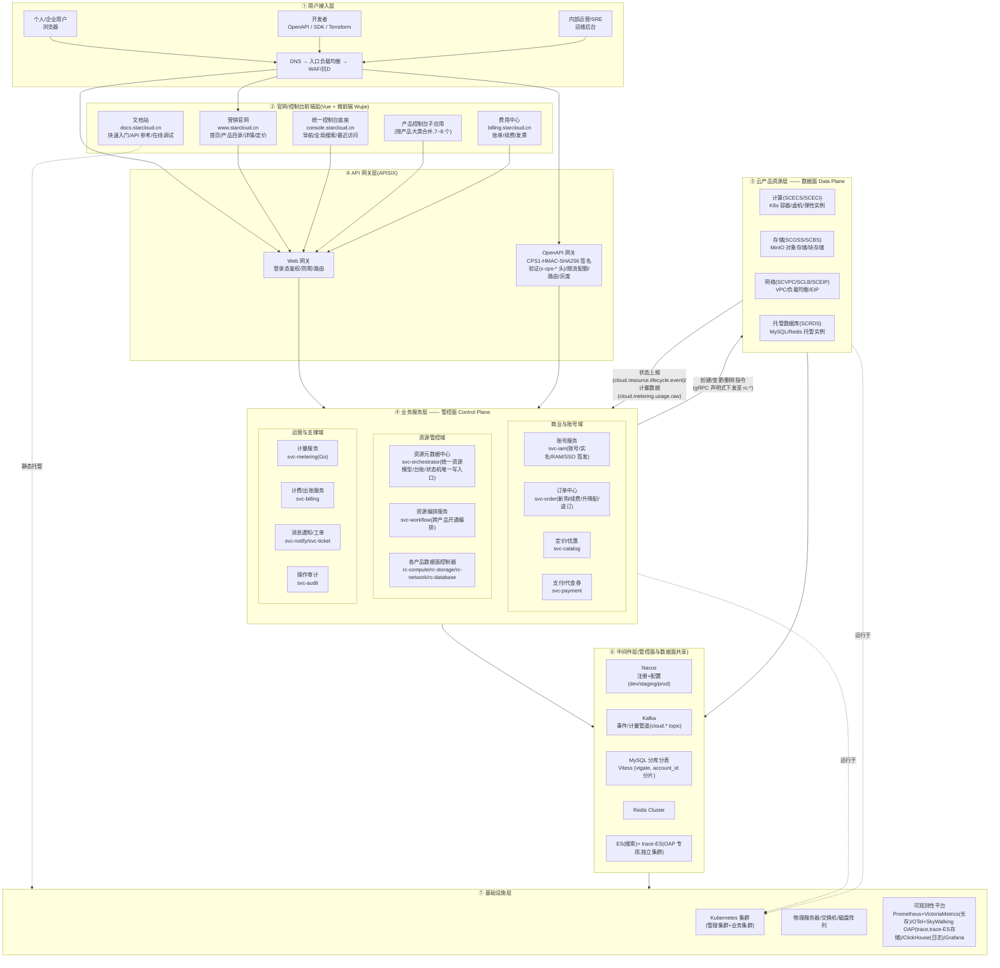
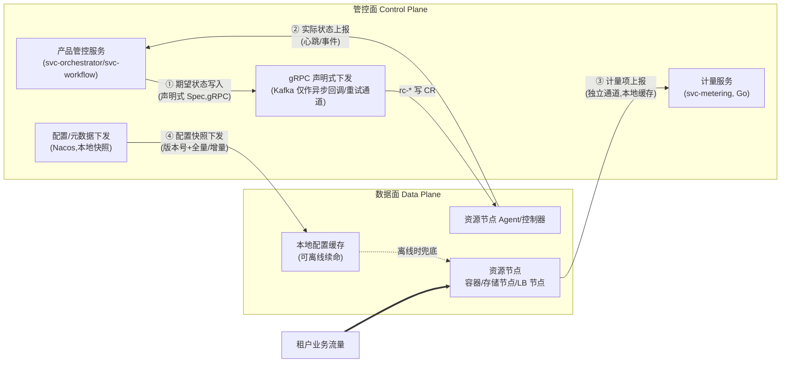
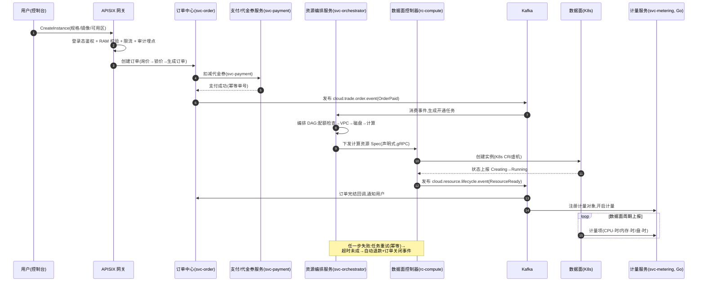
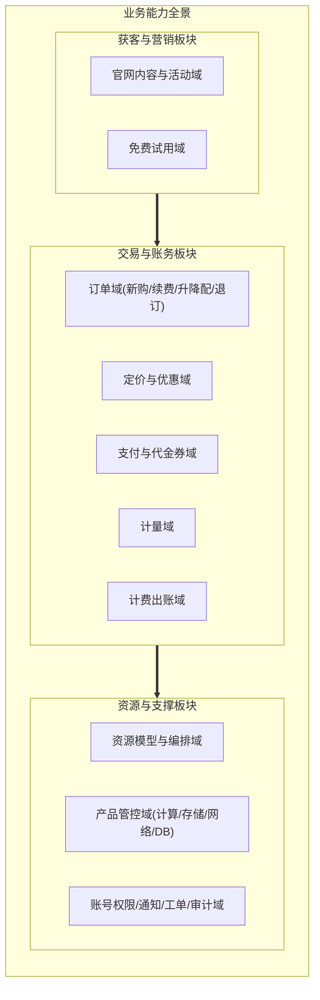
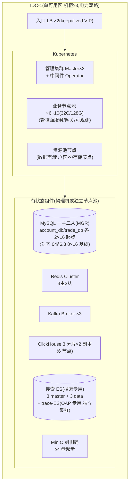
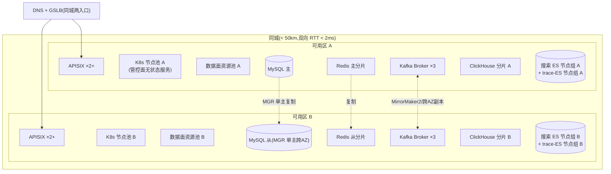
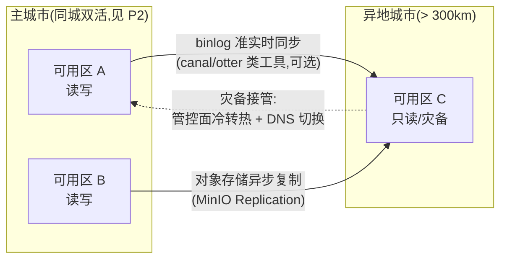

# 第 0 章 · 总体架构总览与分层

> **文档定位**:本书是"自建云服务平台"的产品大框架蓝图(对标阿里云官网形态:营销官网 + 产品控制台 + 文档站 + 账号/费用中心 + 计费出账 + 资源生命周期管理)。本章是全书第一章,负责给出**全局骨架级结论**:定位与约束、分层架构、管控面/数据面划分、四大视图概览、部署拓扑与演进、架构原则、全书导读。
>
> **阅读对象**:架构评审委员会、各章负责人、研发/SRE TL。本章结论对后续各章具有约束力;后续章节如与本章冲突,须显式说明并提请架构评审。
>
> **版本**:v1.1(2026-08) · **状态**:已按裁决书《11-adjudication-decisions.md》传播修复;版本/部署三阶段为本书基线事实源,§4.2 P1/P2/P3 与《09-roadmap.md》一期/二期/三期一一映射。

---

## 目录

- [1. 平台愿景与定位](#1-平台愿景与定位)
- [2. 总体分层架构](#2-总体分层架构)
- [3. 四大视图概览](#3-四大视图概览)
- [4. 全局部署拓扑与演进](#4-全局部署拓扑与演进)
- [5. 架构原则清单](#5-架构原则清单)
- [6. 全书章节导读](#6-全书章节导读)
- [附录 A:术语表](#附录-a术语表)
- [附录 B:插图清单](#附录-b插图清单)

---

## 1. 平台愿景与定位

### 1.1 一句话定位

**以自建基础设施为底座,以 Kubernetes 为核心资源池,对外提供"计算 + 存储 + 网络 + 托管数据库"最小可售闭环的自研云服务平台;以完全透明的计量计费与资源生命周期管理建立商业信任,以 API First 与标准化产品目录支撑产品线的持续扩张。**

我们不追求在第一天复刻阿里云的 300+ 产品,而是先把"账号—购买—开通—计量—出账—续费—到期—释放"这条主链路做到金融级可靠,再按产品目录逐个"填槽"。一期 MVP 可售产品集为:**IAM/计费骨架/商品化中台 + SCVPC(网络)+ SCECS(云服务器 VM)+ SCBS(块存储)+ SCOSS(对象存储)+ SCRDS(托管 MySQL)+ SCMON(监控)+ SCEIP(弹性公网 IP)**,SCECI(弹性容器实例)后置二期(详见《01-product-catalog.md》§3.2、《09-roadmap.md》R-01;对标启示见《10-research-and-selection-decisions.md》§3.4);该组合满足上述最小可售闭环(计算 + 存储 + 网络 + 托管数据库)。

### 1.2 对标阿里云:全面学习,有限实现

对标策略分为三档:**照搬(模式照抄)、裁剪(简化实现)、不做(明确放弃)**。

| 档位 | 内容 | 说明 |
|---|---|---|
| **照搬** | 计费四形态模型(包年包月/按量/抢占式/资源包,Day1 预留模型,Day1 仅售卖包年包月+按量两形态,抢占式售卖后置二期,资源包后置二期)、出账链路(计量→小时出账→抵扣→月账单)、欠费生命周期状态机(欠费→宽限→停服锁定→释放)、Region/AZ 资源模型、RAM 式账号权限模型、"目录三件套"(分类目录→产品详情→定价)官网 IA | 这些是云厂商二十年的商业沉淀,自建无捷径,Day1 模型必须对齐(售卖节奏以 01 D6 为准) |
| **裁剪** | 产品大类(只做计算/存储/网络/数据库四大类起步,不做大数据与 AI 全家桶)、控制台功能(先做资源 CRUD + 监控,高级诊断后置)、支持计划(模型四档:免费/基础/商业/企业,一期先开放基础/商业两档)、文档站(产品简介 + 计费说明 + 快速入门 + API 参考四篇最低门禁,最佳实践/FAQ 后补)、免费试用(试用代金券一期落地,满减/折扣券后置二期) | 形态一致、深度降级,保证"麻雀虽小五脏俱全" |
| **不做** | 云市场、全球多 Region 组网(CEN 类)、行业解决方案定制页、全品类 Serverless、混合云纳管 | 见 1.3 约束分析;明确写入"可晚做/不做清单",避免需求蔓延 |

> 对标调研成果的权威出处统一为《10-research-and-selection-decisions.md》:产品大类全景、官网信息架构、商业模式要点及"10 条对标启示"(见 §3.4)、"可后置/不可后置清单"(见 §3.5)均以该文件为唯一事实源,全书按编号引用的"对标启示 N""选型坑清单 #N"等均以该文件为准(各章引用写法与锚点映射见该文件 §1)。其中"MVP 顺序"与"不可后置清单"直接约束本书后续所有章节的优先级排序。

### 1.3 差异化定位与自建约束

**差异化定位**(相对头部公有云):

1. **可私有化交付的同构架构**——所有组件均选自可在 IDC 自建的开源/自研栈(不依赖任何公有云托管服务),架构天然支持整体搬迁到客户机房,形成"私有云交付"第二增长曲线。
2. **计费完全透明**——计量项、单价、抵扣规则全部开放查询与 OpenAPI 导出,以透明度作为对中小客户的差异化卖点。
3. **开发者体验优先**——OpenAPI/SDK/文档在线调试作为每个产品上线的准入门槛,宁缺产品不缺 API。

**自建约束及其对架构的直接影响**:

| 约束 | 现状假设 | 对架构的影响 |
|---|---|---|
| 团队规模 | 初创期 30~50 人(研发 60%、SRE ≤ 6 人) | 拒绝引入候选池之外的重型组件;每个中间件选型把"运维人力成本"作为一票否决项 |
| 机房条件 | 起步单 IDC,同城有第二机房可租用,异地机房 18 个月后具备 | 部署拓扑按"单 AZ → 同城双活 → 两地三中心"三阶段演进(见第 4 章),数据模型 Day 1 预留 Region 字段 |
| 预算 | 硬件按年滚动采购,无法一次性囤积 | 所有有状态组件必须支持小规格起步、在线水平扩容(分库分表、Redis Cluster、Kafka 分区、K8s 加节点) |
| 合规 | 需满足等保二级起步、用户实名认证 | 账号体系内置实名认证流程位;审计日志不可删除、独立存储(见《07-security.md》) |
| 生态 | 无存量客户、无存量系统 | 没有历史包袱:可以 IDL-first、GitOps 全量铺开;但也意味着品牌信任必须靠"欠费状态机透明、不删数据"等底线行为积累 |

### 1.4 设计目标与量化指标(北极星指标)

总体架构服务于四个量化目标,作为各章设计取舍的裁判依据:

| 维度 | 目标 | 量化指标(一期验收口径) |
|---|---|---|
| **商业闭环正确性** | 一分钱不多收、一分钱不漏收 | 计量采集丢失率 < 0.01%;出账无未解释差异;账单争议率 < 0.1% |
| **可用性** | 管控面故障不影响存量数据面业务 | 一期验收口径见《09-roadmap.md》§3.5 A4:管控面 OpenAPI 可用性 ≥ 99.9%、对象存储数据面 ≥ 99.95%;数据持久性(对象存储)≥ 99.9999999%(纠删码)。本表 99.95%/99.99% 为 P2 阶段目标,非一期验收口径 |
| **产品上架效率** | 新产品"填槽式"接入 | 新产品接入(资源类型 + 计量项 + OpenAPI + 控制台槽位)≤ 4 人周;OpenAPI 文档与控制台同步发布率 100% |
| **运维效率** | 少人化运维 | 单人 SRE 可运维组件数 ≥ 8 类;变更 100% 经 GitOps 流水线;故障定位 P90 ≤ 15 分钟(依赖三件套联动) |

---

## 2. 总体分层架构

### 2.1 七层全景

平台自上而下分为七层。下图是全书的"总图",后续所有章节都是对其中某一层或某一格的放大。

**各层职责一句话定义**:

| 层 | 职责 | 关键产出 | 详见章节 |
|---|---|---|---|
| ① 用户接入层 | 把人/程序安全地接进来 | DNS 规划、入口 LB、WAF/抗D 策略 | 《07-security.md》 |
| ② 前端层 | 呈现与交互,不含业务逻辑 | 微前端应用拆分、统一设计体系 | 《02-frontend-architecture.md》 |
| ③ 网关层 | 南北向唯一入口:认证、限流、路由、灰度、审计 | 路由规划、插件策略 | 《04-middleware-infrastructure.md》 |
| ④ 业务服务层(管控面) | 全部商业与资源管理逻辑 | 微服务清单(svc-*/rc-* 命名,见《03-backend-services.md》§4.0)、领域模型、核心流程 | 《03-backend-services.md》 |
| ⑤ 云产品资源层(数据面) | 真正承载租户业务负载的资源 | 各产品资源控制器与数据通道 | 《06-kubernetes-productization.md》等 |
| ⑥ 中间件层 | 提供注册、消息、存储、缓存等公共能力 | 集群部署形态与容量 | 《04-middleware-infrastructure.md》 |
| ⑦ 基础设施层 | 物理与容器底座、可观测性平台 | K8s 集群规划、监控体系 | 《04-middleware-infrastructure.md》《05-data-observability.md》 |

**层间依赖铁律**(架构评审检查项):

1. 只允许**自上而下**调用;禁止反向依赖(数据面不得同步调用管控面接口,只允许异步上报)。
2. 禁止**跨层穿透**:前端不得直连任何数据库/中间件;业务服务不得绕过网关直接暴露公网。
3. 中间件层**不感知业务语义**,业务服务不得把业务逻辑下沉为中间件插件(APISIX 插件只做通用治理)。
4. 可观测性(⑦)是**横切层**:任何层的组件必须无侵入地暴露 metrics/logs/trace,见《05-data-observability.md》。

### 2.2 管控面与数据面:云平台架构的骨架

这是全书最重要的一对概念,必须先讲透。

#### 2.2.1 定义与边界

- **管控面(Control Plane)**:处理"**关于资源**的请求"——创建、删除、变配、续费、出账、授权。用户通过控制台/OpenAPI 触达的所有商业与管理逻辑都在管控面。
- **数据面(Data Plane)**:承载"**租户真实业务流量**"——虚机里跑的用户进程、对象存储的读写请求、负载均衡的转发流量、托管数据库的连接与 SQL。

同一个产品天然由两面组成,以对象存储为例:

| 动作 | 属于 | 特征 |
|---|---|---|
| 创建 Bucket、设置配额、配置生命周期规则 | 管控面 | 低频、事务性、可容忍秒级延迟 |
| PUT/GET 对象、CDN 回源拉取 | 数据面 | 高频、大带宽、毫秒级敏感、直接产生计量 |

#### 2.2.2 为什么必须严格分离:五个维度的差异

| 维度 | 管控面 | 数据面 |
|---|---|---|
| 流量形态 | 低 QPS、突发(活动页引流)、请求重 | 高 QPS/大吞吐、持续、请求轻 |
| 一致性要求 | 强一致(订单、余额、库存不能错) | 最终一致可接受(状态上报晚几秒没事) |
| 变更频率 | 高(业务迭代每周多次) | 低(资源节点变更必须灰度、可回滚) |
| 可用性口径 | 一期 ≥99.9%(P2 目标 99.95%,允许短暂不可下单) | 一期 ≥99.95%(P2 目标 99.99%+,租户业务不能断) |
| 故障影响 | 不能买/不能改,**存量业务不受影响** | 租户业务直接受损,是 P1 事故 |

**核心结论(写入架构原则):** 管控面整体宕机时,数据面必须保持"降级自治"——已有资源继续服务、停止接受新变更、计量数据本地缓存待补传。这条结论决定了后续一系列工程决策。

#### 2.2.3 两面的交互模型

交互四通道及其工程要求:

1. **指令通道(管控面→数据面)**:采用**声明式期望状态**(Spec 下发,Agent 收敛),而不是命令式 RPC;下发走 **gRPC 声明式下发**(经 svc-workflow 派发步骤)→ rc-* 数据面控制器写 CR,Kafka 的 `cloud.resource.provision.task` 仅作异步回调与重试通道。理由:命令式调用在数据面节点重启/断网后状态丢失;声明式天然具备"断线重连后自动追平"能力。K8s 本身就是这个模型的实现,因此我们优先把产品数据面构建在 K8s Operator 之上(见《06-kubernetes-productization.md》)。
2. **上报通道(数据面→管控面)**:状态变更事件 + 周期心跳双通道;管控面侧做幂等去重与乱序合并(以 resource_version 单调递增为准);资源台账由 svc-orchestrator 的 resource_instance 表统一承接,K8s phase 仅作观测字段。
3. **计量通道(数据面→计量服务)**:独立于状态上报的专用 Kafka topic(`cloud.metering.usage.raw`),消费端"至少一次 + 幂等键"保证不丢;节点侧本地磁盘缓存 ≥ 24h,管控面/计量链路故障时补传。计量通道设计详见《03-backend-services.md》计量域与《05-data-observability.md》,topic 清单以《04-middleware-infrastructure.md》§5.4 为唯一事实源。
4. **配置通道(管控面→数据面)**:所有下发配置带版本号,数据面节点本地落盘缓存;**配置中心不可用时,节点用最后一次快照继续运行**——这是"管控面挂了数据面不死"的关键实现。

#### 2.2.4 典型产品的管控面/数据面边界清单

| 产品 | 管控面组件 | 数据面组件 | 数据面技术底座 |
|---|---|---|---|
| 云主机/容器实例 | svc-orchestrator(编排)+ rc-compute(数据面) | 虚机/容器运行时、宿主机 Agent | Kubernetes(见《06-kubernetes-productization.md》) |
| 对象存储 | svc-orchestrator + rc-storage | MinIO 存储节点、S3 API 端点 | MinIO Operator |
| 负载均衡 | svc-orchestrator + rc-network | 转发节点(keepalived/DPDK 或 K8s Ingress 体系) | K8s + 裸金属转发节点 |
| 托管 MySQL | svc-orchestrator + rc-database(实例生命周期/备份/高可用切换) | mysqld 实例、代理层 | K8s Operator(StatefulSet) |
| VPC/网络 | svc-orchestrator + rc-network | vSwitch/隧道封装、EIP 网关 | K8s CNI + 边界网关 |

#### 2.2.5 分离带来的六条落地规则(评审检查项)

1. 数据面组件**禁止在请求路径上同步调用**管控面服务(鉴权类查询必须走本地缓存 + 异步刷新)。
2. 管控面发布/重启时,数据面**零感知**(下发通道幂等重连即可)。
3. 管控面与数据面**独立扩缩容、独立发布流水线、独立值班**(故障域隔离)。
4. 数据面资源节点只信任**签名过的指令与配置**(指令带管控面签名,防伪造,见《07-security.md》)。
5. 每个数据面组件必须通过"**拔掉管控面网络**"的混沌演练(见《08-devops-delivery.md》演练章节)。
6. OpenAPI 中凡是数据面能力(如 OSS 的 S3 兼容端点)走**独立数据面域名体系**,与管控面 API 域名分开解析、分开限流。

### 2.3 典型请求路径

#### 2.3.1 新购一台云主机(包年包月)——管控面主链路时序

这是全平台最复杂的一条链路,串联了订单、支付、编排、产品管控、计量五个域,是《03-backend-services.md》的核心时序,此处给出总览:

要点:支付与开通通过 Kafka 事件(`cloud.trade.order.event`/`cloud.resource.lifecycle.event`)解耦(异步优先);开通是声明式 DAG,失败可重试可补偿;资源下发经 svc-orchestrator→rc-* 写 CR,计量对象在资源 Running 的瞬间注册(`cloud.metering.usage.raw`),杜绝漏计费。topic 清单以《04-middleware-infrastructure.md》§5.4 为唯一事实源。

#### 2.3.2 三类标准路径

| 路径 | 走向 | 协议 | 延迟目标 |
|---|---|---|---|
| **同步读路径** | 浏览器 → APISIX → BFF/业务服务(svc-*) →(Redis 缓存→MySQL) | HTTP/JSON;东西向 gRPC | P95 ≤ 300ms(控制台查询) |
| **异步写路径** | 业务服务 → Kafka(`cloud.*` topic)→ 下游域消费落库/编排 | Protobuf 消息 | 端到端 ≤ 5s(开通类任务 P95) |
| **数据面路径** | 租户应用 → 数据面接入点(rc-* 资源节点) | S3/gRPC/TCP/隧道 | 产品级 SLO,与管控面无关 |

南北向统一 HTTP/OpenAPI(JSON),东西向统一 gRPC + Protobuf(IDL-first,跨 Go 服务生成),与选型决策表一致(《10-research-and-selection-decisions.md》§4.2),落地详见《04-middleware-infrastructure.md》。

### 2.4 关键选型速览(与全书决策表对齐)

本章只给结论级速览;每项的"结论 + 理由 + 备选 + 何时改选"完整论证,选型层面以决策表《10-research-and-selection-decisions.md》§4.2 为准,中间件落地论证见《04-middleware-infrastructure.md》,技术栈全景见《03-backend-services.md》。下表与《全栈技术选型决策表》(即决策表,调研输入二 · 第二节)完全一致,此处摘录与本层强相关的决策。

| 层 | 决策(结论) | 核心理由 | 备选 | 改选条件 |
|---|---|---|---|---|
| 网关层 | **APISIX** | 全动态配置、插件热加载、语言中立统一承接 Go 服务;限流/认证/灰度插件成熟、K8s 友好 | Kong | 需商业支持合同时评估 Kong |
| 后端框架 | **Kratos(统一 Go)** | 单语言收敛运维面与技能栈;统一注册 Nacos、东西向 gRPC 对齐 | Go-Zero | Go 团队需要开箱即用(内置缓存/限流/代码生成)快速起步;一旦定下不允许两框架混用 |
| 注册/配置 | **Nacos 一体化** | 一套 HA 集群一套权限,运维成本减半;双语言 SDK 成熟;namespace 三套(dev/staging/prod,联调合并入 dev)、Group=应用名覆盖多环境 | Apollo(配置) | 需合规级变更审批 + IP 级灰度 + 数千配置项且已有 Apollo 运维经验(三个条件同时满足) |
| 前端微前端 | **Wujie** | WebComponent + 沙箱隔离好、框架无关、对 Vite 子应用友好 | qiankun | 已有 qiankun 存量或追求最大社区 |
| 容器底座 | **Kubernetes** | 同时是管控面运行底座与数据面资源池,一套平台两面复用 | 无(候选池内唯一) | — |

**注意(兼容性提醒,摘自决策表)**:APISIX 的 Nacos discovery 插件需锁定 Nacos 版本并配置鉴权(决策表兼容性坑清单 #2);APISIX 依赖 etcd,须纳入运维清单(坑清单 #3)——编号全文见《10-research-and-selection-decisions.md》§4.4,落地规避措施见《04-middleware-infrastructure.md》各节 ⚠ 兼容性标注。

---

## 3. 四大视图概览

按企业架构惯例,全书内容组织为业务、应用、数据、技术四个视图。本章只给每个视图的"骨架与索引",细节分别落在对应章节。

### 3.1 业务视图:我们经营什么

业务视图回答"平台卖什么、围绕卖东西有哪些业务能力"。全域划分为三大板块、十个一级域:

业务视图的三条主线:

1. **产品目录主线**:分类目录 → 产品详情 → 定价的"三件套"模板,新产品 = 填槽。见《01-product-catalog.md》(对标启示/选型决策的权威源为《10-research-and-selection-decisions.md》§3.4)。
2. **交易主线**:询价 → 订单 → 支付 → 开通 → 计量 → 出账 → 续费/退订的统一订单模型。见《03-backend-services.md》。
3. **生命周期主线**:运行/停机/到期/锁定/释放状态机 + 数据保留政策 + 到期前多渠道通知,是对用户的信任底线。见《03-backend-services.md》。

### 3.2 应用视图:我们建哪些系统

应用视图回答"有哪些前端应用与微服务、边界在哪"。

**前端应用清单**(详见《02-frontend-architecture.md》):

| 应用 | 形态 | 说明 |
|---|---|---|
| 营销官网 | Vue SSR 独立应用 | 首页/目录/详情/定价/活动,SEO 敏感 |
| 控制台底座 | Vue 微前端主应用(Wujie) | 登录态、导航、全局搜索、消息中心、子应用注册 |
| 产品控制台子应用 | 按产品大类合并拆分(console-compute/console-network/console-storage/console-database/console-security/console-account/console-billing/console-monitor 等约 7~8 个,每子应用一仓库;**完整品类口径与子应用映射以《02-frontend-architecture.md》§1.2 为准**) | 独立仓库、独立发布 |
| 费用中心 | 独立站 + 控制台子应用双入口(billing.starcloud.cn 子域) | 账单/续费/发票,财务强一致展示(billing 子域) |
| 文档站 | 静态生成 + 在线调试组件(docs.starcloud.cn 子域) | 与 OpenAPI 元数据同源生成 |
| 账号/SSO 中心 | 独立 SPA(account.starcloud.cn 子域) | 账号+SSO 中心,由 svc-iam 签发根域 Cookie,各子域共享 |
| 工单站 | 独立站 + 控制台子应用双入口(ticket.starcloud.cn 子域) | 提交/查询工单 |
| 运维/运营后台 | 独立应用(内网) | 客服工单、运营配置、审计查询 |

**后端服务清单(17 个核心服务)**(详见《03-backend-services.md》§4.0 服务总表,以此处为全书统一口径):

| 分组 | 服务 | 语言/框架 |
|---|---|---|
| 接入 | 控制台 BFF(console-bff)、站点 BFF(site-bff) | Go / Kratos |
| 账号权限 | svc-iam、svc-audit、svc-kms | Go / Kratos |
| 交易账务 | svc-order、svc-catalog(代金券最小实现)、svc-payment、svc-metering、svc-billing | Go / Kratos |
| 资源管控 | svc-orchestrator(资源生命周期唯一所有者)、svc-api-meta、各产品 rc-* 数据面控制器 | Go / Kratos |
| 支撑 | svc-notify、svc-ticket、svc-quota、svc-workflow、svc-monitor、alert-engine、alert-center | Go / Kratos |

> OpenAPI 入口由 APISIX + svc-api-meta 承担,**不单设 OpenAPI BFF 服务**;APISIX 完成签名验证/限流/路由后,请求直达对应业务服务。

应用视图的两条硬约束:

- **服务边界 = 领域边界**,一个服务独占自己的分库(参见《05-data-observability.md》数据权属规则;服务命名统一 `svc-{domain}`,Nacos Group=应用名,见附录 A 全局标识规范);
- **跨服务只允许两种交互**:同步 gRPC 查询(读)/ Kafka 事件(`cloud.*` topic,写与流程驱动),禁止跨服务直连库、禁止分布式事务跨三个以上服务。

### 3.3 数据视图:数据怎么放、怎么流

数据视图回答"有哪几类数据、分别用什么存、怎么流转"。总表如下(详细 schema、分片键、TTL 见《05-data-observability.md》):

| 数据类别 | 典型内容 | 存储选型 | 关键设计点 |
|---|---|---|---|
| 交易与账务(OLTP) | 订单、账单、余额流水(ledger 归 trade_db) | MySQL 分库分表(Vitess/vtgate) | account_id 为全局分片键;balance 与余额流水归 trade_db ledger(见《04-middleware-infrastructure.md》§6.3),account 表只存身份属性;余额流水只增不改 |
| 资源元数据 | 全产品资源清单、标签、状态机(resource_instance 台账) | MySQL 分库分表 + Redis 缓存 | 统一资源 ID 格式(见附录 A 全局标识规范);account_id 分片、region_id 必备字段但不作分片键;台账唯一写入口=svc-orchestrator |
| 计量数据 | 逐资源逐计量项原始记录 | Kafka(`cloud.metering.usage.raw`)→ ClickHouse(明细)+ MySQL(汇总账单) | 幂等键去重;小时级预聚合;topic 清单见《04-middleware-infrastructure.md》§5.4 |
| 日志 | 应用日志/审计日志/数据面访问日志 | Vector → ClickHouse(分区 + TTL 分层) | 强制携带 trace_id/service/instance;审计合规基线 ≥180 天热存 + MinIO 冷备,付费档 365 天/18 个月 |
| 监控指标 | 管控面 + 数据面 metrics | Prometheus(短期热数据)→ VictoriaMetrics(长期,remote_write) | 标签基数治理;迁移期双写对比 ≥1 周(决策表坑清单 #7) |
| 调用链 | 分布式 Trace/Span | SkyWalking OAP(接收 OTel/OTLP,存储用独立的 trace-ES 集群,与搜索 ES 物理隔离) | 全平台统一 OTel 埋点(禁止 SW agent 并存,坑清单 #1);trace_id 全链路透传并注入日志 |
| 搜索 | 资源/订单/文档检索 | Elasticsearch(搜索 ES 集群,与 trace-ES 物理隔离) | 由 Kafka 消费准实时同步 |
| 对象数据 | 用户对象存储数据、镜像、备份 | MinIO(纠删码) | 数据面,独立容量规划 |

数据视图的一条总原则:**写路径一律经 Kafka(`cloud.*` topic)削峰解耦,读路径优先缓存与预聚合**;任何"明细→汇总"的口径必须在计量/计费域内闭环对账(商业验收口径为"无未解释差异",工程阈值差异率>0.1% 触发补数、>0.5% 触发告警)。

### 3.4 技术视图:用什么技术、怎么部署

技术视图回答"候选池如何落到每一层、以什么形态部署"。

- **中间件与基础设施**(APISIX、Nacos、Kafka、MySQL、Redis、ES、MinIO、K8s 的部署形态、容量与高可用):见《04-middleware-infrastructure.md》。
- **K8s 集群规划与云产品产品化**(管理集群/业务集群划分、Operator 模式、ACK 形态):见《06-kubernetes-productization.md》。
- **可观测性体系**(metrics/logs/trace 三支柱联动与告警:指标 Prometheus 短期热数据 + VictoriaMetrics 长存、日志 ClickHouse、调用链 OTel 埋点 → SkyWalking OAP 接收(存储用独立的 trace-ES 集群,与搜索 ES 物理隔离),Grafana 统一展示、对客告警由 alert-engine + alert-center 走对客通道):见《05-data-observability.md》。
- **交付体系**(GitLab CI + ArgoCD GitOps、环境规划、发布策略):见《08-devops-delivery.md》。

技术视图的总约束:**候选池闭环**——不引入《全栈技术选型决策表》(《10-research-and-selection-decisions.md》§4.1~§4.2)候选池之外的重型组件;辅助小工具(如 Vector、canal 类 binlog 同步工具)允许使用但必须标注"可选"(决策表 §4.5 辅助工具清单),且需 SRE 评审运维成本,评审流程见《09-roadmap.md》。

---

## 4. 全局部署拓扑与演进

### 4.1 部署单元模型:Region / 可用区

所有资源在数据模型上 Day 1 带 `region_id` 与 `az_id` 作用域(对标阿里云 Region/AZ 模型),即使一期只部署单机房:

- **Region(地域)**= 一套独立完整的管控面 + 中间件 + 资源池部署,对外一个 API Endpoint;跨 Region 默认不共享任何状态(账号体系除外,账号为全局域)。
- **可用区(AZ)**= Region 内电力/网络独立的故障域;资源声明 AZ 亲和或跨 AZ 打散。
- **命名规范**:`region` 如 `cn-north-1`/`cn-east-1`,可用区如 `cn-north-1-a`(短横线风格);所有表、topic、监控标签强制携带 `region_id`,为多地域演进预留——这是"模型先行、部署后置"的典型体现。region_id 作为资源元数据字段但不作分片键(分片键统一为 account_id,见附录 A)。

### 4.2 部署演进三阶段总览

| 阶段 | 拓扑 | 时间窗(参考) | 可用性承诺 | 触发条件(满足任一即启动) |
|---|---|---|---|---|
| P1 | 单 IDC 单可用区 | 0~6 个月(一期:6 月 GA 内测、9 月 GA 正式) | 控制面 ≥ 99.9%、对象存储数据面 ≥ 99.95%(一期验收口径) | 立项即建 |
| P2 | 同城双可用区双活 | 6~18 个月 | 99.95%(管控面)/99.99%(核心数据面,均为 P2 阶段目标) | 付费客户 > 500 或签下 ≥99.95% SLA 合同或等保三级要求 |
| P3 | 两地三中心(同城双活 + 异地灾备);异地多活写属 P3,三 AZ 不在本期规划 | 18 个月+ | 关键数据 RPO≈0、RTO ≤ 30min | 监管要求 / 金融类客户容灾合同 / 单城风险不可接受 |

> 部署三阶段映射(本书 P1/P2/P3 与《09-roadmap.md》一期/二期/三期一一对应):一期(0–9 月)= P1 单机房单 AZ;二期 = P2 同城双 AZ 双活;三期 = P3 两地三中心。一期对应 P1 单机房,**P2 起才进入双机房**;"同城三机房/三可用区"不在本期规划(详见《09-roadmap.md》§2.3 映射表)。

### 4.3 P1:单可用区生产拓扑(起步)

目标:最小硬件把全链路跑起来,所有有状态组件保留水平扩展位。

起步容量建议(按 30 人团队、千级租户估算,一期规模基线见《09-roadmap.md》§3.4 一期规模假设基线表:租户数 1000、活跃用户 1 万、在管资源 5 万、OpenAPI 峰值 QPS 2000、网关峰值 QPS 8000、计量吞吐峰值 1250 条/s):K8s 业务节点 6~10 台(32C/128G 混配,非 16C64G);APISIX 4 节点(每节点 4C8G,冗余 50%);MySQL 每分库组 1 主 2 从 MGR,account_db/trade_db 各 2×16 起步(对齐 04§6.3 8×16 基线),SSD;备份每日全量 + binlog 增量,**异地(机房外)冷备**从 P1 就要有。搜索 ES 3 master + 3 data(8C32G/500GB)承载官网搜索;trace 存储由 SkyWalking OAP 使用独立的 trace-ES 集群(3 节点 16C/64G/2TB,保留 7~15 天),与搜索 ES 物理隔离(见《04-middleware-infrastructure.md》§8、§10.1);可观测性基线组件(Prometheus、VictoriaMetrics 长期指标、Grafana、alert-engine/alert-center 对客告警、SkyWalking OAP、Vector)部署于 K8s 可观测节点池(见《04-middleware-infrastructure.md》§2.1);VictoriaMetrics 在 P1 即作为长期指标存储(见《05-data-observability.md》§7、《09-roadmap.md》)。详细容量计算见《04-middleware-infrastructure.md》。

### 4.4 P2:同城双可用区双活(目标态)

P2 设计要点:

1. **管控面无状态服务双 AZ 对等部署**,任一 AZ 故障由入口 LB 摘除,业务不中断;K8s 节点池跨 AZ 打散。
2. **MySQL**:采用 MGR 单主模式,跨 AZ 部署(AZ 间 RTT < 2ms 时用 MGR,否则降级半同步作为备选,默认 MGR),每逻辑库 1 主 2 从;故障切换由管控组件编排(见《04-middleware-infrastructure.md》§6.9 高可用章节);账单/余额类核心库(ledger 归 trade_db)优先保 RPO=0。
3. **Redis/Kafka/ClickHouse/搜索 ES + trace-ES** 副本与分片跨 AZ 分布,客户端容忍单 AZ 副本全失。
4. **数据面**:租户资源支持"跨 AZ 冗余"规格(如 LB 双 AZ、对象存储跨 AZ 纠删码),作为产品卖点售卖。
5. **切流演练**:每季度一次 AZ 级断网演练,演练结论归档(见《08-devops-delivery.md》)。

### 4.5 P3:两地三中心演进路线(预留)

- **定位**:异地中心平时承担**只读流量分担 + 数据副本 + 冷备管控面**,不承担写入;灾难时按预案接管,目标 RPO ≈ 0(核心账务)/ RTO ≤ 30min。
- **账务数据同步**走 binlog 复制(工具为可选组件,需 SRE 评审);对象数据走 MinIO 站点复制;Kafka 不做跨城镜像,异地按 `cloud.*` 规范重建 topic。
- **明确边界**:P3 不承诺"异地多活写",避免一致性泥潭;如未来需要,升级为单元化架构,另行立项。

---

## 5. 架构原则清单

以下 12 条原则是全书设计取舍的最高准则,每条附"如何落地"的一句话说明;任何章节的设计偏离须在评审时显式申明。

| # | 原则 | 如何落地(一句话) |
|---|---|---|
| 1 | **管控面与数据面严格分离** | 数据面请求路径禁止同步依赖管控面,配置本地快照缓存,管控面宕机只停变更不断业务。 |
| 2 | **一切皆资源** | 所有售卖物抽象为统一资源模型(资源 ID 格式 `{productCode}-{regionId}-{分片因子2位}-{随机8位}`,见附录 A;含类型 + region/az + 标签 + 状态机),走同一套创建/查询/打标/回收接口;资源台账由 svc-orchestrator 的 resource_instance 表统一承接。 |
| 3 | **API First** | 任何能力先产出 OpenAPI 与 IDL,再建控制台;控制台只是 API 的一个客户端,文档由 API 元数据同源生成。 |
| 4 | **多租户隔离默认存在** | 账号是最高租户边界:数据层 account_id 强制过滤、网络层 VPC 隔离、配额与限流按租户维度生效,逻辑隔离起步、专属物理隔离可售卖。 |
| 5 | **异步优先** | 跨域写与流程编排默认走 Kafka 事件驱动,同步调用仅限读与强一致小事务;所有消费者幂等。 |
| 6 | **一切可计量** | 产品注册规范强制包含计量项定义,计量采集与产品开通同一事务门槛;不可计量的产品不允许上架售卖。 |
| 7 | **安全左移** | 网关统一认证鉴权、默认最小权限、AK/SK 签名(CPS1-HMAC-SHA256)与审计日志进 CI 门禁;安全评审前置于需求评审(见《07-security.md》)。 |
| 8 | **面向失败设计** | 默认下游会挂:重试 + 退避、熔断降级、幂等键、死信队列与人工补偿入口是服务的出厂配置而非选配。 |
| 9 | **可观测性是 Day 1 特性** | metrics/logs/trace 三件套随服务模板自带,trace_id 全链路透传并注入日志,未接观测的服务禁止上生产(见《05-data-observability.md》)。 |
| 10 | **声明式与 GitOps** | 基础设施与服务交付物全部声明式(YAML/IDL/SQL 变更单),以 Git 为唯一事实源,ArgoCD 收敛发布(见《08-devops-delivery.md》)。 |
| 11 | **水平扩展优先,状态外置** | 服务无状态化,会话/状态进 Redis/DB;所有有状态中间件选用可在线分片的形态,禁止单机扩容思维。 |
| 12 | **模型先行,演进部署** | Region/AZ、多币种、子账号等模型字段第一天进数据模型,部署可以单点起步;宁可字段冗余,不做破坏性模型改造。 |

---

## 6. 全书章节导读

| 文件 | 章节 | 一句话内容简介 |
|---|---|---|
| `00-overview.md` | 总体架构总览与分层(本章) | 平台定位、七层架构与管控面/数据面骨架、四大视图索引、部署演进三阶段与 12 条架构原则 |
| `01-product-catalog.md` | 云产品体系规划与官网信息架构 | 对标阿里云裁剪出的产品大类与 MVP 产品组合、"目录三件套"模板、官网页面 IA 与转化漏斗设计 |
| `02-frontend-architecture.md` | 前端架构(Vue + 微前端) | Wujie 微前端拆分、控制台底座与子应用工程、SSR 官网、文档站与 OpenAPI 在线调试、前端发布体系 |
| `03-backend-services.md` | 后端微服务划分与领域架构 | 十个一级域的边界、17 个核心服务清单(svc-*/rc-* 命名,§4.0 服务总表)、订单/计费/资源生命周期核心流程时序、关键表结构与 Kafka topic 规划(引用 04§5.4) |
| `04-middleware-infrastructure.md` | 中间件与基础设施架构 | APISIX/Nacos/Kafka(`cloud.*` topic 事实源 §5.4)/MySQL 分库分表(account_id 单键,§6.3/§6.4)/Redis/ES(搜索 ES + trace-ES)/MinIO 的部署形态、容量估算、高可用方案与兼容性坑清单 |
| `05-data-observability.md` | 数据架构与可观测性体系 | 数据分类与权属、计量数据管道、metrics/logs/trace 三支柱(Prometheus+VictoriaMetrics / OTel+SkyWalking OAP / ClickHouse)联动、告警体系与数据生命周期 |
| `06-kubernetes-productization.md` | Kubernetes 容器平台与云服务产品化 | K8s 集群规划(管理/业务/资源池)、Operator 模式、把 K8s 封装成"云主机/容器服务"产品的完整路径 |
| `07-security.md` | 安全与权限体系 | RAM 权限模型、AK/SK(KMS 信封加密)与 CPS1-HMAC-SHA256 签名体系、网络分区与零信任演进、审计合规(≥180 天热存)、安全开发红线 |
| `08-devops-delivery.md` | DevOps 与交付体系 | GitLab CI + ArgoCD GitOps 流水线、环境规划、灰度发布与回滚、混沌演练与 SLO 运营 |
| `09-roadmap.md` | 实施路线图与组织规划 | 三阶段里程碑(MVP→商业化→规模化)、团队组织与岗位配置、风险清单与治理机制 |
| `10-research-and-selection-decisions.md` | 附录 · 对标调研与全栈技术选型决策表(全书调研结论权威源) | 调研输入一:对标调研拆解与 10 条对标启示、可后置/不可后置清单;调研输入二:全栈技术选型决策表、多环境与隔离约定、兼容性坑清单(×9)、辅助工具评审清单。全书"对标启示 N""选型坑清单 #N"等编号引用以本文件为准 |

**建议阅读顺序**:评审委员可按 `00 → 03 → 04 → 06` 走技术主线;产品与商业化背景读者按 `00 → 01 → 03 → 09` 走业务主线;安全与合规读者直达 `07`;调研结论与技术选型论证("对标启示 N""选型坑清单 #N"等编号内容的权威源)直查 `10-research-and-selection-decisions.md`(引用写法与锚点映射见该文件 §1)。

---

## 附录 A:术语表

| 术语 | 含义 |
|---|---|
| 管控面(Control Plane) | 处理资源创建/变更/删除与商业流程的系统集合,不含租户业务流量 |
| 数据面(Data Plane) | 承载租户真实业务负载的资源与通道(计算/存储/网络/DB 实例) |
| Region / AZ | 地域(一套独立部署)/ 可用区(地域内独立故障域),所有资源的作用域字段 |
| 资源模型 | 平台内一切售卖物的统一抽象:资源 ID(`{productCode}-{regionId}-{分片因子2位}-{随机8位}`)、类型、region/az、标签、状态机;资源台账由 svc-orchestrator 的 resource_instance 表统一承接 |
| 计量项 | 资源计费的最小采集单位(如 CPU·时、GB·月、请求次数),产品注册时强制定义;原始数据进 Kafka `cloud.metering.usage.raw` |
| 出账 | 按计费规则把计量明细汇总为账单的过程,小时级出账 + 月度对账(商业验收口径为"无未解释差异") |
| 生命周期状态机 | 运行/停机/欠费宽限(24h,大客户 72h)/锁定保留(30 天)/到期保留(包年包月 15 天)/释放的状态迁移与数据保留政策;参数以《01-product-catalog.md》D8 为唯一事实源 |
| OpenAPI | 平台对外 RESTful API 契约,南北向经 APISIX 暴露,CPS1-HMAC-SHA256(x-cps-* 头)签名鉴权;一产品一子域名 `{productCode}.api.starcloud.cn`,RPC 风格 Action + 日期型 Version(URI 不承载版本号) |
| IDL-first | 先写 Protobuf/OpenAPI 定义再生成代码,东西向 gRPC 的协作方式 |
| GitOps | 以 Git 仓库为唯一事实源、ArgoCD 声明式收敛集群状态的交付模式 |
| BFF | Backend For Frontend,为特定前端(控制台/官网)定制聚合的后端层,命名 `{场景}-bff`(console-bff/site-bff) |
| Operator | K8s 上以 CRD + 控制器实现有状态应用自动化运维的模式;数据面控制器统一 rc-* 命名 |
| account_id | 租户唯一标识(≡ uid ≡ user_id ≡ tenant_id),全书物理列/分片键/Kafka 分区键统一写 account_id |
| CPS1-HMAC-SHA256 | OpenAPI 签名算法(SigV4 风格,Authorization 头 + x-cps-* 头),契约见《07-security.md》§4.1 |

### 全局标识规范(全书唯一事实源)

> 本小节冻结全书的命名/标识口径,各章统一引用;与本小节冲突处一律以本小节为准。详见《10-research-and-selection-decisions.md》《01-product-catalog.md》§1.1 决策 D0、《04-middleware-infrastructure.md》§3.2/§6 与《07-security.md》§4.1。

| 规范项 | 取值 | 示例 |
|---|---|---|
| 主域名 | `starcloud.cn` | www.starcloud.cn / console.starcloud.cn / docs.starcloud.cn / scecs.api.starcloud.cn |
| 品牌/平台前缀 | `sc`(替代 cldp/cps/CPSA) | sc-frontend-platform、@sc/ui、--sc-* CSS 变量、sc:ecs ARN |
| 产品 code 前缀 | `sc` + 品类缩写(全小写) | scecs、scoss、scrds、scvpc、scbs、sceip、scmon、sceci、sccert |
| 服务名 | `svc-{domain}`(统一 Go),Nacos Group = 应用名 | svc-iam、svc-order、svc-billing、svc-metering、svc-orchestrator、svc-kms、svc-api-meta、console-bff、site-bff |
| 数据面控制器 | `rc-*` | rc-compute、rc-storage、rc-network、rc-database |
| 租户标识字段 | `account_id`(≡ uid ≡ user_id ≡ tenant_id) | 全书物理列/Vitess vindex 分片键/Kafka 分区键一律 account_id |
| 分片键 | account_id 单键(账号/交易/资源/计量四库统一,否决 region+account_id 组合路由) | 资源元数据可携带 region_id 但不作分片键 |
| 分库分表 | account_db 4×16、trade/resource/metering_db 8×16(库×表口径) | Vitess Reshard 承载水平扩容(起步 8 库×16 表) |
| 资源 ID 格式 | `{productCode}-{regionId}-{分片因子2位}-{随机8位}` | scecs-cn-north-1-01-a1b2c3d4 |
| region 命名 | `cn-north-1`/`cn-east-1`(短横线风格) | cn-north-1-a |
| 可用区命名 | `{region}-{a/b/...}` | cn-north-1-a |
| OpenAPI 域名 | `{productCode}.api.starcloud.cn`(一产品一子域名) | scecs.api.starcloud.cn |
| OpenAPI 版本载体 | RPC 风格 `Action` + 日期型 `Version` 参数(URI 不承载版本号) | ?Action=RunInstances&Version=2026-08-01 |
| 权限 action | `{productCode}:{Operation}` | scecs:CreateInstance |
| ARN | `sc:{service}:{region}:{account_id}:{relative-resource}` | sc:ecs:cn-east-1:100123:instance/scecs-cn-east-1-01-xxx |
| 错误码 | `{Product}.{Module}.{Reason}`(PascalCase) | Quota.Exceeded.ScecsInstance |
| OpenAPI 签名头前缀 | `x-cps-`(签名协议专用,与品牌前缀 `sc` 解耦,保留不改) | x-cps-date、x-cps-content-sha256、x-cps-nonce |
| AK 前缀 | `SC` | SC****3F |
| Kafka topic 命名 | `cloud.{domain}.{aggregate}.{event}`(topic 不含环境,环境隔离靠集群隔离) | cloud.metering.usage.raw、cloud.trade.order.event |

**租户标识等价声明**:全书凡出现 `uid`/`user_id`/`tenant_id` 指代租户主体的,均等价于 `account_id`,物理列与分片键统一写 `account_id`。

## 附录 B:插图清单

1. 图 2-1 平台七层架构全景图(§2.1)
2. 图 2-2 管控面/数据面四通道交互模型(§2.2.3)
3. 图 2-3 新购云主机全链路时序(§2.3.1)
4. 图 3-1 业务能力全景(§3.1)
5. 图 4-1 P1 单可用区生产拓扑(搜索 ES + trace-ES 双集群、ClickHouse 6 节点、MySQL MGR account_db/trade_db 2×16 起步)(§4.3)
6. 图 4-2 P2 同城双可用区双活拓扑(MGR 单主跨 AZ)(§4.4)
7. 图 4-3 P3 两地三中心演进拓扑(§4.5)

---

> **本章结论的约束力声明**:第 2 章的分层与管控/数据面规则、第 4 章的 Region/AZ 模型、第 5 章的 12 条原则为强约束;第 3 章视图概览为索引性内容,以各专章为准。交叉引用冲突时,以更具体的专章结论为准并回写本章。命名/标识口径以附录 A"全局标识规范"为全书唯一事实源(详见《10-research-and-selection-decisions.md》《04-middleware-infrastructure.md》§3.2/§4.3/§6);对标启示/选型决策编号引用以《10-research-and-selection-decisions.md》为唯一事实源。
