# 01 云产品体系规划与官网信息架构

| 文档属性 | 内容 |
|---|---|
| 章节编号 | 01 |
| 版本 | v1.0(评审稿) |
| 状态 | 待架构评审 |
| 上游输入 | 《00-overview.md》总体分层、阿里云对标调研结论(权威源:《10-research-and-selection-decisions.md》调研输入一) |
| 下游消费方 | 《03-backend-services.md》《02-frontend-architecture.md》《05-data-observability.md》《09-roadmap.md》 |

## 0. 章节导读

本章回答三个问题:

1. **卖什么**:自建云平台对外售卖的产品目录全景——品类规划、逐产品的定位/对标/MVP 范围/依赖/难度、分批上架的优先级矩阵;
2. **在哪卖、怎么用**:营销官网、控制台、文档站、账号中心、费用中心、工单系统六大站点的信息架构与页面地图;
3. **怎么收钱**:计费四形态骨架、免费试用、欠费停服策略,以及支撑这一切的商品化中台(SKU/规格/定价/促销)统一建模。

本章是"产品侧蓝图":它定义业务边界与商业闭环,是《03-backend-services.md》服务划分的输入(产品目录决定领域边界),也是《09-roadmap.md》路线图排期的直接依据。计费出账链路的完整技术设计(计量采集、Kafka topic、出账作业)在《05-data-observability.md》数据架构章节展开,本章只给出商业模型骨架与对中台的接口要求。

> **引用说明**:本章多处引用"对标启示 N""选型坑清单 #N",权威源统一为《10-research-and-selection-decisions.md》(对标启示见 §3.4、选型坑清单见 §4.4、选型总表见 §4.2),不逐处重复标注出处。

### 0.1 本章关键决策速览

| # | 决策 | 结论一句话 |
|---|---|---|
| D1 | 品类节奏 | 先 IaaS + 基础 PaaS,大数据/AI/云市场明确后置 |
| D2 | 产品注册规范 | 产品 = 资源类型 + 计量项 + OpenAPI,三要素不齐不上架 |
| D3 | 商品化优先 | 商品化中台与订单中心先于产品控制台建设 |
| D4 | API First | 一切能力先有 OpenAPI 再有控制台,控制台是 API 的 UI 封装 |
| D5 | 站点拆分 | 六站点多子域隔离(www / console / docs / account / billing / ticket) |
| D6 | 计费形态 | Day 1 支持包年包月 + 按量付费,资源包后置二期,抢占式后置 |
| D7 | 免费试用 | 试用代金券一期内测落地(由 svc-catalog 提供最小实现),满减/折扣券后置 |
| D8 | 欠费策略 | 欠费→宽限→停服保留→释放四段式,状态机对用户全透明 |
| D9 | 微前端拆分 | 控制台子应用按产品大类拆分,与商品目录一级分类对齐 |

每条决策的完整论证(结论+理由+备选+改选条件)分布在各节正文与第 8 节决策汇总中。

---

## 1. 云产品体系总览

### 1.1 品牌与命名规范

**决策 D0:平台品牌与产品前缀**

- **结论**:平台品牌名"辰云 StarCloud",主域名统一为 `starcloud.cn`(域名/品牌前缀统一规范见《00-overview.md》附录A 全局标识规范);产品线统一前缀 `SC`(StarCloud),同时也是平台品牌前缀(替代 02 的 `cldp`、07 的 `cps`/`CPSA`,详见《00-overview.md》附录A 全局标识规范);产品 code 采用 `sc` + 品类缩写 + 功能缩写,全小写无分隔符,如云服务器 `scecs`、对象存储 `scoss`。对外展示名采用"辰云 + 通用品类词",如"辰云服务器"、"辰云对象存储"。
- **理由**:① 产品 code 是贯穿商品化中台、计量、API 路由、控制台微前端注册、权限 action 的全局主键,必须 Day 1 定规范;② 三字母品类段与阿里云/腾讯云习惯接近,降低用户迁移心智成本;③ 避免与开源组件同名(如不叫 "mysql" 而叫 "scrds",强调托管服务而非引擎);④ `sc` 同时是平台品牌前缀(替代 02 的 `cldp`、07 的 `cps`/`CPSA`,详见《00-overview.md》附录A 全局标识规范)。
- **备选**:纯英文自造词品牌(如 AWS 的 EC2/S3 式命名)。
- **改选条件**:若法务评估"辰云"商标不可注册,仅更换品牌词,code 规范不变。

命名约束:

| 项 | 规范 | 示例 |
|---|---|---|
| 产品 code | `sc` + 3~6 字母,全局唯一,创建后不可改 | `scecs`、`scoss`、`scrds` |
| OpenAPI 域 | `{productCode}.api.starcloud.cn` | `scecs.api.starcloud.cn` |
| 控制台路由 | `/console/{productCode}` | `/console/scecs` |
| 权限 action | `{productCode}:{Operation}` | `scecs:CreateInstance` |
| 资源 ID | `{productCode}-{regionId}-{分片因子2位}-{随机8位}` | `scecs-cn-north-1-01-a1b2c3d4` |
| 计量项 code | `{productCode}.{metric}` | `scoss.storage_bytes` |

### 1.2 品类规划框架

**决策 D1:品类节奏——先 IaaS + 基础 PaaS,大数据/AI/云市场后置**

- **结论**:产品体系规划 9 大品类约 35 个产品,但按三批节奏上架:第一批只做"最小可售骨架"(IAM、计算、存储、网络、基础数据库、计费监控),大数据数仓、AI 平台、云市场、行业解决方案明确放入第三批或更后。
- **理由**:① 对标调研结论(《10-research-and-selection-decisions.md》§3.1 品类全景、§3.4 对标启示 7)——计算(VM 形态产品,一期以 KubeVirt on K8s 交付 SCECS,见《09-roadmap.md》决策 D-03)+对象/块存储+VPC/负载均衡是最小可售骨架,托管数据库第二步;② IaaS 是其他一切产品(含自研中间件、大数据)的资源底座,先有底座才能自托管上层产品;③ 大数据/AI 依赖大规模资源池与生态运营,早期投入产出比最低。
- **备选**:先做差异化单品(如直接做托管 K8s 或 Serverless)切入细分市场。
- **改选条件**:若公司商业模式明确锚定单一场景(如只做 AI 推理云),可倒置节奏,但 IAM/计量/订单仍不可跳过。

品类全景图(mermaid mindmap):

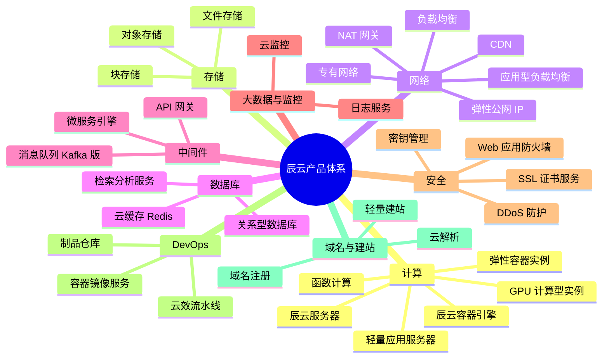

### 1.3 产品上架注册规范(重要)

**决策 D2:产品 = 资源类型 + 计量项 + OpenAPI,三要素不齐不上架**

- **结论**:任何产品上架前必须在商品化中台完成"产品注册",注册物包括:资源类型定义(生命周期状态机)、计量项清单(含计量精度与采集方式)、OpenAPI 定义(OpenAPI 3.0 描述文件)、SKU 与定价。缺一不上架。
- **理由**:对标启示 2(《10-research-and-selection-decisions.md》§3.4)——计量计费先于产品规划,缺计量字段后期补齐成本极高;产品注册规范把"可售卖性"变成上架门禁,而不是事后补课。
- **备选**:先上功能后补计量(很多自建平台的实际做法)。
- **改选条件**:仅内部免费使用的平台型能力(如运维工具)可豁免计量项,但资源类型与 API 仍必须注册。

产品注册物清单(与第 7 节商品化中台模型对接):

| 注册物 | 内容 | 落库位置 |
|---|---|---|
| 资源类型 | 资源实体定义、生命周期状态机、region/可用区作用域 | `t_product` + 各产品控制面 |
| 计量项 | 计量维度、精度(秒/分/时)、采集方式(控制面上报/轮询) | `t_metering_item`,详见《05-data-observability.md》 |
| OpenAPI | OpenAPI 3.0 描述文件、错误码规范、版本策略 | API 管理平台(参见《03-backend-services.md》) |
| 商品定义 | SKU、规格、定价、支持的计费形态 | `t_sku`/`t_pricing_rule`(第 7 节) |
| 控制台微前端 | 子应用注册信息(路由、入口 bundle) | 微前端基座注册中心(参见《02-frontend-architecture.md》) |
| 权限定义 | RAM action 清单、资源 ARN 格式 | IAM(参见《07-security.md》) |
| 文档 | 产品简介 + 计费说明 + 快速入门 + API 参考四篇最低配置 | 文档站 CMS |

### 1.4 Region / 可用区模型

所有产品资源从第一天起携带 `region_id` + `zone_id` 作用域字段,即使 MVP 只部署单地域(cn-north-1):

- 资源 ID 全局格式:`{productCode}-{regionId}-{分片因子2位}-{随机8位}`,内嵌 2 位分片因子以支撑 account_id 分片库定位(对齐《00-overview.md》附录A 全局标识规范与《04-middleware-infrastructure.md》§6.6),例:`scecs-cn-north-1-01-a1b2c3d4`;
- 商品定价按 region 维度配置,支持地域差价;
- OpenAPI 请求头/参数必须显式携带 region;
- 跨 region 能力(容灾、多活)在第二批产品具备后启用,模型无需变更。

---

## 2. 产品目录明细

以下按品类逐一给出产品定义。难度评级口径:**低** = 集成成熟开源组件 + 薄封装即可售卖;**中** = 需要自研控制面或对开源组件做较深改造;**高** = 涉及虚拟化/内核/大规模分布式自研,需要专职团队。

### 2.1 计算

| 产品名 | 一句话定位 | 对标阿里云 | MVP 功能范围 | 依赖的内部能力 | 难度 |
|---|---|---|---|---|---|
| 辰云服务器 SCECS | 云上虚拟服务器,一切资源的基础算力载体 | ECS | 实例创建/启停/重启/释放、公共镜像与自定义镜像、系统盘与数据盘挂载、安全组、VPC 组网、密码与密钥对登录 | 虚拟化资源池(KVM)、块存储、VPC、镜像仓库、IAM、监控 | 高 |
| 轻量应用服务器 SCSAS | 面向中小用户的一价全包套餐化主机 | 轻量应用服务器 | 套餐化售卖(CPU/内存/流量包/带宽打包)、应用镜像一键部署(WordPress 等)、简化控制台 | SCECS 能力复用、商品化中台套餐 SKU、CDN 流量包 | 低 |
| GPU 计算型实例 SCGPU | AI 训练与推理的 GPU 算力实例 | GPU 计算型 | GPU 直通实例、驱动与 CUDA 镜像、按卡时计费 | SCECS、GPU 物理机资源池、镜像服务 | 高 |
| 辰云容器引擎 SCCKE | 企业级托管 Kubernetes 集群服务 | ACK | 托管控制面(免运维 master)、自管 Worker 节点池、集群生命周期管理、对接镜像仓库与监控 | K8s 平台能力(参见《06-kubernetes-productization.md》)、VPC、负载均衡、镜像仓库 | 高 |
| 弹性容器实例 SCECI | 秒级拉起、按秒计费的 Serverless 容器 | ECI | 单 Pod 粒度 API、按 vCPU/内存秒级计费、与 K8s Virtual Kubelet 联动 | K8s、安全沙箱运行时、计量(秒级) | 高 |
| 函数计算 SCFC | 事件驱动 FaaS,按调用次数与执行时长计费 | FC | HTTP 触发器与定时触发器、JS/Python/Go 运行时、按 100ms 粒度计量、并发上限控制 | K8s(Knative/冷启动优化)、API 网关、对象存储(代码包)、计量 | 高 |

**品类说明**:计算品类的自研核心是 SCECS(虚拟化资源池),其余产品均为其上的封装或平行 Serverless 路线。轻量应用服务器是"用 ECS 能力换套餐商品"的低成本高转化产品,建议与 ECS 同批开发、同批上架。GPU 实例受供应链影响大,MVP 可先以少量 A10/L20 卡试点。

### 2.2 存储

| 产品名 | 一句话定位 | 对标阿里云 | MVP 功能范围 | 依赖的内部能力 | 难度 |
|---|---|---|---|---|---|
| 辰云对象存储 SCOSS | RESTful 海量非结构化存储,生态锚点产品 | OSS | Bucket CRUD、S3 兼容 API、控制台上传下载、生命周期规则、静态网站托管、预签名 URL | MinIO 集群(K8s Operator 部署,参见《04-middleware-infrastructure.md》)、IAM、计量 | 低 |
| 辰云块存储 SCBS | 挂载云服务器的高性能云盘 | ESSD 云盘 | 云盘创建/挂载/卸载/扩容、快照创建与回滚、按容量小时计费 | 分布式块存储后端(Ceph RBD 或 MinIO 不适用,需 Ceph)、SCECS 挂载通道 | 中 |
| 辰云文件存储 SCFS | NFS 共享文件系统,多机共享读写 | NAS | NFS v4 挂载点、容量弹性伸缩、按使用量计费 | CephFS 或 NFS-Ganesha、VPC | 中 |

**品类说明**:块存储与文件存储后端统一规划 Ceph 集群(块用 RBD、文件用 CephFS),与对象存储 MinIO 分离部署——对象存储走 S3 语义与多租户 API 面,块/文件存储走存储网络面,两者运维模型不同,强行统一反而增加复杂度。此决策与《04-middleware-infrastructure.md》中间件章节的存储集群规划对齐。

### 2.3 网络

| 产品名 | 一句话定位 | 对标阿里云 | MVP 功能范围 | 依赖的内部能力 | 难度 |
|---|---|---|---|---|---|
| 辰云专有网络 SCVPC | 租户逻辑隔离网络,一切资源的网络边界 | VPC | VPC/子网/路由表 CRUD、安全组、ECS 网卡接入、CIDR 规划 | SDN 方案(OVN 或 VPC 原生方案,参见《04-middleware-infrastructure.md》)、IAM | 高 |
| 辰云负载均衡 SCCLB | 四层流量分发,基础高可用入口 | CLB/SLB | TCP/UDP 监听、后端服务器组、健康检查、按实例+流量计费 | LVS/DPVS 集群、VPC、EIP | 中 |
| 应用型负载均衡 SCALB | 七层负载均衡,托管 APISIX 实例形态 | ALB | HTTP/HTTPS 监听、域名路径转发、证书托管、灰度权重路由 | APISIX 集群托管化、证书服务、VPC | 中 |
| 弹性公网 IP SCEIP | 可独立购买与动态绑定的公网地址 | EIP | IP 购买/绑定/解绑/释放、按带宽或按流量计费、绑定 ECS/CLB/NAT | 公网 IP 池管理、BGP 出口、计量 | 中 |
| NAT 网关 SCNAT | 私网出公网与端口映射 | NAT 网关 | SNAT 条目、DNAT 端口映射、绑定 EIP | VPC、EIP | 中 |
| 内容分发网络 SCCDN | 静态内容加速,降低源站带宽成本 | CDN | 域名接入、缓存刷新/预热、HTTPS 回源、用量报表 | CDN 边缘节点自建或商业 CDN 转售、DNS、证书 | 中 |

**品类说明**:网络品类中 SCVPC 是全平台依赖的关键路径产品,必须第一批交付;SCALB 选择"托管 APISIX 实例"形态实现,与平台自身 API 网关选型(APISIX)技术栈复用,一套引擎两处变现。CDN 边缘节点自建成本高,MVP 可先与商业 CDN 厂商合作转售 + 统一计量出账,自建节点放第三批。

### 2.4 数据库

| 产品名 | 一句话定位 | 对标阿里云 | MVP 功能范围 | 依赖的内部能力 | 难度 |
|---|---|---|---|---|---|
| 辰云数据库 MySQL 版 SCRDS | 托管 MySQL 关系型数据库,上云标配 | RDS MySQL | 5.7/8.0 双版本、一主一备高可用、参数模板、自动备份与按时间点恢复、账号管理、白名单 | DB 管控面自研(实例编排基于 K8s Operator)、VPC、块存储、监控 | 中 |
| 辰云缓存 Redis 版 SCREDIS | 托管 Redis 缓存与 KV 存储 | Tair/Redis | 社区版 6.x/7.x、主备与集群形态、备份恢复、性能监控 | K8s Operator 编排、VPC、监控 | 中 |
| 检索分析服务 SCES | 托管 Elasticsearch,搜索与日志分析 | Elasticsearch 阿里云版 | ES 7.x/8.x 集群托管、Kibana 托管、按节点规格计费、快照备份 | K8s Operator(ECK)、VPC、块存储、监控 | 中 |

**品类说明**:三个数据库产品统一采用"K8s Operator 编排 + 统一管控面"架构:管控面负责下单/变配/备份/监控的商业闭环,Operator 负责实例生命周期。管控面是一个服务还是三个服务,见《03-backend-services.md》领域划分。托管数据库是第二批产品的商业主力——中小企业上云第一采购项通常就是数据库。

### 2.5 中间件

| 产品名 | 一句话定位 | 对标阿里云 | MVP 功能范围 | 依赖的内部能力 | 难度 |
|---|---|---|---|---|---|
| 消息队列 Kafka 版 SCKAFKA | 托管高吞吐消息流平台 | 消息队列 Kafka 版 | 实例/Topic/消费组管理、ACL、消费位点与积压监控、按规格+流量计费 | Kafka 集群托管化(K8s Operator)、VPC、监控 | 中 |
| API 网关 SCGW | API 托管、鉴权、限流、发布管理 | API 网关 | 托管 APISIX 实例、API 分组与版本、Key/JWT 认证、限流配额、调用日志与统计 | APISIX 多租户化、日志服务、计量 | 中 |
| 微服务引擎 SCMSE | 托管 Nacos 注册配置中心 | MSE | 托管 Nacos 集群(按规格)、命名空间管理、配置版本与灰度、与用户 VPC 打通 | Nacos 托管化、VPC、监控 | 低 |

**品类说明**:中间件品类全部采用"开源引擎托管化"路线,不自研引擎。平台内部已在用 Kafka/Nacos/APISIX(参见《04-middleware-infrastructure.md》),对外售卖是把内部运维能力产品化——先内部自用打磨托管工具链,再对外开售。

### 2.6 大数据与监控

| 产品名 | 一句话定位 | 对标阿里云 | MVP 功能范围 | 依赖的内部能力 | 难度 |
|---|---|---|---|---|---|
| 辰云日志服务 SCSLS | 日志/指标统一采集、存储、检索与分析 | SLS | Logtail 兼容采集端(Vector)、Logstore 模型、SQL 查询、索引与 TTL 分层、按写入+存储计费 | ClickHouse 多租户集群、计量、IAM | 中 |
| 辰云监控 SCMON | 资源与自定义指标监控、告警 | 云监控 CloudMonitor | 云产品基础指标自动采集、自定义打点上报、告警规则与通知渠道、Grafana 托管视图 | Prometheus/VictoriaMetrics 多租户、Alertmanager、短信/邮件通道 | 中 |

**品类说明**:这两个产品与平台自身可观测体系(参见《05-data-observability.md》)是"一套底座、两个视图"——对内是运维可观测,对外是多租户商品。多租户隔离(数据/配额/权限)是产品化的主要工作量。ARMS 级别的 APM 商品放第三批,先以 OpenTelemetry 接入指引 + Grafana 托管满足初期需求。

### 2.7 安全

| 产品名 | 一句话定位 | 对标阿里云 | MVP 功能范围 | 依赖的内部能力 | 难度 |
|---|---|---|---|---|---|
| 密钥管理服务 SCKMS | 密钥托管与信封加密,数据加密基石 | KMS | 主密钥创建与轮换、信封加密 API、BYOK 导入、审计日志 | 加密模块(HSM 或软加密)、IAM 审计(参见《07-security.md》) | 中 |
| Web 应用防火墙 SCWAF | Web 应用攻击防护 | WAF | CNAME 接入、OWASP CRS 规则集、CC 防护、黑白名单 | APISIX + ModSecurity/CRS、DNS、证书 | 中 |
| DDoS 防护基础版 SCDPS | 出口流量清洗与黑洞 | DDoS 高防 | 流量基线统计、阈值黑洞、商业清洗线路联动 | 流量采集(sFlow/NetFlow)、BGP 联动、商业高防供应商 API | 高 |
| SSL 证书服务 SCCERT | 证书申请、托管与自动轮换 | SSL 证书服务 | ACME 自动签发(Let's Encrypt 类 CA)、证书库、绑定 CLB/ALB/CDN、到期提醒 | CA 对接、CLB/ALB/CDN 集成 | 低 |

**品类说明**:IAM/RAM 属于平台地基而非售卖产品,设计见《07-security.md》。安全品类中 SCCERT 成本极低且是 HTTPS 类产品的共同依赖,建议第一批随网络产品一起交付;DDoS 深度清洗自研不现实,MVP 走"自有黑洞 + 商业清洗线路转售"模式。

### 2.8 DevOps

| 产品名 | 一句话定位 | 对标阿里云 | MVP 功能范围 | 依赖的内部能力 | 难度 |
|---|---|---|---|---|---|
| 容器镜像服务 SCACR | 镜像托管、分发与安全扫描 | ACR | Harbor 多租户项目、镜像推拉鉴权、Trivy 漏洞扫描、仓库配额 | Harbor 托管化、IAM、VPC | 低 |
| 流水线服务 SCPIPE | CI/CD 流水线即代码 | 云效 Flow | 图形化与 YAML 双模流水线、构建/测试/部署步骤、对接 GitLab CI 引擎与 ArgoCD | GitLab CI Runner 池、ArgoCD 多租户、制品仓库 | 中 |
| 制品仓库 SCARTIFACT | Maven/npm/Docker 通用制品托管 | 云效 Packages | Maven/npm 代理与私有仓库、权限控制、配额 | Nexus/Verdaccio 托管化、IAM | 低 |
**品类说明**:DevOps 品类的底座即平台自身交付体系(参见《08-devops-delivery.md》),对外售卖形态是把内部 GitLab CI + ArgoCD 体系多租户化。建议先卖 SCACR(容器生态刚需、成本最低),SCPIPE 待内部流水线平台稳定后再开放。

### 2.9 域名与建站

| 产品名 | 一句话定位 | 对标阿里云 | MVP 功能范围 | 依赖的内部能力 | 难度 |
|---|---|---|---|---|---|
| 域名注册服务 SCDOMAIN | 域名查询、注册、续费、转入 | 万网域名 | 域名查询与下单、实名资料收集、续费管理(注册局通道初期代理接入) | 订单中心、实名审核流、注册商资质或上游代理 | 低 |
| 云解析 SCDNS | 权威 DNS 解析托管 | 云解析 DNS | A/CNAME/MX 等记录管理、按套餐分级的 TTL 与线路、秒级生效 | 权威 DNS 集群(Knot/PowerDNS)、Anycast IP | 中 |
| 轻量建站 SCSITE | 模板化企业官网搭建 | 云·企业官网 | 模板选择、可视化编辑、绑定域名与证书、一键发布到 OSS+CDN | OSS、CDN、DNS、证书 | 低 |

**品类说明**:域名是获客入口(对标启示:域名/备案是上云入口,见《10-research-and-selection-decisions.md》§3.4),但域名注册局资质审批周期长,MVP 以"上游注册商代理 + 自建控制台与订单流"过渡,解析服务自建。轻量建站是低成本的长尾增收产品,技术上是 OSS 静态托管 + 编辑器,优先级最低。

### 2.10 品类依赖关系总览

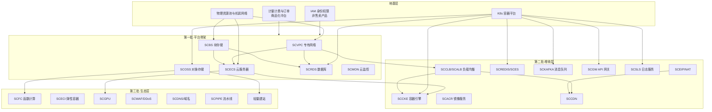

---

## 3. 产品优先级矩阵与批次规划

### 3.1 排序方法论

排序依据四个维度的加权判断,而非单看需求热度:

1. **依赖拓扑**:被依赖数越多的产品越靠前(IAM、计量、VPC、块存储是绝对前置);
2. **商业闭环**:构成"最小可售集合"的产品同批交付——客户能完成"买一台服务器 + 挂盘 + 组网 + 建库 + 被访问"的完整场景;
3. **成本形态**:低成本的"集成封装型"产品(轻量主机、镜像服务、证书)可搭车提前,用低成本换 SKU 丰富度;
4. **风险**:高难度产品(虚拟化、Serverless、DDoS)排在团队能力成熟后,避免阻塞主线。

### 3.2 优先级矩阵总表

| 批次 | 产品 | 类型 | 难度 | 排期窗口 | 核心理由 |
|---|---|---|---|---|---|
| **第一批·平台骨架** | IAM(内部能力) | 地基 | 中 | M0–M3 | 一切产品的前置鉴权,晚做全线返工 |
| | 商品化中台+订单+计费出账(内部能力) | 地基 | 中 | M0–M3 | 商业闭环中枢,产品上架门禁 |
| | SCOSS 对象存储 | 售卖 | 低 | M1–M3 | 集成 MinIO 最快可售,生态锚点,验证全链路(下单→开通→计量→出账) |
| | SCVPC 专有网络 | 售卖 | 高 | M0–M4 | ECS/RDS/容器的网络边界,关键路径 |
| | SCECS 云服务器 + SCBS 块存储 | 售卖 | 高 | M1–M6 | 最小可售骨架的核心,决定平台"是不是云" |
| | SCRDS MySQL | 售卖 | 中 | M4–M7 | 企业上云第一采购项,商业主力 |
| | SCCERT 证书 + SCEIP | 售卖 | 低/中 | M5–M7 | HTTPS 与公网访问的最小依赖,低成本搭车 |
| | SCMON 云监控 | 售卖 | 中 | M4–M7 | 资源可观测是运维信任底线,且是所有产品共同依赖 |
| | 官网/控制台/文档/账号/费用/工单 | 地基 | 中 | M0–M6 | 六大站点 MVP,与第一批产品同步上线(参见第 4 节) |
| **第二批·可售能力完善** | SCCLB/SCALB 负载均衡 | 售卖 | 中 | M7–M9 | 高可用架构刚需,与 ECS 组合成完整方案 |
| | SCREDIS / SCES | 售卖 | 中 | M7–M10 | 数据库品类补全,托管 Operator 复用 RDS 管控面 |
| | SCKAFKA / SCGW / SCMSE | 售卖 | 中/低 | M8–M11 | 内部组件产品化,边际成本低 |
| | SCCKE 容器引擎 + SCACR 镜像 | 售卖 | 高/低 | M7–M12 | 容器是第二批的商业亮点,依赖内部 K8s 平台成熟(参见《06-kubernetes-productization.md》) |
| | SCSLS 日志服务 | 售卖 | 中 | M9–M12 | 复用内部 ClickHouse 底座多租户化 |
| | SCNAT / SCCDN(转售起步) | 售卖 | 中 | M9–M12 | 完善网络方案完整度 |
| | SCDOMAIN 域名代理 + SCDNS | 售卖 | 低/中 | M10–M12 | 获客入口,补"上云第一步" |
| | SCSAS 轻量应用服务器 | 售卖 | 低 | M7–M8 | ECS 能力套餐化,纯商品层工作 |
| **第三批·生态与差异化** | SCFC 函数计算 / SCECI | 售卖 | 高 | M12+ | Serverless 依赖 K8s 与计量精细度成熟 |
| | SCGPU / SCFS / SCWAF / SCDPS | 售卖 | 高/中 | M12+ | 细分市场与合规安全增值 |
| | SCPIPE / SCARTIFACT / SCES 企业版 | 售卖 | 中/低 | M12+ | DevOps 品类补全 |
| | 资源包商城、推荐返佣、云市场雏形 | 运营 | — | M12+ | 运营体系,对标启示 10(《10-research-and-selection-decisions.md》§3.4)明确可后置 |
| **明确后置/不做(一期)** | 大数据数仓、AI 平台、行业解决方案、价格计算器高级版、多账号治理 | — | — | 视商业化数据再启动 | 投入产出比低,先以"合作伙伴方案"形式补位 |

### 3.3 批次准入准出标准

| 批次 | 准入标准 | 准出标准(进入下一批次的门槛) |
|---|---|---|
| 第一批 | 机房/资源池就绪、IAM 与商品化中台立项 | 完成首个付费客户全链路:ECS+OSS+RDS 下单→开通→计量→出账→续费→退订 |
| 第二批 | 第一批产品 SLA ≥ 99.9% 运行满一个季度、K8s 平台内部稳定 | 容器+中间件品类营收占比 ≥ 30%,托管 Operator 故障自愈率达标 |
| 第三批 | 计量精度达到秒级、K8s 多租户隔离通过安全评审 | — |

### 3.4 不可后置清单(红线)

对标启示 10(《10-research-and-selection-decisions.md》§3.4),以下能力**任何批次规划都不得后置**:认证鉴权(IAM)、计量计费与账单、OpenAPI 体系、文档站(可简陋不可缺)、工单通道。活动运营、云市场、行业方案页、高级价格计算器可后置。

---

## 4. 官网信息架构

### 4.1 站点矩阵与域名规划

**决策 D5:六站点多子域隔离**

- **结论**:营销官网(www)、控制台(console)、文档(docs)、账号(account)、费用(billing)、工单(ticket)六个站点独立子域、独立前端应用、独立发布流水线;控制台与账号/费用之间通过 SSO 会话打通,营销站不持有登录态强依赖。账号中心 account 同时是 SSO 中心,由根域 `.starcloud.cn` Cookie 签发统一会话,各子域共享。
- **理由**:① 营销站面向匿名流量,静态化+CDN 极致优化,控制台是重交互 SPA,性能与发布节奏完全不同,必须隔离;② 安全域隔离:控制台/账号中心是高价值攻击面,独立子域便于 CSP、Cookie 域隔离与 WAF 策略分域;③ 微前端基座只需承载 console 域内子应用,避免营销页污染控制台 bundle。
- **备选**:单域名路由式合并(www.starcloud.cn/console)。
- **改选条件**:若 SEO 团队强烈要求统一域名权重,可将 docs 合并回 www 路径下(docs 对 SEO 贡献大),其余站点保持隔离。

| 站点 | 域名 | 定位 | 形态 | 主要技术 |
|---|---|---|---|---|
| 营销官网 | www.starcloud.cn | 品牌信任 + 产品发现 + 转化获客 | SSR/SSG 静态化,CDN 分发 | Vue + SSG,详见《02-frontend-architecture.md》 |
| 控制台 | console.starcloud.cn | 资源购买、管理、运维 | 微前端基座 + 产品子应用 | Vue + Wujie 微前端 |
| 文档站 | docs.starcloud.cn | 开发者第一触点 | 静态站生成 + 版本化 | VitePress/Docusaurus 类 + CI 构建 |
| 账号中心 | account.starcloud.cn | 注册、登录、实名、RAM、AK | 独立 SPA,SSO 中心 | Vue + 统一认证服务 |
| 费用中心 | billing.starcloud.cn | 账单、订单、续费、发票 | 独立 SPA(可作控制台子应用双入口) | Vue |
| 工单支持 | ticket.starcloud.cn | 工单、支持计划、健康看板 | 独立 SPA | Vue |

SSO 会话拓扑:account.starcloud.cn 为唯一认证域,签发会话 Cookie(根域 .starcloud.cn 下 HttpOnly),console/billing/ticket 共享会话;www 营销站仅在用户已登录时读取用户标识用于个性化,不做鉴权强依赖。

### 4.2 营销官网页面地图

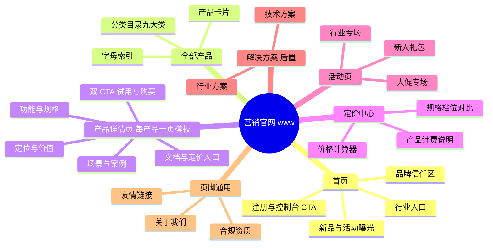

**页面模板决策**:产品详情页执行"目录三件套模板"(对标启示 5,见《10-research-and-selection-decisions.md》§3.4):分类目录页 → 产品详情页 → 定价页,新增产品 = 填槽。模板字段固定为:一句话定位 / 产品优势(3~4 条)/ 功能清单表 / 规格表 / 应用场景 / 客户案例 / FAQ / 双 CTA(免费试用 + 立即购买)。**模板稳定比页面华丽重要**——商品化中台的产品元数据(第 7 节 `t_product.description_*` 与 SKU 规格)直接驱动详情页渲染,运营不写死页面。

### 4.3 控制台页面地图

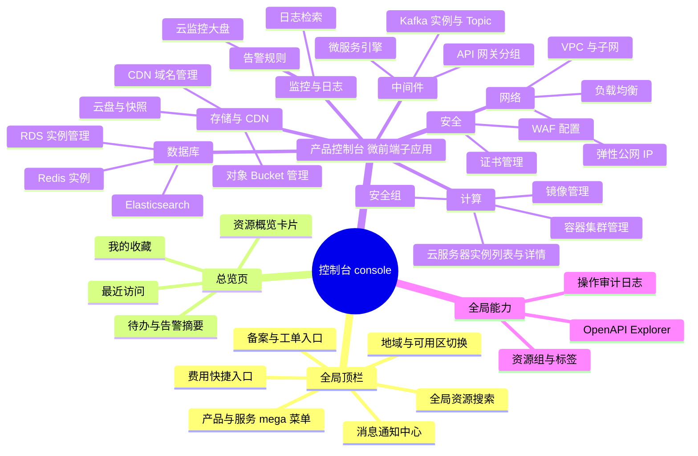

控制台路由规划(微前端子应用挂载规则详见《02-frontend-architecture.md》):

| 路由模式 | 说明 |
|---|---|
| `/console` | 总览页(基座自带) |
| `/console/{productCode}` | 产品控制台默认页(如 `/console/scecs`) |
| `/console/{productCode}/list?region={r}` | 资源列表(统一列表交互规范) |
| `/console/{productCode}/detail/{resourceId}` | 资源详情 |
| `/console/{productCode}/buy` | 购买页(调用商品化中台询价下单) |
| `/console/{productCode}/monitor/{resourceId}` | 资源监控页(嵌入 SCMON 子组件) |

控制台子应用拆分粒度决策:按产品大类合并拆 7 个品类子应用(console-compute/console-storage/console-network/console-database/console-middleware/console-monitor/console-security),而非一产品一子应用——子应用数量直接影响基座加载调度与发布协调成本,品类内产品共享列表/详情交互骨架。每个品类子应用对应一个独立仓库,与商品目录一级分类对齐(D9)。此结论与《02-frontend-architecture.md》的 Wujie 拆分方案一致。

### 4.4 文档站页面地图

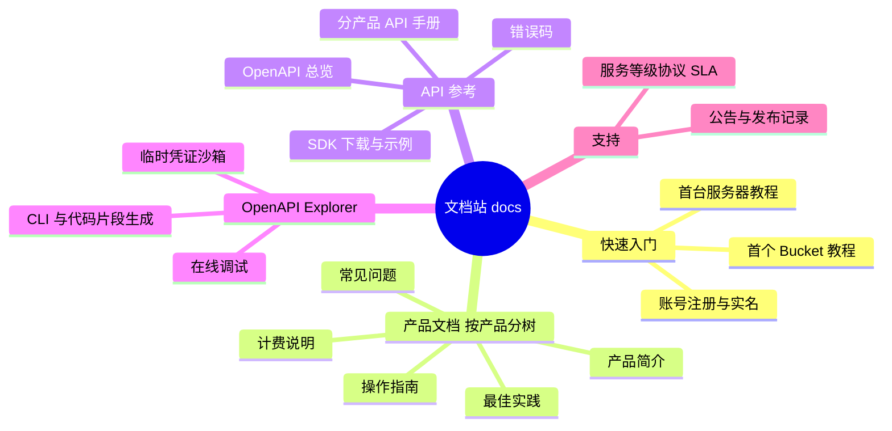

**最低交付标准**:每个上架产品必须随附"产品简介 + 计费说明 + 快速入门 + API 参考"四篇文档(D2 注册规范的门禁项,也是《09-roadmap.md》§3.5 A7 验收口径)。OpenAPI Explorer 与 OpenAPI 描述文件同源生成,避免文档与接口漂移。

### 4.5 账号中心 / 费用中心 / 工单页面地图

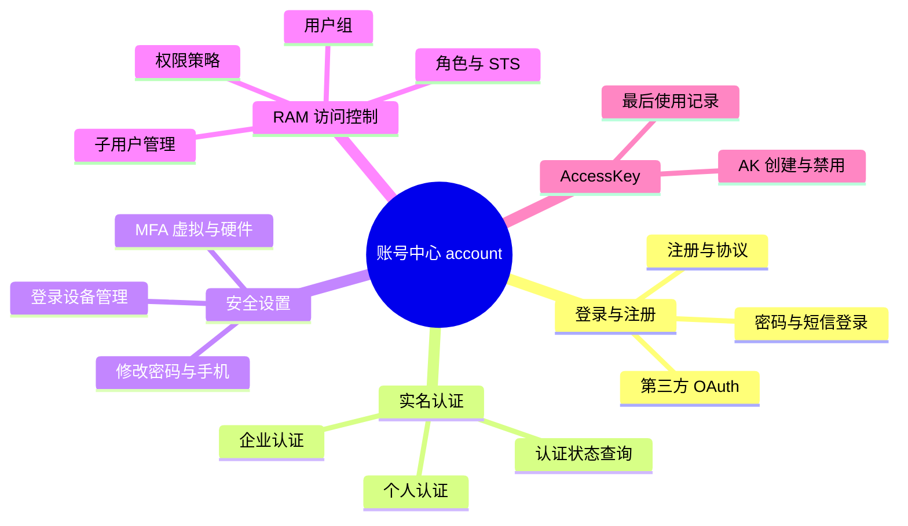

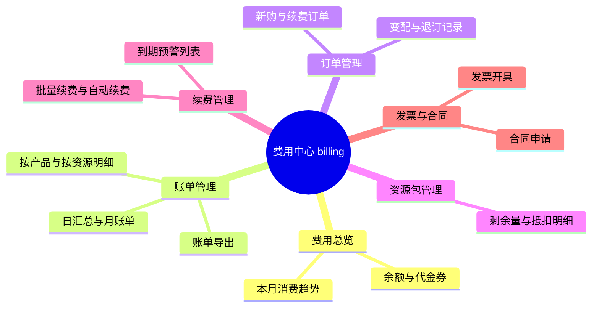

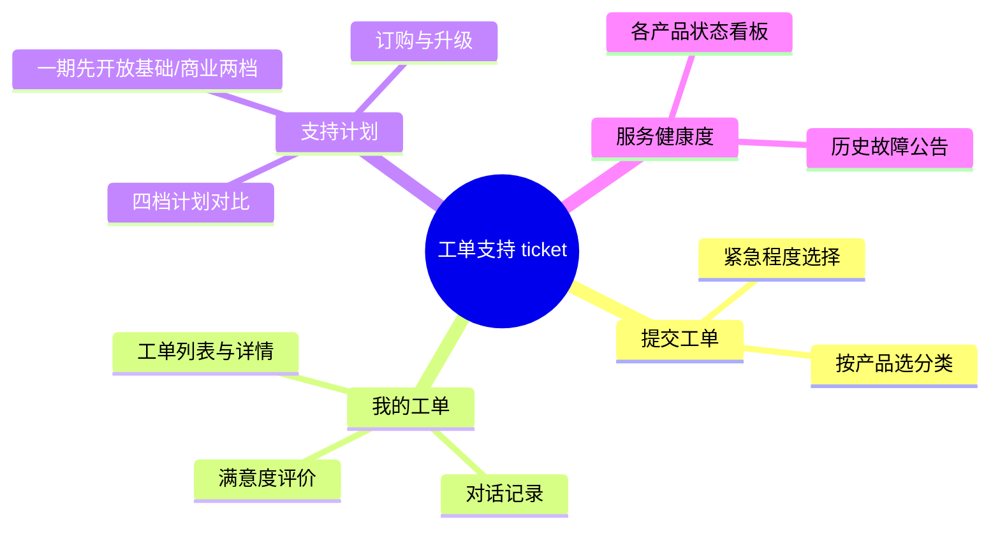

### 4.6 核心转化流程:从浏览到下单

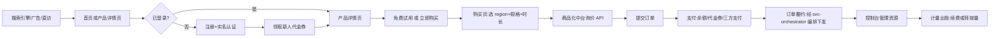

各环节责任系统:询价/订单/支付(商品化中台+订单中心,第 7 节)、履约开通(经 svc-orchestrator 编排下发,参见《03-backend-services.md》)、计量出账(参见《05-data-observability.md》)、代金券与活动(由 svc-catalog 提供代金券最小实现,满减/折扣券后置二期;活动运营系统第三批)。

---

## 5. 商业模式设计

### 5.1 计费四形态骨架

**决策 D6:Day 1 支持包年包月 + 按量付费,资源包后置二期,抢占式后置**

- **结论**:计费中台 Day 1 支持两种形态:包年包月(预付费)、按量付费(后付费小时级出账);**资源包(预付额度抵扣)与抢占式实例后置二期**。四形态模型 Day 1 在中台侧预留接口与字段(订单模型保留 `prepaid`/`resource_pack` 字段),抢占式售卖后置。
- **理由**:① 包年包月与按量共用同一套订单+SKU 模型,仅计费管道不同,增量成本可控;② 无包年包月则客户长期持有意愿与现金流显著受损;③ 资源包是转化与留存利器(批发折扣),且本质是"预付费余额+抵扣规则",中台模型天然支持,但其抵扣账本与到期回收逻辑需二期打磨,一期先以代金券满足试用与抵扣诉求;④ 抢占式实例依赖容量预测与优雅回收机制,是容量调度能力成熟后的二期特性。
- **备选**:仅按量起步,预付费后置。
- **改选条件**:若初期客户全部为开发者个人用户(按量心智强),可先只做按量,但订单模型必须预留 prepaid 字段,保证后补零改造。

| 计费形态 | 一期/后置 | 结算周期 | 资金行为 | 生命周期特征 | 适用场景 | 中台实现要点 |
|---|---|---|---|---|---|---|
| 包年包月 | 一期 Day1 | 一次性预付 | 下单即扣款,可退订(按剩余时长折算) | 到期→停机保留→释放 | 稳态负载、长期持有 | 订单驱动,到期时间写资源元数据 |
| 按量付费 | 一期 Day1 | 小时出账(计量精度到秒) | 出账后从余额/代金券抵扣 | 余额不足→欠费生命周期(5.4 节) | 弹性负载、试用、临时业务 | 计量管道驱动,账户余额预检 |
| 资源包(后置二期) | 二期 | 预付购买固定额度 | 按量账单优先抵扣资源包,超出部分走余额 | 额度用尽或到期失效 | 可预估的中量消耗(流量/存储/API 次数) | 抵扣顺序:资源包→代金券→现金余额 |
| 抢占式实例(后置二期) | 二期 | 分钟级浮动价 | 市场价波动+随时回收 | 平台可回收,提前 5 分钟通知 | 容错批处理 | 依赖容量调度系统,二期 |

免费试用不作为独立计费形态,而是代金券体系的运营策略(5.3 节)。

### 5.2 订单与交易模型骨架

订单中心是商业化复杂度的中枢(对标启示 9,见《10-research-and-selection-decisions.md》§3.4)。统一订单模型覆盖五种交易类型:

| 订单类型 | 说明 | 计费交互 |
|---|---|---|
| NEW 新购 | 创建新资源,支持 prepaid/postpaid | prepaid 即时扣款;postpaid 仅余额预检 |
| RENEW 续费 | 延长包年包月到期时间 | 即时扣款,成功后改资源到期时间 |
| UPGRADE 升配 | 提升规格,补差价 | 按剩余时长折算差价扣款 |
| DOWNGRADE 降配 | 降低规格,退余额(代金券不退现) | 差额退至现金余额 |
| REFUND 退订 | 主动退订包年包月 | 按已用时长+违约金规则折算退款 |

完整订单状态机、表结构与履约时序详见《03-backend-services.md》订单域设计;订单与 SKU/定价的数据模型见本章第 7 节。

### 5.3 免费试用策略

**决策 D7:试用 = 代金券体系 + 标准订单链路,一期内测落地,不建独立免费额度系统**

- **结论**:免费试用通过"试用代金券"实现——新客领取专项代金券,以标准后付费订单创建资源,计量照常产生账单,由试用券全额抵扣。**一期由 svc-catalog 提供代金券的最小实现(创建/发放/抵扣/到期回收),满减券/折扣券后置二期**。不建设独立的免费额度(free tier)库存系统。
- **理由**:① 试用资源与付费资源走同一条计量/出账/停服链路,试用转付费零摩擦,且能真实验证计费链路;② 代金券天然支持"限品类/限规格/限时长/限额"四维风控;③ 独立 free tier 系统需要单独的额度账本与回收逻辑,重复建设。
- **备选**:独立免费额度系统(固定额度内不计费)。
- **改选条件**:若产品策略要求"永久免费小规格"(开发者生态型打法),需评估为 free tier 增加"零价 SKU + 额度豁免规则"的中台改造成本后再决策。

试用策略参数(运营可配置):

| 参数 | 初期建议值 |
|---|---|
| 资格 | 完成企业/个人实名认证的新账号,每账号一次 |
| 券额度 | 按品类发放:计算类 300 元、存储类 50 元、数据库类 200 元 |
| 限时 | 领取后 30 天内使用,资源试用最长 3 个月 |
| 限规格 | 仅限指定入门 SKU(如 2C4G 以下、单节点数据库) |
| 风控 | 实名主体唯一性校验、同设备指纹防刷、试用券抵扣触顶即停 |
| 到期行为 | 券用尽/到期 → 转正常按量(余额不足进欠费流程),提前 7 天站内信+短信通知 |

### 5.4 欠费与停服策略

**决策 D8:欠费→宽限→停服保留→释放四段式,状态机对用户全透明(本表为一期事实源,03§5.2/§5.4 等以此为唯一依据)**

- **结论**:按量资源执行"欠费 → 宽限期(继续服务+催缴)→ 停服锁定(资源冻结、数据保留)→ 到期释放(数据删除)"四段状态机;包年包月执行"到期前多轮提醒 → 到期停机 → 保留期 → 释放"。全部状态、时间点与数据政策在控制台与文档明示。
- **理由**:对标启示 8(《10-research-and-selection-decisions.md》§3.4)——资源生命周期状态机与数据保留政策是商业可信度底线;一次误删客户数据的事故足以摧毁新平台的信任。状态透明 = 信任。
- **备选**:欠费立即停服(无宽限)。
- **改选条件**:仅当坏账率持续高于阈值(如 >5%)时收紧宽限期,任何调整须提前 30 天公告。

按量付费欠费状态机:

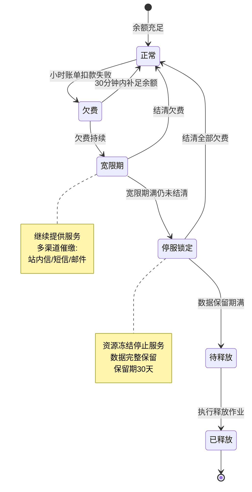

| 阶段 | 时长(初期值) | 资源状态 | 数据状态 | 通知动作 |
|---|---|---|---|---|
| 欠费 | 出账即时 | 正常服务 | 完整 | 出账失败即时通知 |
| 宽限期 | 24 小时(大客户按合同延长至 72h) | 继续服务 | 完整 | 每 12h 催缴(站内信+短信) |
| 停服锁定 | 30 天 | 冻结:ECS 停机、RDS 只读锁、OSS 拒绝读写 | 完整 | 锁定当天 + 保留期剩 7 天/1 天通知 |
| 释放 | — | 资源删除 | **不可逆删除** | 释放前 24h 终版通知,需二次确认策略可配置 |

包年包月到期策略:

| 时间点 | 动作 |
|---|---|
| 到期前 30/15/7/3/1 天 | 续费提醒(站内信+短信+邮件),控制台红色徽标 |
| 到期当天 | 资源停机(计算类)/只读(数据库类),进入保留期 |
| 到期后 15 天内 | 保留期,可随时续费恢复,数据完整 |
| 保留期满 | 释放,释放前 24h 最终通知 |

**全局原则**:① 任何数据删除动作必须有释放前通知且通知记录留痕(审计);② 停服与释放作业必须幂等、可暂停(运营一键熔断);③ 状态机迁移事件全部进 Kafka,topic 命名以《04-middleware-infrastructure.md》§5.3/§5.4 清单为唯一事实源(`cloud.resource.lifecycle.event`、`cloud.billing.account.event`、`cloud.notify.message` 等,详见 04§5.4 全量清单;topic 名不含环境标识,环境隔离靠集群隔离),供控制台、通知中心、费用中心订阅(事件清单参见《03-backend-services.md》)。

---

## 6. 商品化中台:概念与定位

### 6.1 为什么需要商品化中台

**决策 D3:商品化中台与订单中心先于产品控制台建设**

- **结论**:设立独立的商品化中台域(Product Commerce Hub),统一管理"产品→SKU→规格→定价→促销"的商品定义与询价能力;订单中心依赖其询价。该中台与 IAM、计量并列为三大地基,先于任何产品控制台交付。
- **理由**:① 若每个产品自建定价与下单逻辑,35 个产品就是 35 套订单/价格/促销,商业化能力永远碎片化;② 官网定价页、购买页、控制台变配、OpenAPI 下单四个入口必须同源询价,否则价格漂移是资损事故;③ 中台先行,产品团队上架时只需"填槽"注册商品,这正是产品注册规范(D2)的运行基础。
- **备选**:各产品线自建商品逻辑,中台后置收敛。
- **改选条件**:无——这是红线决策。若资源极度紧张,可先裁剪中台的促销模块,但 SKU/定价/询价核心不可裁剪。

商品化中台的职责边界:

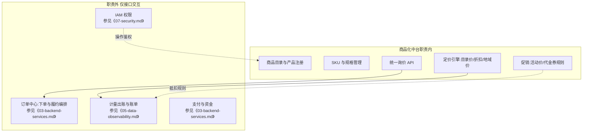

### 6.2 商品发布与下单主流程

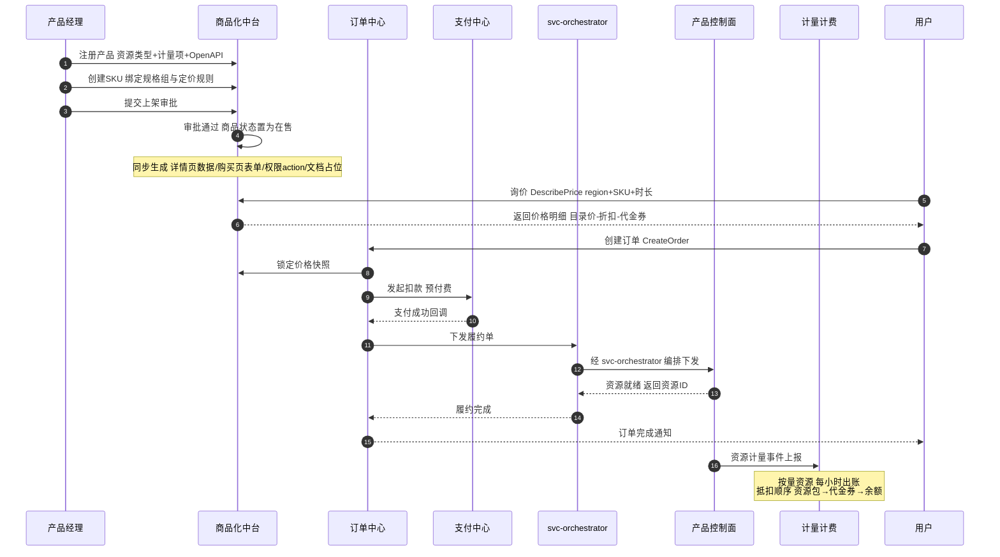

---

## 7. 商品化中台:统一数据模型

### 7.1 领域概念模型

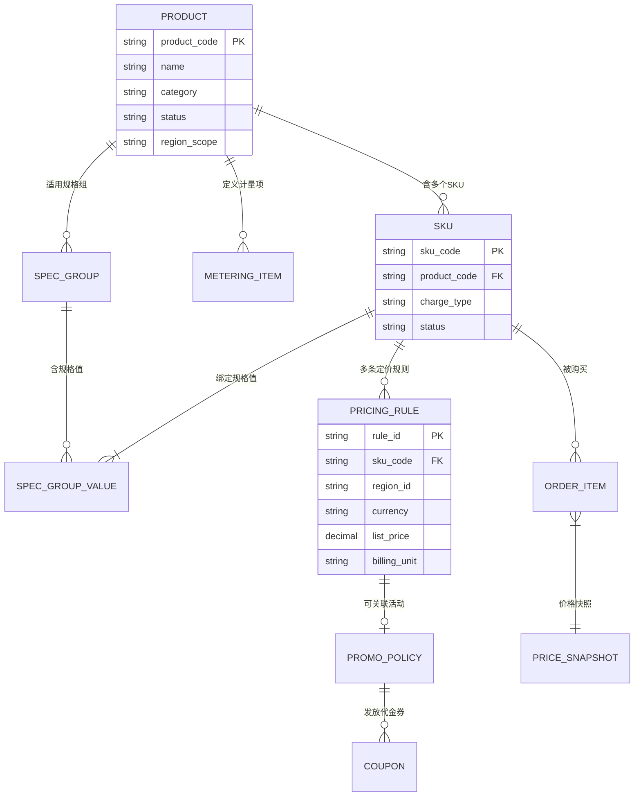

核心概念定义:

| 概念 | 定义 | 示例 |
|---|---|---|
| 产品 Product | 可售卖的服务类目,绑定资源类型与计量项 | 辰云服务器(scecs) |
| 规格组 SpecGroup | 一组可选配置维度 | ECS 的 CPU/内存/系统盘/带宽 |
| 规格值 SpecValue | 规格组下的合法取值(含互斥与依赖约束) | 2C4G、4C8G…… |
| SKU | 产品 + 规格组合 + 计费形态的最小售卖单元 | scecs 标准型 s2.large 包年包月 |
| 定价规则 PricingRule | SKU 在某 region/某时长档位/某客户等级下的目录价 | s2.large cn-east-1 包月 ¥180,包年 85 折 |
| 促销策略 PromoPolicy | 限时改价或发放抵扣物 | 新客首购 3 折、双十一全场券 |
| 代金券 Coupon | 定额/定比例抵扣物,带适用范围与有效期 | 满 100 减 20,仅限新购 |
| 价格快照 PriceSnapshot | 下单时刻冻结的价格构成,出账与对账依据 | 订单 O123 快照:目录 180,折扣 -27,应付 153 |

### 7.2 核心表结构示例

```sql
-- 产品主数据
CREATE TABLE t_product (
  product_code   VARCHAR(32)  PRIMARY KEY COMMENT '产品code,如scecs',
  product_name   VARCHAR(64)  NOT NULL,
  category       VARCHAR(32)  NOT NULL COMMENT '一级分类:compute/storage/...',
  description    VARCHAR(512) COMMENT '一句话定位,驱动官网详情页',
  resource_type  VARCHAR(32)  NOT NULL COMMENT '资源类型,关联资源编排',
  region_scope   VARCHAR(16)  NOT NULL DEFAULT 'REGIONAL' COMMENT 'REGIONAL/GLOBAL',
  status         TINYINT      NOT NULL DEFAULT 0 COMMENT '0草稿 1审核中 2在售 3停售',
  owner_team     VARCHAR(64),
  created_at     DATETIME     NOT NULL,
  updated_at     DATETIME     NOT NULL
) COMMENT='产品主数据';

-- 计量项注册表(与《05-data-observability.md》计量模型同源)
CREATE TABLE t_metering_item (
  item_code      VARCHAR(64) PRIMARY KEY COMMENT '如 scoss.storage_bytes',
  product_code   VARCHAR(32) NOT NULL,
  metric_name    VARCHAR(64) NOT NULL,
  precision      VARCHAR(8)  NOT NULL DEFAULT 'HOUR' COMMENT 'SECOND/MINUTE/HOUR',
  collect_mode   VARCHAR(16) NOT NULL COMMENT 'PUSH控制面上报/PULL轮询',
  billing_phase  VARCHAR(16) NOT NULL COMMENT '该计量项用于何种计费形态'
) COMMENT='产品计量项注册';

-- SKU
CREATE TABLE t_sku (
  sku_code       VARCHAR(64)  PRIMARY KEY,
  product_code   VARCHAR(32)  NOT NULL,
  charge_type    VARCHAR(16)  NOT NULL COMMENT 'PREPAID/POSTPAID/RESOURCE_PACK',
  spec_json      JSON         NOT NULL COMMENT '规格值组合,如{"cpu":2,"mem_gb":4}',
  status         TINYINT      NOT NULL DEFAULT 0,
  KEY idx_product (product_code)
) COMMENT='最小售卖单元';

-- 定价规则(按region与时长档位)
CREATE TABLE t_pricing_rule (
  rule_id        BIGINT       AUTO_INCREMENT PRIMARY KEY,
  sku_code       VARCHAR(64)  NOT NULL,
  region_id      VARCHAR(32)  NOT NULL DEFAULT '*',
  duration_unit  VARCHAR(8)   NOT NULL DEFAULT 'MONTH' COMMENT 'MONTH/YEAR/HOUR/USAGE',
  list_price     DECIMAL(12,4) NOT NULL COMMENT '目录价',
  customer_level VARCHAR(16)  NOT NULL DEFAULT 'NORMAL' COMMENT '客户等级差价',
  effective_from DATETIME     NOT NULL,
  effective_to   DATETIME     NULL,
  KEY idx_sku_region (sku_code, region_id)
) COMMENT='目录价规则,价格变更留痕不改写';

-- 促销策略
CREATE TABLE t_promo_policy (
  promo_id       VARCHAR(32)  PRIMARY KEY,
  promo_type     VARCHAR(16)  NOT NULL COMMENT 'DISCOUNT_RATE/FIXED_PRICE/COUPON',
  scope_type     VARCHAR(16)  NOT NULL COMMENT 'PRODUCT/SKU/ORDER',
  scope_ref      VARCHAR(64)  NOT NULL COMMENT '作用对象code',
  value          DECIMAL(8,4) NOT NULL COMMENT '折扣率或一口价',
  user_tag       VARCHAR(32)  COMMENT '限定人群:new/enterprise/...',
  start_at       DATETIME     NOT NULL,
  end_at         DATETIME     NOT NULL,
  budget_total   DECIMAL(14,2) COMMENT '活动预算上限'
) COMMENT='促销策略';

-- 代金券
CREATE TABLE t_coupon (
  coupon_id      VARCHAR(32)  PRIMARY KEY,
  owner_account_id BIGINT     NOT NULL COMMENT '归属租户(全书 account_id ≡ uid ≡ user_id ≡ tenant_id,见《00》附录A)',
  face_value     DECIMAL(10,2) NOT NULL,
  remain_value   DECIMAL(10,2) NOT NULL,
  scope_json     JSON         NOT NULL COMMENT '限品类/限计费形态/限SKU',
  status         TINYINT      NOT NULL COMMENT '0未用 1部分使用 2用尽 3过期',
  expire_at      DATETIME     NOT NULL,
  KEY idx_owner (owner_account_id, status)
) COMMENT='代金券,免费试用的载体;余额与余额流水归 trade_db ledger(见《04》§6.3)';

-- 价格快照(下单冻结,出账与退款依据)
CREATE TABLE t_price_snapshot (
  snapshot_id    VARCHAR(32) PRIMARY KEY,
  order_id       VARCHAR(32) NOT NULL,
  sku_code       VARCHAR(64) NOT NULL,
  list_amount    DECIMAL(12,4) NOT NULL,
  promo_amount   DECIMAL(12,4) NOT NULL DEFAULT 0,
  coupon_amount  DECIMAL(12,4) NOT NULL DEFAULT 0,
  payable_amount DECIMAL(12,4) NOT NULL,
  detail_json    JSON NOT NULL COMMENT '完整计价过程,客诉与审计依据',
  created_at     DATETIME NOT NULL
) COMMENT='订单价格快照';
```

抵扣与计价规则(询价引擎内置,不可被单产品覆盖):

1. 询价 = 目录价(按 region+时长档位)→ 促销折扣(取最优一条,不叠加)→ 代金券预抵扣展示;
2. 支付抵扣顺序:资源包额度 → 代金券(按到期时间升序消耗)→ 现金余额 → 三方支付;
3. 价格变更只增补新 `t_pricing_rule` 记录并设置生效区间,存量订单以价格快照为准——**价格可追溯、不可改写**是资损防控底线;
4. 退订折算公式、降配差额公式在订单中心实现,但必须引用价格快照而非当前价。

### 7.3 新产品上架"填槽"清单

新增产品上架的标准动作(目标:产品团队 5 个工作日内完成商品化接入):

| # | 动作 | 责任方 | 系统 |
|---|---|---|---|
| 1 | 提交产品注册单(资源类型+状态机+计量项+OpenAPI 描述文件) | 产品团队 | 商品化中台审批流 |
| 2 | 定义规格组与 SKU 矩阵 | 产品团队 | 商品化中台 |
| 3 | 配置分 region 定价规则与支持的计费形态 | 产品+商务 | 定价引擎 |
| 4 | 注册 RAM action 与资源 ARN | 产品团队 | IAM |
| 5 | 控制台子应用路由注册(填槽 /console/{productCode}) | 产品前端 | 微前端基座 |
| 6 | 提交四篇最低文档 + 详情页模板填槽数据 | 产品团队 | 文档站 CMS / 官网 SSG |
| 7 | 履约对接:经 svc-orchestrator 编排下发(回调产品控制面开通/停机/释放) | 产品+平台 | svc-orchestrator |
| 8 | 计量链路联调:计量事件→出账→账单展示 | 产品+平台 | 计量计费 |
| 9 | 定价对账演练(询价-下单-出账-退款四链路) | QA | 全链路 |
| 10 | 上架审批(商品、文档、SLA 承诺、客服话术四项齐备) | 商品委员会 | 审批流 |

---

## 8. 附录:本章决策汇总与交叉引用

### 8.1 决策汇总(结论 + 理由 + 备选 + 改选条件)

| # | 决策 | 结论 | 核心理由 | 备选 | 何时改选备选 |
|---|---|---|---|---|---|
| D1 | 品类节奏 | IaaS+基础PaaS 先行,大数据/AI/云市场后置 | 最小可售骨架理论,底座先行 | 差异化单品切入 | 商业模式锚定单一场景时 |
| D2 | 产品注册规范 | 资源类型+计量项+OpenAPI 三要素门禁 | 补齐计量成本极高,门禁前置 | 先上功能后补计量 | 仅内部免费工具可豁免计量 |
| D3 | 商品化中台先行 | 中台+订单先于产品控制台 | 四入口同源询价防资损,上架填槽化 | 各产品自建后收敛 | 无,红线;极端缺资源时仅可裁剪促销模块 |
| D4 | API First | OpenAPI 先于控制台 | API 是生态与自动化契约,控制台是 UI 封装 | 控制台先行 | 无 |
| D5 | 站点隔离 | 六站点独立子域独立发布 | 性能/安全域/发布节奏三重隔离 | 单域路由合并 | docs 可因 SEO 并入 www |
| D6 | 计费形态 | 包年包月+按量 Day1,资源包后置二期,抢占式后置 | 共用订单模型增量小;资源包抵扣账本二期打磨,先以代金券满足抵扣 | 仅按量起步 | 纯开发者客群时,但模型预留 prepaid |
| D7 | 免费试用 | 代金券+标准订单链路,一期内测落地(svc-catalog 最小实现),满减/折扣券后置 | 试用转付费零摩擦,不重复建设 | 独立 free tier | 需要永久免费小规格生态时 |
| D8 | 欠费策略 | 四段式状态机+全透明通知 | 数据删除不可逆,透明=信任 | 欠费即停 | 坏账率超标时收紧宽限期 |
| D9 | 控制台拆分 | 按产品大类合并拆 7 个品类子应用(每品类子应用一仓库) | 子应用数量可控,品类内共享骨架 | 一产品一子应用 | 单品类产品数>10 且团队拆分时细化 |

### 8.2 与其他章节的交叉引用

| 本章内容 | 承接章节 |
|---|---|
| 产品目录 → 领域与服务划分、订单中心/资源编排设计 | 《03-backend-services.md》 |
| 六站点形态、控制台微前端拆分(Wujie) | 《02-frontend-architecture.md》 |
| MinIO/Kafka/Nacos/APISIX/ClickHouse 等底座的部署形态 | 《04-middleware-infrastructure.md》 |
| 计量采集链路、小时级出账、账单存储与抵扣明细 | 《05-data-observability.md》 |
| SCCKE/SCECI/SCFC 的容器底座与多租户隔离 | 《06-kubernetes-productization.md》 |
| IAM/RAM、KMS、安全产品与平台安全基线 | 《07-security.md》 |
| 文档站/控制台/官网的 CI/CD 与发布流水线 | 《08-devops-delivery.md》 |
| 三批次排期、团队配置与里程碑细化 | 《09-roadmap.md》 |
| 总体分层与全局架构约束 | 《00-overview.md》 |

### 8.3 评审关注点清单

供架构评审会重点质询:

1. D3(商品化中台先行)的资源投入是否被排期计划真实保障?(联动《09-roadmap.md》)
2. SCECS 虚拟化方案(OVN/KVM 资源池)的自研风险与第二批产品的耦合?(联动《04-middleware-infrastructure.md》)
3. 欠费宽限期与释放前通知的合规审查(用户协议条款、数据删除告知义务);
4. 定价"不可改写、只留痕"规则在分库分表下的对账实现(联动《03-backend-services.md》订单域);
5. 域名注册的注册商资质过渡方案的法律风险。
