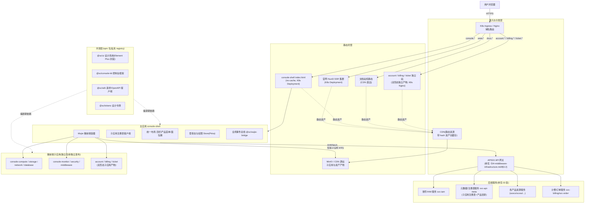
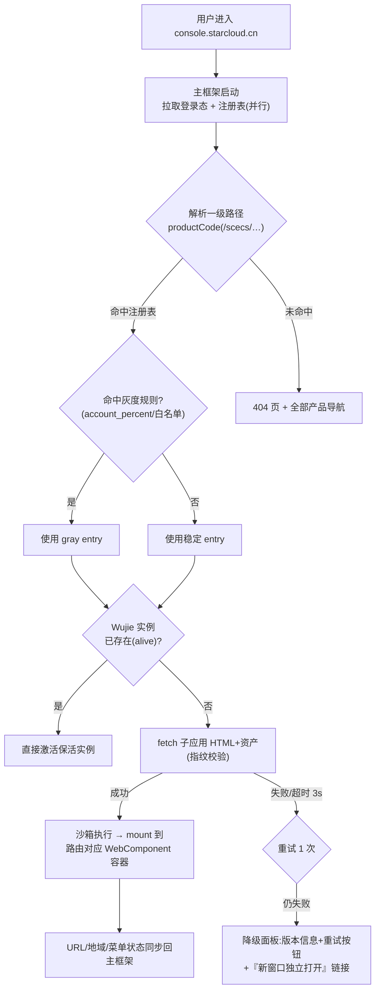
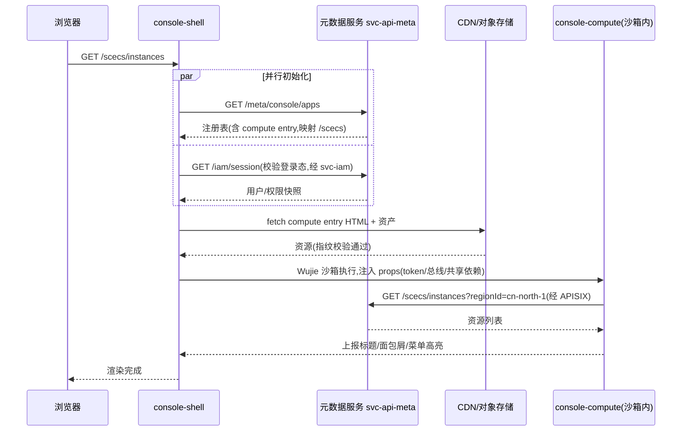
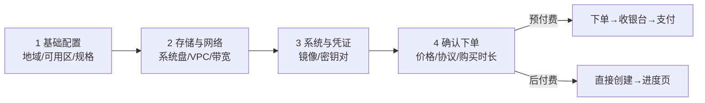

# 02 前端架构(Vue + 微前端)

> 版本:v1.4 | 状态:架构评审稿(站点结构、子应用拆分、令牌时效、品牌前缀、Kafka topic、引用出处、文档最低门禁已按《11-adjudication-decisions.md》裁决书 S9/S10/S13/C2/C9/C7/S26 裁定对齐)
> 本章定义云平台全部 Web 前端(营销官网、控制台、文档站、账号中心、费用中心、工单支持六站点)的应用拆分、微前端体系、登录鉴权、工程化与设计系统。
> 上游依据:《00-overview.md》总体分层、《01-product-catalog.md》产品体系与官网信息架构(D5 六站点隔离、D9 大类拆分);技术选型基线:《10-research-and-selection-decisions.md》§4.2 全栈选型决策表(微前端=Wujie)。

---

## 目录

1. [前端应用全景与拆分](#1-前端应用全景与拆分)
2. [总体前端架构](#2-总体前端架构)
3. [微前端框架选型](#3-微前端框架选型)
4. [控制台主框架(Console Shell)设计](#4-控制台主框架console-shell设计)
5. [统一登录态与鉴权](#5-统一登录态与鉴权)
6. [微前端治理](#6-微前端治理)
7. [控制台通用框架(Console Kit)](#7-控制台通用框架console-kit)
8. [营销官网与文档站](#8-营销官网与文档站)
9. [工程化与构建部署](#9-工程化与构建部署)
10. [设计系统](#10-设计系统)
11. [前端可观测性](#11-前端可观测性)
12. [性能预算与容量部署建议](#12-性能预算与容量部署建议)
13. [演进路线](#13-演进路线)
14. [与其他章节的关系](#14-与其他章节的关系)

---

## 1. 前端应用全景与拆分

### 1.1 拆分原则

对标阿里云官网/控制台结构(参见《01-product-catalog.md》官网信息架构拆解),前端按"**业务域 × 用户旅程 × 发布独立性**"三个维度拆分:

1. **SEO 属性决定渲染形态**:需要搜索引擎收录的(官网、文档站、定价页)与登录后才能访问的(控制台、费用中心)必须物理隔离,前者面向爬虫与首屏性能优化,后者面向交互与状态管理优化。
2. **发布爆炸半径最小化**:每个品类子应用与站点应用独立仓库、独立流水线、独立灰度,计算类子应用发版不允许影响数据库类子应用,更不允许触碰主框架。
3. **团队与应用一一对应**:一个前端小组(2~4 人)对应 1~3 个应用,代码所有者(CODEOWNERS)清晰。
4. **公共能力包化**:设计系统、API SDK、控制台通用框架以 npm 包形式沉淀,禁止跨仓库 copy 代码。

### 1.2 站点结构与应用清单

**决策:站点结构服从《01-product-catalog.md》D5——六站点独立子域。**

- **结论**:www / console / docs / account / billing / ticket 六站点各自独立子域、独立前端应用、独立发布流水线;根域名统一为 `starcloud.cn`(对齐《01-product-catalog.md》D0 品牌规范);文档站子域统一为 `docs.*`;账号中心是 SSO 唯一认证域。
- **理由**:① 营销站匿名静态流量与控制台重交互 SPA 的性能优化、发布节奏完全不同,必须物理隔离;② 安全域隔离:account/console 是高价值攻击面,独立子域便于 CSP、Cookie 域策略与 WAF 规则分域(参见《07-security.md》);③ 与《01-product-catalog.md》站点矩阵和 SSO 拓扑保持一致,避免两章两套域名拓扑在评审中互相矛盾。
- **备选方案**:account/billing/ticket 全部只作 console 域内 Wujie 子应用,不设独立子域(本章 v1.0 稿做法)。
- **改选条件**:仅当 billing/ticket 收敛为纯控制台内嵌视图(无独立 SEO/品牌诉求、无独立发布节奏诉求、安全评审同意并入 console 的 Cookie 与 CSP 域)时,可降级为纯子应用;account 作为 SSO 中心的独立域不可降级。

**决策:account / billing / ticket 采用"独立站点 + 控制台子应用"双形态。**

- **结论**:三个站点各自一个仓库、一套代码、双构建产物——独立产物(含自有导航壳)部署在独立子域;子应用产物(无壳)经注册表以 Wujie 子应用形态挂入控制台。两形态路由与 API 完全一致,会话共享依赖根域 Cookie。
- **理由**:① D5 要求独立站点,且已预留"billing 可作控制台子应用双入口"余地;《00-overview.md》亦明确"费用中心 = 微前端子应用",双形态同时满足两者;② 续费、查账、工单跟进等高频场景要求不离开控制台,纯站点跳转会打断操作动线;③ 一套代码双产物,避免两形态各自实现一套而行为漂移。
- **备选方案**:纯独立站点,控制台内只放外链跳转。
- **改选条件**:若双产物的构建与灰度成本明显高于收益(如双形态回归用例翻倍且团队无法承担),优先裁撤 ticket 的子应用形态、保留 billing 的子应用形态(费用是控制台最强关联场景)。

**决策:控制台产品子应用按产品大类拆分,不做一产品一子应用(对齐《01-product-catalog.md》D9、《00-overview.md》§3.2"按产品大类合并拆分")。**

- **结论**:产品控制台子应用按产品目录一级大类拆分:计算 / 存储 / 网络 / 数据库 / 中间件 / 监控与日志 / 安全,共 7 个大类子应用("域名与建站"类一期不建独立子应用,其下单与咨询动线由官网+工单承载);子应用内部以 productCode 为一级路由,一个子应用承载本大类全部产品。
- **理由**:① 子应用总数直接影响基座加载调度、注册表管理与发布协调成本,大类拆分把数量稳定在 7 个品类 + 3 个双形态站点(上限 10);② 品类内产品共享列表/详情/向导交互骨架,团队组织亦按品类划分(产品组=大类),仓库边界与组织边界一致;③ Wujie 沙箱与注册表已解决"子应用内独立发布",无需把发布粒度再拆到单产品;产品级灰度由"子应用版本灰度 + 特性开关"实现,不靠拆仓库。
- **备选方案**:一产品一子应用(本章 v1.0 稿做法,console-scecs / console-scoss 等 8 仓)。
- **改选条件**:当某大类产品数超过 10 个且由多个前端团队并行认领时(《01-product-catalog.md》D9 改选条件,如计算大类 scecs/轻量/GPU/CKE/ECI/FC 全部铺开且团队拆分),该大类可细化为一产品一子应用;因一级路径取 productCode 而非 appCode(见 2.2),届时细化拆分**不需要变更 URL 与注册表契约**。

**应用清单**(产品 code 对齐《01-product-catalog.md》§2 产品目录明细):

| 应用 | 代号/仓库 | 域名 | 渲染形态 | 微前端角色 | 主要团队 | 发布节奏 |
|---|---|---|---|---|---|---|
| 营销官网 | `web-portal` | `www.starcloud.cn` | Nuxt3 SSR | 否(独立) | 官网组 | 每周 + 活动页随需 |
| 文档站 | `docs-site` | `docs.starcloud.cn` | VitePress SSG 静态 | 否(独立) | 文档组 | 随文档提交自动发布 |
| 控制台主框架 | `console-shell` | `console.starcloud.cn` | SPA(Vue3+Vite) | 主应用(Wujie 基座) | 控制台平台组 | 双周,严格灰度 |
| 计算类控制台 | `console-compute` | console 域(子应用) | SPA | Wujie 子应用,承载 SCECS/SCSAS/SCGPU/SCCKE/SCECI/SCFC(SCECI 后置二期) | 计算产品组 | 随产品迭代 |
| 存储类控制台 | `console-storage` | console 域(子应用) | SPA | Wujie 子应用,承载 SCOSS/SCBS/SCFS | 存储产品组 | 随产品迭代 |
| 网络类控制台 | `console-network` | console 域(子应用) | SPA | Wujie 子应用,承载 SCVPC/SCCLB/SCALB/SCEIP/SCNAT/SCCDN | 网络产品组 | 随产品迭代 |
| 数据库类控制台 | `console-database` | console 域(子应用) | SPA | Wujie 子应用,承载 SCRDS/SCREDIS/SCES | 数据库产品组 | 随产品迭代 |
| 中间件类控制台 | `console-middleware` | console 域(子应用) | SPA | Wujie 子应用,承载 SCKAFKA/SCGW/SCMSE | 中间件产品组 | 随产品迭代 |
| 监控与日志控制台 | `console-monitor` | console 域(子应用) | SPA | Wujie 子应用,承载 SCMON/SCSLS | 可观测产品组 | 随产品迭代 |
| 安全类控制台 | `console-security` | console 域(子应用) | SPA | Wujie 子应用,承载 SCKMS/SCWAF/SCDPS/SCCERT | 安全产品组 | 随产品迭代 |
| 账号中心 | `web-account` | `account.starcloud.cn` + console 域子应用 | SPA 双产物 | 独立站点(SSO 中心)+ Wujie 子应用(双形态) | 账号安全组 | 双周 |
| 费用中心 | `web-billing` | `billing.starcloud.cn` + console 域子应用 | SPA 双产物 | 独立站点 + Wujie 子应用(双形态) | 商业化组 | 双周 |
| 工单支持 | `web-ticket` | `ticket.starcloud.cn` + console 域子应用 | SPA 双产物 | 独立站点 + Wujie 子应用(双形态) | 服务组 | 双周 |

说明:

- **MVP 阶段建仓范围**:首期建 `console-compute`、`console-storage`、`console-network`、`console-database`、`console-monitor` 五个品类子应用(对齐《01-product-catalog.md》§3.2 第一批 MVP 产品集:SCECS+SCBS、SCOSS、SCVPC+SCEIP、SCRDS、SCMON;`console-security` 下的 SCCERT 与 RAM 权限管理随认证能力一期落地但合并入 `web-account`(账号中心,双形态站点)承载,不单列品类仓)与 `web-account`、`web-billing`、`web-ticket` 三个双形态站点(对齐第一批"六大站点 MVP"与不可后置清单:认证、账单、工单不得后置);`console-middleware`、`console-security` 随二批产品建仓。SCECI 后置二期。大类内新增产品只增加路由与页面,不新增仓库。
- **SSO 拓扑落位**:`account.starcloud.cn` 为唯一认证域(对齐《01-product-catalog.md》§4.1)——承载登录/注册/找回/实名认证(未登录态页面,需高可用)与账号管理/RAM/AK(登录态页面),签发根域 `.starcloud.cn` 的 HttpOnly 会话 Cookie,console/billing/ticket 共享会话;www 营销站仅在登录态读取用户标识做个性化,不做鉴权强依赖。本章 v1.0 稿的 `passport.*` 域废止,其职责并入 account。
- **双形态产物机制**:`web-account/web-billing/web-ticket` 单一代码库产出两份构建产物——独立产物(含自有顶栏与导航,部署于独立子域)与子应用产物(无壳,entry 注册进控制台,一级路径 `/account`、`/billing`、`/ticket` 与独立站点保持一致);运行环境由 `@sc/wujie-bridge` 检测(双模式机制复用 3.4 节)。
- **官网"控制台"入口**:官网所有"进入控制台/立即购买"按钮统一跳 `console.starcloud.cn`,不在官网内嵌控制台页面。

### 1.3 仓库策略决策:业务多仓 + 公共层单 monorepo

**结论**:采用"**1 个公共 monorepo + N 个业务独立仓库**"的混合模式。

- `sc-frontend-platform`(monorepo,pnpm workspace):
  - `packages/ui`:设计系统组件库(@sc/ui)
  - `packages/tokens`:设计令牌(@sc/tokens)
  - `packages/sdk`:统一请求/OpenAPI 客户端(@sc/sdk)
  - `packages/console-kit`:控制台通用框架(@sc/console-kit,见第 7 章)
  - `packages/wujie-bridge`:微前端通信/生命周期桥(@sc/wujie-bridge)
  - `packages/eslint-config`、`packages/ts-config`:工程规范
  - `templates/`:子应用脚手架模板(degit/CLI 拉取)
- 每个业务应用(1.2 表格)一个独立 Git 仓库。

**理由**:
1. 满足硬性要求——每个应用独立仓库、独立流水线、独立发布,产品组之间零耦合、零排队;
2. 公共库天然需要原子化联动修改(tokens 改一个变量 → ui 组件跟随 → 文档示例更新),monorepo 内一次 MR 完成,版本发布走 changesets 统一管理;
3. 业务应用通过**语义化版本号**消费公共包,主框架可锁定 `@sc/console-kit` 大版本,避免公共库升级引发全量子应用同时回归。

**备选方案**:全量 monorepo(所有应用 + 公共库一个仓库,turborepo/nx 增量构建)。
**何时改选备选**:当子应用总数 < 8 个且全部由同一支前端团队维护时,全量 monorepo 的依赖同步成本更低;一旦产品组各自认领控制台子应用(组织上多团队并行),立即回到多仓模式。

公共包发布到 **GitLab Package Registry(私有 npm registry)**,CI 中 `npm_config_registry` 指向内网地址。

---

## 2. 总体前端架构

### 2.1 架构总图



要点:

1. **HTML 与静态资产分离**:所有带 content-hash 的 JS/CSS/图片进 CDN 并设置 `Cache-Control: max-age=31536000, immutable`;各应用入口 `index.html` 不进 CDN 缓存(`no-cache`),由 K8s 内 Nginx Deployment 直出,保证"一次发布、即时生效、可秒级回滚"。
2. **子应用产物即静态文件**:子应用构建产物上传对象存储,注册表里记录其 entry URL;Wujie 按 entry 拉取 HTML 并在沙箱中执行,主框架与子应用**发布完全解耦**。
3. **所有 API 统一走 APISIX**:前端不直连任何后端服务;跨域由网关统一 CORS 策略(仅允许 console/account/billing/ticket 四个站点域名作为来源,白名单维护见《04-middleware-infrastructure.md》§3.2)。

### 2.2 域名与路由规划

域名表与《01-product-catalog.md》§4.1 站点矩阵一一对应(六站点 + api/static 两个基础设施域):

| 域名 | 用途 | 缓存策略 |
|---|---|---|
| `www.starcloud.cn` | 营销官网(首页/全部产品/产品详情/定价/活动) | SSR 输出,CDN 缓存 60s + stale-while-revalidate |
| `console.starcloud.cn` | 控制台主框架 + 全部子应用 | HTML no-cache |
| `docs.starcloud.cn` | 文档站 | 纯静态,CDN 长缓存,HTML 短缓存 |
| `account.starcloud.cn` | 账号中心:登录/注册/找回/实名(未登录态)+ 账号管理/RAM/AK(登录态),SSO 唯一认证域 | HTML no-cache,独立高可用部署 |
| `billing.starcloud.cn` | 费用中心独立站形态(账单/订单/续费/发票) | HTML no-cache |
| `ticket.starcloud.cn` | 工单支持独立站形态(工单/支持计划/健康看板) | HTML no-cache |
| `api.starcloud.cn` | APISIX 网关统一 API 入口(控制台 BFF 与子应用 XHR 经此路由;OpenAPI 对客入口按产品子域名 `{productCode}.api.starcloud.cn` 承载,见《04-middleware-infrastructure.md》§3.2,本表不重复列) | 不缓存 |
| `static.starcloud.cn` | 静态资产 CDN 域名(含子应用 entry) | 带 hash 资产 immutable,entry HTML no-cache |

SSO 会话拓扑(对齐《01-product-catalog.md》§4.1):account 是唯一认证域,登录成功后签发 refresh_token Cookie(`Domain=.starcloud.cn; HttpOnly; Secure; SameSite=Lax`,见 5.1),console/billing/ticket 三站共享会话;billing/ticket 的独立站形态与控制台内嵌子应用形态共享同一会话,形态切换对用户无感。www 营销站仅登录态读取用户标识用于个性化。

控制台内 URL 规范(主应用 vue-router 管理一级路径,子应用接管二级及以下):

```text
console.starcloud.cn/                          # 总览页(主应用自持)
console.starcloud.cn/scecs/instances           # 计算类子应用:云服务器实例列表
console.starcloud.cn/scecs/instances/scecs-cn-north-1-01-a1b2c3d4     # 计算类子应用:云服务器实例详情(资源 ID 格式见《00-overview.md》附录 A 全局标识规范)
console.starcloud.cn/scecs/buy                 # 计算类子应用:云服务器购买页
console.starcloud.cn/scoss/buckets             # 存储类子应用:Bucket 列表
console.starcloud.cn/billing/invoices          # 费用中心子应用形态(billing.starcloud.cn/billing/invoices 同页可达)
console.starcloud.cn/account/ram/users         # 账号中心子应用形态(account.starcloud.cn/account/ram/users 同页可达)
```

规则:
- 一级路径段 = productCode(品类子应用)或功能域(account/billing/ticket 双形态);《01-product-catalog.md》§4.3 路由模式 `/console/{productCode}` 在本章落地为 console 子域承载,即 `/console` 段升格为子域、实际路径为 `console.starcloud.cn/{productCode}`(与 01§4.3 路由模式等价,不产生冗余路径段);注册表维护 productCode→子应用映射,一个品类子应用登记本类全部 productCode;一级路径一经发布**永不变更**(变更需走重定向映射);
- 选择 productCode 而非 appCode 作为一级路径,是为了未来某大类细化拆分为一产品一子应用时(1.2 节改选条件)URL 与路由契约零变更;
- 子应用内部路由模式统一 `history`,由 Wujie 接管后与主框架 URL 双向同步;
- 查询参数保留区:`?regionId=cn-north-1`(全局地域切换器写入,所有子应用必须读取;region 命名见《00-overview.md》附录 A 全局标识规范)。

### 2.3 静态资源目录规范

```text
static.starcloud.cn/
├── portal/            # 官网资产(由 CDN 回源 SSR/静态层)
├── docs/              # 文档站资产
├── shell/1.8.2/       # 主框架带版本目录(支持秒级回滚:注册表/入口指回旧版本)
└── apps/
    ├── compute/2.3.1/index.html      # 计算类子应用稳定版 entry
    ├── compute/2.4.0/index.html      # 灰度版本 entry
    ├── billing/1.1.0/index.html      # 费用中心子应用产物(双形态,独立站产物不走此目录)
    └── account/1.0.2/index.html
```

---

## 3. 微前端框架选型

### 3.1 需求清单

| 编号 | 需求 | 权重 |
|---|---|---|
| R1 | 子应用 JS/CSS 隔离,产品组代码互不污染 | 必须 |
| R2 | 与 Vue3 + Vite 构建链无缝兼容(子应用用 Vite 产出 ESM) | 必须 |
| R3 | 子应用可独立开发、独立部署、独立运行(脱离基座可跑) | 必须 |
| R4 | 子应用保活(切换产品控制台不丢表单/列表状态) | 强烈期望 |
| R5 | 主框架可控的预加载与加载失败降级 | 必须 |
| R6 | 框架无关性:未来个别子应用可能用 React(如监控大盘图表生态) | 期望 |
| R7 | 社区活跃、国内案例多、遇到问题可查 | 必须 |

### 3.2 候选对比

| 维度 | qiankun | Wujie(无界) | single-spa 裸用 | Module Federation(Vite 插件) |
|---|---|---|---|---|
| 隔离机制 | 快照沙箱/Proxy 沙箱(JS),CSS 需 shadow DOM 或 scoped 补丁 | WebComponent 容器 + iframe 沙箱,JS/CSS 天然强隔离 | 无内置沙箱,需自研 | 无隔离,共享同一运行时 |
| Vite/ESM 兼容 | 子应用 Vite 需 vite-plugin-qiankun 改造,限制较多(不支持部分 HMR) | entry 模式加载 HTML,Vite 产物零改造 | 需自行适配 | @originjs/vite-plugin-federation,兼容但运行期版本协商复杂 |
| 保活能力 | 不支持(卸载即销毁) | 原生 `alive` 模式,切换不销毁 | 不支持 | 天然"存活"但无隔离 |
| 预加载 | 支持预执行 | 支持预执行 + 保活复用,体验更好 | 手动 | 手动 |
| 子应用独立运行 | 支持 | 支持 | 支持 | 支持 |
| 接入成本 | 中 | 低(接近 iframe 心智,但无 iframe 缺陷) | 高 | 中高 |
| 社区/维护 | 成熟但增量维护 | 腾讯开源,活跃,Vue 生态友好 | 仅底座 | 生态偏 React/Webpack |

### 3.3 选型决策

**结论:微前端框架选用 Wujie(与《10-research-and-selection-decisions.md》§4.2 选型决策表一致)。**

**理由**:
1. **隔离最彻底**:iframe 级 JS 沙箱 + WebComponent 挂载,子应用之间样式、全局变量、定时器互不干扰,直接满足 R1,且无需 qiankun 式的 CSS 补丁;
2. **Vite/Vue3 零改造**:子应用按标准 Vite 应用构建,产出 `index.html` 即 entry,R2 零成本;qiankun 对 Vite ESM 子应用需要插件侵入,是明确短板(《10-research-and-selection-decisions.md》§4.4 兼容性坑清单第 6 条);
3. **保活体验**:控制台场景大量"切产品对比资源→切回来继续操作",`alive` 模式保住表单与滚动状态,直接对标阿里云控制台体验(R4);
4. **降级路径天然**:子应用本就是独立 SPA,加载失败可引导用户新开独立页面打开,故障半径最小(R5)。

**备选方案**:qiankun(最大社区)/ Module Federation(强共享场景)。
**改选条件**:
- 团队已有 qiankun 存量基座且子应用以 Webpack/React 为主 → 选 qiankun;
- 若未来子应用间需要**运行期共享有状态实例**(如同一份地图引擎跨应用共享内存),且接受放弃沙箱隔离 → 局部改用 Module Federation 作为补充方案,而非整体替换。

**明确不选**:single-spa 裸用(无沙箱,需自研隔离,不满足 R1 的投入产出比);iframe 裸嵌(弹窗/路由/通信/性能体验差,仅作应急降级手段)。

### 3.4 Vue3 + Vite 适配要点

```ts
// console-shell 主应用:注册并启动子应用
import { setupApp, preloadApp, startApp, destroyApp } from "wujie";

setupApp({
  name: "compute",                              // 与注册表一致
  url: entry.entryUrl,                          // https://static.starcloud.cn/apps/compute/2.3.1/index.html
  exec: true,                                   // 预执行
  alive: entry.keepAlive,                       // 高频大类(计算/存储)保活
  props: createSharedProps(),                   // 注入登录态、总线、共享依赖(见 6.4/6.5)
  attrs: { "data-app": "compute" },
  replace: (url) => absolutize(url),            // 相对路径改写为 static 域绝对路径
  fetch: authenticatedFetch,                    // 统一 fetch:附加来源标识、超时与失败上报
  plugins: [errorReportPlugin],                 // 子应用内错误捕获上报(见 11 章)
  beforeLoad: [verifyEntryIntegrity],           // 产物指纹校验(供应链安全,见 07 章)
});
```

子应用侧(`console-compute`)无框架耦合改造,只需:
- `vite.config.ts` 设置 `base: 'https://static.starcloud.cn/apps/compute/${version}/'`(构建期注入);
- 使用 `@sc/wujie-bridge` 检测运行环境:`window.__POWERED_BY_WUJIE__` 为真时走子应用模式(不渲染自己的登录页/顶栏),否则独立模式全量渲染(双形态站点 account/billing/ticket 复用同一机制);
- 跨域:子应用 entry 域(static 域)需对 console 域开放 CORS 头(由对象存储/CDN 统一配置),这是 Wujie entry 模式的硬性要求。

---

## 4. 控制台主框架(Console Shell)设计

### 4.1 子应用注册表

**结论**:注册表是**后端服务提供、前端消费**的动态清单,不落死在代码里。

- 提供方:元数据服务 svc-api-meta(参见《03-backend-services.md》§4.0 服务总表)暴露 `GET /api/v1/meta/console/apps`,响应来自 Nacos 配置 + MySQL 存储的版本记录;
- 消费方:主框架启动时拉取,本地 sessionStorage 缓存 5 分钟,失败回退到构建期内置的 `fallback-registry.json`(保底可用);
- 变更入口:控制台管理端(内部运营后台)提交子应用版本上线/灰度/回滚,写库并推 Nacos,`Cache-Control: no-cache` + ETag。

注册表数据模型(MySQL 示例,由 svc-api-meta 维护):

```sql
CREATE TABLE mf_app_registry (
  id            BIGINT PRIMARY KEY AUTO_INCREMENT,
  app_code      VARCHAR(32)  NOT NULL COMMENT '子应用代号,如 compute/billing',
  app_title     VARCHAR(64)  NOT NULL COMMENT '大类或站点名,如 计算、费用中心',
  product_codes VARCHAR(256) NOT NULL DEFAULT '' COMMENT '承载的产品code列表,如 scecs,scsas;站点子应用(account/billing/ticket)为空',
  active_rules  VARCHAR(512) NOT NULL COMMENT '一级路由列表,如 /scecs,/scsas;站点子应用为 /account 等',
  entry_url     VARCHAR(512) NOT NULL COMMENT '当前稳定版 entry',
  version       VARCHAR(32)  NOT NULL COMMENT '当前稳定版语义化版本',
  keep_alive    TINYINT      NOT NULL DEFAULT 0,
  preload       TINYINT      NOT NULL DEFAULT 0 COMMENT '是否空闲预加载',
  gray_version  VARCHAR(32)  NULL COMMENT '灰度版本',
  gray_entry    VARCHAR(512) NULL,
  gray_rule     JSON         NULL COMMENT '灰度规则,见 6.2',
  status        VARCHAR(16)  NOT NULL COMMENT 'online/offline/deprecated',
  sort_weight   INT          NOT NULL DEFAULT 0,
  gmt_modified  DATETIME     NOT NULL,
  UNIQUE KEY uk_app_code (app_code)
) COMMENT='微前端子应用注册表';
```

API 响应示例:

```json
{
  "apps": [
    {
      "appCode": "compute",
      "appTitle": "计算",
      "productCodes": ["scecs", "scsas", "scgpu", "sccke", "sceci", "scfc"],
      "activeRules": ["/scecs", "/scsas", "/scgpu", "/sccke", "/sceci", "/scfc"],
      "entryUrl": "https://static.starcloud.cn/apps/compute/2.3.1/index.html",
      "version": "2.3.1",
      "keepAlive": true,
      "preload": true,
      "gray": {
        "version": "2.4.0",
        "entryUrl": "https://static.starcloud.cn/apps/compute/2.4.0/index.html",
        "rule": { "type": "account_percent", "percent": 10 }
      }
    }
  ],
  "revision": 182,
  "ttl": 300
}
```

### 4.2 子应用加载流程



时序(首次进入某产品控制台):



### 4.3 预加载策略

| 时机 | 动作 |
|---|---|
| 主框架空闲(首页总览渲染后,`requestIdleCallback`) | 预执行注册表中 `preload=true` 的子应用(默认:compute、billing) |
| 鼠标悬停顶部"产品"菜单某项 300ms | 预取该子应用 entry(仅资产,不执行) |
| 保活实例数上限 | `alive` 实例最多 5 个,LRU 淘汰,淘汰前触发子应用 `deactivated` 钩子做状态持久化(写 sessionStorage) |

### 4.4 主框架自持页面

总览页(资源概况卡片、费用提醒、最近访问)、全局搜索页、404/错误页、公告栏。这些页面属于主框架仓库,**不允许**任何子应用修改主框架布局 DOM。

---

## 5. 统一登录态与鉴权

与《07-security.md》身份体系对齐,本节只定义前端侧方案。

### 5.1 Token 方案决策

**结论:双令牌方案——短期 access_token(内存持有)+ 长期 refresh_token(HttpOnly Cookie)。**

| 项 | 方案 |
|---|---|
| access_token | JWT,有效期 15 分钟;仅存于主框架 Pinia store 与 JS 内存,**不落** localStorage;通过 props 下发给子应用,子应用统一走 `@sc/sdk` 发起请求时附带 `Authorization: Bearer` |
| refresh_token | 不透明字符串,有效期 **7 天**,每次续期旋转签发(旧 token 吊销、新 token 下发,7 天内活跃则会话持续延展);`Set-Cookie: HttpOnly; Secure; SameSite=Lax; Domain=.starcloud.cn; Path=/api/auth`(根域签发,console/billing/ticket 三站共享,见 2.2 SSO 会话拓扑);前端 JS 永远读不到。时效与 Cookie 属性由安全章锁定(见《07-security.md》§2.4 会话参数统一基线),本章不得单独变更。注:SameSite=Lax 下从站外(如邮件链接)直达控制台时浏览器不携带该 cookie,主框架静默续期失败后按 §5.3 路由守卫跳转 account 登录页恢复登录态,属预期行为 |
| 静默续期 | access_token 剩余 < 3 分钟或收到 401 时,主框架调用 `POST /api/auth/refresh`(浏览器自动带 cookie)换新 access_token;并发请求排队等待续期(单飞锁) |
| 登出 | `POST /api/auth/logout` 服务端吊销 refresh_token;清内存;总线广播;跳 account 登录页 |
| CSRF | refresh 端点校验自定义头 `X-Requested-With`(SameSite=Lax + 自定义头双保险);网关对 `/api/auth/*` 强制该头 |
| XSS 对策 | token 不入存储 → XSS 即便发生也无法持久窃取凭据;配合 CSP(见《07-security.md》) |

**备选方案**:双 token 全放 localStorage(实现最简单,前端无状态)。
**改选条件**:仅当平台通过安全评审接受"XSS 即凭据泄露"风险等级、且 CSP 无法落地时才允许;本平台默认不允许,不改选。

### 5.2 登录/续期时序

```mermaid
sequenceDiagram
    participant U as 用户
    participant P as account.starcloud.cn 登录页(SSO 唯一认证域)
    participant GW as APISIX
    participant IAM as svc-iam(账号/IAM 服务,account 域签发,见 07 章)
    participant S as console-shell

    U->>P: 访问登录页(带 redirect=console 目标 URL)
    U->>GW: POST /api/auth/login(账密/短信/MFA)
    GW->>IAM: 校验(风控/防爆破,见 07 章)
    IAM-->>U: 200 + Set-Cookie(refresh_token, HttpOnly, SameSite=Lax, Domain=.starcloud.cn) + 返回 access_token
    Note over P,IAM: Cookie 设于根域,console/billing/ticket 三站共享会话
    P->>S: 302 回 console.starcloud.cn
    S->>GW: GET /api/iam/session(带 access_token,经 svc-iam)
    GW-->>S: 用户信息 + 权限快照(RAM 策略评估结果摘要)
    Note over S: access_token 存 Pinia;权限快照缓存
    loop 静默续期
        S->>GW: POST /api/auth/refresh(自动带 cookie)
        GW-->>S: 新 access_token(旧 refresh 旋转吊销)
    end
```

### 5.3 路由守卫

主框架 `router.beforeEach` 三级判定:

```ts
router.beforeEach(async (to) => {
  // 1) 白名单:无需登录的页(几乎不存在,控制台全量需登录)
  if (to.meta.public) return true;

  // 2) 会话有效性:内存无 token 时先尝试静默续期一次(cookie 可能仍在)
  const auth = useAuthStore();
  if (!auth.accessToken) {
    try { await auth.silentRefresh(); }
    catch { return redirectAccount(to.fullPath); } // 跳 account.starcloud.cn 登录,带 redirect 参数
  }

  // 3) 权限判定:一级路径(productCode) -> 品类子应用 -> 所需 RAM action 前缀
  const app = registry.resolve(to.path);
  if (!app) return { name: "not-found" };
  const productCode = app.productCodeOf(to.path); // 站点子应用返回功能域权限码
  if (!auth.can(`${productCode}:Read`)) {
    return { name: "no-permission", query: { app: productCode } }; // 403 页含"联系管理员授权"指引
  }
  return true;
});
```

要点:
- **权限快照模型**:登录后 IAM 返回该账号的策略评估摘要(产品级 action 集合),页面级菜单按此渲染;资源级判定(能否操作某台实例)**永远由后端网关+服务端裁决**,前端只做 UI 隐藏,不作为安全边界(参见《07-security.md》);
- 401 全局拦截:`@sc/sdk` 收到 401 → 触发单飞续期 → 成功则重放请求,失败则广播登出并跳登录页;
- 实名认证状态作为全局拦截:未实名账号进入控制台强制引导实名页(合规要求,见《01-product-catalog.md》§4.5 账号中心页面地图)。

### 5.4 跨子应用会话同步

控制台内的子应用与主框架同源(console 域),且 token 由主框架经 props 注入,天然单点维护。account/billing/ticket 的**独立站形态**与 console 跨子域,不走总线:会话共享依赖根域 Cookie 与各站各自的静默续期(5.1),登出/踢出等跨站事件由后端吊销 refresh_token + 消息中心推送,各站下次 API 请求收到 401 即收敛。需显式同步的是控制台内的**会话事件**:

| 事件 | 发起方 | 处理 |
|---|---|---|
| `auth:token-refreshed` | 主框架 | 子应用 SDK 从 bridge 重新取 token(子应用不缓存 token 副本超过单次请求生命周期) |
| `auth:logout`(含他处登录踢出、后台吊销) | 主框架(收到 401/吊销推送) | 总线广播 → 所有保活子应用停止轮询、清理内存 → 主框架跳转登录页 |
| `auth:switch-account`(RAM 角色切换) | 账号中心(子应用形态经总线;独立站形态经后端事件) | 总线广播 → 主框架强制刷新权限快照与当前页面数据 |
| `region:changed` | 主框架地域选择器 | 所有激活子应用监听并重新拉取数据 |

实现:`@sc/wujie-bridge` 基于 Wujie 的 `window.$wujie?.bus` 封装主题订阅;保活模式下子应用 `deactivate` 期间总线消息缓存于主框架,再次激活时回放最近一条状态类消息(仅最新值,非全量)。

---

## 6. 微前端治理

### 6.1 子应用上线准入(CI 门禁)

子应用 MR 合并前流水线强制检查(详见《08-devops-delivery.md》):

1. `@sc/console-kit`、`@sc/sdk`、`@sc/ui` 版本满足主框架声明的兼容区间(注册表元数据带 `peerShellVersion`);
2. 产物体积超预算则阻断(见第 12 章);
3. 路由前缀、埋点、错误上报接入存在性检查(自定义 lint 规则);
4. 预览环境自动部署:每个 MR 生成临时 entry(`apps/{app}/mr-{id}/index.html`),主框架支持通过 `?mf_app_compute=https://...` 参数在预览壳中加载,联调与验收无需发布。

### 6.2 版本与灰度

- **语义化版本 + 产物版本目录并存**:旧版本产物永不覆盖,回滚 = 注册表 `entry_url` 指回旧目录,秒级生效,无需重新构建;
- 灰度规则类型(`gray_rule` JSON):

```json
// account_percent:按 account_id 尾号百分比
{ "type": "account_percent", "percent": 10 }
// whitelist:内测账号
{ "type": "whitelist", "account_ids": ["100231", "100577"] }
// account_tag:按账号标签(如 内部员工/种子客户)
{ "type": "account_tag", "tag": "internal" }
```

- 主框架在拉取注册表后本地计算命中,**同一用户会话内灰度结果稳定**(account_id 确定则结果确定,不会闪烁);
- 灰度放量节奏由发布负责人在管理端操作:1% → 10% → 50% → 100%,每一档观察前端错误率与关键业务指标(见第 11 章告警);
- **回滚**:一键将 `entry_url` 指回上一稳定版本目录;由于子应用接口契约向后兼容(网关 API 版本管理,见《04-middleware-infrastructure.md》),旧前端配新后端是允许的,反之要求后端 API 废弃走两个大版本周期。

### 6.3 样式隔离

- Wujie WebComponent 容器天然隔离子应用 CSS 作用域,**不依赖**人工前缀;
- 但共享层必须统一,否则"隔离了但长得不一样":设计令牌 `@sc/tokens` 以 CSS 变量注入(`--sc-*`),主框架在容器上设置,子应用读取;子应用**禁止**重定义 `--sc-` 前缀变量;
- 规范红线:子应用禁止使用未 scope 的全局标签选择器(`body {}`、`div {}`);字体、滚动条、弹窗层级(z-index 区段划分:主框架 0–999,子应用 1000–1999,全局弹窗 2000+)按约定分区;
- ESLint stylelint 规则 `sc/no-global-token-override` 在 CI 强制。

### 6.4 应用间通信

原则:**能走 URL 与后端就不走总线**。通信手段按优先级:

| 手段 | 场景 | 示例 |
|---|---|---|
| URL/查询参数 | 跨应用跳转携带上下文 | 费用中心→云服务器:`/scecs/instances?highlight=scecs-cn-north-1-01-a1b2c3d4&from=billing` |
| 后端数据 | 共享业务状态 | 资源列表、余额(各子应用分别请求,网关聚合;余额字段归 trade_db ledger,见《04-middleware-infrastructure.md》§6.3) |
| props 注入 | 主→子只读能力 | token、用户信息、地域、主题、埋点器 |
| wujie-bridge 总线 | 会话/布局级事件 | 5.4 节事件表 |

禁止:子应用之间直接互相 import、直接操作对方 DOM、共享 localStorage 键(localStorage 命名空间按 `sc:{appCode}:` 前缀强制隔离,lint 检查)。

### 6.5 公共依赖共享

**结论:构建期 externals 共享 + 主框架注入共享实例;不采用运行期 Module Federation。**

**理由**:
1. Vue/Vue Router/Pinia/Element Plus/`@sc/*` 必须全平台单实例(多 Vue 实例会导致 devtools、组件注册与总线混乱),externals 强制子应用不打包这些依赖,从机制上杜绝"两份 Vue";
2. Wujie 沙箱内 `window` 被代理,主框架通过 `props` 注入共享实例,子应用以轻量 shim 映射,比 MF 运行期协商更可控、更可调试;
3. 子应用体积大幅下降(典型 scecs 控制台业务 bundle 从 ~900KB 降至 ~250KB gzip 前)。

```ts
// 子应用 vite.config.ts(节选)
export default defineConfig({
  build: {
    rollupOptions: {
      external: ["vue", "vue-router", "pinia", "element-plus",
                 "@sc/ui", "@sc/sdk", "@sc/console-kit"],
    },
  },
});
// 子应用入口 shim:独立运行模式自行 import,微前端模式从 props 取
export function resolveShared(props?: SharedProps) {
  return props?.shared ?? import("./shared-local"); // 双模式兜底
}
```

版本治理:
- 主框架发布 `shared-manifest.json` 声明共享库精确版本与 URL(static 域 `shared/vue@3.5.x/...`);
- 子应用 CI 校验 external 版本区间与 manifest 兼容;**共享库升级 = 主框架灰度发布 + 子应用按兼容区间渐进跟进**,由平台组统一节奏;
- 例外:仅个别子应用使用的大库(如监控大盘的 ECharts)**不进共享层**,随子应用自打包。

**备选方案**:`@originjs/vite-plugin-federation`(运行期模块联邦)。
**改选条件**:当出现"子应用需要按自身节奏独立升级 Vue 次版本且无法等待平台统一"的强需求,或共享库数量膨胀到 15+ 导致 externals 维护成本过高时,评估引入 MF 做增量共享,与 externals 并存。

### 6.6 错误隔离与降级

| 层级 | 机制 |
|---|---|
| 子应用 JS 运行时错误 | Wujie 沙箱隔离,子应用崩溃不炸主框架;主框架 `plugins` 内 `window.onerror`/`unhandledrejection` 捕获并上报 |
| 子应用加载失败 | 4.2 节降级面板:展示应用名/版本/错误码,提供"重试"与"新窗口独立打开 `apps 域独立入口`" |
| 子应用内页面级错误 | `@sc/console-kit` 提供 `<AppErrorBoundary>` 包裹路由视图,错误页带 traceId 与反馈入口 |
| 保活实例异常 | 激活时健康检查(子应用暴露 `healthCheck()`),失败则销毁重建 |
| 前端白屏兜底 | 主框架监控容器渲染超时(8s 无内容),触发上报并展示降级面板 |

子应用独立运行入口:每个品类子应用产物 `https://static.starcloud.cn/apps/{app}/{ver}/index.html` 可直接访问(独立模式渲染自己的壳),作为终极降级路径;双形态站点(account/billing/ticket)的降级入口即其独立子域站点本身,控制台子应用形态加载失败时直接引导跳转对应子域。

---

## 7. 控制台通用框架(Console Kit)

`@sc/console-kit` 是"阿里云控制台体验"的落地点:所有产品控制台子应用基于它开发,**填槽式**产出列表页/详情页/创建向导。

### 7.1 统一布局

```text
┌────────────────────────────────────────────────────────────────────┐
│ 顶栏 TopBar(56px,主框架持有)                                       │
│ Logo | 搜索框(⌘K) | 产品菜单 | 地域选择器 | 费用 | 工单 | 通知 | 账号▾ │
├──────────────┬─────────────────────────────────────────────────────┤
│ 左侧产品菜单  │ 面包屑:云服务器 / 实例列表                        │
│(子应用声明式) │ ┌─────────────────────────────────────────────────┐ │
│  实例         │ │ 内容区(子应用路由视图)                            │ │
│  磁盘         │ │  · 列表页:筛选区 + 工具栏 + 表格 + 分页           │ │
│  镜像         │ │  · 详情页:实例信息头 + Tab 组                     │ │
│  安全组       │ │  · 向导页:步骤条 + 分步表单 + 右侧配置摘要/价格   │ │
│  ▸ 更多...    │ └─────────────────────────────────────────────────┘ │
└──────────────┴─────────────────────────────────────────────────────┘
```

- 顶栏、面包屑容器、左侧菜单容器由主框架渲染;菜单项由子应用启动时通过 bridge 注册(声明式 JSON:路径/标题/图标/所需权限);
- 地域选择器是全局一等公民:切换地域 → 广播 `region:changed` → 子应用重拉数据;所有资源 API 强制携带 `regionId`(对齐《10-research-and-selection-decisions.md》§3.4 对标启示:地域模型 Day 1 建模);
- 全局搜索(⌘K):跨产品搜资源/产品/文档,后端聚合接口 `GET /api/v1/search/global?q=`,支持拼音与资源 ID 直达,搜索结果按产品分组,回车直跳对应子应用详情页。

### 7.2 资源列表通用模型(ResourceTable)

列表页占控制台 80% 工作量,抽象为声明式组件:

```ts
useResourceTable({
  api: scecsSdk.describeInstances,          // OpenAPI 生成函数(见下)
  columns: [
    { key: "instanceId", title: "实例 ID/名称", copyable: true, link: toDetail },
    { key: "status", title: "状态", render: StatusBadge },     // 统一状态徽章
    { key: "spec", title: "规格" },
    { key: "zoneId", title: "可用区" },
    { key: "expiredTime", title: "到期时间", render: ExpiryText }, // 预付费到期提醒
    { key: "ops", title: "操作", render: RowActions },           // 操作按钮按权限+状态机渲染
  ],
  filters: [keyword, region, zone, status, chargeType],
  polling: { interval: 10_000, when: hasTransitionalStatus },   // 存在中间态时轮询
  rowSelection: true,
  bulkActions: [start, stop, release],
  emptySlot: NoResourceGuide,                                    // 空态=新手引导入口
});
```

规范要点:
- **状态徽章全局统一**:Running=绿、Stopped=灰、Expired/Locked=橙、Error=红、Creating/Pending=蓝+进度;状态文案与状态机严格一致(参见《03-backend-services.md》§5.2 资源状态机,资源台账唯一所有者为 svc-orchestrator);
- 轮询退避:页面不可见(`visibilitychange`)停止轮询;存在"创建中/变配中"等过渡态才轮询,稳态列表 30s 低频;
- 表格列配置持久化到 `sc:{app}:columns`;导出 CSV 走后端异步导出任务(大数据量不前端硬拼)。

### 7.3 详情页规范

- 顶部**资源信息头**:名称(可编辑)/ID(一键复制)/状态/到期时间与"续费"按钮/所属地域可用区/标签;
- Tab 组:监控(默认内嵌云监控组件)、配置信息、网络、快照/备份、操作日志(对接审计日志服务,见《07-security.md》);
- 详情页右上角固定"操作"下拉:与行操作一致,**任何写操作必须经二次确认或向导**,高危操作(释放)要求输入资源 ID 确认。

### 7.4 资源操作通用交互

**创建向导(CreateWizard)**:对标阿里云购买页——左侧分步表单,右侧实时配置摘要 + 价格试算(调用 `POST /api/v1/pricing/estimate`):



- 每一步支持草稿暂存(sessionStorage);
- 预付费路径接入订单中心(参见《03-backend-services.md》订单域与《01-product-catalog.md》§5.2 订单中心),前端不实现任何计费逻辑,价格一律取服务端试算接口(计费形态一期=包年包月+按量,资源包/抢占式后置二期,见《01-product-catalog.md》D6);
- 创建提交后进入**任务进度页**:轮询任务状态,展示子任务分解(分配网络→创建磁盘→启动),失败展示可读原因与重试入口。

**变配(UpgradeWizard)**:展示当前配置 vs 目标配置 diff,后端返回补差价/退订金额预览,确认后走订单。
**释放/退订**:三步确认——勾选已知晓数据删除后果 → 输入实例 ID 后四位 → 短信/MFA 二次验证(高敏操作,规则见《07-security.md》);欠费锁定资源的释放入口置灰并解释原因(对齐欠费生命周期透明化要求:宽限期 24h/大客户 72h、停服锁定保留 30 天、包年包月到期保留 15 天、释放前 24h 终版通知,参数以《01-product-catalog.md》§5.4 D8 为唯一事实源,Nacos 可配)。
**续费**:续费管理页(费用中心)支持批量续费、自动续费开关;到期前通知触达前端表现为顶栏红色角标+总览页横幅。

### 7.5 统一错误、Loading 与空态规范

请求统一走 `@sc/sdk`,所有后端错误码结构化:

```json
{ "code": "Scecs.QuotaExceeded.Instance", "message": "实例配额不足", "requestId": "9f8a...", "detailUrl": "https://docs.starcloud.cn/..." }
```

| 场景 | 规范 |
|---|---|
| 网络错误/超时 | Toast + 可重试;连续 3 次失败升级为页面级错误条 |
| 业务错误码 | `code` 前缀决定展示:配额类→展示"申请提升配额"按钮;权限类→展示"联系管理员"与所需 action;余额类→跳充值 |
| 429 限流 | SDK 指数退避自动重试 1 次,仍失败提示"操作过于频繁" |
| Loading | 骨架屏(首屏)→ 局部 spinner(刷新);**禁止**全屏遮罩转圈;按钮防重复提交(请求中禁用+幂等键) |
| 空态 | 永远给出下一步:无资源→创建入口+快速入门文档链接;搜索无结果→建议改词 |
| requestId | 所有错误提示可展开复制 requestId,工单系统凭此串联后端链路(与 trace_id 对应,见《05-data-observability.md》) |

### 7.6 收藏、最近访问与引导

- 资源可"收藏",收藏列表进顶栏星标菜单(后端持久化,跨设备);
- 最近访问(本地+后端合并)显示在控制台总览页;
- 新功能引导:主框架提供步骤引导组件(基于注册表下发的 feature flag 触发,灰度同 6.2 机制)。

---

## 8. 营销官网与文档站

### 8.1 官网技术选型:SSR 为主、预渲染为辅

**结论:官网采用 Nuxt3(Vue3 SSR)部署于 K8s;活动页/纯营销专题页允许 CSR + 预渲染降级。**

**理由**:
1. 官网承担 SEO 获客(产品详情页、定价页必须被搜索引擎完整收录)与首屏转化(首页 LCP 是核心指标),CSR 在这两点上不达标;
2. Nuxt3 对 Vue3/Vite 生态原生,支持路由级渲染模式混合:`ssr`(产品详情/定价)、`swr`(首页,CDN 缓存 60s)、`csr`(交互重的活动组件);
3. 官网内容(产品目录、定价档位)来自后端产品目录服务(参见《03-backend-services.md》《01-product-catalog.md》),SSR 层做数据聚合与缓存,避免浏览器端多次跨域请求。

**备选方案**:纯 SSG 预渲染(构建期生成全站静态)。
**改选条件**:当官网页面总数收敛(<200 页)且产品信息更新频率低于每日一次、团队无 Node 服务运维能力时,可全量改预渲染;反之,产品页随目录动态增长、价格随活动调整频繁,SSR/SWR 是更稳的选择。

SEO 要点清单:
- 语义化 HTML + 结构化数据(Product、FAQPage、BreadcrumbList JSON-LD);
- 每产品页独立 TDK(由产品目录元数据驱动),canonical 规范,sitemap 自动生成 + 主动推送;
- SSR 输出对爬虫(UA 白名单)直出完整 DOM;性能上按路由做组件级缓存,产品详情页 TTFB 目标 < 300ms(CDN 命中时 < 80ms);
- 定价页"价格计算器"为重交互组件,CSR 懒加载,不阻塞 SSR 主体内容。

### 8.2 文档站

**结论:VitePress(Vue 官方生态)Markdown 源文 + 构建期 SSG,产物全量推 CDN。**

- 文档仓库独立(`docs-content`),写作者(产品/技术支持)提 MR,合并即触发构建发布(分钟级);
- 结构对齐《01-product-catalog.md》"文档即产品":每产品固定五槽——产品简介 / 计费说明 / 快速入门 / API 参考 / 操作指南+最佳实践(完整目标,最低门禁为四篇:产品简介+计费说明+快速入门+API 参考,见《01-product-catalog.md》§1.3 注册规范与§4.4 最低交付标准);
- API 参考由 OpenAPI 规范自动生成(IDL-first,与后端 API 规范同源,参见《03-backend-services.md》),杜绝手写 API 文档漂移;
- 版本化:文档目录按 `v1/v2` 维护,跟随产品 API 大版本;
- 站内搜索:构建期索引 + 轻量客户端搜索(页面量增长后再评估接搜索 ES 集群,见《04-middleware-infrastructure.md》§8.1;trace 存储由独立 trace-ES 集群承担,与搜索 ES 物理隔离,见《05-data-observability.md》§7.3);
- 文档内"OpenAPI 在线调试"组件:嵌一个 CSR 岛屿组件,调用网关沙箱环境,对标阿里云 OpenAPI Explorer(可后置,见《01-product-catalog.md》§4.4 文档站页面地图的 OpenAPI Explorer 节;OpenAPI 入口按产品子域名 `{productCode}.api.starcloud.cn` + Action/日期型 Version,见《04-middleware-infrastructure.md》§3.2)。

---

## 9. 工程化与构建部署

### 9.1 工程规范

| 项 | 规范 |
|---|---|
| 语言 | TypeScript(严格模式)全量覆盖;业务代码禁止 `any`(lint 报错) |
| 包管理 | pnpm(hard link 省空间 + workspace 协议);锁定文件入库 |
| Node | LTS 版本锁定(`.nvmrc` + CI 镜像固定) |
| Lint/格式化 | `@sc/eslint-config`(ESLint + Prettier + Stylelint + vue 规则),pre-commit hook(husky)只检查暂存区 |
| 提交 | Conventional Commits;公共包 MR 附 changeset 决定版本号 |
| 状态管理 | Pinia(全平台唯一);子应用 store 命名空间 `{app}/` |
| 请求 | 仅允许 `@sc/sdk`(内部封装 fetch/axios),禁止裸写 axios/fetch(lint 规则) |
| i18n | vue-i18n,首发 zh-CN,en 预留词条键(出海可后置) |

`@sc/sdk` 由 OpenAPI 规范代码生成(后端 IDL-first 的下游产物),类型安全直达每个云产品 API;拦截器统一处理:token 注入、401 续期、错误码映射、requestId 提取、埋点。

### 9.2 构建部署流水线(GitLab CI,与《08-devops-delivery.md》一致)

```mermaid
flowchart LR
    MR["MR 触发"] --> L["lint + typecheck"]
    L --> T["单测 Vitest"]
    T --> B["build(注入 CI 版本号)"]
    B --> P["产物上传预览目录<br/>apps/{app}/mr-{id}/"]
    P --> E2E["冒烟 E2E(预览壳加载)"]
    E2E -->|合并 main| REL["Release 流水线"]
    REL --> B2["build 正式版"]
    B2 --> U2["上传 static 域 apps/{app}/{ver}/"]
    U2 --> REG["更新注册表<br/>(灰度 1% 起步)"]
    REG --> OBS["观察指标→放量→转正"]
```



要点:
- 资产上传对象存储(MinIO,见《04-middleware-infrastructure.md》)后由 CDN 回源;上传幂等(版本目录不可变);
- **注册表更新与产物上传分离**:产物先上传、验证(entry 可访问 + 指纹),再写注册表灰度,回滚只动注册表;
- 主框架(shell)自身部署为 K8s Deployment(Nginx 镜像内置 index.html),ArgoCD GitOps 发布,回滚 = git revert;
- 公共包发布:合并触发 changesets 版本 bump → 发布至 GitLab Package Registry → 通知下游(依赖该包的应用下次构建自动拉取区间内新版,`pnpm update` 策略锁 minor)。

### 9.3 环境与运行时配置

- 三套环境:dev(开发联调,原 test 合并入 dev,子应用可用本地 `localhost` entry)/ staging(预发,全链路真实后端)/ prod(对齐《03-backend-services.md》§2.3.1 与《04-middleware-infrastructure.md》§4.3 的 dev/staging/prod 三套 Nacos namespace,与《10-research-and-selection-decisions.md》§4.3 环境隔离约定一致);
- 前端**不把环境差异打进构建产物**:环境相关配置(网关地址、特性开关、埋点采样率)由 `GET /api/v1/meta/client-config` 运行时下发 + index.html 注入 `<script>window.__SC_ENV__</script>`;同一产物可部署任何环境;
- 特性开关与注册表同源(Nacos),前端轮询/路由切换时刷新。

### 9.4 质量与测试

| 层级 | 工具 | 覆盖要求 |
|---|---|---|
| 单测 | Vitest + Vue Test Utils | 公共包(ui/sdk/kit)分支覆盖 ≥ 80%;业务子应用核心逻辑(向导校验、状态机渲染)有单测 |
| 组件快照 | Vitest snapshot | 设计系统组件防回归 |
| E2E | Playwright(标注:候选池外轻量工具) | 三条黄金链路:登录→进入云服务器→创建实例;账单查看;子应用降级路径。每次主框架发布前执行 |
| 视觉回归 | Playwright 截图比对(可选,后置) | 设计系统升级时启用 |

---

## 10. 设计系统

### 10.1 设计令牌(@sc/tokens)

令牌为唯一事实源(JSON),构建期生成 CSS 变量、SCSS 变量与 TS 类型:

```text
颜色:--sc-color-brand(主色)/ -brand-hover / -danger / -success / -warning
      --sc-bg-page(#f5f7fa)/ -bg-container(#fff)/ -text-primary/-secondary/-disabled
字号:--sc-font-size-{xs|sm|md|lg|xl}(12/13/14/16/20)
间距:--sc-spacing-{1..8}(4px 基数)
圆角/阴影/边框:--sc-radius-{sm|md}, --sc-shadow-{sm|md}
布局:--sc-topbar-height(56px), --sc-sider-width(208px)
```

- 暗色模式:`[data-theme="dark"]` 切换令牌集(跟随系统 + 手动覆盖),控制台默认亮色,监控大屏类页面可强制暗色;
- 令牌变更走公共 monorepo MR,附视觉回归截图,大版本变更需设计评审。

### 10.2 组件库选型

**结论:基础组件库选 Element Plus,`@sc/ui` 在其上做薄封装与业务增强。**

**理由**:
1. Vue3 生态成熟度与中后台组件完整度最高(Tree/Transfer/日期等复杂件齐全),控制台场景直接命中;
2. 主题定制走 CSS 变量,与令牌体系对接成本低;
3. 团队熟悉度与中文社区资料占优。

**备选**:Ant Design Vue(设计更"企业",但样式体系侵入性略强)、Naive UI(TS 体验好、可定制强,但复杂件与生态资料稍弱)。
**改选条件**:若设计团队要求高度定制视觉语言且接受较高封装成本 → Naive UI;若集团已有 AntD 设计规范资产 → Ant Design Vue。

封装原则:`@sc/ui` **只增不改默认语义**——新增业务组件(ResourceTable、StatusBadge、RegionSelector、PriceText、CreateWizard 壳、EmptyGuide),覆写样式仅限令牌映射;子应用不允许绕过 `@sc/ui` 直接深度改 Element Plus 内部样式。

### 10.3 图标与文案规范

- 图标:自建 SVG 图标库 `@sc/icons`(产品图标 60+ 与操作图标 200+,sprite symbol 方案,按需引用);产品图标与《01-product-catalog.md》产品分类一一对应;禁止混用多套图标库;
- 文案规范(摘录):
  - 术语表强制统一:实例/实例 ID、地域/可用区(不写"机房/机房区")、包年包月/按量付费(不写"预付费套餐/计时收费")、释放(不写"删除服务器");
  - 语气:陈述式、可操作("创建实例"而非"点击这里开始");错误文案=原因+动作("配额不足,可申请提升配额");
  - 数字与单位:存储 GiB/TiB,带宽 Mbit/s,金额千分位+两位小数;
  - 敏感操作措辞红线:"释放后数据不可恢复"必须完整出现,不允许缩写。

---

## 11. 前端可观测性

与《05-data-observability.md》三件套联动,前端侧:

| 数据 | 采集 | 去向 |
|---|---|---|
| JS 错误/Promise rejection/资源加载失败 | 主框架全局监听 + Wujie 插件捕获子应用错误,附 appCode/version/account_id/traceId | `POST /api/v1/collect/web` → Kafka `cloud.sys.rum.event` → ClickHouse |
| 性能指标 | LCP/FID/CLS/FCP + 子应用加载耗时(自定义埋点:entry fetch→沙箱执行→首屏) | 同上(→ `cloud.sys.rum.event`) |
| API 质量 | `@sc/sdk` 统一上报:耗时、状态码、错误码、requestId | 同上(→ `cloud.sys.rum.event`),可按 appCode 聚合出"子应用接口成功率" |
| 行为埋点 | 声明式(指令 `v-track`)关键转化漏斗:注册→首购、试用→转正 | 同上(→ `cloud.sys.rum.event`) |

告警规则示例(对客告警由 alert-engine + alert-center 走对客通道,见《05-data-observability.md》§8 与《03-backend-services.md》§4.0):某子应用版本 JS 错误率 > 2% 持续 5 分钟 → 通知发布负责人并自动建议回滚;灰度版本错误率显著高于稳定版(>3 倍)→ 阻断放量。所有上报携带子应用版本号,使"指标异常→定位到具体版本→一键回滚"闭环成立。

---

## 12. 性能预算与容量部署建议

### 12.1 性能预算(CI 强制,超出阻断合并)

| 产物 | 预算(gzip) |
|---|---|
| 主框架 shell 首屏 JS | ≤ 350 KB |
| 单个子应用业务 JS(不含共享层) | ≤ 300 KB |
| 共享层(vue+element-plus+@sc/*)整体缓存 | ≤ 450 KB,全站共享 |
| 官网产品详情页 LCP | P75 < 2.5s(4G) |
| 控制台子应用切换(预执行命中) | < 600ms |

手段:路由级代码分割、图片 WebP + 懒加载、字体子集化、虚拟滚动(ResourceTable 默认开启)、监控图表组件按需动态 import。

### 12.2 部署容量建议

| 组件 | 部署 | 规模建议(起步) |
|---|---|---|
| 官网 Nuxt3 SSR | K8s Deployment,HPA(CPU 60%) | 3 副本 × 2C4G,CDN 吸收 90% 读流量 |
| 控制台 shell + account/billing/ticket 独立站 | K8s Nginx Deployment | shell 2 副本 × 1C2G;三个双形态独立站各 2 副本 × 1C2G(纯静态出口;account 为 SSO 唯一认证域,独立高可用部署,见 2.2) |
| 静态资产 | MinIO 集群(对象存储自建,见《04-middleware-infrastructure.md》§9)+ CDN | 资产总量初期 < 50 GB,重点是 QPS 与可用性 |
| 文档站 | 纯 CDN | 构建产物直传 |
| 前端构建 CI Runner | K8s 弹性 Runner | 峰值 20 并发构建,pnpm store 缓存卷 |

浏览器支持矩阵:Chrome/Edge/Firefox/Safari 最近两个大版本;不支持 IE(控制台首页给出明确提示)。

---

## 13. 演进路线

与《09-roadmap.md》对齐(阶段映射见《09-roadmap.md》§2.3 一期/二期/三期 ↔《00-overview.md》§4.2 P1/P2/P3):

| 阶段 | 前端里程碑 |
|---|---|
| P0(0~3 月) | 公共 monorepo 立项(tokens/ui/sdk 雏形);console-shell + Wujie 基座与子应用注册表;`web-account`(SSO 唯一认证域)上线、登录态闭环;品类子应用 `console-storage`/`console-compute` 与双形态站点 `web-billing`/`web-ticket` 建仓并出骨架(认证、账单、工单不可后置);官网 Nuxt3 首页+3 个产品详情+定价页;docs-site 骨架。此阶段即满足"账号、计费、OpenAPI、文档、工单"不可后置清单的前端面 |
| P1(3~6 月) | console-kit 成熟(ResourceTable/向导/错误规范全量);品类子应用 `console-network`/`console-database`/`console-monitor` 补齐(对齐第一批 MVP:SCVPC/SCEIP、SCRDS、SCMON);SCCERT 与 RAM 权限管理由 `web-account`(账号中心)一并承载;注册表灰度放量机制全量运转;前端监控接入 ClickHouse;官网 SEO 结构化数据与 sitemap 完善 |
| P2(6~12 月) | 共享依赖 externals 体系固化;视觉回归;`console-middleware`、`console-security` 随第二批产品建仓;SCECI 控制台随二期 ECI 上线(`console-compute` 内增路由);双形态站点的控制台子应用形态全量开放(billing/ticket 控制台内嵌);子应用总数稳定在"7 品类 + 3 双形态站点"上限 10 个之内(见 1.2,后续产品扩张只增路由不增仓库);暗色模式;性能预算门禁全面收紧 |
| P3(12 月+) | 国际化多语言;OpenAPI Explorer 在线调试;设计系统对外输出(开放给生态伙伴定制控制台皮肤);评估 Module Federation 补充共享 |

组织配套:平台组(shell/kit/官网基线,4~6 人)与产品前端(每产品组 1~2 人,接受平台组准入评审)双层结构,详见《09-roadmap.md》。

---

## 14. 与其他章节的关系

| 章节 | 与本章的接口 |
|---|---|
| 《00-overview.md》 | 前端在总体分层中的位置:用户接入层;本章的域名/网关规划服从总体架构 |
| 《01-product-catalog.md》 | 官网信息架构(目录三件套、定价页、费用中心模块)是官网与控制台页面结构的输入;MVP 产品顺序决定子应用建设顺序 |
| 《03-backend-services.md》 | OpenAPI 规范/IDL 是 `@sc/sdk` 代码生成的源;订单中心、资源状态机、产品目录服务是前端业务流程的后端依赖 |
| 《04-middleware-infrastructure.md》 | APISIX 统一承接前端 API 流量(CORS/限流/灰度);MinIO 承载静态资产;Nacos 承载注册表与特性开关配置 |
| 《05-data-observability.md》 | 前端 RUM/埋点数据经 Kafka 入 ClickHouse;告警与灰度放量观察依赖其指标体系 |
| 《06-kubernetes-productization.md》 | 托管 K8s(SCCKE)/容器产品控制台的子应用(后续扩展,归 `console-compute`)运行于 K8s 之上,部署侧前端产物分发亦依赖 K8s |
| 《07-security.md》 | 登录协议、RAM 权限模型、CSRF/XSS/CSP 策略的安全基线;本章 5、6 章是其前端实现 |
| 《08-devops-delivery.md》 | GitLab CI + ArgoCD 流水线细节;前端发布流程是其子集 |
| 《09-roadmap.md》 | 本章演进路线的阶段划分与人员组织以其为准 |

---

*本章完。评审关注点提示:Wujie 保活内存占用上限策略(4.3)、externals 共享版本升级的兼容性窗口(6.5)、官网 SSR 集群成本与 CDN 命中率平衡(8.1/12.2)。*
