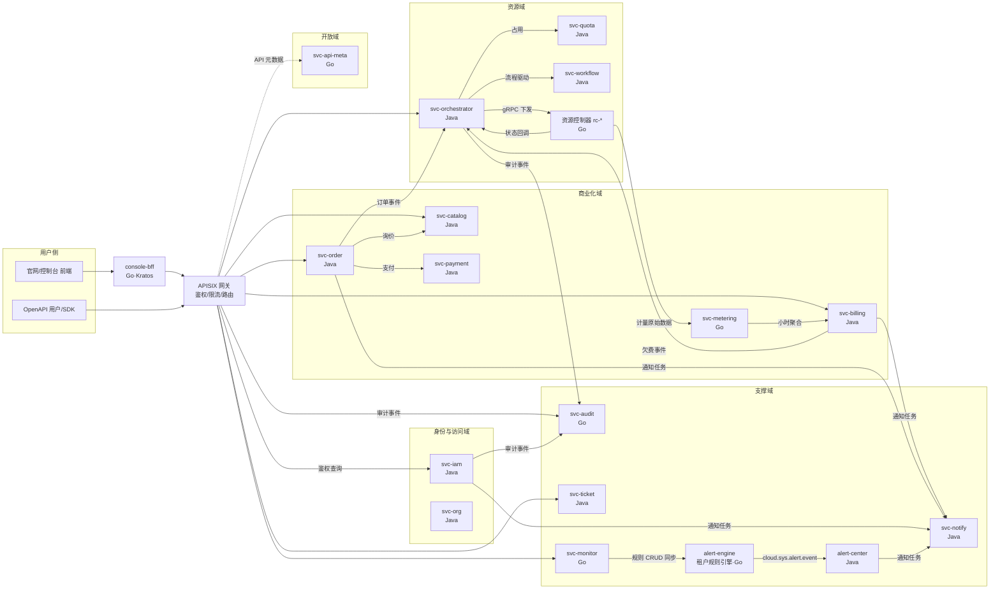
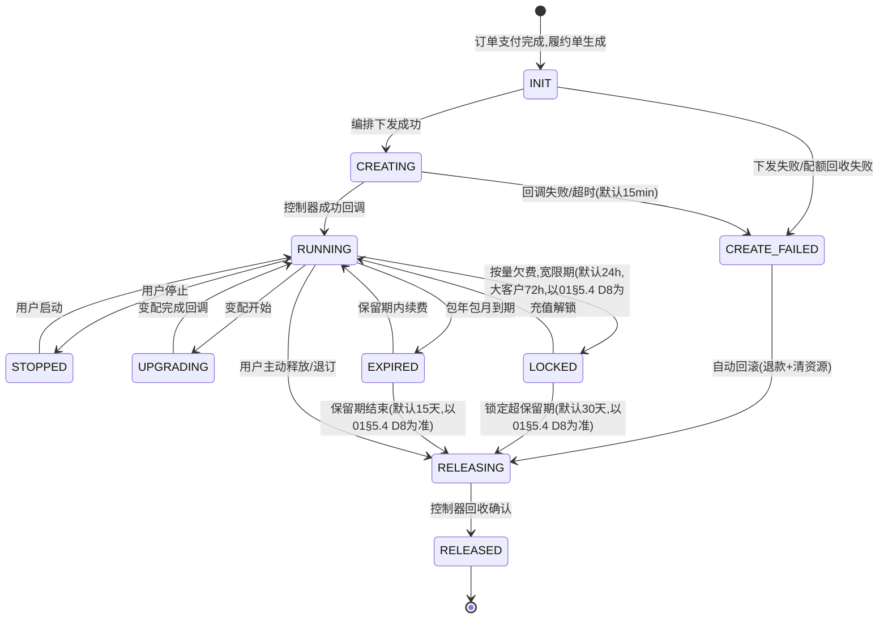
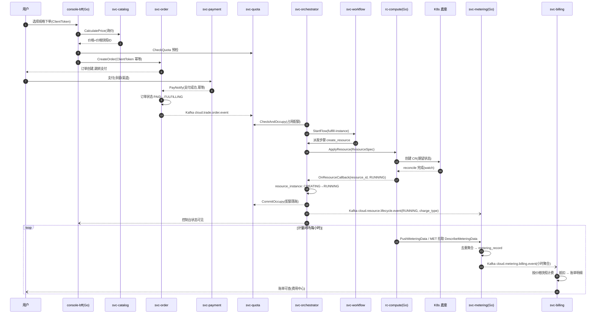
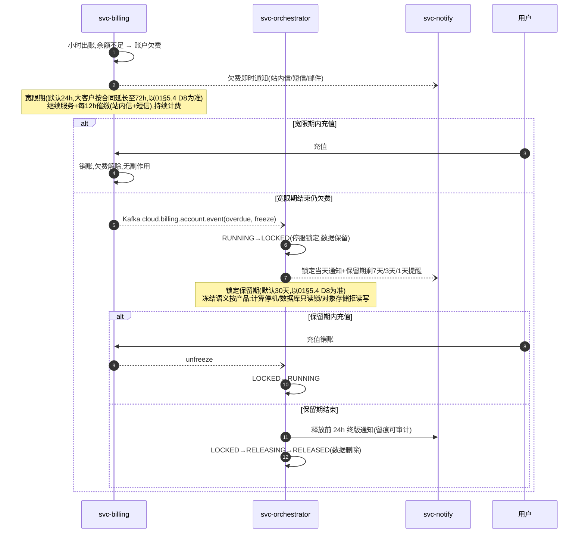
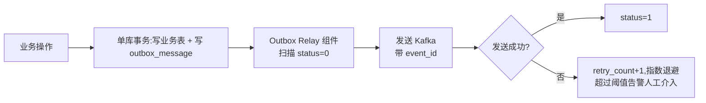
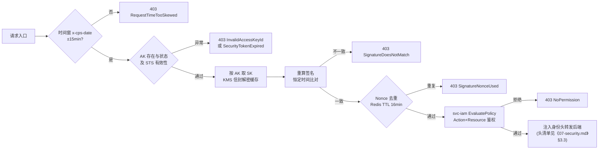
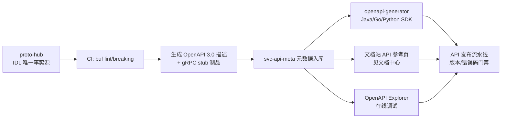

# 03 后端微服务划分与领域架构

| 文档属性 | 值 |
|---|---|
| 章节编号 | 03 |
| 状态 | 评审稿 v1.0 |
| 适用阶段 | 架构评审 / 落地实施 |
| 上游输入 | 《00-overview.md》总体分层、《01-product-catalog.md》产品体系、《10-research-and-selection-decisions.md》选型决策 |
| 下游消费者 | 《04-middleware-infrastructure.md》《05-data-observability.md》《06-kubernetes-productization.md》《08-devops-delivery.md》 |

---

## 1. 章节定位与设计原则

### 1.1 本章回答的问题

本章是云平台"管控面"后端的施工蓝图,回答五个问题:

1. Java(Spring Cloud)与 Go(Kratos)两套语言栈在微服务体系中如何分工,谁写什么域;
2. 平台需要哪些微服务——17 个核心服务(详见 4.0 服务总表)的职责边界、归属语言、核心接口与依赖关系(Nacos Group 一律用应用名,如 Group=svc-order);
3. 云资源生命周期的通用模型:状态机、下单→编排→下发→回调→计量的端到端时序;
4. 账号、资源、订单、账单、配额五类核心数据模型(建表级示例);
5. 分布式一致性方案(最终一致 + 幂等 + 补偿 + 对账)与对外 OpenAPI 规范。

> 命名规范:服务名一律 `svc-{domain}`(svc-iam/svc-order/svc-billing/svc-orchestrator/svc-audit/svc-metering/svc-catalog/svc-quota/svc-workflow/svc-monitor/svc-notify/svc-ticket/svc-api-meta/svc-payment/svc-org 等),接入层 BFF 用 `{场景}-bff`(console-bff/site-bff/auth-console-bff),数据面控制器用 `rc-*`(rc-compute/rc-storage/rc-network/rc-database),告警组件 alert-engine/alert-center;Nacos Group = 应用名(=服务名),废止 `{DOMAIN}_GROUP` 形式;4.0 服务总表为唯一事实源,完整命名模式见《04-middleware-infrastructure.md》§4.3、全局标识规范见《00-overview.md》附录 A。

数据面(承载用户业务流量的 K8s/存储/网络底座)不在本章展开,参见《06-kubernetes-productization.md》与《04-middleware-infrastructure.md》。

### 1.2 领域划分原则(DDD 战略视角)

```
限制上下文(Bounded Context)即服务边界,划分时遵循五条硬规则:
R1 数据私有:每个服务独占自己的库/表,跨服务只允许 API 与事件,禁止跨库 JOIN;
R2 账号维度聚合:凡涉及"钱"与"资源归属"的实体,必须以 account_id 为聚合根或分片键;
R3 状态机内聚:一个状态机的所有迁移只能落在一个服务里(资源状态归编排,订单状态归订单,账单状态归计费);
R4 事件优先:跨域信息传递默认走 Kafka 领域事件,同步 RPC 仅用于必须实时拿到结果的查询/校验;
R5 产品可插拔:新增云产品 = 注册资源类型 + 实现资源控制器 + 注册计量项,不允许侵入平台公共服务。
```

### 1.3 与其他章节的关系

| 关联点 | 参见 |
|---|---|
| 全局分层与管控面/数据面划分 | 《00-overview.md》 |
| 产品大类与 MVP 产品顺序 | 《01-product-catalog.md》 |
| 控制台 BFF、OpenAPI 调试台等前端对接面 | 《02-frontend-architecture.md》 |
| Nacos/Kafka/MySQL 分库分表/Redis 部署形态 | 《04-middleware-infrastructure.md》 |
| 日志/Trace/指标落库与计量明细归档 | 《05-data-observability.md》 |
| 资源控制器如何驱动 K8s CR | 《06-kubernetes-productization.md》 |
| AK/SK、RAM 策略引擎的安全细节 | 《07-security.md》 |
| 服务部署、CI/CD、灰度 | 《08-devops-delivery.md》 |
| 人力排期与里程碑 | 《09-roadmap.md》 |
| 对标启示/选型决策/兼容性坑清单 | 《10-research-and-selection-decisions.md》§3.4/§4.2/§4.4 |

---

## 2. 语言栈分工:Java(Spring Cloud)与 Go(Kratos)

### 2.1 分工结论(与选型决策一致,见《10-research-and-selection-decisions.md》§4.2)

> **结论**:管控业务域(账号、商品、订单、计费、编排等强事务/复杂规则)用 **Java + Spring Cloud**;高并发低延迟、资源敏感型组件(BFF、计量采集、审计接入、推送网关、资源控制器、K8s Operator)用 **Go + Kratos**。
>
> **理由**:① Java 域与 ShardingSphere、事务生态、对账批处理框架契合度最高,团队复杂业务表达力强;② Kratos gRPC-first、编译产物小、内存占用低,适合大量常驻的接入型/数据面组件;③ 与《10-research-and-selection-decisions.md》§4.2"语言分工"结论完全一致,不做偏离。
>
> **备选方案**:Go 域改用 Go-Zero。
>
> **何时改选备选**:Go 团队希望开箱即用(内置缓存/限流/代码生成)、减少自建脚手架投入时改用 Go-Zero;一旦定下来不允许两框架混用。

### 2.2 管控面 vs 数据面职责落位

```
┌─────────────────────────────────────────────────────────────────────┐
│                        管控面(Management Plane)                     │
│                                                                     │
│  ┌─ 接入层 ──────────────────────────────────────────────────────┐  │
│  │ console-bff (Go)   openapi 网关 APISIX   push-gateway (Go)   │  │
│  └───────────────────────────────────────────────────────────────┘  │
│  ┌─ 业务域(Java/Spring Cloud)─────────────────────────────────┐  │
│  │ svc-iam  svc-org  svc-catalog  svc-order  svc-billing        │  │
│  │ svc-payment  svc-orchestrator  svc-quota  svc-workflow       │  │
│  │ svc-notify  svc-ticket  alert-center(告警收敛/对客通道)     │  │
│  └───────────────────────────────────────────────────────────────┘  │
│  ┌─ 高吞吐域(Go/Kratos)───────────────────────────────────────┐  │
│  │ svc-metering(计量采集聚合)  svc-audit(审计接入查询)        │  │
│  │ svc-monitor(监控告警产品)   svc-api-meta(API 元数据/SDK)   │  │
│  │ alert-engine(租户告警规则评估)                            │  │
│  └───────────────────────────────────────────────────────────────┘  │
└─────────────────────────────────────────────────────────────────────┘
                              │ gRPC 下发 / 事件回传
┌─────────────────────────────────────────────────────────────────────┐
│                        数据面(Resource Plane)                       │
│  rc-compute / rc-storage / rc-network ...(Go 资源控制器 + K8s CR)   │
│  K8s / Ceph / MinIO / 网络底座……参见《06》《04》                    │
└─────────────────────────────────────────────────────────────────────┘
```

分工判定口诀:**"规则和钱归 Java,吞吐和连接归 Go,资源动手归控制器"**。

### 2.3 统一服务治理方案

#### 2.3.1 注册发现与配置中心

遵循选型结论,**Nacos 一套同时承担注册中心与配置中心**。

- **Namespace**:按环境隔离 `dev / staging / prod`(联调合并入 dev,不设 test/unit/dev-test),跨环境不互通;与《04-middleware-infrastructure.md》§4.3 及《10-research-and-selection-decisions.md》§4.3 一致;
- **Group**:一律用应用名(如 `svc-order`),禁止按团队分组;
- **服务名规范**:`svc-{domain}`,Java 与 Go 注册名同构,例如 `svc-iam`,元数据带 `lang=java|go`、`plane=mgmt|data` 标签,供网关与监控过滤;
- **配置键规范**:`{app}.{module}.{key}`,敏感配置(数据库口令、支付密钥)不入 Nacos 明文,走 K8s Secret + 启动注入,参见《07-security.md》;
- **APISIX 对接注意**:APISIX discovery 插件走 Nacos 1.x HTTP Open API,需锁定 Nacos 版本并开启鉴权后同步验证(group/namespace 必须与客户端注册参数完全一致),此坑见《10-research-and-selection-decisions.md》§4.4 兼容性清单,部署细节见《04-middleware-infrastructure.md》。

#### 2.3.2 服务间协议选择:gRPC / OpenFeign / HTTP

> **结论**:东西向(服务间)统一 **gRPC + Protobuf,IDL-first**;南北向(对外开放 API)走 **HTTP/OpenAPI + APISIX**;**OpenFeign 不用于服务间契约调用**,仅用于 Java 服务对接第三方 HTTP 服务(支付渠道、短信通道、实名认证供应商)。

| 协议 | 定位 | 适用场景 | 禁止场景 |
|---|---|---|---|
| gRPC + Protobuf | 东西向标准 | 所有微服务间同步调用、资源控制器下发与回调、计量上报 | 直接暴露给公网用户 |
| HTTP/OpenAPI | 南北向标准 | OpenAPI 网关、console-bff 对前端、官网接口 | 服务间高频调用 |
| OpenFeign | 三方集成 | 调支付/短信/实名的外部 HTTP API,带负载均衡与降级 | 内部服务间契约(避免 Java 域自成一套 REST 标准,与 Go 域割裂) |
| Kafka 事件 | 异步解耦 | 跨域状态广播、削峰、计量管道 | 需要即时一致结果的场景 |

**理由**:① 与《10-research-and-selection-decisions.md》§4.2"东西向统一 gRPC+Protobuf、IDL-first 跨语言生成"结论一致;② Kratos 原生 gRPC,Spring 侧用 grpc-spring-boot-starter,一套 proto 双端生成,契约不可被某一方私改;③ 性能上 gRPC 二进制序列化 + HTTP/2 多路复用,计量上报与资源回调这类高频链路收益明显。

**备选方案**:Java 域内部用 OpenFeign(HTTP/JSON)简化调试。

**什么条件下改选备选**:仅当 MVP 阶段 Go 服务数量为 0、且团队确认 proto 治理成本显著高于收益时,允许 Java 域内部短期用 OpenFeign;但任何跨"钱/资源"边界的接口与所有事件必须一步到位按 gRPC/Kafka 标准建设,且该豁免在第一个 Go 服务上线时终止,存量 Feign 接口按季度收敛为 gRPC。

**IDL 管理**:所有 proto 集中在 `proto-hub` 独立仓库,目录按服务划分,CI 强制 `buf lint` + 兼容性检查(`buf breaking`),Java/Go 代码由流水线生成制品(Jar / Go module),业务仓库不手写生成代码。

#### 2.3.3 流量治理:超时、重试、限流、熔断

| 项 | 约定 |
|---|---|
| 超时分级 | 快查询 1s / 常规调用 3s / 编排下发类 10s;调用方超时 ≤ 被调方处理超时的 80% |
| 重试 | 只重试幂等读;写接口默认不重试,除非携带 `ClientToken` 且被调方已实现幂等(见 8.3) |
| 限流 | 南北向由 APISIX `limit-req/limit-count` 插件按 AK/IP 双维限流;Java 域内部用 Sentinel 兜底;Go 服务不单点部署 Sentinel 等价物,统一由 APISIX 与 gRPC 拦截器兜底,避免双标准 |
| 熔断 | gRPC 客户端统一封装熔断拦截器(错误率 >50% 持续 10s 半开),查询类降级返回缓存或空态 |
| 优雅上下线 | 注册 Nacos 后延迟接流(预热 30s);下线前摘流并等待存量请求完成(最长 30s),发布细节见《08-devops-delivery.md》 |

#### 2.3.4 统一工程约定

- **错误传播**:gRPC Status + 自定义 `ErrorDetail`(携带业务错误码),跨服务透传 `request_id`;
- **链路**:全服务强制接入 OpenTelemetry(Java 用 agent,Go 用 SDK),trace_id 注入日志 MDC,可观测体系见《05-data-observability.md》;
- **健康检查**:`/healthz` `/readyz`(Go)与 Spring Actuator health(Java)统一被 K8s 探针使用;
- **指标**:每服务暴露 `/metrics`(Prometheus 格式),RED 三指标(速率/错误/耗时)为交付门禁;
- **脚手架**:Java 统一 archetype、Go 统一 Kratos layout 模板,内含 trace、metrics、幂等、审计埋点中间件,新服务从模板生成。

---

## 3. 领域全景与服务依赖总图



依赖红线:**任何服务不得反向依赖自己的下游消费者的私有库;商业化域不允许直接调资源控制器,必须经过编排服务;rc-* 控制器不感知"钱",只认资源指令。**

---

## 4. 服务清单详解

### 4.0 服务总表

> 本表为全书服务清单/职责/语言栈的**唯一事实源**(命名规范 `svc-{domain}`,Nacos Group=应用名,见《04-middleware-infrastructure.md》§4.3)。本表共列 **18 个具名服务**(含 alert-engine/alert-center 两个告警组件),其中**一期微服务 17 个**(alert-center 后置,见《09-roadmap.md》§3.4 基线表),二/三期扩至 50+。OpenAPI 入口由 APISIX + svc-api-meta 承担,不单设 OpenAPI BFF。
>
> 说明:全平台口径为"**一期 17 个核心微服务**(alert-center 后置)+ 2 个告警组件(alert-engine/alert-center)= 表列 18 行具名项";引用服务总数时写"17"(《09》§3.4 基线),引用本表行数时写"18"。

| 服务名 | 中文职责 | 语言栈 | 域 | 关键存储 |
|---|---|---|---|---|
| svc-iam | 账号、认证、AK/SK、RAM 用户/角色/策略 | Java | 身份 | MySQL(分库)+ Redis |
| svc-org | 组织、项目(资源组)、标签 | Java | 身份 | MySQL |
| svc-catalog | 商品目录、定价、询价、试用代金券 | Java | 商业化 | MySQL + Redis |
| svc-order | 订单中心(新购/续费/升降配/退订) | Java | 商业化 | MySQL(分库分表) |
| svc-payment | 支付渠道对接、收退款、对账单 | Java | 商业化 | MySQL |
| svc-billing | 出账、抵扣、余额、欠费判定(现金余额/流水归 trade_db ledger) | Java | 商业化 | MySQL(分库分表) |
| svc-metering | 计量采集、聚合、上报管道 | Go | 商业化 | Kafka + ClickHouse + MySQL |
| svc-orchestrator | 资源编排与生命周期管控、资源台账 resource_instance 唯一所有者(对标 ROS 履约侧) | Java | 资源 | MySQL + Kafka |
| svc-quota | 配额定义、占用、审批 | Java | 资源 | MySQL + Redis |
| svc-workflow | 轻量工作流/状态机引擎(平台底座) | Java | 资源 | MySQL + Kafka |
| svc-monitor | 用户侧监控告警产品:规则管理与指标查询代理(对标 CloudMonitor) | Go | 支撑 | MySQL + 租户 VM 集群 |
| alert-engine | 租户告警规则评估(即《05》中的"租户规则引擎") | Go | 支撑 | MySQL(alert_rule)+ 租户 VM 集群 |
| alert-center | 告警收敛与对客通知通道 | Java | 支撑 | MySQL + Kafka + ClickHouse |
| svc-notify | 站内信/短信/邮件/推送 | Java | 支撑 | MySQL + Kafka |
| svc-audit | 操作审计采集与查询 | Go | 支撑 | Kafka + ClickHouse |
| svc-ticket | 工单系统 | Java | 支撑 | MySQL |
| svc-api-meta | OpenAPI 元数据、文档与 SDK 生成 | Go | 开放 | MySQL + MinIO |
| console-bff | 控制台聚合层 | Go | 接入 | Redis |
| rc-* | 各产品资源控制器(数据面) | Go | 资源 | K8s etcd(CR) |

> 说明:KMS 信封加密由 svc-iam 调用平台 KMS(部署见《04-middleware-infrastructure.md》§7),不单设独立 KMS 微服务;文档站与站点静态资源由 site-bff 接入(详见《02-frontend-architecture.md》§1.2)。下列按域给出每服务的职责、核心接口示例与依赖。接口以 gRPC/proto 风格示意(对内)并标注其 OpenAPI Action(对外)。

### 4.1 身份与访问域

#### 4.1.1 svc-iam(账号与身份,对标 RAM)

- **职责**:主账号注册/登录/注销、实名认证状态、MFA、RAM 子用户与用户组、角色与 STS 后置、AK/SK 生命周期、策略(Policy)引擎鉴权。**Day 1 服务,晚做则全平台返工**(对标启示 1,见《10-research-and-selection-decisions.md》§3.4)。
- **语言栈**:Java。理由:策略求值涉及组织/项目/资源标签多因子组合,规则复杂、变更频繁,且与账号强事务绑定。
- **核心接口**:
  ```protobuf
  service AccountService {
    rpc Register(RegisterReq) returns (AccountResp);        // IAM.Register
    rpc Login(LoginReq) returns (SessionResp);              // 仅 BFF 内部
    rpc VerifyIdentity(VerifyReq) returns (VerifyResp);     // 网关鉴权热路径,P99<5ms(全缓存)
  }
  service RamService {
    rpc CreateUser / DeleteUser / AttachPolicy / DetachPolicy;
    rpc CreateAccessKey / UpdateAccessKeyStatus;            // IAM.CreateAccessKey
    rpc EvaluatePolicy(EvaluateReq) returns (DecisionResp); // Action+Resource+Principal 求值
  }
  ```
- **性能要点**:`VerifyIdentity` 是全网最热路径(每次 OpenAPI 调用都触发),策略与 AK 元数据全量本地缓存 + Redis 二级缓存,变更经 Kafka 广播失效;不允许任何数据库同步查询。
- **依赖**:上游 APISIX/BFF;下游 无(被所有服务依赖);中间件 MySQL、Redis Cluster、Kafka(`cloud.user.event` 与 `cloud.user.login.event`,topic 规范见《04-middleware-infrastructure.md》§5.4)。
- **安全细节**(密码散列、SK 信封加密存储与验签缓存、MFA TOTP、策略 JSON 语法)见《07-security.md》。

#### 4.1.2 svc-org(组织与项目)

- **职责**:资源目录(企业多账号后置)、项目(资源组)CRUD、资源归属与移动、统一标签(Tag)体系。标签是成本分析与权限的公共语言,模型第一天就要稳。
- **语言栈**:Java。
- **核心接口**:
  ```protobuf
  service OrgService {
    rpc CreateProject / UpdateProject / ListProjects;   // Org.CreateProject
    rpc MoveResource(resource_id, project_id);          // Org.MoveResource
    rpc TagResources / UntagResources;                  // Tag.TagResources
  }
  ```
- **依赖**:svc-iam(鉴权)、被 svc-order/svc-orchestrator 校验项目归属;Kafka 消费 `cloud.resource.lifecycle.event` 维护项目下资源计数(topic 规范见《04-middleware-infrastructure.md》§5.4)。

### 4.2 商业化域

#### 4.2.1 svc-catalog(商品与定价)

- **职责**:产品/资源类型目录、SKU 与规格定义、定价计划(包年包月/按量/资源包)、价格计算引擎、试用代金券规则挂载点。**Day1 计费形态 = 包年包月 + 按量(资源包与抢占式后置二期);免费试用以试用代金券形态一期最小实现(由本服务提供代金券最小实现),满减/折扣券后置二期**(以《01-product-catalog.md》D6/D7 为唯一事实源)。
- **语言栈**:Java。
- **核心接口**:
  ```protobuf
  service CatalogService {
    rpc DescribeProducts / DescribeSpecs;               // Catalog.DescribeProducts
    rpc CalculatePrice(PriceReq) returns (PriceResp);   // Catalog.CalculatePrice 询价,幂等
    rpc GetPriceSnapshot(sku_id, version);              // 订单固化价格快照
  }
  ```
- **依赖**:无强下游;价格配置走 Nacos 热更新 + MySQL 版本表双轨,发布需审批(配置灰度见《04-middleware-infrastructure.md》)。
- **约束**:新增产品必须在此注册"资源类型 + 计量项 + API 集"三件套(对标启示 2,见《10-research-and-selection-decisions.md》§3.4),注册表结构见 5.1。

#### 4.2.2 svc-order(订单中心)

- **职责**:统一订单模型(新购/续费/升配/降配/退订五类),购物车后置;询价→锁价→下单→支付驱动→履约触发→退订退款编排;订单是商业化复杂度的中枢(对标启示 9,见《10-research-and-selection-decisions.md》§3.4)。
- **语言栈**:Java。理由:强事务 + 状态机 + 金额精度,属《10-research-and-selection-decisions.md》§4.2 中 Java 域典型场景。
- **核心接口**:
  ```protobuf
  service OrderService {
    rpc CreateOrder(CreateOrderReq) returns (OrderResp); // Order.CreateOrder,幂等键 ClientToken
    rpc PayNotify(PayNotifyReq) returns (Ack);           // svc-payment 回调,幂等
    rpc RenewOrder / ResizeOrder / RefundOrder;          // Order.RenewOrder 等
    rpc DescribeOrders(account_id, page);                // Order.DescribeOrders
  }
  ```
- **事件**:订单状态机每次迁移发布 `cloud.trade.order.event`(created/paid/fulfilling/completed/cancelled/refunded,topic 规范见《04-middleware-infrastructure.md》§5.4)。
- **依赖**:svc-catalog(询价)、svc-payment(收退款)、svc-quota(预检)、Kafka → svc-orchestrator(履约);数据 MySQL 按 account_id 分库分表。
- **关键规则**:订单 `paid → fulfilling` 是唯一触发资源创建的事件;退订走"先冻结资源 → 编排释放 → 确认退款",禁止先退钱后删资源。

#### 4.2.3 svc-payment(支付对接)

- **职责**:支付渠道适配(一期内部模拟渠道/余额支付,二期对接三方)、支付单与退款单、渠道回调验签与幂等、渠道对账文件解析。
- **语言栈**:Java。
- **核心接口**:
  ```protobuf
  service PaymentService {
    rpc CreatePayment(order_id, channel);               // 内部调用
    rpc ChannelCallback(raw);                           // HTTP 回调入口,验签+幂等
    rpc Refund(payment_id, amount, reason);
    rpc QueryPaymentStatus(payment_id);
  }
  ```
- **依赖**:上游 svc-order;外部渠道 HTTP(OpenFeign 封装);Kafka `cloud.trade.payment.event`(topic 规范见《04-middleware-infrastructure.md》§5.4)。
- **一致性**:支付单与订单之间靠双向对账兜底(8.5),回调处理先落库再发事件。

#### 4.2.4 svc-billing(计费出账)

- **职责**:计费规则执行(按量小时出账)、资源包/代金券抵扣顺序、余额扣减与欠费判定、账单生成(小时明细 + 月度汇总)、欠费催收事件、发票合同后置。现金余额与余额流水归本服务管辖的 trade_db ledger(见《04-middleware-infrastructure.md》§6.3)。
- **语言栈**:Java。理由:金额计算、抵扣顺序、账务强一致,复杂规则密集。
- **核心接口**:
  ```protobuf
  service BillingService {
    rpc ChargeHourly(ChargeBatchReq) returns (Ack);     // 消费 cloud.metering.billing.event
    rpc DescribeBills / DescribeBillDetails;            // Billing.DescribeBills
    rpc GetAccountBalance / AdjustBalance;              // 内部账务
    rpc FreezeResource(resource_id, reason);            // 欠费下发给编排(经 Kafka)
  }
  ```
- **依赖**:上游 svc-metering(聚合计量)、svc-catalog(单价快照);下游 Kafka `cloud.billing.account.event` → 通知/催收;数据按 account_id 分库分表,明细按月分区归档 ClickHouse(见《05-data-observability.md》)。
- **出账链路**:计量聚合 → 计费(单价快照)→ 抵扣(资源包→代金券→余额)→ 明细入账 → 小时汇总 → 月度账单;欠费 → 宽限期 → 停服锁定 → 释放,状态机对用户透明(5.4)。

#### 4.2.5 svc-metering(计量采集与聚合)

- **职责**:采集各 rc-* 控制器的计量原始数据(事件推 + 定时拉双通道)、清洗去重、按"资源 × 计量项 × 小时"聚合、产出计费输入与计量明细归档。
- **语言栈**:Go。理由:高频写入管道(目标 10k msg/s 级)、无复杂事务,属数据接入型,符合 Go 域定位。
- **核心接口**:
  ```protobuf
  service MeteringService {
    rpc PushMeteringData(stream MeteringPoint);         // rc-* 推送,带幂等去重键
    rpc DescribeMeteringData(resource_id, item, range); // Billing.DescribeMeteringData
  }
  ```
- **依赖**:Kafka `cloud.metering.usage.raw`、ClickHouse(明细)、MySQL(小时聚合结果 `metering_record`)、下游 Kafka `cloud.metering.billing.event`(topic 规范见《04-middleware-infrastructure.md》§5.4)。
- **关键规则**:计量宁可重采不可漏采;聚合任务失败可无限重算(幂等,唯一键 resource+item+hour)。

### 4.3 资源域

#### 4.3.1 svc-orchestrator(资源编排与生命周期)

- **职责**:① 资源生命周期唯一所有者:持有资源台账 `resource_instance` 表(6.2),状态机唯一写入口(状态迁移只在本服务发生,K8s phase 仅作观测字段);② 订单履约编排:把订单拆解为资源操作序列并驱动执行;③ 对外 IaC 模板编排(对标 ROS,二期);④ 失败补偿与超时回收。
- **语言栈**:Java。理由:编排逻辑 = 复杂规则 + 状态机 + 事务记录,且与订单/配额等 Java 服务强协同。
- **核心接口**:
  ```protobuf
  service OrchestratorService {
    rpc FulfillOrder(OrderFulfillReq) returns (FlowId); // 消费 cloud.trade.order.event
    rpc OnResourceCallback(CallbackReq) returns (Ack);  // rc-* 异步回调,幂等
    rpc OperateResource(resource_id, op);               // 启停/重启指令透传
    rpc DescribeResourceStatus(resource_id);
  }
  ```
- **依赖**:svc-workflow(流程底座,经其派发 gRPC 声明式下发步骤)、svc-quota(占用/释放)、rc-*(gRPC 声明式下发 `ApplyResource`,rc-* 写 K8s CR 后异步回调;`cloud.resource.provision.task`/`cloud.resource.provision.status` 仅作异步回调与重试通道,非主下发通道,见《06-kubernetes-productization.md》§4.0)、Kafka `cloud.resource.lifecycle.event`、`cloud.billing.account.event`(欠费锁定输入,topic 规范见《04-middleware-infrastructure.md》§5.4)。
- **关键规则**:控制器回调与主动轮询(防丢)双保险;每次状态迁移写 `resource_instance` + 发事件,二者由本地消息表保证原子(8.2)。06 中的 resource-center 并入本服务(同名),provision-bridge 收敛为 rc-* 履约执行层,详见《06-kubernetes-productization.md》§4.0。

#### 4.3.2 svc-quota(配额中心)

- **职责**:配额定义(每产品每 region)、用量实时统计、下单前校验与占用、释放回退、配额提升工单审批。
- **语言栈**:Java。理由:占用/回退必须与订单事务语义协同,且需要审计。
- **核心接口**:
  ```protobuf
  service QuotaService {
    rpc CheckAndOccupy(account_id, quota_code, region, amount) returns (Token);
    rpc CommitOccupy(token) / ReleaseOccupy(token);     // 两阶段占用
    rpc DescribeQuotas(account_id);                     // Quota.DescribeQuotas
    rpc ApplyQuotaIncrease(...);                        // 转工单审批
  }
  ```
- **实现要点**:Redis 承载热路径用量(DB 乐观锁 `version` 字段为准,Redis 加速与限流),占用令牌带 TTL 防止悬挂;被占用后超时未 Commit 自动 Release。
- **依赖**:被 svc-order(下单预检)、svc-orchestrator(履约占用)调用。

#### 4.3.3 svc-workflow(工作流引擎)

- **职责**:平台级轻量流程引擎:流程定义(步骤 DAG)、实例与步骤状态持久化、超时与重试调度、补偿步骤登记。**自研轻量实现,不引入候选池外的重型工作流组件(如 Temporal/Camunda)**。
- **语言栈**:Java。
- **设计**:
  - `flow_definition`(步骤 JSON)/ `flow_instance` / `step_instance` 三张表,步骤经 Kafka `cloud.sys.workflow.task` 派发给执行器(各业务服务订阅自己的 task_type,topic 规范见《04-middleware-infrastructure.md》§5.4);
  - 定时器由"扫描 `next_fire_at` 索引 + 分布式锁"实现,不依赖额外调度组件;
  - 步骤执行必须幂等(引擎 at-least-once 投递)。
- **核心接口**:
  ```protobuf
  service WorkflowService {
    rpc StartFlow(def_key, biz_key, payload) returns (flow_instance_id);
    rpc CompleteStep(step_id, result);   // 执行器回调
    rpc CompensateFlow(flow_instance_id);
  }
  ```
- **服务对象**:svc-orchestrator(主用户)、svc-ticket(审批流)、svc-billing(催收流程)。

#### 4.3.4 rc-*(资源控制器,数据面代理)

- **职责**:每类产品一个控制器(rc-compute / rc-storage / rc-network…),接收编排下发的资源指令,翻译为对底座(K8s CR、MinIO、网络配置)的实际操作;向上异步回调状态,向下周期巡检对账;提供 `DescribeMeteringData` 供计量拉取。
- **语言栈**:Go。理由:K8s Operator 生态(controller-runtime)全部是 Go;常驻组件资源占用敏感。
- **核心接口**:
  ```protobuf
  service ResourceController {
    rpc ApplyResource(ResourceSpec) returns (task_id);  // 创建/变更(声明式)
    rpc DeleteResource(resource_id);
    rpc Operate(resource_id, op);                       // start/stop/restart
    rpc QueryStatus(resource_id) returns (StatusResp);  // 编排轮询兜底
    rpc DescribeMeteringData(range) returns (stream);
  }
  ```
- **模式**:期望状态存 K8s CR,实际状态由 reconcile 收敛;回调 = watch 事件转 gRPC 上报。详见《06-kubernetes-productization.md》。
- **新产品接入契约**:实现本接口 + 在 svc-catalog 注册三件套 + 定义计量项,即完成上架(对标启示 2/5,见《10-research-and-selection-decisions.md》§3.4)。

### 4.4 支撑域

#### 4.4.1 svc-monitor(监控告警服务,对标 CloudMonitor)

- **职责**:面向租户的告警规则 CRUD 与预置规则模板、指标数据查询代理(供控制台图表)、告警与资源生命周期联动。**本服务只做规则管理与查询代理,不做告警评估**——评估由租户规则引擎(alert-engine)完成,对客通知统一走告警中心(alert-center)。
- **语言栈**:Go。理由:查询代理 QPS 高、VM/MetricsQL(PromQL 兼容)生态同语言;规则管理逻辑不复杂。
- **核心接口**:
  ```protobuf
  service MonitorService {
    rpc PutMetricRule / DeleteMetricRule / DescribeMetricRules;  // Monitor.PutMetricRule 等
    rpc DescribeMetricRuleTemplates(product_code);               // 平台预置规则模板(scecs CPU/内存/磁盘等)
    rpc QueryMetricData(resource_id, metric, range);             // Monitor.QueryMetricData
  }
  ```
- **实现**(与《05-data-observability.md》§8/§9 的双栈方案完全一致,以该章为准):
  - **租户侧不部署 Prometheus/AlertManager**:租户 agent(cloudmonitor-agent)经监控接入网关直推租户 VictoriaMetrics 集群(account_id/project_id 多租户隔离,字段名见《00-overview.md》附录 A 全局标识规范),因此不存在"把租户规则编译为 AlertManager 配置"的落地路径;
  - **规则存储**:租户规则落 MySQL `alert_rule`(分片键 account_id),规则数量上限按套餐分级(免费 5 条/企业版 100 条),变更同步 alert-engine 生效;
  - **告警评估**:alert-engine 每分钟从租户指标集群拉取评估,触发事件写 Kafka `cloud.sys.alert.event`;
  - **对客通知**:alert-center 消费 `cloud.sys.alert.event`,经去重/分组/抑制/静默四级收敛后走对客通道(站内信/短信/邮件/Webhook),发送动作经 `cloud.notify.message` 复用 svc-notify 渠道;
  - **大盘不对客暴露 Grafana**:控制台图表由 Vue 组件经 BFF 调用本服务 QueryMetricData,代理层强制注入租户过滤 + RAM 鉴权 + 查询限流(《05-data-observability.md》§9.3)。

#### 4.4.2 svc-notify(消息通知)

- **职责**:通知模板管理、渠道发送(站内信/短信/邮件/WebSocket 推送)、发送频控与退订、通知偏好。
- **语言栈**:Java(模板、偏好、频控规则)+ Go 组件 `push-gateway`(WebSocket 长连接,高并发资源敏感型)。
- **核心接口**:消费 Kafka `cloud.notify.message`(统一任务模型:account_id + template_id + 参数 + 渠道;topic 规范见《04-middleware-infrastructure.md》§5.4);对外 `Notify.DescribeNotifications`(站内信列表)。
- **关键约束**:欠费催收、到期提醒、释放预告三类通知必须落库可查、可追溯(商业信任底线,对标启示 8,见《10-research-and-selection-decisions.md》§3.4)。

#### 4.4.3 svc-audit(审计)

- **职责**:全平台操作审计采集(网关层 + 服务层埋点)、不可篡改存储、按账号检索导出(对标 ActionTrail)。
- **语言栈**:Go。理由:高吞吐写入管道,查询面向分析,ClickHouse 承载;无需复杂事务。
- **实现**:所有审计点统一发 Kafka `cloud.sys.audit.action`(APISIX 插件记录 OpenAPI 调用,服务内拦截器记录管控操作;topic 规范见《04-middleware-infrastructure.md》§5.4),Go 消费者批量写 ClickHouse(按天分区);查询接口供控制台与合规导出。
- **审计留存期**:平台合规基线 ≥180 天热存(等保三级)+ MinIO 冷备;售卖产品提供 365 天/18 个月付费档。与《05-data-observability.md》§11、《07-security.md》§6.2 三章同步,口径以本节为准。
- **依赖**:ClickHouse、Kafka、MinIO;与日志体系关系见《05-data-observability.md》。

#### 4.4.4 svc-ticket(工单)

- **职责**:工单创建/流转/评价、分类与优先级、SLA 计时(支持计划分级后置)、客服工作台接口;审批类流程(配额提升、退款人工审核)复用 svc-workflow。
- **语言栈**:Java。
- **核心接口**:`Ticket.CreateTicket / ReplyTicket / ListTickets`;智能客服机器人接入点预留(后置)。
- **约束**:工单通道属"不可后置"清单(对标启示 10,见《10-research-and-selection-decisions.md》§3.4),MVP 以最简形态上线。

#### 4.4.5 alert-engine(租户规则引擎)

- **职责**:L2 对客告警的评估引擎:按租户规则周期(默认每分钟)从租户 VictoriaMetrics 集群拉取指标并评估(阈值/同比/环比),触发后产出告警事件写 Kafka `cloud.sys.alert.event`;只评估、不通知。
- **语言栈**:Go。理由:周期拉取评估为高频 IO 型负载,无复杂事务,水平扩展友好,符合 Go 域定位。
- **依赖**:读 MySQL `alert_rule`(规则定义归 svc-monitor 所有);读租户 VM 集群;下游 Kafka `cloud.sys.alert.event`(topic 规范见《04-middleware-infrastructure.md》§5.4)。
- **边界**:平台自身(L0/L1)告警走 Prometheus + Alertmanager,不经本服务;双栈分工见《05-data-observability.md》§8.1/§9.2。

#### 4.4.6 alert-center(告警中心)

- **职责**:告警统一收敛与对客通知通道:消费 Kafka `cloud.sys.alert.event`(含平台 Alertmanager webhook 入流与租户规则引擎事件),执行去重/分组/抑制/静默四级收敛,按租户联系人与支持计划等级路由通知,单租户通知限流(10 条/分钟)防通知风暴;告警历史留痕供租户控制台查询。
- **语言栈**:Java。理由:收敛策略、联系人分组、通知偏好属复杂配置型业务,与《05-data-observability.md》§8.3 的结论一致。
- **依赖**:上游 Kafka `cloud.sys.alert.event`;下游 Kafka `cloud.notify.message`(对客短信/邮件/站内信经 svc-notify 发出);告警事件与收敛明细归档 ClickHouse;topic 规范见《04-middleware-infrastructure.md》§5.4。

### 4.5 开放域

#### 4.5.1 OpenAPI 网关(APISIX)+ svc-api-meta(API 元数据与 SDK)

- **职责**:
  - **APISIX**:唯一 OpenAPI 南北向入口——AK/SK 签名校验(CPS1-HMAC-SHA256,见《07-security.md》§4.1)、路由到产品 Action、限流、审计打点、RequestId 生成。路由规划:一产品一子域名 `{productCode}.api.starcloud.cn`(如 `scecs.api.starcloud.cn`),按 `product_code` 路由到对应产品控制面服务,域名形态与路由表以《04-middleware-infrastructure.md》§3.2/§3.3 为准;
  - **svc-api-meta(Go)**:API 元数据中心——存储每个 Action 的参数 schema、错误码、版本;驱动文档自动生成(文档中心,见《01-product-catalog.md》;对标杆源与选型坑清单见《10-research-and-selection-decisions.md》§3.4/§4.2/§4.4)与 SDK 生成(9.4);提供 OpenAPI Explorer 调试台后端。
- **语言栈**:APISIX(选型结论,备选 Spring Cloud Gateway 的条件见《10-research-and-selection-decisions.md》§4.2);svc-api-meta 用 Go(元数据读多写少、与文档/SDK 工具链同生态)。
- **兼容性注意**:APISIX 依赖 etcd,纳入《04-middleware-infrastructure.md》运维清单;Nacos discovery 插件版本锁定见 2.3.1。

---

## 5. 资源生命周期通用模型(云平台核心)

### 5.1 通用资源模型与资源类型注册

所有云资源在平台层抽象为统一的 `resource_instance`,产品私有属性放扩展表/K8s CR,保证控制台列表、费用、审计、配额无需为每个产品定制。

**资源类型注册表**(svc-catalog 持有,新增产品填槽):

| 字段 | 示例(scecs 类) | 说明 |
|---|---|---|
| product_code | `scecs`(SC 云服务器) | 产品代号(《01-product-catalog.md》§1.1 决策 D0,`sc` 前缀体系) |
| resource_type | `instance` | 资源类型 |
| controller_endpoint | `rc-compute:9000` | 控制器 gRPC 地址(Nacos 服务名) |
| supported_ops | create/delete/start/stop/resize | 支持操作集 |
| metering_items | `cpu_core_hour, mem_gb_hour, disk_gb_hour` | 计量项(计费契约) |
| id_prefix | `scecs-` | 资源 ID 前缀(与 product_code 一致) |
| charge_types | prepay/postpay/package | 支持的计费形态 |
| default_quotas | `quota_scecs_instance=20` | 默认配额 |

**资源 ID 规范**:`{productCode}-{regionId}-{分片因子2位}-{随机8位}`,如 `scecs-cn-north-1-01-a1b2c3d4`,全局唯一,前缀即产品,肉眼可读,内嵌 2 位分片因子供反查路由(分片因子格式与《04-middleware-infrastructure.md》§6.4/§6.6 一致,region 命名见《00-overview.md》附录 A 全局标识规范)。

### 5.2 资源状态机



状态机治理规则:

1. **唯一写入口**:所有迁移在 svc-orchestrator 内执行,迁移前 `WHERE status=期望前置态 AND version=?` 乐观锁,非法迁移拒绝并告警;
2. **中间态超时兜底**:`CREATING/UPGRADING/RELEASING` 均设超时(15min/30min/30min),超时任务由 svc-workflow 定时器驱动,先主动 QueryStatus 控制器,仍无果则置失败态并触发补偿;
3. **终态不可逆**:`RELEASED/CREATE_FAILED(已回滚)` 仅保留记录供审计与费用追溯,数据按保留政策物理删除前必须有释放预告通知(5.4);
4. **每次迁移产出两样东西**:`resource_instance` 行更新 + `cloud.resource.lifecycle.event` 事件(本地消息表保证原子,见 8.2);topic 命名以《04-middleware-infrastructure.md》§5.4 为唯一事实源。

### 5.3 下单→编排→下发→回调→计量 端到端时序



时序中的关键设计:

- **第 9 步后订单即不再阻塞用户**,履约全异步,控制台以资源状态为准;
- **第 13-16 步回调丢失兜底**:svc-orchestrator 对 `CREATING` 资源每 30s 轮询 `rc.QueryStatus`,回调与轮询先到者生效(幂等迁移);
- **计量起点**:以 `RUNNING` 事件时间为计费起点(按量),非创建请求时间——对用户公平且可解释;
- **变配/续费**走同一编排框架,仅流程定义不同(resize-flow / renew-flow),时序同上。

### 5.4 欠费生命周期与到期释放策略

对标阿里云,状态机必须对用户完全透明,且每个阶段都有通知。



包年包月并行策略:`到期前 30/15/7/3/1 天续费提醒(站内信+短信+邮件,控制台红色徽标,以 01§5.4 D8 为准)→ 到期 EXPIRED(计算类停机/数据库类只读)→ 保留期 15 天(数据完整,可随时续费恢复)→ 释放(释放前 24h 终版通知)`。

**参数唯一事实源**:以上所有时限以《01-product-catalog.md》§5.4 决策 D8 的参数表为唯一事实源(宽限期 24h、大客户 72h;停服锁定保留 30 天;包年包月到期保留 15 天;续费提醒 30/15/7/3/1 天;释放前 24h 终版通知),本章状态机只消费、不另立默认值;两套参数不允许并存。所有参数声明为 **Nacos 产品级配置**(键示例:`lifecycle.overdue.grace_hours=24`、`lifecycle.overdue.grace_hours.vip=72`、`lifecycle.overdue.dunning_interval_hours=12`、`lifecycle.locked.retention_days=30`、`lifecycle.locked.remind_days=7,1`、`lifecycle.prepay.retention_days=15`、`lifecycle.prepay.remind_days=30,15,7,3,1`、`lifecycle.release.final_notice_hours=24`、`lifecycle.release.secondary_confirm`(释放前二次确认策略,按产品,见《01-product-catalog.md》§5.4)),支持按产品覆盖;任何调整(如因坏账率超阈值收紧宽限期)须提前 30 天公告。释放前通知必须落库可查(svc-notify)+ 审计留痕(svc-audit);停服与释放作业幂等、可暂停(运营一键熔断),对齐《01-product-catalog.md》§5.4 全局原则。

---

## 6. 关键数据模型(SQL 示例)

> 约定:金额一律 `DECIMAL`,禁止浮点;时间一律 `DATETIME` + UTC 存储展示本地化;分库分表策略统一标注。

### 6.1 账号与访问(IAM,按 account_id 分 4 库 × 16 表,对齐 04§6.3)

> **AK/SK 安全基线**:SK 存储方案、生命周期与安全要求以《07-security.md》§2.2/§2.5 为准——验签需要真实 SK 计算 HMAC,故 SK 采用 **KMS 信封加密可逆存储**(`sk_cipher` + `sk_key_version`),**不使用单向哈希**;SK 仅创建时一次性展示,平台不存明文、不可明文查询;每身份最多 2 把 AK,轮转宽限 ≤72h,软删保留 7 天供审计;网关验签经"AK→SK 解密副本"二级缓存、按密钥版本号失效。本节表结构为按 `account_id` 分片的管控视角,与《07-security.md》§2.2 字段安全基线同构。

```sql
CREATE TABLE `account` (
  `account_id`       BIGINT UNSIGNED NOT NULL COMMENT '账号ID,雪花',
  `account_name`     VARCHAR(64)  NOT NULL COMMENT '登录名(邮箱/手机)',
  `password_hash`    VARCHAR(128) NOT NULL COMMENT 'argon2id',
  `status`           TINYINT NOT NULL DEFAULT 1 COMMENT '1正常 2锁定 3注销中 4已注销',
  `real_name_status` TINYINT NOT NULL DEFAULT 0 COMMENT '0未实名 1个人 2企业',
  `mfa_enabled`      TINYINT NOT NULL DEFAULT 0,
  `created_at`       DATETIME NOT NULL DEFAULT CURRENT_TIMESTAMP,
  `updated_at`       DATETIME NOT NULL DEFAULT CURRENT_TIMESTAMP ON UPDATE CURRENT_TIMESTAMP,
  PRIMARY KEY (`account_id`),
  UNIQUE KEY `uk_name` (`account_name`)
) COMMENT='主账号表(仅身份属性);balance 现金余额与余额流水归 trade_db ledger,见《04-middleware-infrastructure.md》§6.3';

CREATE TABLE `access_key` (
  `ak`             VARCHAR(32)    NOT NULL COMMENT '公开标识',
  `sk_cipher`      VARBINARY(512) NOT NULL COMMENT 'SK 的 KMS 信封加密密文;验签需真实 SK 计算 HMAC,故可逆存储而非单向哈希(《07-security.md》§2.2/§2.5)',
  `sk_key_version` INT            NOT NULL COMMENT 'KMS 主密钥版本,密钥轮转时按版本失效验签缓存',
  `account_id`     BIGINT UNSIGNED NOT NULL,
  `ram_user_id`    BIGINT UNSIGNED DEFAULT NULL COMMENT 'NULL=主账号AK',
  `status`         TINYINT NOT NULL DEFAULT 1 COMMENT '1启用 2禁用 3已删除(保留7天可恢复)',
  `last_used_at`   DATETIME DEFAULT NULL,
  `created_at`     DATETIME NOT NULL DEFAULT CURRENT_TIMESTAMP,
  `rotated_at`     DATETIME DEFAULT NULL COMMENT 'SK 轮转时间',
  PRIMARY KEY (`ak`),
  KEY `idx_account` (`account_id`)
) COMMENT='AK表,全局不分片(网关鉴权热表,全量缓存);SK 仅创建时一次性展示,平台不存明文、不可明文查询';

CREATE TABLE `ram_policy` (
  `policy_id`   BIGINT UNSIGNED NOT NULL,
  `account_id`  BIGINT UNSIGNED NOT NULL,
  `policy_name` VARCHAR(64) NOT NULL,
  `document`    JSON NOT NULL COMMENT '{"Version":"1","Statement":[{Effect,Action,Resource}]}',
  `scope`       TINYINT NOT NULL COMMENT '1系统策略 2自定义',
  PRIMARY KEY (`policy_id`),
  UNIQUE KEY `uk_acc_name` (`account_id`,`policy_name`)
) COMMENT='策略;绑定关系表 ram_user_policy/ram_group_policy 从略';
```

### 6.2 资源实例(按 account_id 分 8 库 × 16 表,对齐 04§6.3)

```sql
CREATE TABLE `resource_instance` (
  `resource_id`   VARCHAR(64) NOT NULL COMMENT 'scecs-cn-north-1-01-a1b2c3d4,全局唯一,内嵌2位分片因子',
  `account_id`    BIGINT UNSIGNED NOT NULL,
  `project_id`    BIGINT UNSIGNED NOT NULL DEFAULT 0,
  `product_code`  VARCHAR(32) NOT NULL,
  `resource_type` VARCHAR(64) NOT NULL,
  `region`        VARCHAR(32) NOT NULL,
  `zone`          VARCHAR(32) DEFAULT NULL,
  `charge_type`   TINYINT NOT NULL COMMENT '1包年包月 2按量 3资源包抵扣',
  `status`        VARCHAR(32) NOT NULL COMMENT '状态机枚举,见5.2',
  `spec_code`     VARCHAR(64) DEFAULT NULL COMMENT '规格快照',
  `order_id`      BIGINT UNSIGNED DEFAULT NULL,
  `billing_start` DATETIME DEFAULT NULL COMMENT '计费起点(RUNNING时刻)',
  `expired_at`    DATETIME DEFAULT NULL COMMENT '包年包月到期时间',
  `locked_at`     DATETIME DEFAULT NULL COMMENT '欠费锁定时间',
  `released_at`   DATETIME DEFAULT NULL,
  `version`       INT NOT NULL DEFAULT 0 COMMENT '状态机乐观锁',
  `created_at`    DATETIME NOT NULL DEFAULT CURRENT_TIMESTAMP,
  `updated_at`    DATETIME NOT NULL DEFAULT CURRENT_TIMESTAMP ON UPDATE CURRENT_TIMESTAMP,
  PRIMARY KEY (`resource_id`),
  KEY `idx_acc_prod` (`account_id`,`product_code`,`status`),
  KEY `idx_status_charge` (`status`,`charge_type`) COMMENT '欠费扫描/到期扫描'
) COMMENT='资源实例通用表';

CREATE TABLE `resource_instance_attr` (
  `resource_id` VARCHAR(64) NOT NULL,
  `account_id`  BIGINT UNSIGNED NOT NULL COMMENT '冗余分片键',
  `attr_key`    VARCHAR(64) NOT NULL,
  `attr_value`  VARCHAR(1024),
  PRIMARY KEY (`resource_id`,`attr_key`)
) COMMENT='产品私有属性KV扩展;深度私有状态放控制器CR';
```

### 6.3 订单(按 account_id 分 8 库 × 16 表,对齐 04§6.3)

```sql
CREATE TABLE `order_main` (
  `order_id`        BIGINT UNSIGNED NOT NULL,
  `order_no`        VARCHAR(32) NOT NULL COMMENT '对外单号',
  `account_id`      BIGINT UNSIGNED NOT NULL,
  `order_type`      TINYINT NOT NULL COMMENT '1新购 2续费 3升配 4降配 5退订',
  `product_code`    VARCHAR(32) NOT NULL,
  `charge_type`     TINYINT NOT NULL,
  `original_amount` DECIMAL(12,2) NOT NULL,
  `discount_amount` DECIMAL(12,2) NOT NULL DEFAULT 0,
  `payable_amount`  DECIMAL(12,2) NOT NULL,
  `status`          TINYINT NOT NULL COMMENT '1待支付 2已支付 3履约中 4已完成 5已取消 6退款中 7已退款',
  `client_token`    VARCHAR(64) NOT NULL COMMENT '幂等键',
  `paid_at`         DATETIME DEFAULT NULL,
  `created_at`      DATETIME NOT NULL DEFAULT CURRENT_TIMESTAMP,
  `updated_at`      DATETIME NOT NULL DEFAULT CURRENT_TIMESTAMP ON UPDATE CURRENT_TIMESTAMP,
  PRIMARY KEY (`order_id`),
  UNIQUE KEY `uk_order_no` (`order_no`),
  UNIQUE KEY `uk_client_token` (`account_id`,`client_token`),
  KEY `idx_acc_status` (`account_id`,`status`)
) COMMENT='订单主表';

CREATE TABLE `order_item` (
  `id`            BIGINT UNSIGNED NOT NULL,
  `order_id`      BIGINT UNSIGNED NOT NULL,
  `account_id`    BIGINT UNSIGNED NOT NULL COMMENT '冗余分片键',
  `resource_id`   VARCHAR(64) DEFAULT NULL COMMENT '续费/变配时非空',
  `spec_code`     VARCHAR(64) NOT NULL,
  `quantity`      INT NOT NULL DEFAULT 1,
  `duration`      INT DEFAULT NULL COMMENT '时长',
  `duration_unit` VARCHAR(8) DEFAULT NULL COMMENT 'Month/Year',
  `price_snapshot` JSON NOT NULL COMMENT '询价快照,对账依据',
  `item_amount`   DECIMAL(12,2) NOT NULL,
  PRIMARY KEY (`id`),
  KEY `idx_order` (`order_id`)
) COMMENT='订单行';
```

### 6.4 计量与账单(按 account_id 分 8 库 × 16 表,对齐 04§6.3;明细冷数据归档 ClickHouse)

```sql
CREATE TABLE `metering_record` (
  `id`            BIGINT UNSIGNED NOT NULL,
  `account_id`    BIGINT UNSIGNED NOT NULL,
  `resource_id`   VARCHAR(64) NOT NULL,
  `metering_item` VARCHAR(64) NOT NULL COMMENT 'cpu_core_hour等',
  `metering_hour` DATETIME NOT NULL COMMENT '整点,计量周期',
  `quantity`      DECIMAL(18,6) NOT NULL,
  `source`        TINYINT NOT NULL COMMENT '1推送 2拉取 3补算',
  `created_at`    DATETIME NOT NULL DEFAULT CURRENT_TIMESTAMP,
  PRIMARY KEY (`id`),
  UNIQUE KEY `uk_res_item_hour` (`resource_id`,`metering_item`,`metering_hour`),
  KEY `idx_acc_hour` (`account_id`,`metering_hour`)
) COMMENT='小时计量聚合;幂等重算依赖唯一键';

CREATE TABLE `bill_detail` (
  `id`             BIGINT UNSIGNED NOT NULL,
  `account_id`     BIGINT UNSIGNED NOT NULL,
  `bill_period`    CHAR(7) NOT NULL COMMENT '2026-08 月账期',
  `billing_cycle`  DATETIME NOT NULL COMMENT '小时计费周期',
  `resource_id`    VARCHAR(64) NOT NULL,
  `product_code`   VARCHAR(32) NOT NULL,
  `pretax_amount`  DECIMAL(12,4) NOT NULL COMMENT '原价',
  `deduct_package` DECIMAL(12,4) NOT NULL DEFAULT 0 COMMENT '资源包抵扣',
  `deduct_coupon`  DECIMAL(12,4) NOT NULL DEFAULT 0,
  `pay_amount`     DECIMAL(12,4) NOT NULL COMMENT '实付(扣余额)',
  PRIMARY KEY (`id`),
  KEY `idx_acc_period` (`account_id`,`bill_period`)
) COMMENT='小时账单明细,6个月后归档ClickHouse';

CREATE TABLE `bill_main` (
  `bill_id`       BIGINT UNSIGNED NOT NULL,
  `account_id`    BIGINT UNSIGNED NOT NULL,
  `bill_period`   CHAR(7) NOT NULL,
  `total_amount`  DECIMAL(14,2) NOT NULL,
  `paid_amount`   DECIMAL(14,2) NOT NULL,
  `status`        TINYINT NOT NULL COMMENT '1出账中 2已出账 3已结清 4欠费',
  `settled_at`    DATETIME DEFAULT NULL,
  PRIMARY KEY (`bill_id`),
  UNIQUE KEY `uk_acc_period` (`account_id`,`bill_period`)
) COMMENT='月度汇总账单';
```

### 6.5 配额

```sql
CREATE TABLE `quota_definition` (
  `quota_code`    VARCHAR(64) NOT NULL COMMENT 'quota_scecs_instance',
  `product_code`  VARCHAR(32) NOT NULL,
  `default_value` INT NOT NULL,
  `scope`         VARCHAR(16) NOT NULL COMMENT 'GLOBAL/REGION',
  `adjustable`    TINYINT NOT NULL DEFAULT 1,
  PRIMARY KEY (`quota_code`)
) COMMENT='配额定义,全局表';

CREATE TABLE `quota_usage` (
  `id`          BIGINT UNSIGNED NOT NULL,
  `account_id`  BIGINT UNSIGNED NOT NULL,
  `quota_code`  VARCHAR(64) NOT NULL,
  `region`      VARCHAR(32) NOT NULL DEFAULT '*',
  `used`        INT NOT NULL DEFAULT 0,
  `occupying`   INT NOT NULL DEFAULT 0 COMMENT '履约中占用',
  `hard_limit`  INT NOT NULL COMMENT '账户级覆盖值,缺省取定义',
  `version`     INT NOT NULL DEFAULT 0,
  PRIMARY KEY (`id`),
  UNIQUE KEY `uk_acc_quota_region` (`account_id`,`quota_code`,`region`)
) COMMENT='配额用量,更新走 version 乐观锁';
```

---

## 7. 领域事件与 Kafka Topic 规划

> Topic 命名遵循《04-middleware-infrastructure.md》§5.3 的 `cloud.{domain}.{aggregate}.{event}` 规范,**topic 名不含环境标识,环境隔离一律靠集群隔离**(否决环境前缀方案);完整清单(分区数/保留策略/环境隔离)以《04-middleware-infrastructure.md》§5.4 为**唯一事实源**,本章只列举本域涉及的核心 topic,不另立定义。

| Topic | 生产者 | 消费者 | 分区键 | 说明 |
|---|---|---|---|---|
| `cloud.user.event` | svc-iam | svc-audit、svc-notify | account_id | 注册、实名、改密、AK 变更、注销(账号域聚合事件,定义见 04§5.4) |
| `cloud.user.login.event` | svc-iam | svc-audit、svc-notify | account_id | 登录成功/失败与异常登录检测(登录聚合事件,定义见 04§5.4) |
| `cloud.trade.order.event` | svc-order | svc-orchestrator、svc-billing、svc-audit | account_id | 订单状态机迁移 |
| `cloud.trade.payment.event` | svc-payment | svc-order、svc-billing | order_id | 支付/退款终态 |
| `cloud.resource.lifecycle.event` | svc-orchestrator | svc-metering、svc-monitor、svc-audit、svc-org、控制台搜索 | resource_id | 资源状态机迁移(最热) |
| `cloud.metering.usage.raw` | rc-* / agent | svc-metering | resource_id | 计量原始数据,高吞吐,允许重放(分区数 64,见 04§5.4) |
| `cloud.metering.billing.event` | svc-metering | svc-billing | resource_id | 计量小时聚合完成 |
| `cloud.billing.account.event` | svc-billing | svc-notify、svc-orchestrator(欠费)、财务 | account_id | 出账/欠费/销账 |
| `cloud.resource.quota.event` | svc-quota | svc-audit、svc-notify | account_id | 用量超 80% 预警 |
| `cloud.sys.alert.event` | 平台 Alertmanager webhook(L0/L1)、alert-engine(L2 租户规则) | alert-center | fingerprint | 告警事件统一入流,topic 定义与容量见《04-middleware-infrastructure.md》§5.4 |
| `cloud.notify.message` | 全体业务服务 | svc-notify | account_id | 通知任务(模板+参数) |
| `cloud.sys.audit.action` | APISIX、全体服务 | svc-audit | account_id | 审计流水,禁止业务阻塞等待 |
| `cloud.sys.workflow.task` | svc-workflow | 各执行器 | flow_instance_id | 步骤派发 |

约定:① 事件体统一信封 `{event_id, event_type, occurred_at, aggregate_id, payload}`,payload 只放 ID 与状态,不放全量数据(消费者按需回查);② 消费端全部实现幂等(8.3);③ 破坏性变更按 04§5.3 规范升版本并双发过渡,不在 topic 名内嵌环境标识;④ topic 的副本数/分区数/保留策略见《04-middleware-infrastructure.md》§5.4。

---

## 8. 分布式事务与一致性设计

### 8.1 总体策略

> **结论**:全平台**不依赖 XA**;资金与资源链路采用"**本地事务 + 本地消息表(outbox)+ Kafka 最终一致 + 定时补偿 + T+1 对账**"组合;跨服务强一致需求通过**模型设计消除**(如配额两阶段占用),而非引入重事务框架。
>
> **理由**:云管控链路跨 5+ 服务,XA/全局锁的可用性代价不可接受;账单与计量天然可重算、可对账,最终一致 + 兜底纠正是云厂商通行做法。
>
> **备选方案**:Seata(AT/TCC)覆盖 Java 域内强一致场景。
>
> **何时改选备选**:当出现"一个用户请求内必须原子落 2 个以上 Java 服务库"且无法用 outbox 改造的场景累计 ≥3 个时,在 Java 域局部引入 Seata AT;TCC 仅允许用于资金冻结类接口。引入前必须评估悬挂/空回滚防护成本。

### 8.2 本地消息表 + Outbox 投递(标准范式)

以"资源状态迁移 + 发事件"为例:

```sql
-- 与业务表同库同事务
CREATE TABLE `outbox_message` (
  `id`          BIGINT UNSIGNED NOT NULL,
  `biz_type`    VARCHAR(32) NOT NULL COMMENT 'resource/order/billing',
  `biz_key`     VARCHAR(64) NOT NULL,
  `topic`       VARCHAR(64) NOT NULL,
  `payload`     MEDIUMTEXT NOT NULL,
  `status`      TINYINT NOT NULL DEFAULT 0 COMMENT '0待发 1已发 2放弃',
  `retry_count` INT NOT NULL DEFAULT 0,
  `next_retry`  DATETIME NOT NULL,
  PRIMARY KEY (`id`),
  KEY `idx_status_retry` (`status`,`next_retry`)
) COMMENT='本地消息表';
```



要点:Relay 为各 Java 服务内嵌组件(统一 starter),扫描加分布式锁防重;消息至少一次投递,消费端必须幂等;禁止业务代码直接发 Kafka 替代 outbox(资金/资源相关事件)。

### 8.3 幂等设计(全平台强制)

| 层面 | 手段 |
|---|---|
| OpenAPI 入口 | 写操作强制 `ClientToken`(UUID,10min 窗口),网关层 Redis SETNX 初筛,服务层唯一索引终裁(如 `order_main.uk_client_token`) |
| 服务间 RPC | 请求携带 `event_id`/`task_id`,处理前查幂等表 `idempotent_record(biz_type, biz_key)`,唯一索引冲突即视为重复直接返回已有结果 |
| 状态机 | 迁移 SQL 带前置态与 version 条件,重复回调天然无效(`affected_rows=0` 即幂等成功) |
| Kafka 消费 | 消费逻辑先写幂等表再写业务表(同事务);消费失败不提交 offset,依赖重试 + 幂等表防重 |
| 计量 | `metering_record` 唯一键 `resource+item+hour`,重复/乱到数据 `INSERT ... ON DUPLICATE KEY UPDATE` 收敛 |
| 支付回调 | 渠道回调先落 `payment_callback_log`(唯一键:渠道+流水号),再驱动状态,防止渠道重复通知造成重复销账 |

### 8.4 补偿与编排回滚(Saga)

svc-workflow 中每个流程步骤登记**正向操作 + 补偿操作**:

| 流程步骤 | 正向 | 补偿 |
|---|---|---|
| 占用配额 | CheckAndOccupy | ReleaseOccupy |
| 创建资源 | rc.ApplyResource | rc.DeleteResource(幂等删除) |
| 启动计量 | 发 cloud.resource.lifecycle.event(RUNNING) | 发 cloud.resource.lifecycle.event(RELEASED) |
| 订单履约确认 | order→COMPLETED | order→履约失败,转退款流程 |

失败语义:步骤失败按登记逆序执行补偿;补偿本身也幂等、也经 at-least-once 重试;补偿三次失败转人工工单(svc-ticket 自动开单)并告警。**退款是独立流程而非补偿动作**:退订 = 释放资源流程成功后再触发退款流程,钱货两清有先后。

### 8.5 对账体系(T+1,最后的防线)

| 对账任务 | 两侧数据 | 差异处理 |
|---|---|---|
| 计量↔账单 | `metering_record` 小时聚合 vs `bill_detail` | 自动补出账/冲正(白名单金额内),超额人工 |
| 订单↔支付 | `order_main.paid` vs 渠道对账文件 | 长款补销账,短款挂起+工单 |
| 资源↔计量 | RUNNING>1h 的资源 vs 有无计量记录 | 漏计量触发 svc-metering 补采(回溯拉取) |
| 配额↔资源 | `quota_usage.used` vs 资源实数 | 自动校准 used(以资源表为准) |
| 编排↔控制器 | `resource_instance.status` vs rc.QueryStatus 全量巡检 | 每日全量对账,差异驱动状态修复 |

对账服务归属 svc-billing(账务类)与 svc-orchestrator(资源类),任务跑在独立低优先级线程池,结果报表入 ClickHouse 供运营查看。

---

## 9. OpenAPI 规范

### 9.1 API 风格与版本号

> **结论**:管控类 OpenAPI 采用 **RPC 风格(Action + Version)**,与阿里云生态习惯对齐,利于 SDK/Explorer 工具链;对象存储产品保持 **S3 兼容 REST**(生态锚点,用户零迁移成本)。
>
> **理由**:控制面 API 以命令式操作为主(CreateXxx/DescribeXxx/DeleteXxx),RPC 风格参数显式、签名简单、文档模板统一(对标启示 5"目录三件套",见《10-research-and-selection-decisions.md》§3.4)。
>
> **备选方案**:RESTful 资源化风格。
>
> **何时改选备选**:当某产品 API 明显以资源 CRUD + 子资源关系为主(如未来的应用编排、镜像仓库),且合作方强烈要求 REST 时,该产品可单独 REST,但必须经 API 委员会评审并在 svc-api-meta 登记双风格。

规范要点:

- **入口**:`POST https://{productCode}.api.starcloud.cn/?Action=RunInstances&Version=2026-08-01`,一产品一子域名(见《04-middleware-infrastructure.md》§3.2),Version 为日期型版本(对齐阿里云惯例),URI 不承载版本号;
- **兼容性铁律**:已发布 Action 只增参数不改语义、不删参数、不改类型;破坏性变更 = 新 Version;旧版本维护 ≥12 个月,退役前 3 个月站内信 + Response Header `Deprecation` 双通知;
- **命名**:`{Verb}{Resource}`,Verb 集合固定为 Create/Delete/Describe/Modify/Start/Stop/Reboot/Resize/List,禁止自造动词;
- **分页**:统一 `PageNumber/PageSize`(上限 100),列表返回 `TotalCount`;
- **RequestId**:网关生成、全链路透传、响应必回,是客服与排障的第一索引键。

### 9.2 签名认证(CPS1-HMAC-SHA256)

> **结论**:OpenAPI 签名统一采用 **CPS1-HMAC-SHA256**(SigV4 风格:`Authorization` 头 + CanonicalRequest + 分域派生密钥 + Body 哈希绑定),**唯一权威定义在《07-security.md》§4.1**;本节只给调用方视角与网关处理链路,与安全章逐字对齐——网关签名实现仅此一套。
>
> **理由**:相比查询参数式签名(AccessKeyId/Signature/Timestamp/SignatureNonce 置于 QueryString、密钥 SK+"&"、Base64 输出),SigV4 风格具备 Body 哈希绑定(防篡改)、分域派生密钥链(密钥泄露面最小)、完备防重放(时间窗 + nonce + body 哈希三重),且头承载契约对网关插件实现友好;对齐主流云厂商开发者心智。
>
> **备选方案**:查询参数式 HMAC-SHA256(StringToSign = Method + URI + QueryString,阿里云 V1 风格),实现更简单。
>
> **何时改选备选**:无——算法即契约,随 SDK 发布,永不兼容破坏(见《07-security.md》决策速查表 D4)。

**请求必带请求头(取代查询参数式公共参数)**:

| Header | 说明 |
|---|---|
| `Authorization` | `CPS1-HMAC-SHA256 Credential={AK}/{scope}, SignedHeaders={list}, Signature={sig}` |
| `x-cps-date` | 请求时间,ISO8601 UTC,如 `20260804T093000Z`,服务端容忍 ±15 分钟(防重放) |
| `x-cps-content-sha256` | 请求体 SHA256 十六进制(无 body 为空串的哈希) |
| `x-cps-nonce` | 随机串(UUID),防重放 |
| `x-cps-security-token` | 使用 STS 临时凭证时必带 |

`Action/Version` 仍作为业务参数携带;CanonicalRequest 构造、scope 组成、分域派生密钥链与服务端验签顺序一律以《07-security.md》§4.1 为准,不得自行简化或变体。

处理链路(网关侧实现形态与配置示例见《04-middleware-infrastructure.md》§3.4/§3.8;验签顺序与《07-security.md》§4.1 一致):



要点:① SK 永不出现在 KMS 与网关验签缓存之外(信封解密短时副本、版本号失效,见《07-security.md》§2.5),后端只见账号身份头;② `x-cps-security-token`(STS 临时凭证)属于算法契约的一部分,角色/STS 的产品化落地节奏以《07-security.md》§10(M1)为准;③ 内部东西向不走此签名,采用短 TTL 内部 JWT(iss=cps-internal)+ 网关内网防伪,见《07-security.md》§4.3。

### 9.3 错误码体系

**HTTP 状态码语义分层**:

| HTTP | 语义 |
|---|---|
| 400 | 参数错误/业务规则不满足(InvalidParameter 系列) |
| 403 | 认证失败/无权限/欠费拒绝操作 |
| 404 | 资源不存在 |
| 409 | 状态冲突(如资源 CREATING 中不允许删除) |
| 429 | 限流 |
| 500/503 | 内部错误/依赖不可用 |

**业务错误码格式**:`{Product}.{Module}.{Reason}`(PascalCase),全局唯一,登记于 svc-api-meta,未登记的错误码不允许上线(CI 校验)。

| Code 示例 | HTTP | 含义 |
|---|---|---|
| `Common.InvalidParameter` | 400 | 通用参数错误,Message 指明字段 |
| `Common.Throttling` | 429 | API 限流 |
| `IAM.SignatureDoesNotMatch` | 403 | 签名不匹配 |
| `IAM.NoPermission` | 403 | RAM 策略拒绝 |
| `Order.InvalidClientToken` | 400 | 幂等键冲突且参数不一致 |
| `Quota.Exceeded.ScecsInstance` | 403 | 配额超限 |
| `Resource.NotFound` | 404 | 资源不存在或已释放 |
| `Resource.IncorrectStatus` | 409 | 状态机不允许该操作 |
| `Billing.InsufficientBalance` | 403 | 余额不足 |
| `Common.InternalError` | 500 | 兜底错误,必须带 RequestId 上报 |

响应体统一:`{ "RequestId": "...", "Code": "...", "Message": "...", "Data": {...} }`,成功时省略 Code/Message。

### 9.4 SDK 生成与文档自动化(IDL-first)



规则:① 服务未登记元数据 = 不允许在 APISIX 开通路由(流水线门禁);② SDK 按产品 + 版本发包到私有仓库,命名 `cloudsdk-{product}-{lang}`;③ 文档与调试台与 API 同版本发布,杜绝"文档滞后于接口"(对标启示 4:文档可简陋不可缺,见《10-research-and-selection-decisions.md》§3.4);④ 前端 console-bff 与 SDK 共享同一契约,契约测试纳入 CI(见《08-devops-delivery.md》);⑤ **SDK 签名模块以 CPS1-HMAC-SHA256 为唯一契约实现**(见《07-security.md》§4.1),文档站签名示例代码、OpenAPI Explorer 在线调试与 SDK 共用同一签名实现源码,杜绝"SDK/文档/网关"三处算法定义漂移。

---

## 10. 容量估算与部署建议

> 容量假设以《09-roadmap.md》§3.4"一期规模假设基线表"为唯一事实源,本节为服务部署视角的引用口径:一期注册租户数 1000、活跃用户 1 万、在管资源实例数 5 万、微服务数 17、OpenAPI 峰值 QPS 2000(网关峰值=OpenAPI+控制台+BFF 合计 8000)、计量吞吐均值 250 条/s/峰值 1250 条/s(组件设计容量 10k msg/s,见 4.2.5)、K8s 业务节点 6–10 台 32C128G、APISIX 4 节点 4C8G。

假设第一年规模:注册租户 1000、活跃用户 1 万,在管资源实例 5 万,OpenAPI 峰值 2000 QPS(网关峰值 8000),详见《09-roadmap.md》§3.4 基线表。

| 组件 | 副本 | 规格建议 | 说明 |
|---|---|---|---|
| APISIX | 4(跨 AZ) | 4C8G | 签名插件 CPU 敏感,压测定容(对齐 09§3.4) |
| console-bff | 4 | 1C2G | Go 低占用 |
| svc-iam | 4 | 2C4G | 鉴权热路径,本地缓存为主 |
| svc-order / billing / orchestrator | 各 3 | 2C4G | Java 域标准 |
| svc-catalog / quota / payment / workflow | 各 2 | 2C4G | |
| svc-metering / audit / monitor / api-meta | 各 2 | 1C2G | Go 域标准 |
| svc-notify + push-gateway | 2 + 2 | 1C2G | 长连接单独扩缩 |
| alert-engine / alert-center | 各 2 | 1C2G | 对客告警链路,租户规则量大时单独扩容 |
| rc-* | 各 2 | 1C2G | 按产品数增加;一期 rc-compute/rc-storage/rc-network/rc-database |

数据面部署原则:

- 全部容器化跑在管控 K8s 集群,HPA 以 CPU 70% + 自定义 QPS 指标双触发;
- MySQL:ShardingSphere-JDBC 分库分表(account_db 4 库×16 表、trade_db/resource_db/metering_db 8 库×16 表,统一按 account_id 分片,8 库×16 表=128 片起步、倍增扩容),中间件部署细节见《04-middleware-infrastructure.md》§6.3;
- 审计与计量明细走 ClickHouse(MySQL 只存聚合与热数据),日志/Trace 体系见《05-data-observability.md》;
- 多地域:模型层 Day 1 带 region 字段(对标启示 6,见《10-research-and-selection-decisions.md》§3.4),物理上先单地域单 AZ(P1),P2 起同城双 AZ;跨地域复制方案后置(P3,见《00-overview.md》§4.2 部署演进)。

---

## 11. 服务上线顺序与演进路线

与《09-roadmap.md》里程碑对齐:

**阶段一(M0~M3,可售 MVP)**
1. svc-iam(账号+AK+最简鉴权)、svc-org(项目从简)——地基先行;
2. svc-catalog(2~3 个产品的三件套注册)、svc-order(新购/按量)、svc-payment(余额+模拟渠道);
3. svc-orchestrator + svc-workflow + rc-compute/rc-storage/rc-network/rc-database(计算实例 + 块存储 + 网络 + 托管数据库,见《01-product-catalog.md》MVP 骨架与《09-roadmap.md》一期产品集);SCECI(弹性容器实例)后置二期;
4. svc-billing(按量小时出账)+ svc-metering;svc-notify(站内信+邮件);
5. APISIX + OpenAPI 签名 + svc-audit 简版。
   ——里程碑:用户可注册→买一台实例→按小时出账→欠费锁定→释放,全链路跑通。

**阶段二(M3~M6)**
- svc-quota、续费/升降配/退订、包年包月全生命周期;svc-ticket;svc-monitor 产品化(租户 agent + VM 租户集群 + alert-engine/alert-center 对客告警链路,见《05-data-observability.md》§8.5);SDK v1 与文档中心联动;对账体系全量上线。

**阶段三(M6+)**
- ROS 模板编排对外、STS/角色、资源包与成本分析、SCECI(弹性容器实例)接入、多地域部署评估(P3 两地三中心,见《00-overview.md》§4.2)。

**每个新云产品接入的标准路径**(固化流程,防止架构腐化):
`svc-catalog 注册三件套 → 实现 rc-* 控制器 → 定义计量项与配额 → svc-api-meta 登记 OpenAPI → 文档/SDK 自动产出 → 上架售卖`。

---

## 附:评审关注点自查

- [x] Java/Go 分工与选型决策一致,OpenFeign 定位显式说明(2.3.2;选型见《10-research-and-selection-decisions.md》§4.2)
- [x] 17 个核心服务均有职责/语言/接口/依赖(第 4 节,详见 4.0 服务总表)
- [x] 资源状态机覆盖欠费锁定与到期释放(5.2/5.4)
- [x] 端到端时序图含回调兜底与计量闭环(5.3)
- [x] 五类核心表 SQL、分片键明确(第 6 节)
- [x] 无 XA,outbox+幂等+补偿+对账四件套齐备(第 8 节)
- [x] OpenAPI 版本/签名/错误码/SDK 生成闭环(第 9 节;签名唯一契约 CPS1-HMAC-SHA256 见《07-security.md》§4.1)
- [x] AK/SK 存储采用 KMS 信封加密可逆方案(sk_cipher + sk_key_version),验签依赖可逆 SK(6.1,事实源《07-security.md》§2.2)
- [x] 对客告警走 alert-engine/alert-center 双栈,租户侧不部署 Prometheus(4.4.1,事实源《05-data-observability.md》§8/§9)
- [x] 一期规模引用《09-roadmap.md》§3.4 基线表(第 10 节)
- [x] 一期上线顺序含 rc-network/rc-database,SCECI 后置二期(第 11 节)
- [x] 余额字段归 trade_db ledger,account 表仅留身份属性(6.1)
- [x] Nacos 环境 namespace 为 dev/staging/prod 三套(2.3.1)
- [x] DDL 评审模板见附录 A(供《04-middleware-infrastructure.md》§6.10 引用)

---

## 附录 A:DDL 评审模板

> 本模板供各服务建表评审使用,与《04-middleware-infrastructure.md》§6.10 的 DDL 评审流程对齐。新表上线前须按本表逐项核对并由架构/DBA 双签。

| 评审项 | 检查要点 | 通过标准 |
|---|---|---|
| 命名规范 | 库名/表名/列名小写下划线,禁用保留字;索引名 `uk_`/`idx_` 前缀 | 与 04§6.1 命名规范一致 |
| 分片键 | 涉及"钱/资源归属/计量"的表必须以 `account_id` 为分片键(单键,否决 region+account_id 组合) | 与 04§6.3/§6.4 一致;资源元数据可携 `region` 字段但不作分片键 |
| 分库分表 | account_db 4×16、trade/resource/metering_db 8×16(起步 8 库×16 表=128 片,倍增扩容) | 与 04§6.3 量级一致 |
| 主键与唯一键 | 主键建议雪花 BIGINT;业务唯一键显式 `UNIQUE KEY`;幂等键(如 `client_token`)落唯一索引 | 见 6.3 `order_main.uk_client_token` |
| 字段类型 | 金额 `DECIMAL`(禁浮点);时间 `DATETIME`+UTC;枚举用 `TINYINT`+注释字典;JSON 字段标注结构示例 | 见第 6 节约定 |
| 索引设计 | 查询条件字段建复合索引;区分度高列在前;`idx_status_*` 类扫描索引单独建;单表索引 ≤8 | 见 6.2 `idx_acc_prod`/`idx_status_charge` |
| 乐观锁 | 状态机表必须有 `version INT` 字段,迁移 SQL 带 `WHERE status=? AND version=?` | 见 6.2 `resource_instance.version` |
| 时间字段 | 统一 `created_at`/`updated_at`,默认 `CURRENT_TIMESTAMP`/`ON UPDATE CURRENT_TIMESTAMP` | 见各表明细 |
| 注释完备 | 表/字段/枚举值/特殊语义(如分片键冗余、TTL、冷备)必须有 COMMENT | 见 6.1 access_key 表注释 |
| 数据归档 | 明细类大表标注冷数据归档策略(ClickHouse/MinIO)与保留期 | 见 6.4 `bill_detail`(6 个月归档 CK)、4.4.3 审计(180 天热+MinIO 冷备) |
| 跨库 JOIN | 禁止跨库 JOIN;跨服务数据走 API 或事件,反范式冗余分片键 | 与 R1 数据私有一致 |
| 预留扩展 | 状态枚举、`charge_type`、`source` 等取值预留扩展位,避免后期改类型 | — |

评审流程:① 建表 PR 须附本表逐项勾选;② 架构组核验分片键/命名/归档三项一票否决;③ DBA 核验索引/类型/预留;④ 通过后在 svc-api-meta 登记表元数据,流水线门禁未登记的表不允许上线。
