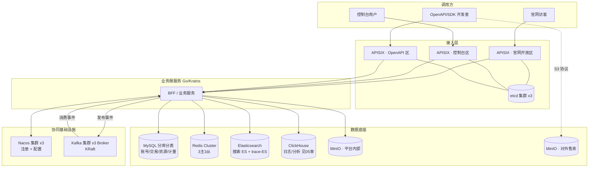
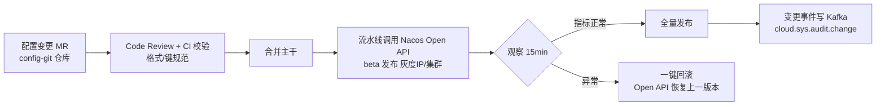
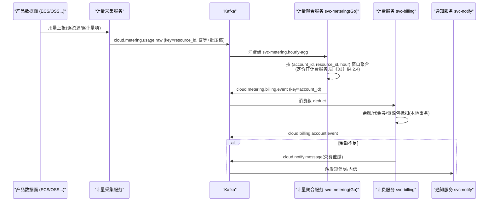
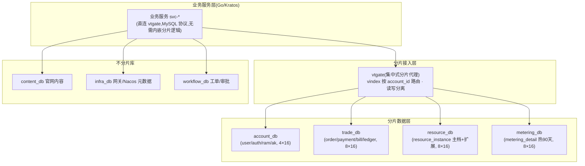
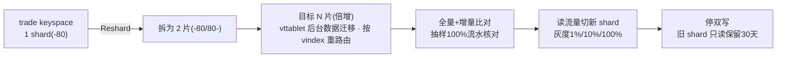
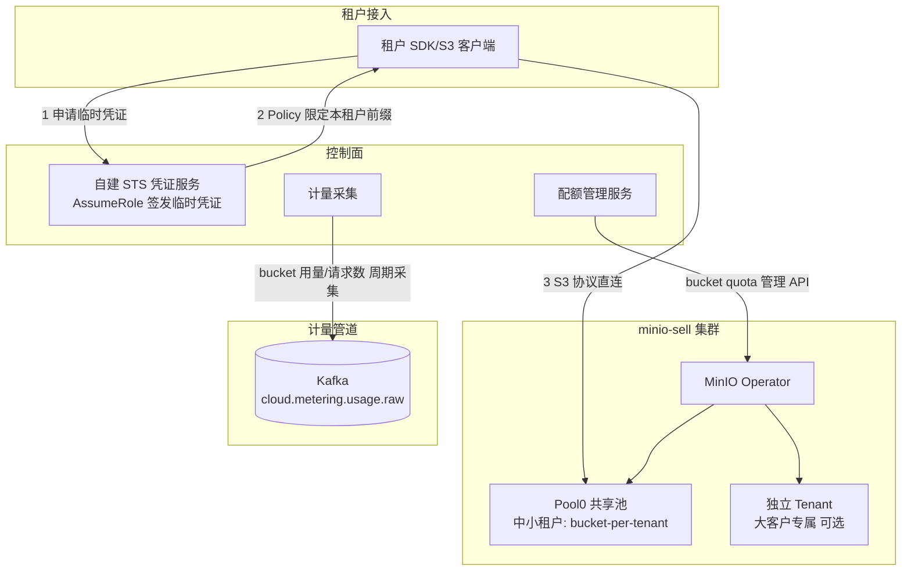
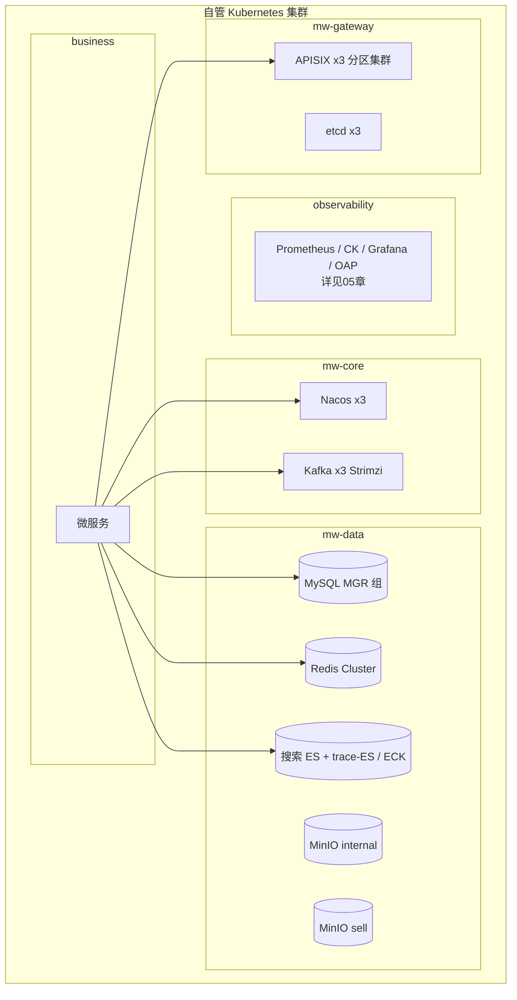

# 04 · 中间件与基础设施架构

> 版本:v1.0(架构评审稿)
> 负责范围:API 网关、注册/配置中心、消息队列、关系数据库(分库分表)、缓存、搜索、对象存储,以及全部中间件在 Kubernetes 上的部署形态与高可用设计。
> 上游输入:《00-overview.md》总体分层、《03-backend-services.md》微服务划分;下游消费方:《05-data-observability.md》《06-kubernetes-productization.md》《07-security.md》《08-devops-delivery.md》。

---

## 目录

1. [本章定位与选型总览](#1-本章定位与选型总览)
2. [总体架构与部署分区](#2-总体架构与部署分区)
3. [API 网关(APISIX)](#3-api-网关apisix)
4. [注册与配置中心(Nacos)](#4-注册与配置中心nacos)
5. [消息中间件(Kafka)](#5-消息中间件kafka)
6. [MySQL 分库分表(Vitess)](#6-mysql-分库分表vitess)
7. [Redis Cluster](#7-redis-cluster)
8. [Elasticsearch 搜索集群](#8-elasticsearch-搜索集群)
9. [对象存储底座(MinIO)](#9-对象存储底座minio)
10. [中间件在 Kubernetes 上的统一部署形态](#10-中间件在-kubernetes-上的统一部署形态)
11. [容量规划与演进路线](#11-容量规划与演进路线)
12. [跨章节接口约定](#12-跨章节接口约定)

---

## 1. 本章定位与选型总览

### 1.1 本章解决什么问题

本平台对外售卖云资源(计算/存储/网络/数据库等),对内是一套完整的微服务体系。中间件层承担四类职责:

- **流量入口与治理**:API 网关统一承接官网、控制台、OpenAPI 三类南北向流量,负责认证、限流、灰度、观测埋点;
- **服务协同基础设施**:注册中心、配置中心、消息队列,支撑微服务发现、动态配置与异步解耦;
- **数据底座**:MySQL(交易与资源事实数据)、Redis(热数据与协调)、Elasticsearch(搜索)、ClickHouse(日志/分析,详见《05-data-observability.md》)、MinIO(对象存储,内部使用 + 对外售卖双重角色);
- **运行底座**:Kubernetes(详见《06-kubernetes-productization.md》),本章所有中间件均以 K8s 为部署载体。

### 1.2 选型结论总览(与全栈选型决策表完全对齐)

| 领域 | 结论 | 核心理由 | 备选 | 改选条件 |
|---|---|---|---|---|
| API 网关 | **APISIX** | 全动态配置、插件热加载、限流/认证/灰度插件齐全、K8s 友好、语言中立 | Kong | 需商业支持合同才考虑 Kong |
| 注册+配置 | **Nacos(一体化)** | 注册配置一套栈,Go SDK 成熟,运维与权限减半 | Consul + Apollo | 需多数据中心联邦/服务网格选 Consul;需合规级变更审批 + IP 级灰度 + 数千配置项且已有 Apollo 运维经验才拆 Apollo |
| 消息队列 | **Kafka** | 候选池唯一 MQ;高吞吐、生态最全,计量/审计/日志类大流量场景天然适配 | (池内无) | — |
| 分库分表 | **Vitess(vtgate)** | Go 原生组件,vtgate 以 MySQL 协议统一供 Go 服务接入,vindex 按 account_id 分片,支持 Reshard 扩容 | ShardingSphere-Proxy(已废止,Java 承载) | 出现跨库强一致事务硬诉求时评估 Proxy,但默认维持 Vitess(架构原则为"本地事务+Outbox",避免跨分片强一致) |
| 缓存 | **Redis Cluster** | 候选池结论;6 节点集群模式起步 | — | — |
| 搜索 | **Elasticsearch(仅搜索)** | 官网/产品/文档三类搜索;日志检索按选型走 ClickHouse | ELK 全家桶 | 见第 8 章说明 |
| 对象存储 | **MinIO** | S3 兼容、K8s Operator 成熟、自建场景运维轻 | Ceph / 公有云 OSS | 需块+文件+对象统一存储且规模很大选 Ceph;若整体托管上公有云直接买 OSS |
| 时序/日志/追踪 | Prometheus / ClickHouse / OpenTelemetry | 归属《05-data-observability.md》,本章仅覆盖其存储依赖的 K8s 资源规划 | — | — |

> 说明:本章所有决策与"全栈技术选型决策表"保持一致,无冲突项。与选型表"兼容性坑清单"相关的落地规避措施在各节中以 **⚠ 兼容性** 标注。

### 1.3 中间件全景图



---

## 2. 总体架构与部署分区

### 2.1 K8s 集群与节点池规划

平台自身控制面(管理面)部署在一套自管 Kubernetes 集群上(该集群同时是容器产品 ACK-like 的"母集群",详见《06-kubernetes-productization.md》)。中间件与业务共集群、**分节点池**隔离:

| 节点池 | taint | 承载内容 | 机型建议(起步) |
|---|---|---|---|
| `pool-gateway` | `dedicated=gateway:NoSchedule` | APISIX 数据面、L4 LB | 3 节点 8C16G |
| `pool-middleware` | `dedicated=middleware:NoSchedule` | Nacos、Kafka、Redis、搜索 ES + trace-ES、MinIO、MySQL | 6~8 节点 16C64G + 本地 NVMe |
| `pool-business` | 无(默认) | 业务微服务、BFF | 按需弹性 |
| `pool-observability` | `dedicated=obs:NoSchedule` | Prometheus、ClickHouse、Grafana、SkyWalking OAP | 见《05-data-observability.md》 |

要点:

- Kafka / ES / ClickHouse / MinIO 使用**本地 NVMe SSD**(hostPath + PV 静态供给或 local-static-provisioner,辅助工具标注:可选),MySQL / Redis / Nacos / etcd 使用**分布式块存储或高可靠云盘**,兼顾 IO 与漂移能力;
- 所有 StatefulSet 配置 `topologySpreadConstraints`(跨节点打散)与 Pod 反亲和;
- 中间件命名空间规划:`mw-gateway`(网关+etcd)、`mw-core`(Nacos/Kafka)、`mw-data`(MySQL/Redis/ES/MinIO)、`observability`(可观测)。

### 2.2 环境拓扑

每个环境(dev / staging / prod)独立一套中间件实例,不做跨环境共享(联调合并入 dev,MVP 阶段 dev 仅一套非高可用部署以省成本):

| 环境 | 形态 |
|---|---|
| dev | 单副本/3 broker 降为 1、MySQL 单实例,承担联调 |
| staging | 与 prod 同构但规模减半,承担灰度预演 |
| prod | 本章后续所有规格均指 prod |

环境隔离在配置侧通过 Nacos namespace(见 4.3)与 K8s namespace 双重落地;**Kafka topic 名中不含环境标识**,环境隔离靠集群隔离,避免"测试流量写进生产 topic"类事故。

---

## 3. API 网关(APISIX)

### 3.1 决策:网关选型与集群切分

**决策 1(组件选型)**:采用 **APISIX** 作为唯一南北向网关。

- 理由:① 路由/插件全动态(etcd 热生效),发布不改配置不重启;② 内置 limit-count / limit-req / jwt-auth / traffic-split / prometheus 等插件覆盖本章全部诉求;③ 语言中立,统一承接 Go/Kratos 上游;④ K8s Ingress 与原生 CRD/Helm 支持成熟。
- 备选:Kong —— 商业支持。
- 改选条件:采购合同要求商业 SLA 时评估 Kong Enterprise。

**决策 2(集群切分)**:数据面按安全域拆为 **3 个独立 APISIX 集群**(官网开放区 / 控制台区 / OpenAPI 区),共享**同一套 3 节点 etcd**。

- 理由:① 三区安全等级、认证方式、限流基线、发布节奏完全不同,物理隔离避免官网被刷拖垮 OpenAPI;② 独立 HPA 与容量水位;③ etcd 共享可降低一份有状态组件的运维成本(控制面数据量很小)。
- 备选:单集群按 route 分区(MVP 最初 2 个月可用,快速起步)。
- 改选条件:OpenAPI 区 QPS 超过 2 万或出现合规要求的网络强隔离时,etcd 也随之拆分独立。

### 3.2 三区职责与域名规划

| 分区 | 域名 | 面向流量 | 认证方式 | 限流基线 | 附加插件 |
|---|---|---|---|---|---|
| 官网开放区 | `www.starcloud.cn`、`www.starcloud.cn/api/portal/**` | 匿名访客 + 营销 API | 匿名(可选登录态透传) | IP 维度 60 req/s | ip-restriction、UA 过滤、静态缓存 |
| 控制台区 | `console.starcloud.cn/api/**` | 登录用户 | JWT(Session 换发) | 用户维度 30 req/s,登录接口 IP 维度 5 req/min | jwt-auth、csrf(应用层配合)、request-id |
| OpenAPI 区 | `{productCode}.api.starcloud.cn`(如 `scecs.api.starcloud.cn`) | AK/SK 签名调用 | AK/SK CPS1-HMAC-SHA256 签名(契约见《07-security.md》§4.1) | AK 维度按套餐(QPS 配额),默认 20 req/s/AK | forward-auth(签名校验)、request-validation、api-version |

> **OpenAPI 形态全局锁定(全书唯一口径,各章以此为准)**:
> ① **域名形态锁定"一产品一子域名"`{productCode}.api.starcloud.cn`**,productCode 命名与示例对齐《01-product-catalog.md》§1.1 决策 D0(`sc` 前缀,如 `scecs`/`scoss`);不采用单一主域名 `api.{domain}/?Action=...` 形态(《03-backend-services.md》§9.1 的入口域名表述需回写对齐本节);
> ② **版本载体锁定 RPC 风格 `Action` + 日期型 `Version` 参数**(与《03-backend-services.md》§9.1 一致,如 `?Action=RunInstances&Version=2026-08-01`),**URI 不承载版本号**(不使用 `/v1/` 前缀式版本;《07-security.md》§4.3 中 `api.<domain>.com/v1/{service}/*` 的路由形态需回写对齐本节);
> ③ 签名算法唯一契约 CPS1-HMAC-SHA256,见《07-security.md》§4.1;对象存储产品保持 S3 兼容 REST(见 9.3),不受①②约束。

三区共用的全局插件:`real-ip`、`request-id`(全链路 trace_id 注入,与《05-data-observability.md》的 OTel 对齐)、`prometheus`、`http-logger`(访问日志投递 Kafka `cloud.sys.audit.access`,见 5.4)。

### 3.3 路由规划

路由原则:**一个产品控制台 = 一个路由前缀组;一个 OpenAPI 产品 = 一个子域名**。route 全部声明式管理(apisix.yaml),经 GitOps 下发(见《08-devops-delivery.md》)。下表上游服务名严格对齐《03-backend-services.md》§4.0 服务总表,订阅串格式与命名规范见 4.3(Group = 应用名):

| 分区 | 路由(uri/host) | 上游(Nacos service) | 说明 |
|---|---|---|---|
| 官网 | `www.starcloud.cn/` | 静态 CDN/Nginx,回源 site-bff | SSR 首屏 |
| 官网 | `/api/portal/**` | `site-bff@@site-bff` | 营销、产品目录查询(site-bff 待补录《03》§4.0,见 4.3) |
| 官网 | `/api/doc/**` | `svc-doc@@svc-doc` | 文档中心内容 API(svc-doc 待补录《03》§4.0,见 4.3) |
| 控制台 | `/api/account/**` | `svc-iam@@svc-iam` | 账号、RAM、AK 管理 |
| 控制台 | `/api/trade/**` | `console-bff@@console-bff` | 订单/费用中心聚合层(《03》§4.0 console-bff) |
| 控制台 | `/api/resource/**` | `console-bff@@console-bff` | 资源列表/生命周期聚合层(同上) |
| 控制台 | `/api/{productCode}/**` | `svc-{productCode}@@svc-{productCode}` | 各产品控制台后端,新增产品=新增一条路由模板,服务同步补录《03》§4.0(见 4.3) |
| OpenAPI | `scecs.api.starcloud.cn/**` | `svc-scecs@@svc-scecs` | RPC 风格:`Action`+日期型 `Version` 参数,URI 不带版本(《03》§9.1) |
| OpenAPI | `scoss.api.starcloud.cn/**` | MinIO 售卖集群(特殊路由,见 9.3/9.4) | S3 兼容协议透传 |

路由命名规范:`{zone}-{domain}-{name}`,如 `console-trade-list-orders`。所有路由强制挂 `prometheus` 与 `request-id` 插件(通过 global_rule 统一下发,避免遗漏)。

### 3.4 认证插件设计

认证体系总设计(签发、会话、RAM 策略)见《07-security.md》,本节只定义网关侧落点:

**(1)控制台区:JWT**

- 登录后由账号域 **svc-iam** 签发 JWT(签发与会话管理归登录/会话 BFF auth-console-bff——该名见《07-security.md》§1.3,尚未列入《03-backend-services.md》§4.0 服务总表,补录登记见本章 4.3;身份核验由 svc-iam 完成,见《07-security.md》§2.4;RS256,**access 15min + refresh 7 天**,SameSite=Lax,refresh 旋转签发——该组参数由《07-security.md》§2.4 统一锁定,本章只做校验实现),网关启用 `jwt-auth` 插件验签;
- 公钥通过 Nacos 配置下发并支持 kid 轮转;登出/踢人通过 Redis 中的 token 黑名单(short TTL,与剩余有效期对齐)在自定义 `auth-check` 阶段校验;
- 验签通过后网关统一注入 `X-Sc-Uid`、`X-Sc-Identity`、`X-Sc-TraceId` 身份头(头清单以《07-security.md》§3.3 为唯一权威),上游服务**只信任网关注入头**(入口层 mTLS/内网隔离保证,见《07-security.md》§4.3)。

**(2)OpenAPI 区:AK/SK CPS1-HMAC-SHA256 签名**

APISIX 无内置"云厂商风格签名"插件,采用 `forward-auth` 旁路到 svc-iam 内置的 OpenAPI 验签端点(归属身份域,与《07-security.md》§3.3 验签链路、§8 容量基线一致):

- 验签端点按《07-security.md》§4.1 的唯一算法契约校验 `Authorization` 中的 CPS1-HMAC-SHA256 签名:CanonicalRequest 重算、分域派生密钥、恒定时间比对;同时校验时间窗(`x-cps-date` ±15min)、nonce 重放(`x-cps-nonce`,Redis TTL 16min)与 body 哈希绑定(`x-cps-content-sha256`);(`x-cps-*` 头前缀为签名协议专用头名,与品牌前缀 `sc` 解耦,保留不改,见裁决书 §3)
- 校验通过后注入 `X-Sc-Uid`、`X-Sc-Identity`、`X-Sc-TraceId` 身份头(《07-security.md》§3.3),并额外回传 `X-Sc-Ak-Id`、`X-Sc-Quota-Qps`(本章补充的限流辅助头,品牌前缀统一 `X-Sc-*`),网关继续做 AK 维度限流;
- 该端点 P99 < 10ms(签名本地计算 + AK 元数据本地缓存),对网关增加一跳延迟可接受。

**(3)官网区:匿名 + 风控**

匿名访问,仅做 IP 限流、Bot UA 拦截;登录态接口走 `optional-auth`(有 cookie 则解析,无则匿名)。

### 3.5 限流与熔断

| 维度 | 插件 | key | 说明 |
|---|---|---|---|
| 全局保护 | limit-req | 按分区设默认值 | 漏桶,防雪崩兜底 |
| IP | limit-count | `remote_addr` | 官网区主力,计数器存 Redis Cluster |
| 登录用户 | limit-count | `http_x_sc_uid` | 控制台区主力(网关注入头,见 3.4) |
| AK 配额 | limit-count | `http_x_sc_ak_id` | OpenAPI 区,阈值从 forward-auth 回传头动态读取(自定义插件,可选增强) |
| 单接口热点 | limit-count | route + key 组合 | 下单、发短信等敏感接口单独收紧 |

熔断策略:上游健康检查使用 APISIX 内置 `healthcheck`(被动检查:5xx/超时计数摘除,主动检查可选);**不引入独立熔断中间件**,服务级熔断统一由 APISIX 插件与 gRPC 拦截器分担,避免双标准。

### 3.6 灰度发布支持

网关支持两种灰度,配合 ArgoCD Rollouts(见《08-devops-delivery.md》):

1. **按权重灰度**:`traffic-split` 加权上游,新版本 5% → 20% → 50% → 100%;
2. **按特征灰度**:header `x-canary: true`(内部测试账号)、cookie 中的灰度标、account_id 尾号取模(自定义 vars 条件),用于"先灰度内部员工账号"。

### 3.7 与 Nacos 服务发现集成

上游全部通过 Nacos 动态发现,不在网关固化 IP:

```yaml
# apisix config.yaml 片段(三个分区集群共用模板)
discovery:
  nacos:
    host:
      - "http://nacos-headless.mw-core.svc:8848"
    prefix: "/nacos/v1/"
    username: apisix_ro
    password: ${NACOS_APISIX_PASSWORD}   # K8s Secret 注入
    fetch_interval: 30
    default_weight: 100
```

⚠ **兼容性**(对应选型表坑清单 #2):

- APISIX discovery 走 Nacos 1.x 风格 HTTP Open API;Nacos 锁定 **2.4.x LTS**,启用鉴权并为 `apisix_ro` 账号配置只读权限;升级 Nacos 3.x 前必须在 staging 验证 discovery 兼容性;
- `service_name` 必须写成 `{GROUP}@@{serviceName}`;按本章 4.3 冻结的命名规范 Group 一律等于应用名,订阅串形如 `svc-order@@svc-order`,且 GROUP/namespace 必须与服务注册端(Kratos contrib 注册参数)完全一致;
- 网关所在 namespace 与 Nacos 的 namespace 映射:prod 网关只订阅 `prod` namespace。

### 3.8 关键配置示例(声明式,GitOps 管理)

```yaml
# apisix-routes/console-trade.yaml —— 由 ADC(apisix-declarative-cli)校验并同步
routes:
  - id: console-trade-orders
    uri: /api/trade/orders/*
    methods: [GET, POST, PUT]
    upstream:
      discovery_type: nacos
      service_name: svc-order@@svc-order
      type: roundrobin
      timeout: { connect: 2, send: 5, read: 5 }
    plugins:
      jwt-auth: {}
      limit-count:
        count: 1800
        time_window: 60
        key_type: var
        key: http_x_sc_uid
        rejected_code: 429
        policy: redis-cluster
        redis_cluster_nodes:
          - redis-cluster.mw-data.svc:6379
        redis_password: ${REDIS_PASSWORD}
      proxy-rewrite:
        headers:
          set:
            X-Forwarded-Zone: console
      prometheus: {}
    labels:
      zone: console
      domain: trade

  # OpenAPI 区示例:AK/SK 签名 + AK 维度限流
  # RPC 风格:Action/Version 为请求参数,URI 不承载版本(见 3.2 锁定声明)
  - id: openapi-scecs
    host: scecs.api.starcloud.cn
    uri: /*
    methods: [POST]
    upstream:
      discovery_type: nacos
      service_name: svc-scecs@@svc-scecs
      type: roundrobin
    plugins:
      forward-auth:
        uri: http://svc-iam.business.svc/internal/openapi/verify
        request_headers: [Authorization, x-cps-date, x-cps-content-sha256, x-cps-nonce, x-cps-security-token]   # 头名与《07-security.md》§4.1 签名契约对齐
        upstream_headers: [X-Sc-Uid, X-Sc-Identity, X-Sc-TraceId, X-Sc-Ak-Id, X-Sc-Quota-Qps]
        timeout: { connect: 500, send: 500, read: 500 }
        keepalive: true
      limit-count:
        count: 1200          # 默认 20 QPS x 60s,大客户经配额服务覆盖
        time_window: 60
        key_type: var
        key: http_x_sc_ak_id
        rejected_code: 429
        policy: redis-cluster
      request-validation:
        header_schema:
          required: [Authorization, x-cps-date, x-cps-content-sha256]
      prometheus: {}

  # 灰度示例:控制台区 console-bff 按权重 + 内部账号特征灰度
  - id: console-bff-canary
    uri: /api/trade/bff/*
    plugins:
      traffic-split:
        rules:
          - match:
              - vars: [["http_x_canary", "==", "true"]]
            weighted_upstreams:
              - upstream:
                  discovery_type: nacos
                  service_name: console-bff-canary@@console-bff-canary
                weight: 100
          - weighted_upstreams:
              - upstream:
                  discovery_type: nacos
                  service_name: console-bff@@console-bff
                weight: 95
              - upstream:
                  discovery_type: nacos
                  service_name: console-bff-canary@@console-bff-canary
                weight: 5
```

### 3.9 部署与高可用

| 项 | 规格 |
|---|---|
| 数据面 | 每分区 Deployment ≥ 2 副本(OpenAPI 区 3 起步),HPA 按 CPU 60% / QPS 扩容,单副本承载约 5k QPS(插件组合下实测基线) |
| etcd | StatefulSet 3 副本,独立 PV 50GB,`--quota-backend-bytes=8G`,跨节点反亲和 |
| 控制面 | 不使用 Dashboard,统一 **ADC CLI + GitOps**(配置即代码、可审计);变更走 MR 评审(见《08-devops-delivery.md》) |
| 观测 | `prometheus` 插件暴露 :9091,接入 Prometheus;访问日志 `http-logger` → Kafka `cloud.sys.audit.access` |
| 故障演练 | 每季度一次:单分区集群全杀,验证其余分区不受影响(分区切分决策的验收项) |

---

## 4. 注册与配置中心(Nacos)

### 4.1 决策

**结论:Nacos 一体化承担注册中心 + 配置中心。**

- 理由:① 一套 HA 集群、一套鉴权与备份策略,运维成本减半;② Go(nacos-sdk-go / Kratos contrib)SDK 成熟,与统一 Go 方案天然对齐;③ namespace/group 模型足以覆盖多环境与产品线分组;④ APISIX discovery 可直接对接。
- 备选:Consul(注册)+ Apollo(配置)。
- 改选条件:仅当**同时**满足——合规要求配置变更全量审批与审计、需要 IP 级灰度下发、配置项达数千且团队已有 Apollo 运维经验——才改为 Nacos 注册 + Apollo 配置。

### 4.2 集群部署形态

| 项 | 方案 |
|---|---|
| 部署方式 | Helm Chart(nacos-server)部署 StatefulSet,**3 副本**(cluster 模式,内嵌 Raft 选主) |
| 持久化 | 元数据外置 MySQL(独立实例 `nacos_db`,与业务 MySQL 集群分开),配置/用户/权限全部落库,节点无状态可随意重建 |
| 端口 | 8848(HTTP API)/ 9848(客户端 gRPC)/ 9849(节点间 gRPC),Service 为 headless |
| 资源 | 每节点 4C8G(独立中间件进程,JVM 内存配置 4G) |
| 版本 | 锁定 2.4.x LTS;客户端 SDK 版本随《08-devops-delivery.md》基础镜像统一管控 |
| 备份 | `nacos_db` 每日全备 + binlog;另用 Nacos Open API 每日导出全量配置快照入 Git(配置双保险,也支撑配置灾难恢复) |
| 鉴权 | 开启 auth(token 密钥从 K8s Secret 注入),账号分权:`app_rw`(服务注册)、`config_ro`/`config_rw`(按 namespace 授权)、`apisix_ro` |

⚠ **兼容性**:Nacos 2.x 客户端走 gRPC(9848),K8s Service/Ingress 必须同时放行 8848 与 9848/9849;曾出现只暴露 8848 导致客户端反复重连的事故,列入上线 checklist。

### 4.3 Namespace / Group / Data ID 规划

**Namespace 按环境**(dev / staging / prod,与《03-backend-services.md》§2.3.1 及本章 2.2 环境划分一致;联调合并入 dev,不设 test/unit/dev-test 命名空间),不按产品线切 namespace——避免 namespace 爆炸;域归属用注册元数据标签表达(见下),不用 Group 表达。

**全局服务与 Nacos 命名规范(冻结,全书唯一口径)**

> 本节与《03-backend-services.md》§2.3.1/§4.0 共同构成全平台命名契约,分工为:**服务清单、职责与语言栈以《03-backend-services.md》§4.0 服务总表为唯一事实源;命名模式、Group 维度、Data ID 与 APISIX 订阅串格式以本节为唯一事实源**。任何章节出现的服务名必须先通过《03》§4.0 总表登记或本节补录清单,方可在路由、Group、消费组中引用。

- **服务名**:管控域服务统一 `svc-{domain}`,短横线小写,Go 服务注册名统一,如 `svc-iam`、`svc-order`;例外项以《03》§4.0 总表固化为名:接入层 BFF 采用 `{场景}-bff`(如 `console-bff`、`site-bff`)、`alert-engine`/`alert-center`、数据面资源控制器 `rc-*`;**产品控制面服务命名 `svc-{productCode}`**(productCode 见《01-product-catalog.md》D0,如 `scecs` 产品对应 `svc-scecs`)。注册元数据强制带 `lang=go`、`plane=mgmt|data` 标签,供网关与监控过滤;
- **Group**:**一律用应用名,即 Group 与服务名完全一致**(如 Group=`svc-order`),禁止按团队或业务域分组(`XXX_GROUP` 形式一律废止);APISIX discovery 订阅串 `{GROUP}@@{serviceName}` 因此固定形如 `svc-order@@svc-order`;
- **Data ID(配置)**:`{serviceName}.yaml`(主配置)+ `{serviceName}-{feature}.yaml`(拆分配置);共享配置 `shared-{scope}.yaml`,如 `shared-datasource.yaml`、`shared-kafka.yaml`,以 `shared-` 前缀识别;
- **配置键命名**:`{app}.{module}.{键}`(与《03-backend-services.md》§2.3.1 一致),如 `svc-order.purchase.timeout-minutes`。

```
namespace: prod(Group = 应用名,逐服务一组,示意)
├── svc-iam / svc-org                                        身份与访问域
├── svc-catalog / svc-order / svc-payment /
│   svc-billing / svc-metering / svc-idgen                   商业化域
├── svc-orchestrator / svc-quota / svc-workflow / rc-*       资源域
├── svc-monitor / alert-engine / alert-center /
│   svc-notify / svc-audit / svc-ticket / svc-doc            支撑域
├── svc-api-meta / svc-kms                                   开放与安全域
├── console-bff / site-bff / auth-console-bff                接入层
└── svc-scecs / svc-scoss / ...                              各产品控制面(立项时补录)
```

**补录清单(本章及关联章节出现、尚未列入《03-backend-services.md》§4.0 总表的服务,须以 MR 补录后方可上线)**:

| 服务 | 登记名 | 语言栈 | 域 | 首次出现位置 |
|---|---|---|---|---|
| 官网 BFF | `site-bff` | Go | 接入 | 本章 3.3 |
| 登录/会话 BFF | `auth-console-bff` | Go | 接入 | 《07-security.md》§1.3 |
| 文档中心内容服务 | `svc-doc` | Go | 支撑 | 本章 3.3(API 参考类文档仍归 `svc-api-meta`) |
| 号段发号服务 | `svc-idgen` | Go | 商业化 | 本章 6.6 |
| KMS 密钥服务 | `svc-kms` | Go | 安全 | 《07-security.md》§1.3(该章现名 `kms-service`,按本节规范改名) |
| 产品控制面(模板) | `svc-{productCode}`(如 `svc-scecs`) | 以产品立项为准 | 产品 | 本章 3.3,新品上架时逐个补录 |

> 映射说明:《07-security.md》中的 `iam-service`/`audit-service` 即《03》§4.0 总表中的 `svc-iam`/`svc-audit`,不再另设同名服务;《06-kubernetes-productization.md》初稿的 `resource-center` 即 `svc-orchestrator`、`provision-bridge` 收敛为 `rc-*` 控制器履约执行层(《06》§8 口径表),本章 5.4/5.5 已按此对齐。

**配置分层原则**(什么进 Nacos、什么不进):

| 进 Nacos(动态) | 不进 Nacos |
|---|---|
| 业务开关、限流阈值、灰度规则、白名单 | 数据库连接串/密码(K8s Secret) |
| 价格系数、出账批次参数 | 镜像版本、副本数(K8s manifest / GitOps) |
| 功能特性 Flag | 环境间恒定不变的代码级常量 |

### 4.4 配置变更流程与灰度



- Nacos 原生支持 **beta 发布**(按来源 IP 灰度),满足"先灰度一台再全量";
- 客户端监听规范:Kratos config watch(统一 Go 栈);约定**配置变更必须是幂等且可回滚的**,禁止依赖变更顺序的有状态配置;
- 重要配置(计费相关)变更走双人复核 + 变更单,与《08-devops-delivery.md》变更管理制度对齐。

---

## 5. 消息中间件(Kafka)

### 5.1 决策与定位

**结论:Kafka 作为唯一消息中间件**(候选池内唯一 MQ,无需比选)。定位:领域事件总线、计量数据管道、审计日志管道、异步任务通道。**不承担**在线请求响应式 RPC(那走 gRPC/HTTP)。

事件契约(IDL)管理:所有 topic 的消息体使用 **Protobuf 定义**,schema 仓库与《03-backend-services.md》的 IDL-first 流程一致;消息头强制携带 `trace_id`(OTel 上下文透传)、`event_id`(幂等键)、`occur_time`。

### 5.2 集群规模起步

| 项 | 起步规格 | 说明 |
|---|---|---|
| Broker 数 | **3(KRaft 模式,controller 与 broker 合一)** | 满足 RF=3、min ISR=2 的可用性 |
| 单 Broker 资源 | 8C16G,2 × 1TB 本地 NVMe(JBOD,`log.dirs` 双目录) | 本地盘是吞吐关键,不走网络盘 |
| 容量估算 | 平均写入 2k msg/s × 1KB ≈ 170GB/天,×3 副本 ≈ 510GB/天;热数据保留 3~7 天 ≈ 1.5~3.5TB | 双 1TB 盘 ×3 节点可承载,水位 60% 触发扩容 |
| 部署方式 | **Strimzi Operator**(KafkaNodePool 管理 KRaft 节点),PV 静态供给本地盘 | Operator 负责滚动升级、再平衡触发 |
| 环境 | prod 3 broker;staging 3 broker(低配);dev 1 broker KRaft single node | |

扩容时机:磁盘水位 > 60%、或分区总数 > 4000/集群、或 broker CPU 持续 > 65%,加 broker 后用 `kafka-reassign-partitions` 再平衡(Strimzi 可编排)。

### 5.3 Topic 命名规范

```
cloud.{domain}.{aggregate}.{event}            —— 领域事件(追加型)
cloud.{domain}.{aggregate}.{event}.retry      —— 消费重试(延迟梯度,可选)
cloud.{domain}.{aggregate}.{event}.dlq        —— 死信
cloud.sys.{purpose}                            —— 平台级通道(审计/告警/通知)
```

规则:全小写、点分层级、**不含环境名**(环境靠集群隔离)、**不含版本号**(schema 版本由消息体 `schema_version` 字段管理,Protobuf 向后兼容演进;确属破坏性变更时新建聚合根 topic 并双发过渡)、一个聚合根一个 topic(事件类型放消息体 `event_type` 字段,避免 topic 爆炸)、新增 topic 必须走 MR 评审进 GitOps 清单(Strimzi KafkaTopic CR)。

### 5.4 按域 Topic 清单(全书唯一事实源)

> **本节是全平台 Kafka topic 的唯一事实源(Single Source of Truth)**:topic 命名、分区数、保留期、分区键与环境隔离策略一律以本节为准;《03-backend-services.md》《05-data-observability.md》《06-kubernetes-productization.md》《07-security.md》《02-frontend-architecture.md》等章节只描述各 topic 的生产者/消费者与数据流向,不得另行定义 topic 名或参数。新增 topic 必须先以 MR 方式登记进本表(Strimzi KafkaTopic CR 同步声明),否则不予开通。

| Topic | 域 | Key | 分区 | 保留 | 说明 |
|---|---|---|---|---|---|
| `cloud.trade.order.event` | 交易 | `order_id` | 16 | 7 天 | 订单创建/支付/取消/退订/变配,驱动资源开通与费用 |
| `cloud.trade.payment.event` | 交易 | `order_id` | 8 | 30 天 | 支付/退款终态,驱动订单状态机与账务(见《03》) |
| `cloud.billing.account.event` | 计费 | `account_id` | 16 | 30 天 | 余额变动、流水、抵扣记录 |
| `cloud.billing.invoice.event` | 计费 | `account_id` | 8 | 30 天 | 月度账单、发票事件 |
| `cloud.resource.lifecycle.event` | 资源 | `resource_id` | 32 | 14 天 | RUNNING/STOPPED/EXPIRED/LOCKED/RELEASED 状态机事件,全平台资源生命周期总线 |
| `cloud.resource.quota.event` | 资源 | `account_id` | 8 | 30 天 | 配额占用变化与超量(>80%)预警(见《03》) |
| `cloud.resource.provision.task` | 资源 | `instance_id` | 16 | 7 天 | 供给/变配/释放任务下发:svc-orchestrator → rc-* 履约执行层(《06》§9 口径表;初稿名 resource-center/provision-bridge 废止) |
| `cloud.resource.provision.status` | 资源 | `instance_id` | 16 | 7 天 | 供给结果回调(CR phase 变更):rc-* 履约执行层 → svc-orchestrator(同上) |
| `cloud.metering.usage.raw` | 计量 | `resource_id` | 64 | 3 天 | 逐资源逐计量项原始用量,全平台**最大流量 topic**;所有产品共用该 topic,以消息体 `resource_type` 区分产品(不按产品拆 topic) |
| `cloud.metering.billing.event` | 计量 | `account_id` | 16 | 30 天 | 小时聚合结果(用量汇总与计费依据,即《05》HourlyUsage),由 svc-metering 产出,计费服务消费做定价与抵扣 |
| `cloud.sys.audit.action` | 审计 | `account_id` | 16 | 90 天 | 用户/管理员操作审计,下游入 ClickHouse 长期留存 |
| `cloud.sys.audit.access` | 审计 | `client_ip` | 16 | 14 天 | 网关访问日志(APISIX http-logger) |
| `cloud.sys.audit.change` | 审计 | `target` | 4 | 90 天 | 配置/发布变更记录 |
| `cloud.sys.audit.agent` | 审计 | `node_id` | 8 | 90 天 | 宿主 agent 命令执行审计(见《06》) |
| `cloud.sys.alert.event` | 告警 | `alert_name` | 8 | 7 天 | Alertmanager 统一告警出口,下游分发短信/邮件/IM |
| `cloud.notify.message` | 通知 | `account_id` | 16 | 7 天 | 站内信/短信/邮件发送任务(到期提醒、欠费催缴) |
| `cloud.user.event` | 账号 | `account_id` | 16 | 30 天 | 注册、实名、RAM 变更、AK 变更 |
| `cloud.user.login.event` | 账号 | `account_id` | 8 | 30 天 | 登录成功/失败与异常登录检测(见《07》) |
| `cloud.sys.authz.policy.changed` | 平台 | `account_id` | 4 | 7 天 | 授权策略变更的缓存失效广播(见《07》) |
| `cloud.sys.threat.event` | 平台 | `client_ip` | 8 | 90 天 | WAF 拦截/防重放命中等安全威胁事件(见《07》) |
| `cloud.sys.workflow.task` | 平台 | `flow_instance_id` | 8 | 7 天 | 工作流步骤派发(见《03》§4.3.3) |
| `cloud.sys.log.buffer` | 平台 | `service` | 16 | 3 天 | 日志缓冲通道,常态旁路、洪峰/维护窗口启用(见《05》§7.4),允许极端情况丢弃 |
| `cloud.sys.rum.event` | 平台 | `session_id` | 8 | 7 天 | 前端 RUM/JS 错误上报(见《02》) |
| `cloud.sys.host.metrics` | 平台 | `node_id` | 16 | 7 天 | 主机指标(计量口径,见《06》§5.4) |
| `cloud.sys.agent.command` | 平台 | `node_id` | 8 | 7 天 | 下发至宿主 cp-agent 的异步命令任务(见《06》) |
| `cloud.sys.node.lifecycle` | 平台 | `cluster_id` | 8 | 30 天 | 基础设施节点扩缩/上下线事件(见《06》) |
| `cloud.sys.etcd.backup` | 平台 | `cluster_id` | 4 | 30 天 | etcd 备份结果事件(见《06》) |
| `cloud.sys.cache.invalidate` | 平台 | `cache_key` | 4 | 3 天 | 缓存失效广播(可选增强,见本章 7.4) |
| `cloud.sys.search.sync` | 平台 | `doc_id` | 4 | 3 天 | 搜索 ES 索引同步通道(MySQL 变更 → bulk 写入,见本章 8.2) |
| `cloud.market.activity.event` | 营销 | `campaign_id` | 8 | 7 天 | 活动/优惠券领取核销(对应"可晚做清单",二期启用) |

分区数原则:**按峰值吞吐目标 ÷ 单分区写入能力(经验值 10MB/s)** 起步,同时保证分区数 ≥ 消费端最大并行度;`usage.raw` 按 5 年规划峰值 60MB/s 设 64 分区。Key 选择以"需要保序的最小单元"为准:同一资源的用量、同一订单的状态流转必须落同分区。

### 5.5 消费组规划

命名:`{service}.{purpose}`,服务名取自《03-backend-services.md》§4.0 总表(规范见 4.3),如 `svc-metering.hourly-agg`、`svc-notify.sms-dispatch`。

| 消费组 | 订阅 | 语义 | 幂等手段 |
|---|---|---|---|
| svc-orchestrator.provision-trigger | trade.order.event(paid) | 至少一次 | order_id 幂等表 + 状态机校验 |
| svc-metering.hourly-agg | metering.usage.raw | 至少一次 | (account_id, resource_id, hour) 唯一键 upsert |
| svc-billing.deduct | metering.billing.event | 至少一次 | bill_id 幂等,扣款本地事务 |
| svc-notify.dispatch | notify.message、resource.lifecycle.event | 至少一次 | event_id 去重表(Redis SETNX 7 天) |
| audit-ck-writer | sys.audit.* | 至少一次 | ClickHouse ReplacingMergeTree 按 event_id 去重 |
| metering-archive-writer | metering.usage.raw | 至少一次 | 归档至 ClickHouse,按 (resource_id, ts) 去重 |

消费端通用规范:

- **手动提交 offset**,业务写库/写下游成功后再 commit;
- 重试策略:业务异常 → 写 `{topic}.retry`(按重试次数梯度延迟,由定时任务回灌);重试 5 次仍失败 → `{topic}.dlq`,DLQ 有看板与值班响应流程;
- 禁止消费端跨 topic 事务性聚合,需要一致性编排时用 Saga/事务消息(见 6.7);
- 消费滞后(lag)统一暴露 Prometheus 指标,lag > 阈值告警。

### 5.6 可靠性参数

**Broker 侧(server.properties,Strimzi Kafka CR 下发)**

```properties
min.insync.replicas=2
default.replication.factor=3
unclean.leader.election.enable=false
log.flush.interval.messages=10000        # 依赖副本而非刷盘保证持久化
log.retention.check.interval.ms=300000
auto.create.topics.enable=false          # topic 一律 GitOps 声明
message.max.bytes=4194304                # 用量批上报允许 4MB
```

**Producer 侧(统一 SDK 封装,Go 全栈同参)**

```properties
acks=all
enable.idempotence=true
max.in.flight.requests.per.connection=5
retries=2147483647
delivery.timeout.ms=120000
compression.type=lz4                     # usage.raw 大流量 topic 收益明显
```

**Consumer 侧**:`enable.auto.commit=false`、`max.poll.records=500`、`session.timeout.ms=45000`(处理重的聚合任务加大超时防误 rebalance)、启用 `cooperative-sticky` 分配器降低 rebalance 抖动。

**端到端时序示例:计量 → 出账 → 扣费**



### 5.7 K8s 部署与高可用要点

- Strimzi KafkaNodePool:3 个节点各 1 个 PVC(本地盘),`podAntiAffinity` 强制跨节点;设置 `PodDisruptionBudget: maxUnavailable=1`;
- Broker 滚动升级顺序由 Operator 控制,遵循"先 follower 后 leader"(`KafkaRoller`);
- Kafka Exporter(可选辅助工具)暴露 lag/吞吐指标;
- 跨可用区:单地域多 AZ 部署时开启 rack awareness(可选,二期),副本分布跨 AZ。

---

## 6. MySQL 分库分表(Vitess)

### 6.1 决策

**结论:Vitess(vtgate 集中式分片代理,Go 原生)承担分库分表与读写分离;应用不再内嵌分片逻辑。**

- 理由:① Go 原生组件,与统一 Go/Kratos 栈同语言、同运维面;② vtgate 以 MySQL 协议统一供 Go 服务接入,应用侧无需内嵌任何分片 SDK,语言解耦;③ vindex 按 account_id 路由、支持 Reshard 扩容与读写分离,能力完整。
- 备选:ShardingSphere-Proxy(已废止,Java 承载,不引入)。
- 改选条件:出现"跨分片强一致事务"硬诉求时评估 ShardingSphere-Proxy,但架构原则为"本地事务 + Outbox",默认维持 Vitess。

⚠ **兼容性**(选型表坑清单 #5):Go MySQL driver 与 vtgate 版本组合先在基础镜像中固化并回归;连接池开启 `keepalive` 防止长连接被中间设备掐断;统一经 vtgate 访问分片,**不直连 vttablet**。

### 6.2 总体原则:先垂直拆库,再水平分片



每个逻辑库独立物理实例(起步可两个逻辑库合并一个物理实例,但**连接串与账号从第一天隔离**,保证随时可拆)。

### 6.3 按域拆库规划

| 逻辑库 | 域 | 核心表 | 是否分片 | 分片键 | 库×表 |
|---|---|---|---|---|---|
| account_db | 账号 | user、user_auth(登录凭证)、ram_user、ram_role、ram_policy、access_key(仅身份属性;balance/余额流水归 trade_db ledger,见 S29) | 是 | account_id | 4×16 |
| trade_db | 交易 | order、order_item、payment、refund、bill_month、bill_detail、ledger(资金流水)、coupon、resource_pack | 是 | account_id | 8×16 |
| resource_db | 资源 | resource_instance(全产品资源主档)、resource_{scecs/scoss/scrds...}_ext、resource_tag、resource_bindingip | 是 | account_id | 8×16 |
| metering_db | 计量 | metering_detail(热 90 天)、metering_hourly_agg | 是 | account_id | 8×16 |
| content_db | 官网 | page、product_doc、doc_version、banner | 否 | — | 单库 |
| workflow_db | 工单/审批 | ticket、ticket_message、approval | 否(量大后按 account_id 分) | — | 单库起步 |
| infra_db | 基础设施 | Nacos 元数据、网关审计小表 | 否 | — | 单库 |

> **分片口径全局锁定(全书唯一口径)**:① **租户标识字段统一为 `account_id`**,与《00-overview.md》§3.3、《03-backend-services.md》§6、《05-data-observability.md》§3.1 及《10-research-and-selection-decisions.md》选型决策表(account_id 全局分片键)一致;字段映射关系显式声明:`account_id`(本章规范名)≡ `uid`(《07-security.md》安全语境称谓)≡ `user_id`(部分初稿旧称)≡ `tenant_id`(《06-kubernetes-productization.md》K8s 租户语境称谓),物理列名、Vitess `vindex` 分片键、Kafka 分区键一律写 `account_id`;② **垂直拆库与库×表数以本节为唯一基线**:account_db 4×16、trade_db/resource_db/metering_db 各 8×16;《03-backend-services.md》§10 的"16 库×16 表"与《09-roadmap.md》§3.4 一期"MySQL 2 分片×主从"等口径须回写对齐本节(一期预算不足时可按 account_db 2×16、trade_db 2×16 最小起步,但逻辑库边界与分片键不变,扩容按 6.8 Reshard 路径执行)。

`resource_instance` 主档是全平台资源的"户口本":resource_id、product_code、region、zone、account_id、status(生命周期状态机,见《03-backend-services.md》)、expire_time。各产品扩展表与主档同分片键同库同片,保证"资源主档 + 扩展"单片 join。

### 6.4 分片键选择:为什么全平台统一 account_id

**结论:账号/交易/资源/计量四库统一以 `account_id` 为分片键**(字段名与映射声明见 6.3 锁定框)。

- 理由:① 控制台 90% 查询是"某用户的订单/资源/账单"列表,account_id 分片使主链路单片命中;② 出账、抵扣、余额操作天然是"同账号事务",同片内可用本地事务,规避分布式事务;③ account_id 全局唯一且终身不变(由 svc-iam 发号),无迁移风险。
- **resource_id 单独分片的弊端**:用户控制台资源列表变成全分片扫描(scatter-gather),且订单→资源跨库事务增多。
- 代价与对策:按 resource_id 反查(运维、OpenAPI DescribeInstance)→ 采用**"resource_id 编码内嵌分片信息"**:resource_id 生成时尾部携带 `(account_id % 库数)(account_id % 表数)` 两位分片因子,解析即可路由;无法改造的外部系统查询走 resource_db 的全局索引表(见 6.10)。
- 备选:resource_db 按 resource_id 分片 + account_id 异构索引。
- 改选条件:出现"超大 B 端单账号资源量超过单片容量(预估 > 2000 万行)"时,对该租户启用二级分片(account_id + resource_id 哈希)。

### 6.5 分片配置示例(Vitess vschema)

```json
// trade_db 分片规则(vtgate keyspace trade)
{
  "keyspaces": [
    {
      "name": "trade",
      "sharded": true,
      "vindexes": {
        "account_id_hash": { "type": "hash" }
      },
      "tables": {
        "t_order": {
          "column_vindexes": [
            { "column": "account_id", "name": "account_id_hash" }
          ],
          "columnListAuthoritative": true
        },
        "t_order_item": {
          "column_vindexes": [
            { "column": "account_id", "name": "account_id_hash" }
          ]
        }
      }
    }
  ]
}
```

```sh
# trade keyspace(vindex 按 account_id 哈希路由)。Vitess 以 range shard 承载分片:
# 起步 1 个 shard(-80),容量不足时按 6.8 Reshard 倍增细分为目标 shard 数。
vtctld ApplySchema -keyspace=trade -sql-file trade_schema.sql
vtctld CreateShard -keyspace=trade -shard=-80     # 首个 shard
vtctld Reshard --keyspace=trade                    # 触发倍增拆分
```

> **口径说明**:§6.3 的"库×表"(`account_db 4×16、trade/resource/metering_db 8×16`)是**容量规划与表扇出口径**(每个逻辑库内的表拆分),由架构裁决锁定(见 04§6.3、11 C5+S12);Vitess 侧以 **range shard** 承载分片并支持 Reshard 拆分,两者正交:keyspace 划分到逻辑库,shard 数与 Reshard 承载水平扩容。"128 片"指 Reshard 到位后的目标 shard 规模,不是 ShardingSphere 的"库×表"物化。

### 6.6 全局序列与业务单号

**结论:自建号段服务(Leaf 段式思想,自研轻量实现,归属 svc-idgen),不依赖 DB 自增与纯雪花。**

- 理由:订单/支付/资源 ID 需要**趋势递增 + 可读 + 可内嵌分片因子**;纯雪花 ID 无业务语义且时钟回拨敏感;DB 自增在分片下不可用。
- 设计:号段服务双 buffer 预取(每段 2000),号段元数据存 infra_db;发号格式:

```
order_id:  yyyyMMddHH + 机器/分片位(2) + 段内序列(8) + vindex 路由位(2)  → 22 位
resource_id: {productCode}-{regionId}-{分片因子2位}-{随机8位}  → 如 scecs-cn-north-1-01-a1b2c3d4
```

> 说明:资源 ID 格式遵循《00-overview.md》附录 A 全局标识规范(`{productCode}-{regionId}-{分片因子2位}-{随机8位}`,productCode 为 `sc` 前缀如 `scecs`,region 为短横线风格如 `cn-north-1`,2 位分片因子 = `(account_id % 库数)(account_id % 表数)`)。

- 备选:纯雪花算法 / Redis `INCRBY` 直发(内部纯技术 ID 场景)。
- 改选条件:号段服务成为瓶颈(QPS > 5 万)时改 Redis `INCRBY` + Lua 直发。

### 6.7 跨库一致性与"分布式事务"策略

**原则:尽量不用分布式事务组件,用"本地事务 + 事件最终一致"。**

| 场景 | 方案 |
|---|---|
| 支付成功 → 更新订单 → 开通资源 | 订单库本地事务写订单 + 同库 `outbox` 表 → relay 投递 `cloud.trade.order.event` → svc-orchestrator 幂等消费(事务性 Outbox) |
| 扣费 → 余额变动 | billing 单库本地事务(account_id 同片) |
| 退订 → 退款 + 资源释放 | Saga 编排:退款服务与资源服务各自本地事务,失败补偿事件;编排器归属 trade 域 |
| 必须强一致(罕见,如余额与流水) | 约束在同一库同片内设计,靠分片键保证;**不引入跨分片强一致事务**(架构原则"本地事务 + Outbox") |

Outbox relay 为独立轻量服务(Go/Kratos),扫描各分片 outbox 表写 Kafka,保证"DB 写入与事件发布"原子性。

### 6.8 扩容策略

分片容量规划:**按 §6.3 的库×表口径,单分片(shard)容量红线 500 万行/50GB**。以 trade_db 估算,支撑百万级付费用户 3~5 年无需扩容。

扩容路径:Vitess **Reshard** 倍增拆分(range shard 细分,业务无感,`account_id` vindex 路由不变):



- Vitess Reshard 自动完成数据搬移与路由切换,业务无感知;分片键与表结构不变,只做 shard 细分;
- 迁移与比对工具自研(Vitess Reshard + 自研比对,辅助工具标注:可选);
- 触发条件:任一逻辑库磁盘 > 65% 或单 shard 行数 > 400 万,启动扩容评审(周期约 4~6 周,纳入《09-roadmap.md》季度规划)。

### 6.9 MySQL 高可用与备份

- **决策:每个逻辑库 1 主 2 从(MGR 单主模式)**,跨 AZ 部署(P2 起);vttablet 承载分片,vtgate 读写分离。备选:传统半同步主从 + Orchestrator 自动切主(辅助工具标注:可选)。改选条件:**AZ 间 RTT<2ms 时用 MGR,否则降级半同步**;或团队无 MGR 运维经验且节点预算紧张时,降级为半同步主从(MGR 单主为默认,半同步仅为降级备选,非默认方案)。
- 备份:XtraBackup 每日全备 + binlog 连续归档至 MinIO 内部集群 `backup-mysql` bucket,支持 PITR,RPO < 5min;每季度恢复演练;
- 主从延迟 > 5s 自动摘除读节点(健康检查脚本 + Nacos 元数据联动)。

### 6.10 慢 SQL 与连接池规范(强制)

| 类别 | 规范 |
|---|---|
| 分片 | 所有查询必须携带分片键或走全局索引;禁止跨分片 join、跨分片 `ORDER BY + LIMIT` 深翻页 |
| 翻页 | 大列表一律"条件过滤 + 上一页最大 ID"游标式翻页;禁止 `LIMIT 100000, 20` |
| 索引 | 联合索引最左匹配;单表索引 ≤ 5;禁止 `SELECT *`;禁止对分片键做函数运算 |
| 事务 | 单事务持锁 < 200ms;禁止事务内发 RPC/MQ(用 Outbox) |
| 连接池 | Go driver 连接池:`SetMaxOpenConns ≤ 32`(实例数 × 池大小 ≤ 该库最大连接数的 60%)、`SetConnMaxLifetime=25min`、keepalive 开启、连接空闲超时 5min |
| 治理 | 慢查询阈值 500ms,日报告入《05-data-observability.md》数据质量看板;新表/新索引必须过 DDL 评审(模板见《03-backend-services.md》附录) |
| 大字段 | 详情/JSON 扩展字段单独扩展表,不进热点主表 |

全局索引表方案(供 OpenAPI 按 resource_id 查询兜底):`resource_db` 中维护 `idx_resource_uid(resource_id, account_id)`,按 resource_id 哈希路由(与主档同 keyspace),与主档双写(本地事务,同库);读多写少,容量极小。

---

## 7. Redis Cluster

### 7.1 用途规划

一套 Redis Cluster 承担全部用途,用 key 前缀命名空间隔离(MVP 阶段);出现大租户互相影响时按用途拆实例。

| 用途 | 典型 key | 数据结构 | 说明 |
|---|---|---|---|
| 登录态/令牌黑名单 | `acct:jwt:bl:{jti}` | STRING,TTL=令牌剩余有效期 | JWT 无状态为主,黑名单兜底踢人 |
| 业务缓存 | `trade:order:{orderId}`、`res:inst:{resourceId}` | STRING/HASH,TTL 5~30min + 随机抖动 | Cache-Aside,读多写少 |
| 分布式锁 | `lock:billing:deduct:{account_id}` | STRING NX PX + Lua 释放 | 自研封装(Go 可选库),锁必带 TTL 与 owner |
| 限流计数 | `rl:{zone}:{key}:{window}` | APISIX limit-count 托管 | 与网关共享本集群 |
| 幂等去重 | `idem:{topic}:{eventId}` | SETNX,TTL 7 天 | Kafka 消费幂等 |
| 验证码/频控 | `cap:sms:{phone}` | STRING + 计数 | 防刷,联动风控 |
| 热榜/计数 | `site:hot:product` | ZSET | 官网曝光位 |

### 7.2 Key 规范(强制)

- 格式 `{服务缩写}:{业务}:{标识}`,冒号分层,**禁止** key 含空格/换行;
- TTL 强制:除白名单(需评审)外所有 key 必须有 TTL,且加 0~10% 随机抖动防集中过期;
- 大 key 红线:string ≤ 10KB,hash/zset/list 元素 ≤ 5000;超限告警(通过 `redis-cli --bigkeys` 周期巡检 + Prometheus exporter);
- 多 key 操作(mget/事务/Lua)必须使用 hashtag 保证同 slot:`{trade}:order:{orderId}` 与 `{trade}:orderitem:{orderId}`;
- 禁止生产执行 `KEYS *`、无 TTL 的 `FLUSHDB`;运维走管控脚本(白名单命令)。

### 7.3 容量与部署

| 项 | 规格 |
|---|---|
| 形态 | Redis Cluster,**3 主 3 从**,每节点 16GB(内存上限 12GB,预留 fork/碎片) |
| 持久化 | AOF `appendfsync everysec` + RPF 每日快照备份至 MinIO 内部集群 |
| 淘汰策略 | 缓存类 `allkeys-lru`;**若承载锁/幂等等不可丢数据用途的实例,改 `noeviction` 并监控内存水位**——决策:MVP 单集群用 `allkeys-lru`,锁与幂等 key 接受极端内存压力下被淘汰的风险(幂等表 DB 兜底);二期拆"核心小实例(no eviction,4GB×3)+ 缓存大实例" |
| 部署 | **Redis Operator(社区版,辅助工具标注:可选)或 StatefulSet + PVC**;主从跨节点反亲和,PDB maxUnavailable=1 |
| 客户端 | Go:go-redis v9(全栈统一);统一封装:超时 300ms、重试 1 次、熔断降级(缓存不可用时**直通 DB 并限流**) |

### 7.4 缓存一致性策略

统一采用 **Cache-Aside + 先更新 DB 再删缓存 + 删除失败重试(经 Kafka `cloud.sys.cache.invalidate`,可选增强)**;不引入延迟双删。对一致性要求高的数据(余额展示)不走缓存,直查 DB。热点 key(如大促活动配置)在应用内叠加 Caffeine 本地缓存(TTL ≤ 10s)。

---

## 8. Elasticsearch 搜索集群

### 8.1 决策:用途边界与集群合并问题

**结论:Elasticsearch 只承担三类"搜索"用途;日志检索不走 ES,走 ClickHouse(选型表结论,详见《05-data-observability.md》)。搜索集群独立部署,不与任何其他用途合并。trace 存储由 SkyWalking OAP 使用独立的 trace-ES 集群,与搜索 ES 物理隔离(见《05-data-observability.md》§7.3)。**

- 理由:① 选型已定日志入 ClickHouse,ES 上不存在"搜索 vs 日志"的合并命题;② 即使未来因"需要 Kibana 开箱体验 + 团队已有 ES 运维能力"改选 ELK 存日志,日志集群(写密集、ILM 冷热分层、大磁盘低配机型)与搜索集群(读密集、低延迟、高配机型)的负载特征也完全不同,**仍必须两集群分离**;③ 搜索集群数据量小(官网内容 + 产品目录 + 文档,合计 < 500 万 doc),独立小集群成本极低;④ trace-ES 仅服务 SkyWalking OAP,容量与保留期与搜索 ES 完全不同(见 8.2),物理隔离避免 trace 写入抖动影响搜索查询。
- 备选:搜索也走 ClickHouse(CK 全文索引能力近年增强)。
- 改选条件:平台彻底放弃 ES 运维能力、且搜索需求退化为简单关键词匹配时,可用 ClickHouse `full_text` 索引承接,节省一套组件。

### 8.2 集群与索引设计

**搜索 ES 集群规模**:3 master(2C4G)+ 3 data(8C32G,500GB SSD),ECK Operator 部署,跨节点反亲和。**trace-ES 集群规模**:3 节点 16C/64G/2TB,保留 7~15 天,仅服务 SkyWalking OAP,与搜索 ES 物理隔离。

| 索引(带版本后缀 + 别名) | 数据源 | 同步方式 | 规模 |
|---|---|---|---|
| `site_content_v{n}` ← 别名 `site_content` | content_db(官网页面/活动/帮助) | Kafka `cloud.sys.search.sync` 消费批量写 | < 50 万 doc |
| `product_catalog_v{n}` ← 别名 `product_catalog` | 产品目录(见《01-product-catalog.md》) | 全量重建(发布触发)+ 增量 | < 1 万 doc |
| `doc_center_v{n}` ← 别名 `doc_center` | 文档中心(文档即产品,Day 1 必须) | Kafka 增量 + 每日全量校准 | < 500 万 doc |

索引设计要点:

- **版本化索引 + 别名切换**:重建索引(mapping 变更/分词器升级)时建新版本索引全量灌入,别名原子切换,零停机;
- mapping 原则:搜索字段 `text`(中文分词器 IK,辅助插件标注:可选,不装则用 ngram)+ 过滤/聚合字段 `keyword`;`copy_to` 汇总到 `all_content` 提升召回;大文本字段 `_source` 排除存储,回源 content_db 取正文;
- 分片数:每索引 2 primary × 1 replica(小索引 1 primary),拒绝过度分片;
- 查询侧:搜索建议词 `search-as-you-type`;产品搜索叠加 `function_score` 按产品权重(主推产品加权)排序;
- **同步链路**:MySQL 变更 → 应用发 Kafka 事件(与业务事务同 Outbox)→ 同步服务消费 → bulk 写入(批 200 条或 1s);每日凌晨全量 diff 校准,差异告警。

---

## 9. 对象存储底座(MinIO)

### 9.1 决策

**结论:MinIO 作为对象存储底座,双集群部署:`minio-internal`(平台内部)与 `minio-sell`(对外售卖的对象存储产品)物理分离。**

- 理由:① S3 协议兼容,内部业务与外部租户 SDK 零成本;② K8s Operator 成熟、纠删码部署运维轻;③ 内外分集群避免"租户大流量冲击平台自身备份/官网资产",且售卖集群可独立扩容、独立计量、独立定价演进。
- 备选:Ceph(块/文件/对象统一、超大规模)/ 直接采购公有云 OSS(不自建)。
- 改选条件:二期出现"售卖块存储(云盘)与对象存储需要统一存储池"的强诉求且规模 > 数 PB 时评估 Ceph;若公司策略转为托管于公有云,则售卖侧直接包装 OSS。

### 9.2 内部集群(minio-internal)规划

| Bucket | 用途 | 生命周期 |
|---|---|---|
| `web-assets` | 官网静态资源、活动素材 | 版本保留 2 版 |
| `doc-attachments` | 文档中心图片/附件 | 长期 |
| `backup-mysql` / `backup-nacos` / `backup-redis` | 各中间件备份 | 30 天滚动 |
| `log-archive` | ClickHouse/网关日志冷归档 | 90 天后转 Glacier 类层级(可选) |
| `workflow-artifacts` | CI 构建临时产物、工单附件 | 7~30 天 |

部署:MinIO Operator,1 个 Pool × 4 节点 × 4 盘(1TB NVMe),EC:4,可用容量 ≈ 8TB 起。内部访问走 IAM Policy 按服务账号最小授权。

⚠ **兼容性**(选型表坑清单 #8):Operator 部署、纠删码最少 4 盘、**禁止跨大版本滚动升级**(升级路径逐级进行)。

### 9.3 对外售卖:多租户隔离设计

售卖的对象存储服务(产品定义见《01-product-catalog.md》)需要解决:租户隔离、配额、凭证、计量四件事。



关键设计:

1. **租户隔离形态**:默认**共享池 + bucket-per-tenant**,bucket 命名 `{account_id}-{bucketname}`,租户凭证 Policy 限定 `arn:aws:s3:::{account_id}-*`;付费大客户(可选,二期)由 Operator 开独立 Tenant,物理隔离;
2. **凭证**:租户不持有集群级 AK;自建 STS 服务以平台管理员身份调用 MinIO STS,签发限定本租户前缀的临时凭证(有效期 ≤ 1h),凭证签发事件写 `cloud.sys.audit.action`;
3. **配额**:bucket 级 quota(MinIO admin API)+ 租户级总配额(STS Policy `s3:quota` 无法表达总量,由配额服务周期校验 + 超限置为只读并通知);
4. **计量埋点**:① 存储用量——MinIO Prometheus 指标(`minio_bucket_usage_total_bytes`)按 bucket 采集,5min 粒度;② 请求次数——MinIO audit webhook → 日志 → 计量服务聚合;③ 外网流量——网关侧流量统计。三路汇总写入 `cloud.metering.usage.raw`(计量项:`oss_storage_gb_hour`、`oss_api_10k_req`、`oss_egress_gb`),进入统一出账链路(见 5.6 时序与《03-backend-services.md》计费设计);
5. **路由**:OpenAPI 区 `scoss.api.starcloud.cn` 透传 S3 协议到售卖集群(API path style 关闭、virtual-host 子域名模式,APISIX 四层/七层透传,Host 头保留);
6. **数据安全**:售卖集群开启 SSE-S3 默认加密;版本控制默认关闭(租户可开启,开启后容量计量按版本累计);跨集群复制作为企业级增值能力预留(可选)。

---

## 10. 中间件在 Kubernetes 上的统一部署形态

### 10.1 部署形态总表

| 组件 | 部署方式 | 副本数 | 存储 | 高可用要点 |
|---|---|---|---|---|
| APISIX 数据面 | Helm + Deployment + HPA | 每分区 ≥2(OpenAPI 3) | 无状态 | 跨节点反亲和;PDB maxUnavailable=1 |
| etcd | StatefulSet | 3 | PVC 50GB(云盘) | Raft;快照每 6h 入内部 MinIO |
| Nacos | Helm + StatefulSet | 3 | 元数据外置 MySQL | 集群模式;单节点故障自动摘除 |
| Kafka | **Strimzi Operator** | 3 broker(KRaft) | 本地 NVMe PVC ×2/节点 | RF=3、ISR=2、PDB maxUnavailable=1 |
| Vitess | Helm + StatefulSet | vtgate ≥2(无状态);vttablet 每分片 1 主 2 从;vtctld 1 | vttablet PVC 500GB 起(云盘/高性能盘) | vtgate 水平扩展;vttablet 主从随 6.9 MGR/半同步策略;etcd 由共享集群承担 |
| MySQL(底座) | StatefulSet(主从各一组)或 Operator(辅助工具标注:可选) | 每逻辑库 1 主 2 从 | PVC 500GB 起(云盘/高性能盘) | MGR 单主(跨 AZ,AZ 间 RTT<2ms;否则降级半同步);failover 脚本 + 演练 |
| Redis | Redis Operator(可选)或 StatefulSet | 3 主 3 从 | PVC 32GB(AOF) | 主从跨节点;从节点故障自动提升由 Cluster 协议完成 |
| Elasticsearch | **ECK Operator** | 搜索 ES 3 master + 3 data;trace-ES 3 节点(独立集群,服务 OAP) | 搜索 ES PVC 500GB/data;trace-ES 2TB/节点 | master 法定数;data 副本分片 ≥1;trace-ES 与搜索 ES 物理隔离 |
| ClickHouse | Altinity Operator(见《05》) | 见 05 章 | 本地 NVMe | 分片 + 副本 |
| MinIO | **MinIO Operator** | internal 4 节点;sell 4 节点起 | 本地 NVMe ×4/节点 | EC:4 容忍 2 盘/1 节点故障;Pool 级扩容 |
| Prometheus/Grafana/SkyWalking | kube-prometheus-stack / Helm | 见《05》 | — | — |

统一约定:

- **一切中间件 manifest 进 Git,ArgoCD 同步**(GitOps,见《08-devops-delivery.md》),禁止 kubectl 手改;
- StatefulSet 全部配置 `podAntiAffinity`(同名不同节点)+ `topologySpreadConstraints`;
- 有状态组件统一 PDB:滚动升级/节点排水时最多不可用 1;
- Secret 统一由 Sealed Secrets / External Secrets(辅助工具标注:可选)管理,不落明文 Git;
- 本地盘组件(Kafka/ES/CH/MinIO)绑定节点池与 PV,节点故障处置 SOP:先确认副本健康,再换盘/换节点重建 Pod,禁止直接删 PVC。

### 10.2 部署拓扑图



---

## 11. 容量规划与演进路线

### 11.1 分阶段容量基线

| 组件 | MVP(0~6 月) | 成长期(6~18 月) | 规模化(18 月+) |
|---|---|---|---|
| APISIX | 每分区 2 副本 | OpenAPI 区 HPA 上限 10 | 分区集群按产品域再拆分评估 |
| Nacos | 3×4C8G | 不变(服务数千以内无压力) | 读写分离(只读节点,可选) |
| Kafka | 3 broker × 2TB | 6 broker,usage topic 分区 64→128 | 按域拆集群(计量独立集群) |
| MySQL | 8 库×16 表,每库 500GB | 触发 Reshard 扩容评审 | shard 细分;冷热分离入 CK |
| Redis | 6×16G | 拆核心实例 + 缓存实例 | 缓存实例水平扩分片 |
| ES | 搜索 ES 3+3 小集群 + trace-ES 3 节点(独立集群,见 8.2) | 搜索 data 节点 +2 | 视文档量,通常不变 |
| MinIO | 双集群各 4 节点 | sell 集群加 Pool | sell 集群多 Pool + 大客户独立 Tenant |

### 11.2 关键演进触发器(写进入口检查单)

| 触发条件 | 动作 |
|---|---|
| Nacos 需合规级审计 + IP 级灰度 + 配置项 > 3000 | 评估 Nacos 注册 + Apollo 配置拆分 |
| 出现跨分片强一致事务硬诉求 | 评估 ShardingSphere-Proxy(默认维持 Vitess"本地事务 + Outbox") |
| Kafka 磁盘水位 60% / 分区 > 4000 | 扩 broker 或按域拆集群 |
| 单 shard 行数 > 400 万 | 启动 Reshard 倍增扩容(6.8) |
| 缓存与锁/幂等出现资源竞争告警 | Redis 拆双实例(7.3) |
| 搜索需要语义/向量检索 | 评估 ES 向量能力或专用引擎(超出本章,立项评审) |
| 对象存储售卖规模 > 数 PB 或需块存储统一底座 | Ceph 评估立项 |
| Prometheus 保留 > 15 天 / 系列数 > 500 万 | VictoriaMetrics remote_write 承接(见《05》) |

---

## 12. 跨章节接口约定

| 对端章节 | 本章提供/约定 |
|---|---|
| 《00-overview.md》 | 本章落地"中间件层"与"接入层",分区与总览图保持一致 |
| 《01-product-catalog.md》 | 对象存储产品(OSS)的售卖形态、配额与计费项定义由产品目录给出,本章实现隔离与计量 |
| 《02-frontend-architecture.md》 | 官网/控制台域名与路由前缀以 3.2/3.3 为准;微前端子应用网关透传规则 |
| 《03-backend-services.md》 | 服务注册 Group 命名、Kafka topic 清单与 Outbox 模式、分库分表域归属以服务划分为准 |
| 《05-data-observability.md》 | 网关/中间件指标暴露(:9091 等)、审计 topic → ClickHouse 链路、trace_id 贯穿 |
| 《06-kubernetes-productization.md》 | 本章中间件运行在母集群;节点池规划与容器产品售卖集群物理隔离 |
| 《07-security.md》 | JWT/AK 签名细则、RAM 策略、内网零信任由安全章定义,本章网关插件按其规范实现 |
| 《08-devops-delivery.md》 | 全部中间件 GitOps 下发(ArgoCD)、配置变更流水线、变更管理制度 |
| 《09-roadmap.md》 | 11.1 分阶段容量与 11.2 触发器纳入路线图季度评审 |

---

> 附录 A:本章决策索引
> 1. 网关选 APISIX 并按安全域拆三集群(3.1)
> 2. Nacos 注册配置一体化,Apollo 仅在合规条件下拆分(4.1)
> 3. Kafka KRaft 3 broker 起步,topic 按域规划、key 以保序单元设计(5.2~5.4)
> 4. Vitess(vtgate)分库分表,四库统一 account_id 分片,库×表口径不变(6.1、6.4)
> 5. 跨库一致性一律"本地事务 + Outbox 事件",不引入跨分片强一致事务(6.7)
> 6. Redis 单 Cluster 起步,key 规范与 TTL 强制(7.1、7.2)
> 7. ES 只做搜索(搜索 ES),trace 归独立 trace-ES 集群(OAP 专用),日志归 ClickHouse,索引别名化零停机重建(8.1、8.2)
> 8. MinIO 内外双集群,售卖侧 bucket-per-tenant + STS + 配额 + 计量埋点(9.1、9.3)
> 9. 全部中间件 GitOps + Operator/StatefulSet + PDB + 反亲和(10.1)
