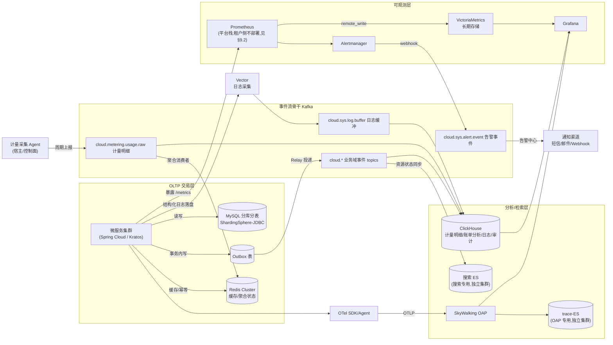
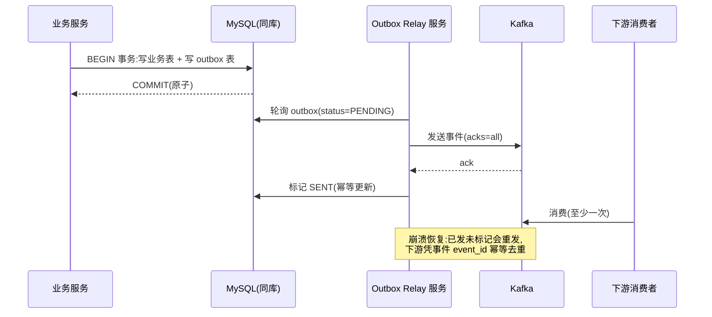
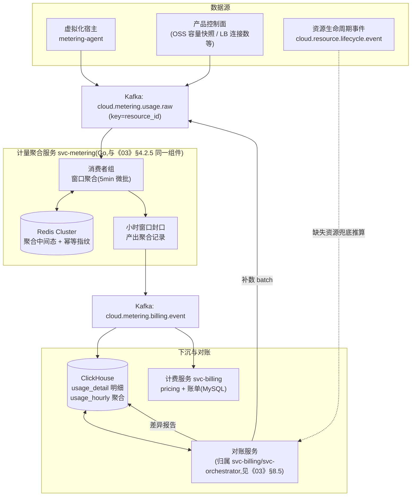
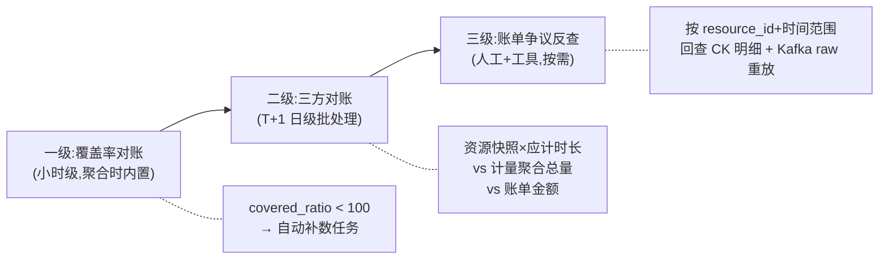
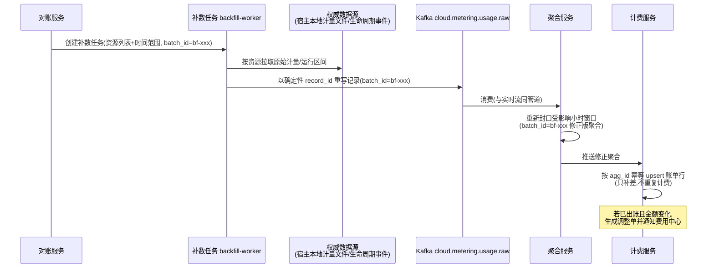
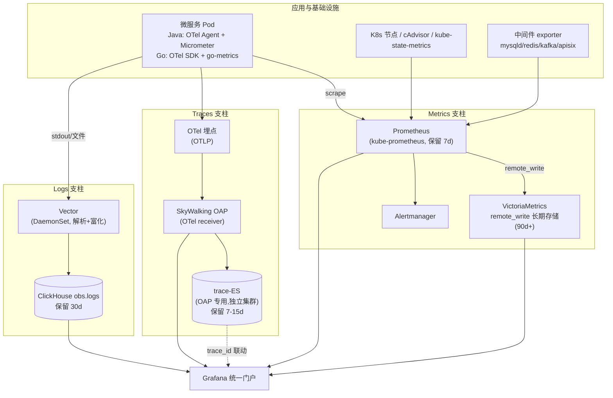
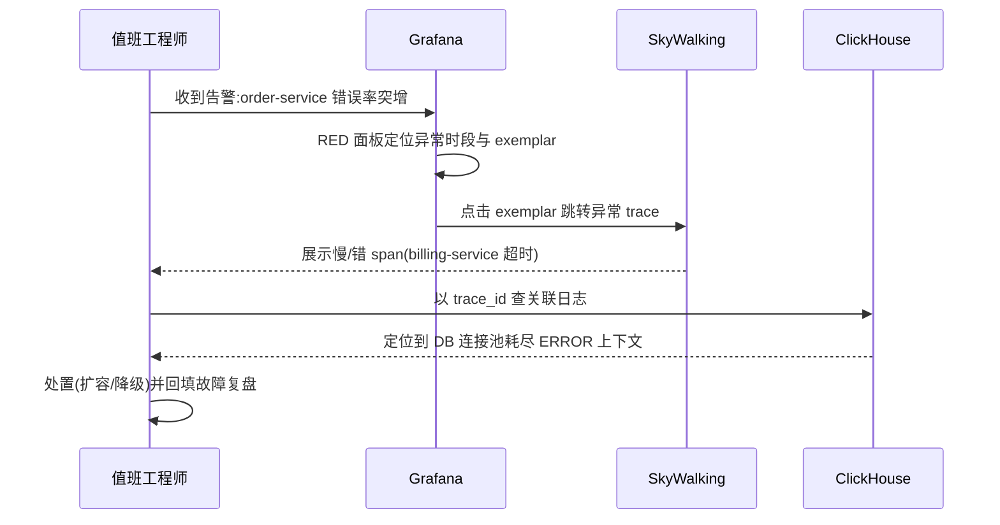
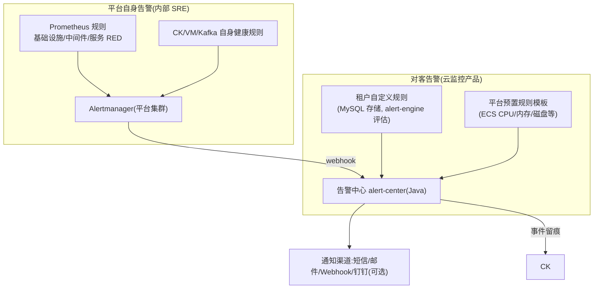
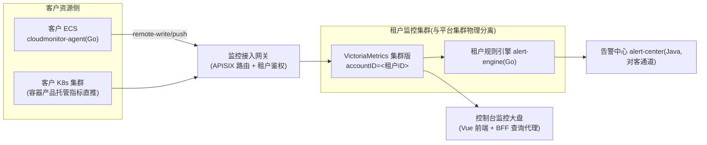

# 05 数据架构与可观测性体系

> 本章定义云服务平台的数据架构(OLTP / 事件流 / OLAP / 缓存 / 搜索的分工与流向)、计量计费数据管道(云平台商业生命线)、可观测性三支柱统一方案(Metrics / Traces / Logs)、统一告警体系与"云监控"产品化路径、多租户监控隔离架构,以及容量估算方法。
>
> 本章所有技术选型与《10-research-and-selection-decisions.md》全栈技术选型决策表保持一致;如本章存在细化或局部修正,均在文中显式说明理由。

**与其他章节的关系:**

| 关联章节 | 关系说明 |
|---|---|
| 参见《00-overview.md》 | 本章是总体架构中"数据层 + 可观测层"的展开 |
| 参见《03-backend-services.md》 | 计费/账单域的领域模型与订单中心归属该章,本章只定义计量数据管道与其交接契约 |
| 参见《04-middleware-infrastructure.md》 | Kafka、MySQL、Redis、ES 的集群部署、高可用与运维细节归属该章;**Kafka topic 的命名、分区数、保留期与环境隔离策略以该章 §5.4 为全书唯一事实源,本章不另行定义**;本章聚焦数据模型与使用方式 |
| 参见《06-kubernetes-productization.md》 | 容器平台的监控数据采集(cAdvisor/kube-state-metrics)与本章采集体系对接 |
| 参见《07-security.md》 | 监控数据的租户隔离鉴权、日志脱敏策略的安全要求归属该章,本章给出数据侧落点 |
| 参见《08-devops-delivery.md》 | 告警规则、Grafana 面板、Kafka topic 的 GitOps 化管理纳入该章交付流水线 |
| 参见《09-roadmap.md》 | 本章第 12 节的演进路线与该章里程碑对齐 |

---

## 1. 设计目标与总体原则

### 1.1 设计目标

1. **商业可信**:计量计费数据不丢、不重、可审计、可对账。账单与用量之间任何差异都能在 24 小时内定位到根因,这是云平台信任底线(对标阿里云"出账链路"调研结论)。
2. **读写分治**:OLTP 只承担事务性读写;分析、账单明细查询、日志检索全部下推到 OLAP(ClickHouse)与搜索(ES),避免分析流量拖垮交易库。
3. **流为骨干**:所有跨域数据移动(计量上报、业务事件、日志缓冲、告警事件)统一经 Kafka 异步化,生产侧与消费侧解耦、可重放。
4. **可观测先行**:可观测体系既是内部运维工具,也是对外售卖的"云监控"产品的母体。平台自用与对客售卖两套视图共享采集与存储底座,但物理隔离。
5. **成本可控**:日志、Trace、指标全部设 TTL 分层保留;ClickHouse 列存压缩把日志存储成本压到 ES 方案的 ~1/10。

### 1.2 总体原则

- **幂等优于精确一次传输**:Kafka 语义采用 at-least-once + 全链路幂等键,不依赖端到端 exactly-once(成本高、故障面大)。
- **确定性 ID**:计量记录、账单条目、告警事件的唯一键尽量由业务语义哈希生成(如 `hash(resource_id|item|window)`),天然抗重放。
- **Schema 注册制**:新增云产品必须注册"资源类型 + 计量项 + 指标名",否则不予上线(呼应对标启示 2:计量计费先于产品规划,见《10-research-and-selection-decisions.md》§3.4)。
- **标签规范统一**:所有观测数据强制携带统一标签集(service / instance / region / trace_id / account_id),三支柱联动的基石。

---

## 2. 数据架构全景

### 2.1 数据分类与存储映射

| 数据类别 | 典型内容 | 主存储 | 辅助组件 | 特征 |
|---|---|---|---|---|
| 交易型业务数据 | 订单、账单汇总、资源元数据、账号权限 | MySQL 分库分表(ShardingSphere-JDBC) | Redis Cluster 缓存 | 强一致、行级事务、低延迟点查 |
| 计量明细 | 逐资源逐计量项的用量记录 | ClickHouse | Kafka 管道 + Redis 聚合状态 | 只追加、海量、按账号/时间分析 |
| 账单/聚合数据 | 小时聚合、日汇总、账单明细 | MySQL(账单)+ ClickHouse(明细分析) | — | 出账写 MySQL,追溯查明细走 CK |
| 业务事件流 | 订单事件、资源生命周期事件、计费事件 | Kafka(管道)+ ClickHouse(事件审计) | MySQL outbox 表 | 事件溯源、跨域解耦 |
| 日志 | 平台服务日志、审计日志、售卖日志服务 | ClickHouse | Vector 采集 + Kafka 缓冲 | 高吞吐写、低频改、TTL 淘汰 |
| 指标 | 平台监控指标、客户资源监控指标 | Prometheus(近期)+ VictoriaMetrics(长期) | Grafana 展示 | 时序、按标签聚合 |
| 调用链 | 分布式 Trace/Span | SkyWalking OAP(存储用 trace-ES,独立集群) | OTel 采集 | 写多读少、按 trace_id 点查 |
| 搜索索引 | 官网产品搜索、文档站检索 | Elasticsearch(搜索专用,与 trace-ES 物理隔离) | — | 全文检索、低延迟读 |
| 对象数据 | 镜像、备份、静态资源、日志归档 | MinIO | — | 参见《04-middleware-infrastructure.md》 |

### 2.2 数据全景图



**读图要点:**

1. MySQL 是唯一事务事实源;任何分析查询不得直连 MySQL 大表扫描,改走 Kafka 同步至 ClickHouse 的副本。
2. Kafka 承担四类流量:业务事件、计量、日志缓冲、告警事件,各自独立 topic 组与 SLA(见第 4 节)。
3. 可观测层与业务数据面物理分离:Prometheus/VM/ClickHouse 故障不得影响交易链路;反过来交易链路异常必须能被观测层捕获。

### 2.3 选型结论汇总(与《10-research-and-selection-decisions.md》§4.2 选型决策总表一致)

| 领域 | 结论 | 理由(摘要) | 备选 | 改选条件 |
|---|---|---|---|---|
| OLAP 引擎 | **ClickHouse** | 列存压缩成本约为 ES 1/10;SQL 分析;高吞吐写入;同时承接计量/账单/日志/审计四类负载,一套引擎收敛运维面 | Elasticsearch | 团队已有成熟 ES 运维能力且全文检索为第一诉求 |
| 日志存储 | **ClickHouse**(Vector 官方 sink 写入) | 同上;日志写多读少、几乎不更新,与 MergeTree+TTL 天然匹配 | ELK | 强依赖 Kibana 开箱体验与全文检索体验时 |
| 长期指标存储 | **VictoriaMetrics**(Prometheus remote_write 承接) | 单机 Prometheus 只留 7d 热数据;VM 提供长保留、高压缩比与多租户 accountID 能力 | Prometheus 自身长保留 | 数据量小、保留期 ≤30 天且无多租户诉求 |
| Trace 后端 | **OpenTelemetry 埋点 + SkyWalking OAP 接收存储** | OTel 行业标准、双语言 SDK 成熟;OAP 提供一体化 APM UI,存储用独立的 trace-ES 集群(与搜索 ES 物理隔离,见 §7.3) | 纯 OTel Collector + 自研存储 | 需要字节码零侵入且纯 Java 栈时可直接 SW agent(但全平台统一口径优先,维持 OTel) |
| 流式聚合 | **自研消费者服务**(即 svc-metering,Go/Kratos 实现,Kafka 消费者 + Redis 状态) | 候选池无 Flink;计量聚合逻辑固定、窗口简单,自研消费者 + 幂等下沉成本最低、可控性最强;语言归属符合"吞吐和连接归 Go"分工(见《03-backend-services.md》§2.2) | Flink(可选,候选池外小工具标注) | 出现复杂多流 join / CEP / 分钟级大规模状态计算需求时 |
| 业务数据同步至分析层 | **事务 Outbox + Relay 投递** | 与业务事务原子提交,无额外组件;实现简单 | Debezium/Canal CDC(可选) | 存量库无法改造、或需要整库批量同步时 |

> 说明:Flink 与 Debezium 不在用户给定候选池内,此处仅作为"触发条件满足后"的备选标注,一期不引入。

---

## 3. OLTP 数据架构(摘要与本章增量约定)

分库分表总体方案、ShardingSphere-JDBC 使用规范、连接池与驱动版本耦合坑,参见《04-middleware-infrastructure.md》与《03-backend-services.md》。此处只列与数据流相关的强约定:

### 3.1 分片键约定

| 域 | 分片键 | 理由 |
|---|---|---|
| 订单/账单 | account_id | 费用中心查询永远按账号入口,天然聚合 |
| 资源元数据 | account_id(单键) | 与《04-middleware-infrastructure.md》§6.4 对齐:账号/交易/资源/计量四库统一以账号为唯一分片键,账号维度资源列表单片命中;region 为普通字段,仅参与过滤,不参与路由(控制面按 region 调度走字段索引) |
| 计量对账单/稽核 | account_id | 与账单同库路由,减少跨库 join |
| 告警规则(对客) | account_id | 租户维度 CRUD |

> **术语与口径对齐**:`account_id` 即《04-middleware-infrastructure.md》中记作 `user_id` 的平台账号编号(全书术语权威定义见《00-overview.md》附录 A);两章分片键口径完全一致,不存在两套规则。

禁止跨片大事务;跨域一致性用事件最终一致(见 3.3)。

### 3.2 表生命周期约定

- 所有表必备四列:`created_at`、`updated_at`、`version`(乐观锁)、`is_deleted`(软删)。
- 账单类表按月分区思路:不做物理分区,按 `bill_month` 建逻辑归档线,T+13 个月归档至 MinIO(Parquet)并从 MySQL 删除,归档文件可被 ClickHouse 外表拉回查询。

### 3.3 事务 Outbox 模式(业务事件标准出口)



- Outbox 表分片键与业务表一致,Relay 按分片并行轮询,轮询间隔 200ms~1s。
- 事件信封(event envelope)统一格式:

```json
{
  "event_id": "ord-2026080412-e3b0c442",
  "event_type": "order.paid",
  "occurred_at": "2026-08-04T12:00:00Z",
  "account_id": 100231,
  "region": "cn-east-1",
  "aggregate_id": "ORD20260804000123",
  "schema_version": "1.2",
  "trace_id": "4bf92f3577b34da6a3ce929d0e0e4736",
  "payload": { }
}
```

`event_id` 由业务语义确定性生成(如 `hash(aggregate_id|action|version)`),下游据此幂等。

---

## 4. Kafka 事件流平台规划

集群部署、分区副本、运维参数参见《04-middleware-infrastructure.md》,本节给出数据视角的规划。

### 4.1 Topic 总规划表(引用《04》§5.4 唯一事实源)

**Topic 命名规范、分区数、保留期、分区键与环境隔离策略一律以《04-middleware-infrastructure.md》§5.4(全书唯一事实源)为准;本节只列本章数据管道关注的 topic 及其数据流角色,不另行定义任何 topic 参数。** 新增 topic 必须先以 MR 方式登记进《04》§5.4 清单(Strimzi KafkaTopic CR 同步声明),否则不予开通。

| Topic(权威名,见《04》§5.4) | 本章数据流角色 | 分区键 | 参数出处 |
|---|---|---|---|
| `cloud.metering.usage.raw` | 计量明细上报,全平台最大流量 topic;事实源与重放窗口(5.4/5.5) | resource_id | 《04》§5.4:64 分区,保留 3 天 |
| `cloud.metering.billing.event` | 小时聚合结果(HourlyUsage)出口,交接计费域(5.6) | account_id | 《04》§5.4:16 分区,保留 30 天 |
| `cloud.trade.order.event` | 订单域事件,提供出账上下文 | order_id | 《04》§5.4:16 分区,保留 7 天 |
| `cloud.resource.lifecycle.event` | 资源生命周期事件,二级对账的权威时间线(5.5.2) | resource_id | 《04》§5.4:32 分区,保留 14 天 |
| `cloud.billing.account.event` | 计费/扣费/账单事件,账务审计可重放 | account_id | 《04》§5.4:16 分区,保留 30 天 |
| `cloud.sys.log.buffer` | 日志缓冲(可选链路,见 7.4),允许极端情况丢弃 | service | 《04》§5.4:16 分区,保留 3 天 |
| `cloud.sys.alert.event` | 告警事件(Alertmanager webhook 入流,见第 8 节) | alert_name | 《04》§5.4:8 分区,保留 7 天 |
| `cloud.sys.audit.action` | 用户操作审计(控制台/OpenAPI 动作),下游入 CK 留存(合规基线 ≥180 天热存+MinIO 冷备,付费档 365 天/18 个月,见第 11 节) | account_id | 《04》§5.4:16 分区,保留 90 天 |
| `cloud.{domain}.{aggregate}.{event}.dlq` | 各消费组死信 | 同源 topic | 《04》§5.3 命名规范 |

### 4.2 通用契约

1. **生产端**:计量、账务与审计类 topic 强制 `acks=all` + `enable.idempotence=true`(broker 侧 `min.insync.replicas=2`,见《04》§5.6);日志缓冲类(`cloud.sys.log.buffer`)允许 `acks=1`(允许极端情况丢弃)。
2. **分区键 = 顺序边界**:同一资源/账号的事件必须落同一分区;禁止随机 key。
3. **消息必须含 `trace_id` 字段**:生产端由框架拦截器自动注入(Java 用 OTel agent 注入的 MDC,Go 用统一日志/消息封装),实现"事件→调用链"反查。
4. **消费端三件套**:手动提交 offset、幂等下沉、死信转发。消费失败重试后投 `cloud.*.dlq` 并告警;消费组命名 `{service}.{purpose}`(见《04》§5.5)。
5. **Schema 治理**:payload 用 Protobuf(与东西向 gRPC IDL-first 策略一致),`schema_version` 字段做兼容演进;新增字段只增不改;topic 名不含版本号(《04》§5.3)。

---

## 5. 计量计费数据管道(云平台生命线)

对标阿里云出账链路:**计量采集(逐资源逐计量项)→ 小时级出账 → 余额/代金券抵扣 → 月度账单汇总对账**。本节定义从采集到小时聚合的管道;计费定价、账单、扣费属于交易域,参见《03-backend-services.md》。

### 5.1 管道总体架构



### 5.2 采集层设计

**结论:采集以"产品控制面 + 宿主 agent"双通道为主,Kafka 为唯一出口。**

- **通道 A — 宿主/基础设施 agent**:ECS 类计算资源由宿主机上的 metering-agent(Go 实现,常驻 DaemonSet 或 systemd 服务)每 60s 汇总本机运行中实例的 cpu_seconds、mem_gb_seconds、disk_gb_hours,批量上报。
- **通道 B — 产品控制面直报**:OSS 容量由对象存储控制面每小时快照统计;负载均衡由数据面按 5 分钟聚合连接数/流量;此类数据由控制面服务直接作为生产者上报。
- **上报协议**:HTTP POST(经 APISIX 内网路由,客户端证书互信)或直接 SDK 写 Kafka(控制面服务)。agent 场景用 HTTP + 本地磁盘 WAL 队列,断网时本地暂存重传。
- **采集周期**:默认 60s 一条原始记录;agent 本地预聚合为 5min 批次后发送,降低 Kafka 压力(条数不变、请求数降 5 倍)。

**理由**:采集职责天然分散在各产品数据面,集中拉模式(Prometheus pull)无法承担计费级可靠性与逐租户隔离;推模式 + Kafka 缓冲让采集端与计费端故障互不影响。
**备选**:直接用 Prometheus 的指标做计量源。
**改选条件**:仅当产品形态只有"实例在/不在"二态(纯包年包月、无用量浮动)时可省去明细采集,直接按订单计费——但平台必须保留管道能力,按量付费是云的核心形态。

### 5.3 计量数据模型

#### 5.3.1 原始用量记录(cloud.metering.usage.raw 消息体,Protobuf 示意)

```protobuf
message UsageRecord {
  string record_id      = 1;  // 确定性 ID: sha1(resource_id|item|window_start)[0:24]
  uint64 account_id     = 2;
  string region         = 3;
  string resource_type  = 4;  // ecs / oss / slb / rds ...
  string resource_id    = 5;
  string metering_item  = 6;  // cpu_seconds / mem_gb_seconds / storage_gb_hour ...
  string quantity       = 7;  // decimal 字符串,避免浮点误差
  int64  window_start   = 8;  // 计量窗口起点(分钟对齐),Unix 秒
  int32  window_seconds = 9;  // 窗口长度(通常 60)
  int64  collect_ts     = 10; // 采集时间
  string collector_id   = 11; // agent/控制面实例标识
  string batch_id       = 12; // 补数批次号(正常上报为 "rt")
  string trace_id       = 13;
}
```

**计量项注册制**:每个产品上线前在"计量目录表"(MySQL `metering_catalog`)注册资源类型与计量项:

```sql
CREATE TABLE metering_catalog (
  id              BIGINT PRIMARY KEY AUTO_INCREMENT,
  resource_type   VARCHAR(32)  NOT NULL,           -- ecs
  metering_item   VARCHAR(64)  NOT NULL,           -- cpu_seconds
  unit            VARCHAR(16)  NOT NULL,           -- second / gb_hour / count
  precision       TINYINT      NOT NULL DEFAULT 6,
  collect_source  VARCHAR(16)  NOT NULL,           -- agent / control_plane
  collect_period  INT          NOT NULL DEFAULT 60,
  status          TINYINT      NOT NULL DEFAULT 1,
  UNIQUE KEY uk_type_item (resource_type, metering_item)
);
```

#### 5.3.2 小时聚合记录(cloud.metering.billing.event)

```protobuf
message HourlyUsage {
  string agg_id         = 1; // sha1(resource_id|item|hour)[0:24]
  uint64 account_id     = 2;
  string region         = 3;
  string resource_type  = 4;
  string resource_id    = 5;
  string metering_item  = 6;
  string total_quantity = 7; // 该小时累计量
  int64  hour_start     = 8; // 整点 Unix 秒
  int32  covered_ratio  = 9; // 覆盖率 0-100:实际收到的窗口数/应到窗口数,<100 触发稽核关注
  int64  produced_ts    = 10;
  string batch_id       = 11;
}
```

`covered_ratio` 是把"数据质量"显性化的关键设计:聚合服务知道自己收到的窗口数,缺口在聚合时就暴露,而不是等账单争议时才发现。

### 5.4 聚合层实现要点

- **技术形态**:Go(Kratos)服务 `svc-metering`,3 副本——与《03-backend-services.md》§4.2.5 是**同一组件、同一服务名**(语言归属按双栈分工口诀"吞吐和连接归 Go",见《03》§2.2 与《09-roadmap.md》决策 R-04);消费组内按 resource_id 哈希与 Kafka 分区天然对齐,同资源顺序处理。
- **状态管理**:5min 微批先累加进 Redis(`HINCRBYFLOAT metering:{hour}:{partition-range}`),小时窗口封口时读出并产出 HourlyUsage。Redis 只做加速,**不是事实源**——事实源是 Kafka `cloud.metering.usage.raw`(保留 3 天,参数见《04-middleware-infrastructure.md》§5.4),Redis 状态丢失可从 raw 重放重建。
- **窗口封口时机**:整点后等待 10 分钟水位线(容忍 agent 延迟),封口后仍可通过补数流程修正。
- **乱序处理**:`window_start` 决定归属窗口,与到达顺序无关;迟到数据(跨小时到达)单独标记并合并进对应历史窗口,产出 `batch_id=late` 的修正聚合记录。

### 5.5 不丢不重设计:幂等、对账、补数三板斧

#### 5.5.1 全链路幂等

| 环节 | 幂等手段 |
|---|---|
| agent 重传 | record_id 确定性生成(资源+计量项+窗口),重传不产生新记录 |
| Kafka 生产 | `enable.idempotence=true` 防生产端重复;崩溃重发由 record_id 兜底 |
| 聚合消费 | Redis `SETNX agg:{agg_id}` 防同窗口重复封口;消费 offset 手动提交 |
| ClickHouse 下沉 | `ReplacingMergeTree` 以 record_id/agg_id 入排序键,重复插入在合并后收敛;查询侧对准确性要求高的场景用 `FINAL` 或 argMax |
| 计费入账 | 计费服务以 agg_id 为入账幂等键,`bill_detail` 唯一索引 `(agg_id)` |
| 补数 | 补数复用相同确定性 ID,重算结果与原始记录天然合并,不会双计 |

#### 5.5.2 三级对账



- **一级(小时)**:聚合服务自带 covered_ratio;covered_ratio < 100% 由对账服务自动生成补数任务。
- **二级(T+1)**:对账服务(归属 `svc-billing`/`svc-orchestrator`,见《03-backend-services.md》§8.5)每日跑批:
  - 期望侧:从资源元数据快照计算"每个应计费资源 × 当日运行时长 × 计量项"的理论用量(资源生命周期事件 `cloud.resource.lifecycle.event` 是权威时间线);
  - 实际侧:ClickHouse `usage_hourly` 按资源汇总;
  - 差异率 = |理论-实际|/理论,采用分层阈值:**差异率 >0.1% 触发自动补数,>0.5% 触发 L0/L1 告警**;差异报告写入 CK `recon_report` 表并在内部监控大盘呈现。
- **三级(争议)**:客服/工单通道发起(参见《01-product-catalog.md》§4.5 支持计划),支持按资源+时间段导出明细 CSV(Kafka raw 3 天内可直接重放,更早从 CK 明细查)。

> **对账口径区分(与《09-roadmap.md》Gate 商业门禁对齐)**:商业验收口径是"**无未解释差异(covered_ratio=100%)**"——任何差异都必须定位根因并闭环,不存在"可接受的差异百分比";本节 covered_ratio(<100%)与差异率(>0.1% 补数、>0.5% 告警)仅为**工程触发阈值**,用于自动补数任务与 L0/L1 告警的触发,不得作为验收口径使用。

#### 5.5.3 补数流程



**设计取舍**:补数与实时流共用管道、共用 ID 体系,避免"两套账";代价是聚合与计费必须全面幂等——这笔账必须付。

### 5.6 与计费域的交接契约

- 交接物:`cloud.metering.billing.event` topic 上的 HourlyUsage + ClickHouse `usage_hourly` 表(计费服务可直接查 CK 做大盘核对)。
- 计费服务(参见《03-backend-services.md》账单域)订阅该 topic,按价格规则(包年包月不计用量、按量付费按小时出账、资源包抵扣)生成账单明细写 MySQL。
- **冻结窗口**:每月 1 日 06:00 前完成上月全量二级对账与补数,之后上月计量窗口进入"只读冻结"(CK 分区标记 + 补数服务拒收该月任务),保证财务可审计。

---

## 6. ClickHouse:OLAP 引擎定位与表设计

### 6.1 定位与边界

**结论:ClickHouse 是全平台唯一 OLAP 引擎,承接四类负载——计量明细、账单/对账分析、日志存储分析、审计与事件分析。**

- 理由:列存压缩比高(日志成本约为 ES 1/10)、SQL 通用、写入吞吐高;四类负载合并一套集群,运维与成本收敛。
- 备选:ELK(日志)+ 独立分析库的分裂方案。
- 改选条件:当日志全文检索体验成为核心诉求(复杂分词、Kibana 深度依赖)且团队具备 ES 运维能力时,日志迁回 ELK;ClickHouse 保留计量/分析负载。
- 边界红线:**禁止**在 CK 上做高频 UPDATE/DELETE、点查型 OLTP、强一致读写;所有写入走批量(≥1 万行/批或 1~5s 攒批)。

### 6.2 表引擎决策

| 场景 | 引擎 | 理由 |
|---|---|---|
| 计量明细 | `ReplacingMergeTree(insert_ts)` | 补数/重放重复写按排序键收敛,查询侧可控 FINAL |
| 小时聚合 | `ReplacingMergeTree` | 同上,修正版聚合覆盖旧版 |
| 日志 | `MergeTree`(不去重) | 日志允许极端重复,去重成本高于收益;以 TTL 控量 |
| 审计 | `MergeTree` | 只追加、强留痕 |
| 对账报告 | `MergeTree` | 日级低频写 |
| 实时预聚合 | 物化视图(对 `usage_detail` 建 5min/小时 rollup) | 查询加速,写入放大可控 |

### 6.3 DDL 示例

```sql
-- 计量明细表:分区按月,排序键按"账号→资源→计量项→时间"匹配查询模式
CREATE TABLE metering.usage_detail ON CLUSTER obs_cluster
(
    record_id      FixedString(24),
    account_id     UInt64,
    region         LowCardinality(String),
    resource_type  LowCardinality(String),
    resource_id    String,
    metering_item  LowCardinality(String),
    quantity       Decimal(24,6),
    window_start   DateTime,
    window_seconds UInt16 DEFAULT 60,
    collector_id   LowCardinality(String),
    batch_id       LowCardinality(String) DEFAULT 'rt',
    trace_id       String DEFAULT '',
    insert_ts      DateTime DEFAULT now()
)
ENGINE = ReplacingMergeTree(insert_ts)
PARTITION BY toYYYYMM(window_start)
ORDER BY (account_id, resource_type, resource_id, metering_item, window_start)
TTL window_start + INTERVAL 13 MONTH TO VOLUME 'cold',
    window_start + INTERVAL 25 MONTH DELETE
SETTINGS index_granularity = 8192;

-- 小时聚合表(计费入账与对账主查询面)
CREATE TABLE metering.usage_hourly ON CLUSTER obs_cluster
(
    agg_id         FixedString(24),
    account_id     UInt64,
    region         LowCardinality(String),
    resource_type  LowCardinality(String),
    resource_id    String,
    metering_item  LowCardinality(String),
    total_quantity Decimal(24,6),
    hour_start     DateTime,
    covered_ratio  UInt8,
    batch_id       LowCardinality(String),
    produced_ts    DateTime,
    insert_ts      DateTime DEFAULT now()
)
ENGINE = ReplacingMergeTree(insert_ts)
PARTITION BY toYYYYMM(hour_start)
ORDER BY (account_id, resource_id, metering_item, hour_start)
TTL hour_start + INTERVAL 25 MONTH DELETE;

-- 平台日志表:按天分区(trace_id 建 bloom filter 支持排障点查)
CREATE TABLE obs.logs ON CLUSTER obs_cluster
(
    ts        DateTime64(3),
    service   LowCardinality(String),
    instance  LowCardinality(String),
    env       LowCardinality(String) DEFAULT 'prod',
    level     LowCardinality(String),
    trace_id  String DEFAULT '',
    span_id   String DEFAULT '',
    message   String,
    attrs     String DEFAULT '{}',          -- JSON 字符串,重字段按需抽列
    INDEX idx_trace trace_id TYPE bloom_filter(0.01) GRANULARITY 4,
    INDEX idx_msg message TYPE tokenbf_v1(30720, 2, 0) GRANULARITY 4
)
ENGINE = MergeTree
PARTITION BY toYYYYMMDD(ts)
ORDER BY (service, level, toUnixTimestamp64Milli(ts))
TTL ts + INTERVAL 30 DAY DELETE
SETTINGS index_granularity = 8192;
```

**分区键设计理由**:分区粒度取"月"(计量)/"天"(日志),保证单分区数据量在数 GB~数十 GB 区间(part 数量可控);排序键把最高频过滤列(account_id / service)放最左;TTL 直接承担生命周期管理,不做手工删除(CK 不擅长高频删除,呼应选型坑清单 9,见《10-research-and-selection-decisions.md》§4.4)。

### 6.4 写入链路

| 数据 | 写入方 | 攒批策略 |
|---|---|---|
| 计量明细/聚合 | svc-metering(Go)/ ck-writer(Go 消费者) | 1 万行或 2s 先到先发;失败进 DLQ topic |
| 日志 | Vector `clickhouse` 官方 sink | 默认 batch 1000 条 / 1s |
| 审计 | svc-audit 消费者 | 5s 攒批 |
| 业务事件归档 | events-archiver 消费者(消费 `cloud.*` 业务事件 topic) | 5s 攒批 |

CK 写入大忌是"逐条 INSERT";所有写入方必须攒批,并对 `Too many parts` 错误做指数退避(该错误即写入过碎信号,接入平台自身告警)。

### 6.5 集群与部署建议(一期)

- 3 分片 × 2 副本(6 节点,可复用日志/分析混部),每节点 16C/64G/2×1TB NVMe;ZooKeeper/ClickHouse Keeper 3 节点独立部署。
- Grafana、计费核对、对账批处理全部只读账号;写入账号按库隔离。
- 查询限流:`max_memory_usage` 单查询 16G 上限 + `max_concurrent_queries` 64,防止大盘查询拖垮写入。
- 演进:日志量超 100GB/天后独立日志集群,计量/账单保留在核心集群(见 9 节估算)。

---

## 7. 可观测性三支柱统一方案

### 7.1 总体架构



### 7.2 Metrics 支柱

**结论:Prometheus 采集近期数据 + VictoriaMetrics 经 remote_write 承接长期存储 + Grafana 统一展示。**

- 理由:Prometheus 是 K8s 事实标准、PromQL 与 exporter 生态无可替代;单机 TSDB 长保留成本高且无多租户,VM 压缩比高、支持 accountID 多租户(第 9 节产品化依赖)。
- 备选:仅用 Prometheus 自身长保留 / Thanos 类方案。
- 改选条件:指标总量小(序列数 <50 万)且保留期 ≤30 天时,Prometheus 单栈即可,撤掉 VM 减少组件;反之若多集群聚合诉求出现,VM 是唯一正确方向(选型表一致)。
- **坑位提示(与选型坑清单 7 一致,见《10-research-and-selection-decisions.md》§4.4)**:Prometheus→VM 迁移期 remote_write 双写对比至少一周;recording rule 尽量留在 Prometheus 侧,VM 只存结果,避免行为差异。
- 采集规范:服务统一暴露 `/metrics`(Java Micrometer + OTel agent 自动装配;Go 用 prometheus/client_golang);标签必须含 `service`、`instance`、`region`、`env`;**禁止高基数标签**(account_id、resource_id 不得进指标标签——它们属于 trace/log 与租户监控域)。
- RED/USE 模板:每个服务默认出 RED 面板(请求率/错误率/时延)与依赖健康面板,由平台 Grafana provisioning 统一下发(纳入《08-devops-delivery.md》GitOps)。

### 7.3 Traces 支柱

**结论:全平台统一 OpenTelemetry 埋点,OTLP 输出至 SkyWalking OAP(Otel receiver)做存储与分析 UI;存储用独立的 trace-ES 集群(与搜索 ES 物理隔离)。**

- 理由:OTel 是行业标准、Java agent 与 Go SDK 均成熟,与 Java/Go 双语言分工(参见《03-backend-services.md》)天然匹配;OAP 提供开箱即用的 APM 拓扑/慢调用分析,免去自建 trace 查询 UI。
- 备选:纯 SkyWalking agent(字节码增强零侵入)。
- 改选条件:平台收敛为纯 Java 且追求零改造成本时可全量切 SW agent;但当前双语言格局下,OTel 统一口径收益更大,维持现结论。
- **红线(选型坑清单 1,见《10-research-and-selection-decisions.md》§4.4)**:同一进程禁止 SW agent 与 OTel exporter 并存——双份上报且上下文传播断裂。工程落地:CI 镜像构建基线只内置 OTel agent,把该红线变成构建约束。
- Trace 存储:OAP 使用**独立的 trace-ES 集群**(3 节点 16C/64G/2TB,保留 7~15 天),与官网**搜索 ES 集群**(3 master+3 data,8C32G/500GB)物理隔离,二者互不影响。**用途边界与集群规格以《04-middleware-infrastructure.md》§8.1/§8.2 为准**:搜索 ES 只承担"三类搜索"用途,trace-ES 只承担 OAP trace 存储,均不与日志/OLAP(ClickHouse)负载混部。采样策略:网关默认 10% 采样 + 错误/慢调用(>1s)100% 尾采样,由 APISIX/OTel 采样器实现。

### 7.4 Logs 支柱

**结论:Vector(DaemonSet)采集容器 stdout 与宿主文件 → 解析富化 → 写 ClickHouse;大流量场景经 Kafka `cloud.sys.log.buffer` 缓冲。**

- 理由:Vector 官方支持 ClickHouse sink(Filebeat 的 CK 输出是社区插件,选型坑清单 4 已排除,见《10-research-and-selection-decisions.md》§4.4);DaemonSet 形态与 K8s 对齐;CK 存储成本约为 ES 1/10。
- 备选:ELK。改选条件见 6.1。
- **日志规范(强制,三支柱联动的前提)**:
  - 结构化 JSON 单行输出;必含字段:`ts, level, service, instance, env, msg`;
  - `trace_id/span_id`:Java 由 OTel agent 自动注入 MDC,Go 用平台统一日志库封装注入;
  - 敏感数据(AK/SK、手机号、身份证)在应用侧脱敏后输出;平台侧 Vector transform 兜底正则遮蔽(安全细则参见《07-security.md》);
  - 日志等级纪律:正常流量禁打 INFO 大对象;ERROR 必须可告警或可忽略有标记,否则告警体系被噪音淹没。
- Kafka 缓冲链路取舍:日常直写 CK(Vector 自带磁盘 buffer);仅在 CK 维护窗口或日志洪峰时启用 Kafka 缓冲(消费者为 logs-ingestor),保持链路可切换但常态最短。

### 7.5 统一标签/字段规范

| 字段 | Metrics 标签 | Trace 属性 | Log 字段 | 说明 |
|---|---|---|---|---|
| service | ✅ 必填 | service.name | service | 与服务注册名(Nacos dataId 前缀)一致 |
| instance | ✅ | service.instance.id | instance | Pod 名或宿主名 |
| region | ✅ | deployment.region | region | 多地域演进预留(呼应对标启示 6,见《10-research-and-selection-decisions.md》§3.4) |
| env | ✅ | deployment.environment | env | dev/staging/prod(三套,联调合并入 dev,见《03》§2.3.1) |
| trace_id | exemplar | trace ID 本体 | trace_id | 联动键 |
| account_id | ❌ 禁入平台指标 | 业务 span 属性 | tenant 场景字段 | 防高基数;租户监控域另行建模(`account_id` ≡ `uid` ≡ `user_id` ≡ `tenant_id`,见《00-overview.md》附录 A) |

### 7.6 三支柱联动与排障流程

**联动机制:**
1. Prometheus exemplar(带 trace_id 的样本点)→ Grafana 从指标曲线一键跳转 SkyWalking trace;
2. SkyWalking trace 详情 → 携带 trace_id 跳转 Grafana/CK 日志查询(`WHERE trace_id = ...`,bloom filter 索引保证点查性能);
3. ClickHouse 日志 → 反查同 trace_id 的完整日志链与对应 trace。



---

## 8. 统一告警体系

### 8.1 告警分层模型



| 层级 | 规则来源 | 评估引擎 | 通知对象 |
|---|---|---|---|
| L0 平台红线 | 平台告警基线(站点不可用、账务链路中断、数据管道断流) | Prometheus | SRE 值班(电话/短信) |
| L1 平台运行 | 中间件容量、服务 RED、CK `Too many parts`、Kafka lag | Prometheus | SRE/对应域 owner |
| L2 对客产品 | 租户在云监控控制台配置的阈值/同比环比规则 | 租户规则引擎(alert-engine,Go;消费租户 VM 数据) | 租户联系人 |

**L0 清单(不可降级,Day 1 必须存在)**:网关整体错误率 >5%、计费管道 lag >10min、对账差异率 >0.5%(工程告警阈值;商业验收口径为"无未解释差异",见《09-roadmap.md》Gate)、MySQL 主库不可用、APISIX/etcd 集群失稳、登录服务错误率 >10%。

### 8.2 规则管理:告警即代码

- 平台规则:PrometheusRule CRD + Grafana dashboard 一律进 Git,经 ArgoCD 同步(参见《08-devops-delivery.md》);规则变更走 MR 评审。
- 规则模板:每类中间件/服务提供默认规则包(Nacos 注册即自动被 kube-prometheus 发现并挂默认规则),新服务上线自带基础告警。
- 对客规则:存 MySQL(`alert_rule`,分片键 account_id),由 `alert-engine`(Go)消费租户 VM 数据评估,规则数量上限按套餐分级(免费 5 条/企业版 100 条);`svc-monitor` 只负责租户告警规则 CRUD 与查询代理,不编译 Prometheus/Alertmanager 配置(对客告警双栈方案见 §8.5/§9.2)。

### 8.3 告警收敛

告警中心(alert-center,Java 服务)消费 `cloud.sys.alert.event`,执行四级收敛管线:

1. **去重**:同 fingerprint(规则 ID+标签集哈希)在 10min 窗口内仅留一条;
2. **分组**:按 service/region 聚合为告警组,同组多条只发一条摘要(含 top 实例列表);
3. **抑制**:上游故障抑制下游(如 MySQL 主库 down 抑制其上层 200 条依赖告警),抑制关系在 Git 中声明;
4. **静默**:变更窗口(发布/演练)自动静默关联范围,静默必须绑定变更单号,防止"长静默养痈成患"。

辅以**升级策略**:P0 告警 5 分钟未认领自动升级电话通知值班经理;每告警必须可路由到 owner(无 owner 的规则不允许启用)。

### 8.4 通知渠道

- 内部:L1 企业 IM/邮件,L0 短信+电话(短信网关复用平台短信产品,自家云吃自家狗粮);
- 对客:邮件/短信/Webhook(供租户接自有系统);通知文案含资源 ID、指标快照、处置建议链接(指向文档站对应 runbook);
- 限流保护:单租户通知风暴时按租户限流(10 条/分钟)并自动收敛为摘要,防止通知渠道被打爆。

### 8.5 "云监控"产品如何从这套体系长出来

**结论:云监控 = 租户采集 agent + 租户指标集群(VM accountID 隔离)+ 租户规则引擎 + 告警中心对客通道 + 控制台图表前端;复用平台已建成的采集协议、告警管线与通知渠道,不另起炉灶。**



产品化要点:

1. **基础监控免费、精细监控收费**:agent 60s 粒度基础指标(CPU/内存/磁盘/网络)免费,作为 ECS 标配提升产品力;10s 粒度、自定义指标、更长保留期走付费套餐——直接对标阿里云云监控商业模式。
2. **agent 即 Go 基建**:cloudmonitor-agent 用 Go 实现(呼应 Java/Go 分工:Go 负责资源敏感型工具),支持宿主一键安装脚本与 K8s DaemonSet 两种形态。
3. **大盘不用 Grafana 对客**:多租户 Grafana 暴露面大、定制差;控制台用 Vue 图表组件 + BFF 查询代理(见第 9 节隔离),Grafana 仅限内部。
4. **与资源生命周期联动**:资源释放后监控数据保留 3 天供回溯,随后随租户数据清理策略删除(呼应对标启示 8 的透明状态机,见《10-research-and-selection-decisions.md》§3.4)。

---

## 9. 多租户监控隔离

### 9.1 隔离总原则

**结论:平台自身监控与客户资源监控物理双栈;客户监控内部按账号逻辑隔离(accountID + 行级过滤 + 查询代理强制鉴权)。**

- 理由:平台监控含内部拓扑/容量敏感信息,绝不能与租户数据混存;而每租户一套 Prometheus 不可行,租户内部走逻辑隔离。
- 备选:单栈 + 标签过滤。改选条件:无——这是安全红线,不因成本放宽(参见《07-security.md》数据隔离要求)。

### 9.2 双栈架构

| 维度 | 平台监控栈 | 租户监控栈(云监控) |
|---|---|---|
| Prometheus | 1 套(kube-prometheus) | 不部署租户侧 Prometheus,直接 push 至 VM |
| 长期存储 | VM 单集群(内部) | VM 集群版,`accountID/projectID` URL 路径多租户 |
| Grafana | SRE 专用,SSO 内部账号 | 不对客;控制台 BFF 代理查询 |
| 告警 | L0/L1 → 内部渠道 | 租户规则引擎 → 对客渠道 |
| 日志 | 平台日志进 obs.logs | 若售卖日志服务,按 tenant 分列 + 独立保留策略 |
| 网络 | 内部 VPC/namespace | 接入网关独立入口,与平台采集网段分离 |

### 9.3 租户内隔离落点

1. **存储**:VictoriaMetrics 集群版天然按 `accountID/projectID` 分租户存储与查询(产品能力直接复用);ClickHouse 对客表(如售卖日志)必带 `account_id` 列并建索引。
2. **查询**:所有租户查询必须经 BFF/查询代理,代理层①校验用户对资源的权限(RAM 式策略,参见《07-security.md》)②强制注入 `account_id = 当前账号` 过滤条件③查询配额限流(防单租户大查询拖垮集群)。禁止前端直连 VM/CK。
3. **写入**:监控接入网关校验 agent 身份(实例身份凭证绑定 account_id),防止伪造租户 ID 写入他人空间。
4. **展示**:控制台图表、告警列表、大盘全部以登录账号为作用域;URL 不含可枚举的他人资源 ID。

---

## 10. 容量估算

### 10.1 方法论

估算公式:**总量 = 实例数 × 单位产生率 × 时间 × 峰值系数**;存储 = 原始量 × 压缩比 × 副本数 × 保留期。给出假设基线,规模变化时按公式重算(本节数字为演示,实际以压测校准)。

**一期规模基线(权威出处:《09-roadmap.md》§3.4"一期规模假设基线表",各章容量估算统一引用)**:平台管控面微服务一期 17 个(二/三期扩至 50+,见《03-backend-services.md》§4.0)/ Pod 约 200 个 / 管控面 worker 节点 6~10 台(32C128G);在管计费资源 5 万个、注册租户 1000 家(活跃付费约 500)、活跃用户 1 万;OpenAPI 峰值 2000 QPS(网关峰值 8000 QPS = OpenAPI 2000 + 控制台 + BFF 合计;4 倍余量);计量吞吐均值约 250 条/s、峰值约 1250 条/s(组件设计容量 10k msg/s,见《03-backend-services.md》§4.2.5);审计写入峰值 2 万/s(非网关 QPS)。

### 10.2 指标量

- 平台:500 Pod × 平均 600 序列 + 30 节点 × 1500 序列 ≈ **35 万活跃序列**;30s 采集 → ~1.2 万样本/s ≈ **10 亿样本/天**。VM 压缩 ~0.7 字节/样本 → ~0.7GB/天,90 天保留含副本 ≈ **150GB**。
- 租户:2000 台 ECS × 20 基础指标 / 60s ≈ 670 样本/s ≈ **5800 万样本/天**;付费租户升级为 10s 粒度按 3 倍计。90 天保留 ≈ **100GB 级**。
- 结论:VM 单集群(3 节点)即可承载;序列数突破 200 万或跨地域部署时扩分片。

### 10.3 日志量

- 平台:500 Pod × 平均 30MB/天 ≈ **15GB/天**(故障风暴按 5 倍瞬时设计,即 Vector/Kafka 管道按 ~1GB/s 突发削峰);CK 压缩比约 8:1 → ~2GB/天,30 天热保留含副本 ≈ **120GB**。
- 若售卖日志服务:按付费租户接入量单列集群,首期按 50GB/天原始量规划。
- 结论:一期与计量/审计混部核心 CK 集群;日志原始量 >100GB/天后拆独立集群。

### 10.4 Trace 量

- 网关峰值 8000 QPS × 10% 采样 × 平均 8 span ≈ 6400 span/s;均值按 1/5 峰值 ≈ **1300 span/s ≈ 1.1 亿 span/天**;~400B/span → ~45GB/天原始,trace-ES 存储(含索引)按 2.5 倍计 ≈ 110GB/天 × 10 天保留 ≈ **1.1TB**。
- 结论:trace 存入独立的 trace-ES 集群(3 节点 16C/64G/2TB),保留 7~15 天;超 15 天的慢/错 trace 抽样归档 MinIO。
- 成本控制:尾采样优先保留错误与慢调用;全量采样仅在压测窗口开启。

### 10.5 计量数据量

- 5 万计费资源 × 平均 3 计量项 × 60 条/小时 = **900 万条/小时 ≈ 250 条/s(均值)**(agent 5min 攒批后请求数降 5 倍;峰值按 5 倍计 1250 条/s,Kafka `cloud.metering.usage.raw` 64 分区余量充足);
- 每条 ~200B → 原始 ~4GB/天;CK 压缩后 ~0.5GB/天;13 个月热 + 12 个月冷保留 ≈ **300GB(含副本)**,其中冷段转 CK 冷卷(HDD)/MinIO Parquet 归档。

### 10.6 汇总与硬件建议(一期)

| 组件 | 规格建议 | 磁盘规划 |
|---|---|---|
| Kafka | 3 broker(8C/16G/2×1TB NVMe),见《04》 | 3 天计量 + 30 天业务事件 ≈ 1TB |
| ClickHouse | 6 节点(3 分片×2 副本,16C/64G/NVMe 2TB + 冷卷 4TB) | 计量 300G + 日志 120G + 审计杂项 ≈ 600GB 热 |
| VictoriaMetrics | 3 节点(8C/32G/1TB) | 双栈合计 90 天 ≈ 300GB |
| 搜索 ES(搜索专用,独立集群) | 3 master(2C4G)+ 3 data(8C32G/500GB SSD),见《04》§8.2 | 官网 + 产品 + 文档索引 < 500GB |
| trace-ES(OAP 专用,独立集群) | 3 数据节点(16C/64G/2TB) | trace 1.1TB(保留 7~15 天) |
| Prometheus | 每栈 2 副本(8C/32G/500G) | 7 天热数据 <100GB/副本 |
| MySQL/Redis | 见《04》 | — |

**水位红线**:任一存储组件磁盘水位 >70% 触发 L1 告警,>80% 触发扩容流程;Kafka lag、CK 写入拒绝率、VM ingestion rate 均纳入 L0/L1 监控——数据管道本身是被监控对象。

---

## 11. 数据安全与合规要点(数据侧落点)

详细策略参见《07-security.md》,此处列本章组件的强制落点:

1. **传输加密**:所有观测/计量链路内网 TLS(mTLS 于 APISIX 与网格层);agent 上报用实例身份凭证防伪造。
2. **存储加密与权限**:CK/搜索 ES/trace-ES/VM 启用磁盘加密(或依赖 K8s 存储层加密);读写账号按库/按租户最小授权,审计所有 DDL。
3. **敏感数据**:日志侧应用脱敏 + Vector 兜底;计量与账单数据属高敏,访问走堡垒审批;对客查询代理禁返回他人账号数据(9.3 强制注入 `account_id` 过滤)。
4. **保留即合规**:所有删除只通过 TTL/归档流水线执行,禁止手工删账单相关数据;冻结窗口(5.6)保证财务审计链完整。
5. **操作审计**:控制台/OpenAPI 动作进 `cloud.sys.audit.action` topic → CK 长期保留(**合规基线 ≥180 天热存 + MinIO 冷备;售卖产品提供 365 天/18 个月付费档**,与《03-backend-services.md》§4.4.3、《07-security.md》§6.2 三章口径一致)。

---

## 12. 演进路线(与《09-roadmap.md》对齐)

| 阶段 | 数据与可观测能力 | 出口标准 |
|---|---|---|
| P0 平台地基期 | MySQL 分库分表 + Redis + Prometheus/Grafana 基础监控;日志 Vector→CK 最小链路;Outbox 事件出口 | 服务可被 scrape、可查日志、事件链路打通 |
| P1 商业化 MVP | Kafka topic 全量铺开;**计量管道 + 小时聚合 + 三级对账上线(与按量付费同步,硬门槛)**;OTel 全量埋点 + SkyWalking;告警中心 L0/L1 | 按量计费可出账且**无未解释差异(covered_ratio=100%)**;三支柱联动排障可用 |
| P2 体验完善期 | VM 长期存储;云监控 agent 与租户监控集群;对客告警;Grafana provisioning 大盘体系 | 云监控基础版随 ECS 售卖 |
| P3 规模化期 | CK 日志独立集群(视量级);云监控付费套餐(细粒度/自定义指标);多地域数据面预留(region 标签已在模型中);评估 Flink/CDC 等候选池外组件引入时机 | 单地域 5 万计费资源不重构 |

**关键依赖提示**:计量管道的"计量项注册制"必须在第一个按量付费产品立项前落地,否则补建模成本极高(对标启示 2,见《10-research-and-selection-decisions.md》§3.4);OTel 埋点基线必须在框架脚手架期固化,后补埋点成本是前期的 5 倍以上。

---

## 附录 A:Kafka topic 清单速查

见 4.1 节表格。Topic 命名不含环境标识,生产/预发环境一律以**集群隔离**实现(命名规范与环境隔离策略见《04-middleware-infrastructure.md》§5.3/§5.4,全书唯一事实源),由 GitOps 统一声明。

## 附录 B:观测标签速查

见 7.5 节表格。新增标签须评审:凡可能无界增长的字段(account_id/resource_id/order_id)一律入 trace 属性与日志字段,禁入指标标签。

## 附录 C:告警级别定义

| 级别 | 定义 | 响应时限 | 通知方式 |
|---|---|---|---|
| P0 | 平台不可用/资金链路中断/数据丢失风险 | 5 分钟响应 | 电话+短信+IM |
| P1 | 核心功能降级、容量临近上限、数据管道断流 | 15 分钟响应 | 短信+IM |
| P2 | 非核心功能异常、单点故障但有冗余 | 工作时间 2 小时 | IM+邮件 |
| P3 | 隐患/优化项(如慢查询增长、磁盘增长趋势) | 例行处理 | 邮件/工单 |

对客告警沿用同一定义口径,但通知渠道与时限由租户支持计划等级决定(参见《01-product-catalog.md》§4.5 支持计划)。
