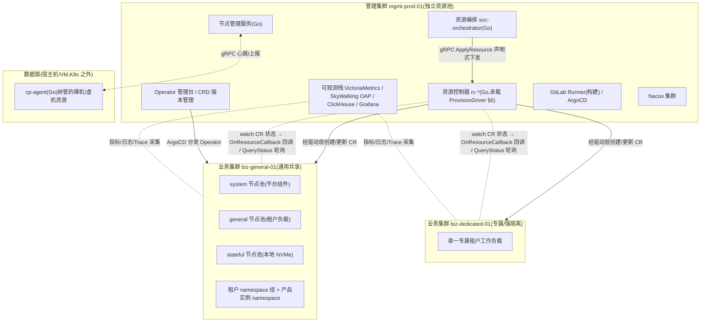
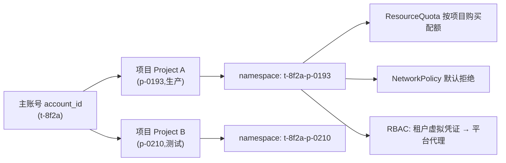
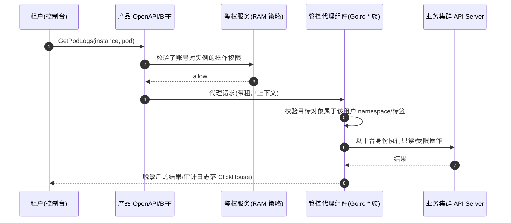
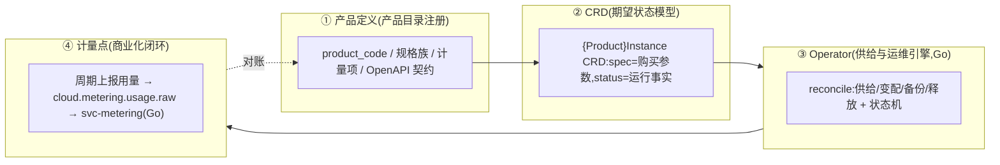
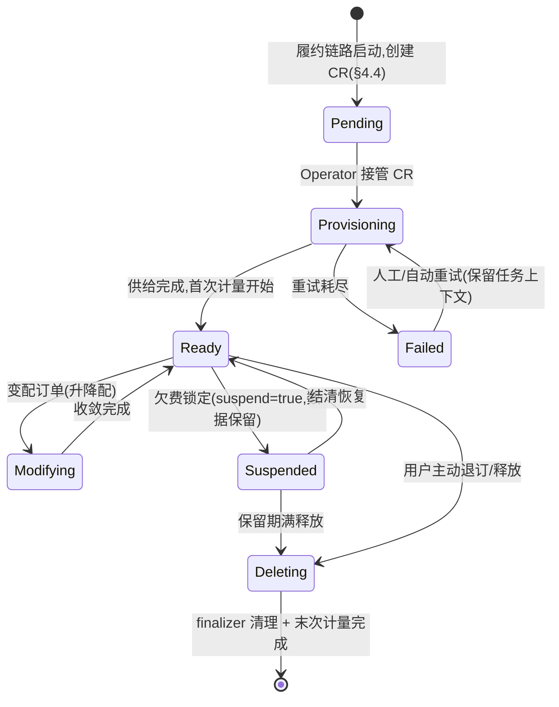
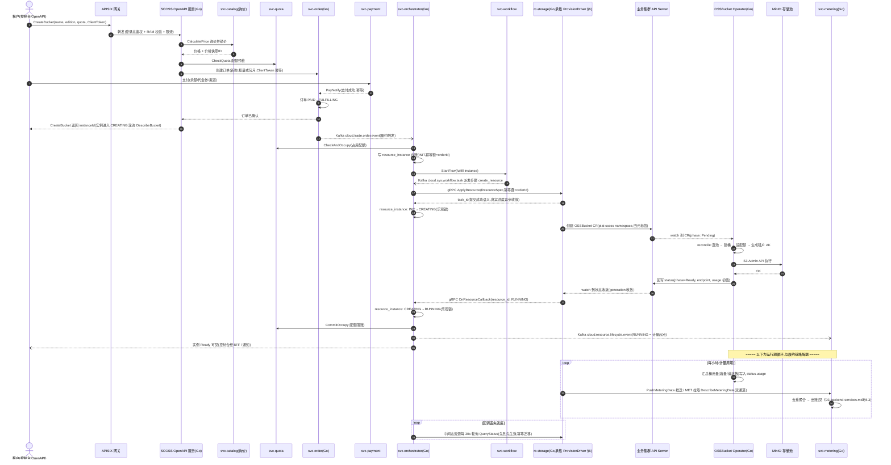
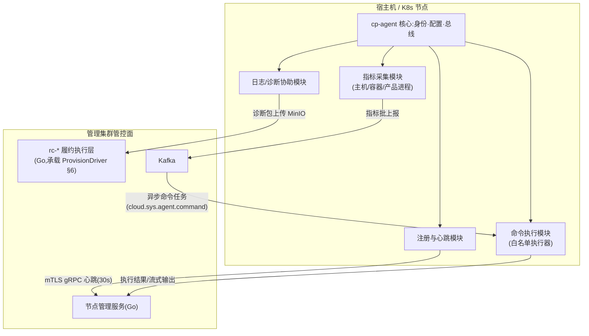
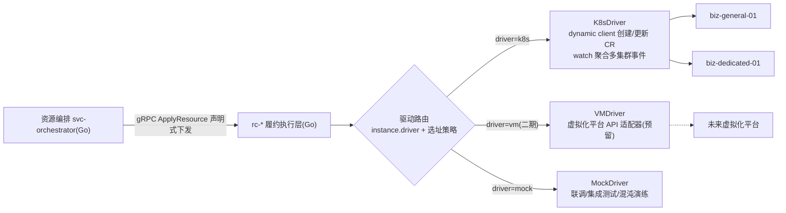
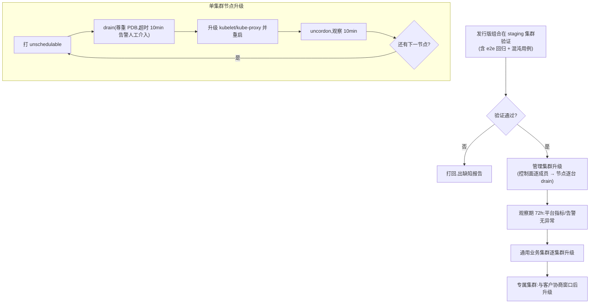

# 06 · Kubernetes 容器平台与云服务产品化

> 本章定位:整套蓝图中"把 Kubernetes 从内部基础设施升级为云产品生产线"的一章。
> 前半部分回答"平台底座怎么建"(集群规划、网络、存储、弹性、多租户),
> 后半部分回答"云产品怎么在底座上长出来"(CRD+Operator 产品化范式、数据面 Agent、驱动抽象、灾备升级、成本容量)。
>
> 阅读地图:
> - 平台全局分层视角参见《00-overview.md》;
> - 管控侧微服务(订单中心 svc-order、资源编排 svc-orchestrator、流程引擎 svc-workflow、配额 svc-quota、计量 svc-metering)与资源控制器 rc-* 的领域划分参见《03-backend-services.md》;
> - MinIO、Kafka、Nacos 等中间件自身的部署形态参见《04-middleware-infrastructure.md》;
> - 本章产出的计量数据与监控指标的落库、分析参见《05-data-observability.md》;
> - 租户鉴权、RAM 模型、证书与密钥体系参见《07-security.md》;
> - Operator 与 Agent 的构建发布流水线参见《08-devops-delivery.md》;
> - 本章演进路线与整体里程碑的对齐参见《09-roadmap.md》。

---

## 1. 设计目标与总体原则

### 1.1 本章要解决的问题

对标阿里云,ACK/ECI/轻量容器等产品背后是同一套能力:**把一个"云产品实例"变成可编程、可对账、可运维的资源对象**。自建平台要在 Kubernetes 上复刻这种能力,必须同时满足四个目标:

| 目标 | 含义 | 本章对应设计 |
|---|---|---|
| 生产化 | 任何新产品上线 = 填槽,而不是重新搭一套供给链路 | §4 CRD+Operator 产品化范式 |
| 可售卖 | 资源必须可计量、可计费、有生命周期状态机 | §4.0 履约链路统一口径、§4.3 状态机与两侧映射、§4.5 台账与部署属性 |
| 多租户 | 不同付费用户的资源互相隔离、配额可控 | §3 多租户模型 |
| 可运维 | 集群可升级、可备份、可扩缩、成本可解释 | §2.6、§7、§8 |

### 1.2 总体原则(评审口径)

1. **控制面与数据面分离**:管控组件(订单、资源编排 svc-orchestrator、rc-* 资源控制器、Operator 管理台)与租户工作负载不混布在同一资源池内;管控故障不得影响已供给的租户资源,租户负载异常不得拖垮管控。
2. **声明式到底**:从 OpenAPI 到 Operator,全链路只传递"期望状态",由 reconcile 循环收敛;禁止把一次性命令当作供给主链路。
3. **一切资源皆有归属标签**:任何被平台创建的 K8s 对象必须携带 `tenant/project/instance/product` 四元标签,配额、计量、审计、清理都依赖它。
4. **K8s 不是唯一后端**:供给链路通过驱动层抽象(§6),今天落 K8s,明天可落虚机/裸金属,管控上层不感知。
5. **语言统一遵循选型决议**:全平台后端统一 Go/Kratos;其中所有直接操作 K8s API 的组件(Operator、rc-* 资源控制器、数据面 Agent)及高频写入/数据接入型服务(计量聚合 svc-metering)用 Go/Kratos 生态。依据见《10-research-and-selection-decisions.md》§4.2 选型总表(统一 Go 分工同《03-backend-services.md》§2.2/§4.0 服务总表)。

---

## 2. K8s 平台底座

### 2.1 集群规划:管理集群 / 业务集群 / 数据面分离

**结论**:采用"1 管理集群 + N 业务集群"的分层拓扑,管理集群独立成池,业务集群按"用途 × 隔离等级"划分;数据面(租户负载、产品实例数据组件)只存在于业务集群。

**理由**:
- 管控组件(svc-orchestrator、rc-*、Operator、监控栈、CI/CD 控制面)本身是"平台的产品",需要稳定的资源保障;与租户负载混布时,租户突发会挤垮管控,形成级联故障。
- 业务集群可按隔离等级/硬件形态(通用、GPU、高内存、专属)横向切分,单集群故障半径可控(K8s 单集群规模上限、etcd 容量、升级窗口都是现实约束)。
- 与 §6 驱动层抽象天然对齐:管理集群是"管控的机房",业务集群是驱动层的"供给目标"。

**备选方案**:单集群 + namespace 分区(建设成本最低);改选条件:MVP 联调阶段(≤2 周)可临时单集群,一旦接入真实租户必须拆分。

#### 2.1.1 集群拓扑总览



#### 2.1.2 集群清单与命名规范

| 集群 | 命名 | 用途 | 控制面规格 | 说明 |
|---|---|---|---|---|
| 管理集群 | `mgmt-{env}-01` | 管控服务、平台 Operator、可观测栈、CI/CD 控制面 | 3×8C16G,etcd 独立本地 NVMe | 不承载任何租户负载 |
| 通用业务集群 | `biz-general-{n}` | 共享多租户负载、多数云产品实例 | 3×8C16G | 节点池见 §2.6.1 |
| 专属业务集群 | `biz-dedicated-{n}` | 强隔离租户(金融/合规/大客户)独享 | 3×8C16G | 一集群一租户或一租户一资源域 |
| 边缘/测试集群 | `biz-staging-01` | 预发、破坏性演练、新版本先导 | 3×4C8G | 所有升级的第一站 |

命名与标签规范(全局强制):

```yaml
# 集群级标签(打在 node 与集群元数据上)
cloud.platform/cluster: biz-general-01
cloud.platform/env: prod            # prod | staging | dev(Nacos 环境 namespace 与之一致,见《04-middleware-infrastructure.md》§4.3)
cloud.platform/iso-level: shared    # shared | dedicated
# 对象级标签(所有平台创建的 K8s 对象必须携带)
cloud.platform/tenant: t-8f2a       # 云平台主账号 ID(account_id)
cloud.platform/project: p-0193      # 项目 ID(见 §3.1)
cloud.platform/product: scoss-bucket  # 产品代码(与产品目录一致,sc 前缀)
cloud.platform/instance: scoss-cn-north-1-01-a1b2c3d4  # 实例 ID(全局唯一,费用中心对账键,见 00 附录A 资源 ID 格式)
```

> 标签是配额、计量、审计、强制清理的唯一依据。`instance` 标签缺失的对象会被巡检任务判定为"孤儿资源"并进入人工回收队列——这条纪律写进 Operator 开发规约。

### 2.2 集群构建方式

**结论**:使用 Kubespray(ansible playbook 集合)做集群引导,kubeadm 作为其底层引擎;集群清单(版本、节点池、CIDR)以 Git 仓库管理,配合 ArgoCD/GitOps 思想做变更审计。

**理由**:① 自建 IDC 没有托管控制面,二进制手搭不可复制、不可审计;② Kubespray 产出的就是标准 kubeadm 集群,无锁定;③ 与《08-devops-delivery.md》的 GitOps 主线一致,集群参数变更走 MR。

**备选**:Rancher RKE2(带 UI 的多集群管理)。改选条件:集群数量超过 10 个且需要非 SRE 角色(如交付工程师)自助建集群时引入,Rancher 仅作管理面,不改变本章集群拓扑。

### 2.3 版本策略

**结论**:平台 K8s 版本 = 上游最新 stable 的 N-1 minor,每季度一次升级窗口,**禁止跨 minor 跳升**。

| 规则 | 内容 |
|---|---|
| 版本基线 | 以 CNCF 上游为准,取 stable 的 N-1(例如上游 1.31 stable 时平台基线 1.30) |
| 升级节奏 | 每季度固定窗口;安全补丁(CVE ≥ High)走紧急通道,7 天内完成 |
| 升级顺序 | staging 先导集群 → 管理集群 → 通用业务集群 → 专属业务集群(与客户协商窗口) |
| 组件兼容矩阵 | Calico、CSI、Ingress、cert-manager、OTel Operator 等随 K8s 版本锁定为"平台发行版"组合,整包验证后才允许发布(详见 §7.2) |
| API 废弃 | 任何 manifest 不得引用已标记 deprecated 的 API;CI 流水线用 `kube-linter` + `pluto` 强制检查 |

**理由**:N-1 既享受上游大部分修复,又避开新版本头三个月的社区回归问题;季度节奏与 §7 的演练周期对齐。
**备选**:始终跟随最新 stable。改选条件:平台团队有专职 K8s 小组(≥2 人)且建立了完整的先导回归环境。

### 2.4 CNI 网络方案

**结论**:Calico(VXLAN 模式起步,具备条件后切 BGP),启用 NetworkPolicy。

**理由**:
1. §3 的多租户隔离把 NetworkPolicy 作为强制能力,Calico 原生支持且实现最成熟;
2. VXLAN 模式不依赖底层网络改造,自建 IDC 起步阶段无需动交换机;节点规模 >200 或跨机房时切 BGP 直连消除封包开销;
3. 与候选池内所有组件(无特殊网络依赖)兼容,社区问题可查。

**备选**:Cilium(eBPF,替代 kube-proxy,网络可观测性显著更好)。
**改选条件**:① 单集群 Pod 密度 >80/节点且 kube-proxy iptables 规则膨胀导致 conntrack 性能劣化;② 对租户网络流量需要 L7 级可视化/策略。迁移路径:新集群直接用 Cilium,存量集群不原地换 CNI,走 §7.3 的"新建集群迁移"路线。

**不选**:Flannel(无 NetworkPolicy,仅 PoC 可用)。

#### 2.4.1 网络平面与 CIDR 规划(示例)

| 平面 | 网段示例 | 说明 |
|---|---|---|
| 节点网 | `10.80.0.0/16` | 每集群一个 /20,物理/虚机节点地址 |
| Pod 网 | `10.128.0.0/14` 按集群切 /17 | 保证单节点 ≥254 个 Pod 地址 |
| Service 网 | `10.96.0.0/16` 按集群切 /20 | 各集群互不冲突,为多集群联邦预留 |
| LoadBalancer 池 | `10.90.0.0/22` | MetalLB(自建必备,候选池外的轻量组件)分配外部 VIP |
| 存储网 | `10.88.0.0/20` | Ceph/MinIO 数据面流量专用,与业务网物理或 VLAN 隔离 |

> 自建 IDC 没有云 LB,Service type=LoadBalancer 由 MetalLB(L2/BGP 模式)承接;此项为 K8s 生态内的必要小组件,不属于"候选池外重型组件"。

### 2.5 CSI 存储方案

**结论**:双轨制——`local-path-provisioner`(本地 NVMe,承载 etcd、Kafka broker、ClickHouse 等高 IO 有状态组件)+ Ceph RBD CSI(通用块存储 PV,供产品实例与租户负载)。对象存储统一由 MinIO 集群提供(与《04-middleware-infrastructure.md》一致),不走 CSI。

**理由**:
1. etcd/消息队列对延迟敏感,本地 NVMe 是唯一稳妥选择;local-path 简单可靠,数据冗余交给应用层副本;
2. 通用块 PV 需要"Pod 漂移后数据跟随",本地盘做不到,故引入 Ceph RBD CSI;Ceph 与选型表中"大规模统一存储时改选 Ceph"的路线一致;
3. MinIO 自身用本地盘 + 纠删码(≥4 盘,见《10-research-and-selection-decisions.md》§4.4 选型坑清单),它对外暴露 S3 协议,不需要 CSI 挂载。

**备选**:全部使用 local-path + 应用层副本(初期最简)。
**改选条件**:① 平台规模小(业务集群 ≤3 集群)且所有有状态产品都自带副本时,可推迟引入 Ceph 两个季度;② 若底层已建设 Ceph 大规模统一存储(块/文件/对象三合一),则 CSI 全部收敛到 Ceph,local-path 仅保留给 etcd。

StorageClass 清单:

| StorageClass | 后端 | reclaimPolicy | 典型用户 |
|---|---|---|---|
| `local-nvme` | local-path | Retain(平台组件)/ Delete(租户) | etcd、Kafka、ClickHouse |
| `ceph-rbd` | Ceph RBD | Delete | 产品实例数据卷、租户 PVC |
| `ceph-rbd-ssd` | Ceph RBD(SSD crush 池) | Delete | 高 IOPS 产品规格 |

### 2.6 节点池与弹性伸缩

#### 2.6.1 节点池规划(每个业务集群)

| 节点池 | taint/label | 规格 | 用途 |
|---|---|---|---|
| `system` | `taint: platform/system:NoSchedule` | 3 台 16C64G | Ingress、监控、Operator 等平台组件专用,租户不可见 |
| `general` | 无 taint | 8 台起步 32C128G | 租户无状态负载、多数产品实例 |
| `stateful` | `taint: platform/stateful:NoSchedule` | 4 台起步 16C64G + 2×NVMe | 挂 `local-nvme` 的有状态负载,反亲和强制分散 |
| `dedicated-*`(可选) | 按租户 taint | 按需 | 强隔离租户专属物理节点 |
| `gpu`(可选) | `taint: nvidia.com/gpu:NoSchedule` | 按需 | GPU 产品(见《01-product-catalog.md》演进) |

租户工作负载统一加 `nodeAffinity: general`,并用 tolerations 白名单管控——任何试图调度到 system/stateful 池的租户 Pod 在准入阶段被拒绝(§3.3 准入策略)。

#### 2.6.2 弹性伸缩三件套决策

**HPA(工作负载级)**:结论为标准启用,基于 CPU/内存 + 自定义指标(VictoriaMetrics 适配);所有平台侧无状态服务(网关、OpenAPI、管控服务)必须配置 HPA,min≥2。

**VPA(工作负载垂直)**:结论为仅用 **recommendation 模式**,不开自动 in-place 更新。理由:VPA 自动模式会驱逐重建 Pod,与多租户配额、有状态负载配合风险高;用它的推荐值每周校准各产品的 request 模板(§8.3)。

**CA(节点级)**——这是自建场景的关键差异点:

**结论**:不自建 IDC 的裸机扩缩没有云 API,因此自研一个实现 cluster-autoscaler `cloudprovider` 接口的 **节点生命周期服务(NodeLifecycleService,Go)**,把"扩容"翻译为裸机纳管/虚机创建流程;一期先实现"虚机/已有备机池"的准实时扩容,裸机 PXE 纳管作为小时级后备。

**理由**:① 直接用社区 CA 框架,保留其 scale-up/down 决策逻辑,只替换执行层;② 与 §6 驱动层复用同一套资源纳管代码;③ 自建机房物理机采购周期以周计,"实时弹性"必须建立在预留缓冲池上,而不是按需采购。

**备选**:不部署 CA,采用"容量缓冲 + 每周人工容量评审"(见 §8.2 水位红线触发人工扩容)。
**改选条件**:平台初期节点 <30 台时,CA 的复杂度收益不成比例,用缓冲池方案即可;节点 >50 台或产品化售卖弹性规格后必须上 CA。若未来底层接入公有云/成熟虚拟化平台(有标准扩缩 API),直接替换为对应官方 cloudprovider,自研适配层作废。

#### 2.6.3 扩容缓冲池规则

- `general` 池保持 **N+2 且空闲可分配 CPU ≥ 总 allocatable 的 20%** 作为缓冲;
- CA 扩容粒度:一次 +2 节点(避免单点增量),冷却 10 分钟;
- 缩容:节点可分配资源实际使用 <30% 且持续 30 分钟,先打 `unschedulable`,由 descheduler 平滑排空后下线;
- 所有扩缩动作写审计事件并发 Kafka `cloud.sys.node.lifecycle`(见 §9)。

---

## 3. 多租户模型

### 3.1 隔离等级决策

**结论**:默认采用"**namespace + ResourceQuota + LimitRange + NetworkPolicy + RBAC**"的共享集群软隔离(下称标准租户);对合规/安全要求高的客户提供"**专属集群**"强隔离商品(§3.5)。Kata/gVisor 沙箱运行时列为可选增强,不作为一期交付。

**理由**:
1. 标准租户是绝大多数用户的形态,软隔离成本最低、密度最高,配合 NetworkPolicy 与准入策略已满足"互不可见、互不干扰、配额可控"的商业承诺;
2. 真正的强隔离需求(等保三级以上、金融、大客户独占)本质是"故障域 + 审计域"隔离,namespace 无论怎么加固都无法提供,只能用独立集群;
3. 沙箱运行时(Kata)会引入额外性能损耗与运维面,等出现"多租户跑不可信代码"(如 FaaS 产品)的明确需求再引入。

**备选**:全量租户都发专属集群。不选理由:成本与集群运维数量不可接受(每集群 3 台控制面节点是固定开销)。
**改选条件**:平台定位转向只做少数大客户私有化交付时。

### 3.2 租户 ↔ 云平台账号模型映射

云平台账号体系(主账号、RAM 子账号、项目)定义见《07-security.md》,本章定义其到 K8s 对象的映射:



映射规则(强制):

| 云平台概念 | K8s 映射 | 说明 |
|---|---|---|
| 主账号(account_id) | 标签 `cloud.platform/tenant` | 不直接对应任何 K8s 对象 |
| 项目(Project) | **一个 namespace**,命名 `t-{account_id}-p-{pid}` | namespace 是配额、网络隔离、计量归属的最小单元 |
| 产品实例 | 租户 namespace 内的 CR/workload,或平台 namespace 内的共享服务实例 | 共享型产品(如托管 MQ)数据面在平台 namespace,用标签归属租户 |
| RAM 用户/角色 | **不**直接映射 K8s ServiceAccount | 租户永远不持有 kubeconfig;控制台/OpenAPI 经管控代理操作 K8s(§3.4) |
| 区域 region | 集群标签 `topology.cloud.platform/region`(取值如 `cn-north-1`,命名规范见《00-overview.md》附录A) | 一期单地域,模型预留(呼应《10-research-and-selection-decisions.md》§3.4 对标启示 6) |

> 关键决策:**租户不接触 K8s API**。租户通过产品 OpenAPI 与控制台操作自己的资源,K8s API Server 只对平台组件开放。这同时解决了租户凭证管理、审计归一、API 商业化三个问题(对标阿里云:客户也从来看不到底层编排 API)。

### 3.3 配额、限制与准入

每个租户 namespace 创建时由 TenantProvision Operator 自动生成以下对象(模板节选):

```yaml
apiVersion: v1
kind: ResourceQuota
metadata:
  name: t-8f2a-p-0193-quota
  namespace: t-8f2a-p-0193
spec:
  hard:
    requests.cpu: "32"          # 由订单系统购买的配额驱动,可在线变配
    requests.memory: 96Gi
    limits.cpu: "48"            # 允许 limit 超卖,比例受 §8.3 红线约束
    limits.memory: 96Gi         # 内存不超卖
    pods: "120"
    persistentvolumeclaims: "20"
    requests.storage: 2Ti
    services.loadbalancers: "2"
---
apiVersion: v1
kind: LimitRange
metadata:
  name: defaults
  namespace: t-8f2a-p-0193
spec:
  limits:
  - default: { cpu: "1", memory: 2Gi }        # 忘写 limit 的兜底
    defaultRequest: { cpu: 200m, memory: 512Mi }
    type: Container
---
apiVersion: networking.k8s.io/v1
kind: NetworkPolicy
metadata:
  name: default-deny-cross-tenant
  namespace: t-8f2a-p-0193
spec:
  podSelector: {}
  policyTypes: [Ingress, Egress]
  ingress:
  - from:                                    # 仅允许同 namespace 与平台组件
    - podSelector: {}
    - namespaceSelector:
        matchLabels: { cloud.platform/role: platform }
  egress:
  - to:
    - podSelector: {}
    - namespaceSelector:
        matchLabels: { kubernetes.io/metadata.name: kube-system }  # DNS
```

配额变更链路:**费用中心变配订单 → svc-order → svc-orchestrator 履约派发(§4.0 口径)→ rc-* → TenantProvision Operator 更新 ResourceQuota**,全程无租户参与。配额超限时的用户可见错误码、文案由 OpenAPI 层统一包装,禁止直接透传 K8s 原始报错(产品化体验要求)。

准入控制(ValidatingAdmissionPolicy / 自研准入 webhook,二选一,一期用后者):
1. 租户 namespace 内 Pod 必须带四元标签(§2.1.2),否则拒绝;
2. 禁止 hostPath/hostNetwork/privileged(平台组件 namespace 豁免);
3. 镜像必须来自平台镜像仓库(ACR 自建等价物,见《08-devops-delivery.md》),阻止任意外部镜像;
4. 强制 `runAsNonRoot`(一期 warning,二期 reject)。

### 3.4 租户操作的代理模型

租户"登录控制台查看 Pod 日志/执行诊断"这类需求,通过**管控代理通道**实现,而非下发 kubeconfig:



该通道同时是 §5 Agent 命令下发与"容器终端/日志查看"功能的统一入口,所有操作过审计(参见《07-security.md》操作审计要求)。

### 3.5 专属集群(强隔离商品)

- 售卖形态:专属集群 = 独享控制面 + 独享节点池,按"集群管理费 + 节点费"计费(对标 ACK 专属版);
- 技术形态:`biz-dedicated-{n}` 集群,管控多集群纳管(同一套 rc-* 驱动层接入多个 kubeconfig,凭据存 KMS,见《07-security.md》);
- 约束:专属集群的 K8s 版本必须与平台基线一致,不接受客户自定义版本(降低运维矩阵);
- 升级窗口需与客户协商,走 §7.2 流程并输出升级报告。

---

## 4. 云服务产品化的通用范式(本章核心)

### 4.0 履约/供给链路统一口径(全书收敛,评审裁定)

履约/供给链路是全书第一跨章链路,本章与《00-overview.md》《01-product-catalog.md》《03-backend-services.md》已收敛为同一口径(以《00-overview.md》§2.3.1 与《03-backend-services.md》§4.3/§5.3 为准),本章内容按收敛后口径描述:

| 收敛项 | 结论 |
|---|---|
| 服务命名 | 本章初稿的"资源管控 / resource-center"即 **svc-orchestrator**(资源编排与生命周期,Go,《03-backend-services.md》§4.3.1),全书不再另设同名服务;"provision-bridge"收敛为 **rc-* 资源控制器**(rc-compute / rc-storage / rc-network…,Go,《03-backend-services.md》§4.3.4)内的履约执行层,即本章 §6 ProvisionDriver 抽象的承载者 |
| 实例台账 | 唯一台账为 `resource_instance`(svc-orchestrator 持有,表结构见《03-backend-services.md》§6.2);本章初稿的 `product_instance` 表废弃;产品私有属性进 `resource_instance_attr` KV 扩展表与 CR spec(§4.5) |
| 状态机事实源 | 平台级资源状态机(INIT/CREATING/RUNNING/…)**仅由 svc-orchestrator 写入**,是计费、控制台、审计口径;K8s CR `status.phase` 是**数据面运行事实**,经 rc-* 回调/轮询上送;两者以固定映射(§4.3)+ 超时兜底 + 每日对账收敛,而非互为镜像 |
| 下发通道 | gRPC 声明式下发 + 回调/轮询双保险(决策见下) |

**下发通道决策**:

- **结论**:svc-orchestrator → rc-* 同步调用 `ApplyResource(ResourceSpec)` 声明式下发("提交成功"语义,真实进度异步收敛);rc-* watch CR 收敛后经 gRPC `OnResourceCallback` 上报;svc-orchestrator 对中间态资源每 30s 轮询 `QueryStatus` 兜底(先到先生效,幂等迁移);超时与补偿调度统一由 svc-workflow 定时器驱动。Kafka **不承载发往 rc-* 的资源供给指令**(本章初稿的 `provision.task`/`provision.status` topic 仅作异步回调与重试通道,非主下发通道,见 §9),只承载域事件(`cloud.trade.order.event`/`cloud.sys.workflow.task`/`cloud.resource.lifecycle.event`)与计量数据;其中 `cloud.sys.workflow.task` 是 svc-workflow 与执行器 svc-orchestrator 之间的流程调度消息,不是对 rc-* 的资源指令。
- **理由**:① 下发语义天然声明式且幂等,同步 gRPC 失败面更清晰,重试与状态修复统一收敛在编排侧,避免"指令在 MQ、任务状态在 bridge、CR 状态在 etcd"的三处状态源;② 零新增组件,与《03-backend-services.md》§4.3.4 接口契约、§5.3 端到端时序一致;③ 回调丢失有轮询兜底、每日全量对账闭环(《03-backend-services.md》§8),可靠性不依赖任务队列削峰。
- **备选方案**:供给指令经 Kafka 任务 topic(`cloud.resource.provision.task`)由 rc-* 异步消费(即本章初稿方案,完全削峰解耦)。
- **改选条件**:出现跨地域跨网下发(同步 gRPC 跨网时延/可用性不达标),或供给指令峰值达万级 QPS 需与编排器彻底解耦时,启用任务 topic 通道;`ApplyResource` 接口语义不变,仅更换传输层。

> **口径说明**:《01-product-catalog.md》§6.2 中"资源编排调用产品 OpenAPI 开通资源"是产品视角表述。自研产品的履约走内部 svc-orchestrator → rc-* 通道,不绕行产品 OpenAPI;产品 OpenAPI 是租户侧接口(§3.2"租户不接触 K8s API")。仅未来生态/三方(市场 ISV)产品按回调其 OpenAPI 方式履约。

### 4.1 范式总纲:一个云产品 = 四个构件

任何要上架的云产品(对象存储桶、托管 Redis、消息队列……)必须交付四个构件,缺一不得上架。这条规范与《01-product-catalog.md》的"产品 = 资源类型 + 计量项 + API"注册规范互为表里。



四条铁律:
1. **CRD 是唯一事实接口**:管控不 SSH、不直连产品内部组件改配置;一切变更 = 改 CR spec。
2. **status 必须可机读**:phase + conditions 结构化,管控据此驱动订单状态与用户通知,禁止解析日志判断状态。
3. **Operator 必须幂等且可重入**:reconcile 随时被重复触发;任何中间步骤失败可从当前状态继续。
4. **计量缺失即不可上架**:计量项在 CRD status 中必须有一等公民字段(如 `status.usage`),Operator 负责维护,采集器负责搬运。

### 4.2 CRD 设计统一规约

所有产品 CRD 遵循同一骨架(以虚构的通用字段约束表达):

```yaml
apiVersion: products.cloud.platform/v1
kind: {Product}Instance            # 命名规范:{Product}Instance,复数小写
metadata:
  name: scoss-cn-north-1-01-a1b2c3d4  # = 平台实例 ID,全局唯一(资源 ID 格式见 00 附录A)
  namespace: plat-scoss              # 共享型产品数据面统一放 plat-{product}
  labels:                          # 四元标签强制(§2.1.2)
    cloud.platform/tenant: t-8f2a
    cloud.platform/project: p-0193
    cloud.platform/product: scoss-bucket
    cloud.platform/instance: scoss-cn-north-1-01-a1b2c3d4
spec:
  edition: standard                # 规格族,只能取产品目录注册过的枚举
  params: { ... }                  # 购买参数(与 OpenAPI 创建入参一一对应)
  suspend: false                   # 欠费停服开关:管控置 true,Operator 冻结服务但保留数据
status:
  phase: Ready                     # Pending|Provisioning|Ready|Modifying|Suspended|Failed|Deleting
  observedGeneration: 12
  usage: { ... }                   # 计量项一等公民(容量/请求数/连接数等)
  endpoints: [ ... ]               # 供 OpenAPI 回显给租户
  conditions:
  - type: Provisioned
    status: "True"
    reason: BucketCreated
    lastTransitionTime: "..."
```

统一约定:
- **finalizer**:`products.cloud.platform/cleanup`。删除 CR 时 Operator 先做资源回收 + 末次计量上报,再摘 finalizer;管控侧释放流程以"CR 真正消失"作为释放完成信号;
- **suspend 语义**:对应欠费生命周期(参数以《01-product-catalog.md》§5.4 决策 D8 为唯一事实源)——`suspend=true` 时 Operator 冻结服务(拒绝访问、停对外端口)但**绝不删数据**,与"宽限期 24h(大客户 72h)→停服锁定保留 30 天→到期释放(包年包月到期保留 15 天;续费提醒 30/15/7/3/1 天;释放前 24h 终版通知)"状态机一一对应(§4.3 状态机);
- **generation/observedGeneration**:管控与 Operator 判断"变更是否收敛"的唯一依据,变配工单据此闭环;
- **版本演进**:CRD 遵循 K8s API 版本规范,破坏性变更必须走 v1→v2 双版本 + conversion webhook,存量 CR 由管控批量迁移。

### 4.3 实例生命周期状态机

实例状态机横跨平台域与 K8s 域(对标《10-research-and-selection-decisions.md》§3.4 对标启示 8"资源生命周期状态机不可省")。本节状态图描述 **K8s CR `status.phase`(数据面运行事实)**;平台级状态机(INIT/CREATING/RUNNING/…,计费/控制台口径)及其治理规则(乐观锁、超时兜底、终态不可逆)统一定义在《03-backend-services.md》§5.2,**仅由 svc-orchestrator 写入**。两侧映射与同步纪律见下:



**两侧状态映射(与《03-backend-services.md》§5.2 平台状态机对齐)**:

| K8s CR `status.phase`(数据面运行事实) | 平台 `resource_instance.status`(计费/控制台口径,仅 svc-orchestrator 写入) |
|---|---|
| Pending | INIT / CREATING |
| Provisioning | CREATING / UPGRADING |
| Ready | RUNNING |
| Modifying | UPGRADING |
| Suspended | LOCKED / EXPIRED |
| Failed | CREATE_FAILED |
| Deleting | RELEASING |
| (CR 消失且 finalizer 完成) | RELEASED |

同步纪律:

1. rc-* 将 CR phase 变化转为平台状态事件,经 gRPC `OnResourceCallback` 上报,svc-orchestrator 校验(上表映射 + 乐观锁)后幂等迁移;
2. 回调丢失兜底:svc-orchestrator 对中间态资源每 30s 轮询 `rc.QueryStatus`;中间态超时(CREATING 15min / UPGRADING 30min / RELEASING 30min)由 svc-workflow 定时器统一驱动;
3. 每日全量对账:`resource_instance.status` vs `rc.QueryStatus`,差异驱动状态修复,报表入 ClickHouse;
4. CR 丢失(etcd 灾难/误删)是唯一"台账为准"的场景:触发"台账孤儿"人工流程,先按 `resource_instance` 规格快照 + 订单参数重建 CR,无法重建则转释放与补偿。

### 4.4 完整示例:对象存储桶服务(OSSBucket)从下单到计量

选择对象存储桶作为贯穿示例,因为它依赖已选型的 MinIO(见《04-middleware-infrastructure.md》),复杂度适中且链路完整。托管 Redis/RDS 类产品范式相同,只是 Operator 内部供给动作换成了"创建主从实例 + 备份策略"。

供给侧前提:平台预先部署 MinIO 多集群(Tenant 模式),每个 MinIO Tenant 是一个 CR(MinIO Operator 提供),资源池以存储池(bucket pool)为单位预供给。OSSBucket Operator 只负责在池内开桶、配配额、发凭证,**不**每单新建 MinIO 集群——这是"资源池化预供给 + 轻量实例供给"的两级模型,保证开桶秒级完成。



要点说明:
1. **CreateBucket 是同步下单 + 异步供给**:OpenAPI 在订单确认后即返回 `instanceId`,实例进入 `CREATING`(平台状态机口径,§4.3),客户端轮询 `DescribeBucket` 获取 Ready——与公有云 API 体验一致;状态展示统一以 svc-orchestrator 的 `resource_instance.status` 为准,不直接透传 CR phase;
2. **链路参与方与《03-backend-services.md》§5.3 端到端时序完全一致**:询价(svc-catalog)→ 配额预检/占用(svc-quota)→ 订单(svc-order)→ 事件驱动编排(svc-orchestrator)→ 流程步骤派发(svc-workflow)→ gRPC 声明式下发(rc-storage)→ Operator 收敛 → 回调迁移状态。控制台入口的询价与下单经 console-bff(Go),本例为 OpenAPI 入口由产品 OpenAPI 服务直连,两入口共用同一询价引擎(《01-product-catalog.md》决策 D3"四入口同源询价"防资损);
3. **计量不信任旁路采集**:桶用量由 Operator 直接向 MinIO 查询并写 `status.usage`,由 rc-* 推送 / svc-metering 拉取双通道搬运(《03-backend-services.md》§4.3.4 `DescribeMeteringData` 接口),保证"计量数字与供给方同源",避免出账对不上;
4. **失败路径**:Operator reconcile 失败将 `phase=Failed` + condition 写回;rc-* 回调上报后,svc-orchestrator 在 svc-workflow 中将该步骤标记失败并走重试/补偿(《03-backend-services.md》§4.3.3、§8.4);补偿耗尽则订单侧支持"供给失败自动退款"(svc-order 职责,与《00-overview.md》§2.3.1 口径一致)。

### 4.5 管控侧核心表结构(示例)

> **台账事实源说明**:全平台资源台账唯一为 `resource_instance`(由 svc-orchestrator 持有,表结构见《03-backend-services.md》§6.2),分库分表策略(按 `account_id` 单键分片,垂直四库 account_db/trade_db/resource_db/metering_db,水平 account_db 4×16、trade/resource/metering_db 8×16 起步,Vitess)参见《04-middleware-infrastructure.md》§6.3 与《03-backend-services.md》§6。本章初稿的 `product_instance` 表**已废弃并合并至 `resource_instance`**;产品私有属性进 `resource_instance_attr` KV 扩展表与 CR spec。下方仅展示 rc-* 侧的供给任务表(仍归 svc-orchestrator/履约执行层维护)。

```sql
-- 供给/运维任务:一切对 CR 的写操作都必须先落任务(可追溯、可重试)
-- 注:实例台账统一使用 resource_instance(见《03-backend-services.md》§6.2),不在本章重复定义。
CREATE TABLE provision_task (
  id            BIGINT PRIMARY KEY AUTO_INCREMENT,
  task_id       VARCHAR(32) NOT NULL,
  instance_id   VARCHAR(32) NOT NULL COMMENT '对应 resource_instance.instance_id',
  account_id    VARCHAR(32) NOT NULL COMMENT '租户主键(分片键,见《03》§6.2/《04》§6.3)',
  op_type       VARCHAR(16) NOT NULL COMMENT 'CREATE|MODIFY|SUSPEND|RESUME|DELETE',
  idempot_key   VARCHAR(64) NOT NULL COMMENT '幂等键,通常为 orderId',
  params_json   JSON,
  status        VARCHAR(16) NOT NULL COMMENT 'INIT|DISPATCHED|DONE|FAILED|RETRYING',
  retry_count   INT NOT NULL DEFAULT 0,
  last_error    VARCHAR(1024),
  created_at    DATETIME NOT NULL,
  finished_at   DATETIME NULL,
  UNIQUE KEY uk_task (task_id),
  UNIQUE KEY uk_idem (idempot_key),
  KEY idx_inst (instance_id, status),
  KEY idx_account (account_id)
) COMMENT '供给任务表(台账以 resource_instance 为准,见 03§6.2)';
```

### 4.6 Operator 工程规范

- **脚手架**:kubebuilder + controller-runtime;每个产品一个独立 Operator 进程(独立 Deployment,独立故障域),统一由 ArgoCD App-of-Apps 分发(见《08-devops-delivery.md》);
- **语言**:Go(与《10-research-and-selection-decisions.md》§4.2 选型总表一致——"K8s operator 与运维工具"归 Go 分工);
- **并发与限速**:reconcile worker 默认 4,对底层资源(MinIO/DB)的写操作加令牌桶限流,防止订单洪峰打穿存储控制面;
- **可观测**:Operator 自身暴露 `/metrics`(reconcile 延迟、失败率、队列深度),接平台 VictoriaMetrics;关键 reconcile 带 OTel trace,经 SkyWalking OAP(trace-ES 存储,见《05-data-observability.md》);
- **准入与测试**:每个 Operator 必须提供 envtest 集成测试 + "断网重连恢复"混沌用例(CI 中跑 API Server 故障注入);
- **发布**:CRD 先于 Operator 发布(CRD 由平台组评审合入独立仓库),Operator 灰度顺序 staging→管理集群→业务集群。

---

## 5. 数据面代理 Agent(cp-agent)设计

### 5.1 定位

cp-agent 是运行在**每台被纳管主机**(K8s 节点以 DaemonSet 部署;未来虚机/裸机以 systemd 常驻)的 Go 代理,是平台在数据面的"手和眼"。它与 Operator 的分工:

| 维度 | Operator | cp-agent |
|---|---|---|
| 作用对象 | K8s CR/资源 | 宿主机、OS 层、K8s 之外的资源 |
| 触发方式 | watch CR 变化 | 心跳周期 + 管控下发命令 |
| 典型职责 | 供给/变配/释放产品实例 | 主机纳管、指标采集、命令执行、日志协助 |

**结论**:cp-agent 用 Go 实现,框架选型贴合 Kratos 生态(自研 daemon,不强依赖 Kratos 服务框架,但复用其错误码/配置/日志规范);单一二进制、按启动参数启用模块。
**理由**:符合选型决议(《10-research-and-selection-decisions.md》§4.2)中 Go 负责"数据接入、运维工具"的分工;单二进制便于裸机场景分发。
**备选**:用成熟开源 agent 拼装(node_exporter + Telegraf + 自研命令通道)。改选条件:若命令执行与纳管需求退化到"只要指标",可直接用开源组合减少自研面。

### 5.2 模块架构



各模块职责:

1. **注册与心跳**:首次启动用"一次性纳管令牌"(由节点管理服务签发,见《07-security.md》)换取 agent 证书(mTLS,平台 CA 签发,90 天轮换);心跳携带主机指纹(序列号/内核/IP/池标签),心跳丢失 3 周期触发节点 NotReady 运维事件;
2. **指标采集**:采集主机指标(CPU/内存/磁盘/网络,与 node_exporter 指标语义兼容)与**产品进程级计量指标**(按四元标签归类);出口两条:主机计量走 Kafka `cloud.sys.host.metrics`、产品计量走 `cloud.metering.usage.raw`,统一由 svc-metering(Go)消费后 remote write 到 VictoriaMetrics(§5.4);
3. **命令执行**:白名单制——agent 内置命令清单(版本化),管控只能下发"清单内命令 + 参数";参数经 agent 二次校验;所有执行生成审计记录(who/when/cmd/exit)上报 ClickHouse;危险命令(重启/删数据)要求双人审批令牌;
4. **日志/诊断协助**:按需抓取指定路径日志、内核 dmesg、产品进程堆栈,打包上传 MinIO 临时桶(预签名,24h 过期),供工单系统(参见《01-product-catalog.md》§4.5 支持计划)取用。

### 5.3 通道与安全决策

**结论**:心跳/结果回传走 **mTLS gRPC 长连接**(agent → 节点管理服务,经内网 LB);大体量异步命令任务经 **Kafka** 解耦;agent 永不监听入站端口(全出向连接,简化宿主机防火墙)。
**理由**:① 出向连接模型天然穿透 NAT/防火墙,裸机纳管场景最稳;② Kafka 承接命令洪峰(如全网补丁下发)并天然重试;③ 心跳走低延迟 gRPC,命令走削峰 Kafka,各取所长。
**备选**:全走 Kafka(含心跳)。改选条件:节点规模 <500 且无批量命令洪峰时可简化为全 Kafka 单通道。

安全红线(与《07-security.md》会签):
- agent 证书绑定主机指纹,证书与指纹不匹配即拒绝;
- 命令白名单外请求直接拒绝并上报安全事件;
- agent 不持有租户数据访问权限,诊断包上传用一次性预签名;
- agent 自更新走平台镜像/包仓库 + 签名校验,禁止手工替换。

### 5.4 Agent 数据出口规划

| 数据 | 出口 | 目标 | topic/端点 |
|---|---|---|---|
| 心跳/主机状态 | gRPC | 节点管理服务 | — |
| 主机计量指标 | Kafka | svc-metering(Go)→ VictoriaMetrics remote write | `cloud.sys.host.metrics` |
| 产品进程计量 | Kafka | svc-metering(Go) | `cloud.metering.usage.raw` |
| 异步命令任务 | Kafka | cp-agent 命令执行模块 | `cloud.sys.agent.command` |
| 命令结果 | gRPC 流式 | 节点管理服务 | — |
| 审计记录 | Kafka | ClickHouse 审计库 | `cloud.sys.audit.agent` |
| 诊断包 | HTTPS | MinIO 临时桶 | 预签名 URL |

> topic 命名一律遵循 `cloud.{domain}.{aggregate}.{event}` 规范,以《04-middleware-infrastructure.md》§5.4 清单为唯一事实源。

---

## 6. 资源供给驱动抽象

### 6.1 为什么需要驱动层

svc-orchestrator 若直接调用 client-go,则未来接入虚机(OpenStack 或自研虚拟化)、裸金属时整个供给链路要重写。参照《10-research-and-selection-decisions.md》§3.4 对标启示 7(MVP 先虚机/容器,虚拟化后置),**模型必须现在预留,实现可以后做**——这正是驱动层的目的。

### 6.2 驱动接口定义(Go)

```go
// 供给驱动:svc-orchestrator/rc-* 对"资源后端"的唯一抽象。
// 实现必须满足:幂等(同 idempotencyKey 重复调用结果一致)、
// 无状态(所有事实从 Query/Watch 重新获取)、可并发。
type ProvisionDriver interface {
    Name() string                      // "k8s" | "vm" | "mock"
    Capabilities() Capability          // 支持的操作集(CREATE/RESIZE/SUSPEND...)

    // 同步语义均为"提交成功",真实进度经 Watch 回传
    Create(ctx context.Context, req CreateRequest) (ref ResourceRef, err error)
    Modify(ctx context.Context, ref ResourceRef, spec InstanceSpec) error
    Suspend(ctx context.Context, ref ResourceRef) error   // 欠费锁定,保留数据
    Resume(ctx context.Context, ref ResourceRef) error
    Delete(ctx context.Context, ref ResourceRef) error    // 最终释放(含清理确认)
    Query(ctx context.Context, ref ResourceRef) (ResourceStatus, error)

    // 状态事件流:后端 phase 变化 → 统一事件,屏蔽 CR/虚机 API 差异
    Watch(ctx context.Context, sel ResourceSelector) (<-chan StatusEvent, error)
}

type ResourceRef struct {
    Driver    string  // k8s | vm
    ClusterID string  // k8s: 业务集群;vm: 虚拟化集群
    Namespace string  // k8s 专用
    Name      string  // 实例 ID
}

type StatusEvent struct {
    InstanceID string
    Phase      Phase      // 与 §4.3 状态机对齐
    Usage      UsageMap   // 计量项(若后端可给)
    Reason     string
    OccurredAt time.Time
}
```

### 6.3 驱动实现与路由



> 注:主下发通道为 gRPC 声明式下发(经 svc-workflow 派发步骤),rc-* 写 CR;Kafka `cloud.resource.provision.task`/`cloud.resource.provision.status` 仅作异步回调与重试通道,非主下发通道(见 §4.0)。

- **K8sDriver**:把 `InstanceSpec` 渲染为对应产品 CRD 的 CR(渲染模板随产品注册进产品目录),经各集群 ServiceAccount(最小权限:仅 plat-* namespace 的对应 CRD)操作;Watch 由每集群一个 informer 汇聚为统一 StatusEvent 流;
- **选址策略**(选哪个业务集群):资源水位 + 隔离等级 + 亲和规则,由选址器独立组件承载,规则在 Nacos 配置;
- **VMDriver**:接口已冻结,实现留桩;未来对接虚拟化平台时新增一个实现并在产品目录声明 `driver: vm` 即可,管控上层零改动;
- **MockDriver**:在 staging 模拟完整状态机(含随机失败注入),所有新产品上架前必须在 MockDriver 上跑通供给全链路测试——这是"产品化范式"的验收门槛。

---

## 7. 灾备与升级

### 7.1 etcd 备份与恢复

**结论**:etcd 全量快照 **每 6 小时一次 + 每日异地副本 + 保留 30 天**,快照加密后存 MinIO 独立备份桶(与业务数据桶物理隔离的 MinIO 集群);**每季度至少一次真实恢复演练**(恢复到隔离集群并校验资源清单一致性)。

| 项 | 规则 |
|---|---|
| 备份工具 | etcdctl snapshot + 自研备份 CronJob(管理集群),执行结果发 Kafka `cloud.sys.etcd.backup` 并告警 |
| 校验 | 每次快照自动在沙箱 etcd 实例 restore 校验可打开(防"备份了个寂寞") |
| 异地 | 每日最新快照同步至第二可用区(P2 起,同城双 AZ;见《00-overview.md》§4.2 部署三阶段)MinIO;一期(P1 单机房单 AZ)至少跨机架存储池 |
| 恢复 RTO | 目标 <1h(含集群拉起与校验),演练实测值每季度更新 |
| 附加 | 管理集群 etcd 开启自动碎片化(defrag 窗口:业务低峰,逐成员执行) |

**理由**:etcd 是 K8s 唯一持久化事实源,其备份成熟方案就是快照,无需引入额外组件。
**备选**:etcd 跨集群实时复制(federation 级容灾)。改选条件:平台提供"管控面 SLA 99.99%"商业化承诺且具备同城双 AZ 低延迟专线(P2 起)时再评估。

### 7.2 K8s 集群升级策略

**结论**:滚动升级为主,严格"先导 → 管理 → 业务"顺序;升级以"平台发行版包"(K8s 版本 + Calico + CSI + Ingress + 监控组件的锁定组合)为单位整体推进,禁止单组件散升。

升级标准流程:



配套纪律:
1. 所有平台组件 Deployment 必须满足:PDB(minAvailable)、副本 ≥2 且跨节点反亲和、`maxUnavailable=0` 滚动策略——升级前 CI 用策略扫描强制检查;
2. 业务集群升级期间冻结该集群的所有供给变更(管控侧"集群维护模式"开关),避免 reconcile 与 drain 打架;
3. 升级失败回滚原则:控制面组件可回退一个 minor 内的补丁版本;**跨 minor 升级不回滚**——一旦跨过即向前修复,这通过"观察期"制度保障;
4. 每次升级产出《升级报告》(变更清单、异常、耗时),归档至运维知识库。

### 7.3 业务负载的滚动 / 蓝绿决策

| 场景 | 策略 | 说明 |
|---|---|---|
| 平台组件版本更新 | 滚动(GitOps 声明式) | ArgoCD 自动同步 + 分批(先 staging 后 prod,见《08-devops-delivery.md》) |
| 平台组件重大变更 | 蓝绿(双 Deployment 切流) | 经 APISIX 上游权重切换,秒级回滚 |
| 集群级重大故障/跨版本迁移 | 新建集群 + 实例迁移 | 不在原集群做高风险手术:新建 `biz-general-{n+1}`,产品实例逐个"重建式迁移"(CR 重放 + 数据搬迁),旧集群退役 |
| 租户自身负载 | 平台不管 | 通过产品能力(如容器服务的发布管理)提供给租户,见《06》产品演进 |

"重建式迁移"之所以可行,正是 §4 范式的红利:**实例的期望状态完整保存在 CR spec 与实例台账中**,迁移 = 在新集群重放供给任务 + 数据卷同步,而不是现场抢救。

### 7.4 管控自身的高可用

- 管理集群组件:APISIX/Nacos/Kafka/管控服务全部 ≥2 副本 + 反亲和,PriorityClass `platform-critical` 保证资源紧张时优先;
- 管控对业务集群的连接断开时:业务集群内已供给实例**不受任何影响**(Operator 本地自治),仅供给/变更链路降级,管控侧显示"集群失联"并告警;
- 每季度一次"管理集群整体宕机"演练:验证业务数据面零影响 + 管控 RTO 达标。

---

## 8. 成本与容量

### 8.1 节点规格规划

| 集群/池 | 节点规格(起步) | 数量 | 说明 |
|---|---|---|---|
| mgmt 控制面 | 8C16G + 200G NVMe | 3 | etcd 独立盘 |
| mgmt worker | 16C64G | 3 | 管控服务/监控栈 |
| biz system 池 | 16C64G | 3/集群 | 平台组件 |
| biz general 池 | 32C128G | 8/集群 | 标准售卖单元,优先单机 128G 提高装箱率 |
| biz stateful 池 | 16C64G + 2×1.9T NVMe | 4/集群 | 本地盘机型 |
| 缓冲备机 | 同 general | 2/地域 | CA 扩容来源,平时跑低优批处理 |

规格决策理由:32C128G 是"装箱率/故障域/采购通用性"的平衡点——节点过小则 Pod 密度与碎片率差,过大则单节点故障驱逐代价高;有状态池用 16C 小机型 + 大 NVMe,匹配"盘贵 CPU 闲"的实际画像。一期规模基线以《09-roadmap.md》§3.4"一期规模假设基线表"为唯一事实源(K8s 业务节点 6–10 台 32C128G;管理集群 3 master + 3 worker;微服务数 17,二/三期扩至 50+)。

### 8.2 容量估算模型

供给容量以 **request 口径**核算(不超卖部分),公式:

```
所需节点数 = ceil( Σ租户购买配额(request口径) × 冗余系数1.3 / (单节点可分配 × 装箱率0.7) ) + 控制面/系统池固定开销
```

运营规则:
- **水位红线**:集群 request 水位(已分配/可分配)>70% 触发扩容流程(CA 自动或人工);>85% 冻结该集群新供给并告警升级;
- **实际利用率**:CPU 实际使用 >70%(15 分钟均值)触发 HPA/限流检查,>85% 视为容量事故(说明 request 模板失真,回 §8.3 校准);
- 每周容量报表(VictoriaMetrics + ClickHouse 产出,见《05-data-observability.md》):各池水位、TOP 租户、request 与实际使用的偏差率——偏差率是规格定价是否合理的直接证据,反馈给《01-product-catalog.md》定价页。

### 8.3 超卖策略与红线

**结论**:**CPU 允许 limit 层超卖、request 层不超卖;内存一律不超卖。**

| 资源 | request | limit | 说明 |
|---|---|---|---|
| CPU | 严格按售卖分配(配额即 request) | 允许 limit = 1.5 × request(标准池) | 用户空闲时互相借用 CPU 时间片,符合云主机"基准性能"商业模型 |
| 内存 | 严格,limit = request | 不超卖 | 内存超卖触发 OOM Kill,直接损害商业信任 |
| 磁盘 | PVC 严格 | — | 容量型告警阈值 80% |

配套机制:
1. **PriorityClass**:`platform-critical`(平台组件)> `tenant-paid`(付费负载)> `batch-low`(内部批处理/缓冲池填充);节点压力时按优先级驱逐;
2. **准入强制**:租户 Pod 若 limit/request 比值超过池策略(1.5)直接拒绝,防止个别用户把超卖空间吃光;
3. **规格模板校准**:VPA recommendation 周报驱动各产品规格模板的 request 值修正——超卖的本质风险是"模板 request 低估",用数据闭环而非拍脑袋;
4. **红线告警**:节点内存 >80%、CPU load 异常、磁盘 IO 饱和均接入对客告警通道(05 方案:租户 agent 直推 VictoriaMetrics,alert-engine(Go)+alert-center(Go)评估走对客通道,见《05-data-observability.md》§8/§9)并定义 SLO。

演进开关:当售卖"突发性能型"规格(对标阿里云 t 系列)时,才考虑引入 CPU 积分制限流(APISIX/自研 cgroup 控制器),一期不做。

---

## 9. 本章相关 Kafka Topic 规划

> topic 命名一律遵循 `cloud.{domain}.{aggregate}.{event}` 规范,环境隔离靠集群隔离(topic 不含环境前缀),分区数以《04-middleware-infrastructure.md》§5.4 清单为唯一事实源。下表为本章产生/消费的 topic(口径已与《03-backend-services.md》§7、《05-data-observability.md》§4.1、《07-security.md》§6.2 对齐):

| Topic | 生产者 | 消费者 | 分区键 | 说明 |
|---|---|---|---|---|
| `cloud.resource.provision.task` | svc-orchestrator | rc-* 履约执行层 | instance_id | 供给/变配/释放任务;**仅作异步回调与重试通道,非主下发通道**(主下发为 gRPC 声明式下发,见 §4.0) |
| `cloud.resource.provision.status` | rc-* 履约执行层 | svc-orchestrator、通知服务 | instance_id | CR phase 变更事件(异步回调) |
| `cloud.metering.usage.raw` | rc-*/Operator | svc-metering | resource_id | 产品计量(计量原始流,见《04》§5.4) |
| `cloud.sys.host.metrics` | cp-agent | svc-metering / 监控 | node_id | 主机指标(计量口径) |
| `cloud.sys.agent.command` | 节点管理服务 | cp-agent | node_id | 下发至宿主 cp-agent 的异步命令任务(白名单命令,见 §5.2/§5.3) |
| `cloud.sys.workflow.task` | svc-workflow | svc-orchestrator | flow_instance_id | 流程步骤派发(create_resource 等);**仅作流程调度,非对 rc-* 资源指令** |
| `cloud.resource.lifecycle.event` | svc-orchestrator | 计量/通知服务 | resource_id | 资源生命周期事件(RUNNING=计量起点) |
| `cloud.sys.audit.agent` | cp-agent | ClickHouse 审计库 | node_id | 宿主 agent 命令执行审计(平台合规基线 ≥180 天热存+MinIO 冷备,付费档 365 天/18 个月,见《07-security.md》§6.2) |
| `cloud.sys.node.lifecycle` | 节点管理服务/CA | 运维看板、告警 | cluster_id | 节点扩缩/上下线事件 |
| `cloud.sys.etcd.backup` | 备份 CronJob | 告警 | cluster_id | 备份结果 |

> 以上 topic 名/分区键/保留期均以《04-middleware-infrastructure.md》§5.4 清单为唯一事实源,本章仅列本章产生/消费的子集(口径已与《03-backend-services.md》§7、《05-data-observability.md》§4.1、《07-security.md》§6.2 对齐)。

规约:保留期以《04》§5.4 清单为准(如 `cloud.metering.usage.raw` 3 天、`cloud.resource.provision.*` 7 天);`cloud.resource.provision.*` 开启幂等生产者;计量类 topic 额外镜像落 ClickHouse 原始层供对账(参见《05-data-observability.md》§5.5.2)。

---

## 10. 演进路线(与《09-roadmap.md》对齐)

| 阶段 | 目标 | 关键交付 |
|---|---|---|
| M1(第 1~2 月) | 底座可用 | 单管理集群 + 单业务集群(Kubespray);Calico VXLAN;local-path;多租户 namespace 基线;MockDriver 打通供给链路 |
| M2(第 3~4 月) | 首个产品上架 | OSSBucket 全链路(§4.4)上线;rc-* 履约执行层(Go)+ K8sDriver;计量管道通;etcd 备份与升级流程演练首轮 |
| M3(第 5~7 月) | 规模化与隔离 | 第二个通用业务集群;ResourceQuota/准入策略硬化;cp-agent 全量;Ceph RBD CSI 上线;CA 接入缓冲池 |
| M4(第 8 月起) | 商业化深水区 | 专属集群商品;VMDriver 对接虚拟化(若立项);蓝绿集群迁移实战;超卖策略按产品线细化 |

明确后置(与《10-research-and-selection-decisions.md》§3.4 对标启示 10 一致):Kata 沙箱运行时、Cilium 替换、多集群联邦调度、GPU 池精细化调度,均等明确业务需求出现再启动。

---

## 11. 本章决策汇总表(评审速览)

| # | 决策点 | 结论 | 备选 | 改选条件 |
|---|---|---|---|---|
| 1 | 集群拓扑 | 1 管理集群 + N 业务集群,数据面只在业务集群 | 单集群 namespace 分区 | MVP 联调期可临时单集群,接真实租户即拆 |
| 2 | 集群构建 | Kubespray + kubeadm + Git 化集群清单 | Rancher RKE2 | 集群 >10 且需非 SRE 自助建集群 |
| 3 | K8s 版本 | 上游 stable N-1,季度窗口,禁跨 minor | 跟随最新 stable | 有专职 K8s 小组 + 完整先导环境 |
| 4 | CNI | Calico(VXLAN→BGP)+ NetworkPolicy | Cilium | 高密度 Pod 性能劣化或需 L7 网络策略;走新集群迁移 |
| 5 | CSI | local-path(高 IO)+ Ceph RBD(通用块) | 全 local-path + 应用副本 | 小规模可推迟 Ceph 两季度;统一存储底座建成后收敛 Ceph |
| 6 | CA | 自研 cloudprovider 对接节点生命周期服务 | 缓冲池 + 人工评审 | 节点 <30 用人工方案;接入标准云 API 则换官方实现 |
| 7 | 多租户隔离 | namespace+Quota+NetPol+准入(默认)/专属集群(强隔离商品) | 全量专属集群 | 转型少数大客户私有化交付 |
| 8 | 租户访问模型 | 永不发 kubeconfig,经管控代理通道 | —(安全红线,无备选) | — |
| 9 | 产品化范式 | 产品 = 产品定义 + CRD + Operator + 计量点 | 管控直连底层 API 脚本化供给 | 无(直连模式禁止上架) |
| 10 | Operator 技术 | Go + kubebuilder,每产品独立 Operator | 大一统 Operator | 无 |
| 11 | Agent | 自研 Go cp-agent,出向 mTLS + Kafka 命令(`cloud.sys.agent.command`) | 开源组合(node_exporter 等)拼装 | 需求退化到纯指标采集 |
| 12 | 供给驱动 | ProvisionDriver 抽象,k8s/vm/mock 三实现 | 直接 client-go | 无(抽象先行) |
| 13 | etcd 备份 | 6h 快照 + 沙箱 restore 校验 + 季度演练 | 跨集群实时复制 | 同城双 AZ 专线(P2)+ 管控面 99.99% 承诺 |
| 14 | 集群升级 | 滚动为主,发行版包整包推进;重大迁移走新建集群 | 原地蓝绿集群 | 无 |
| 15 | 超卖 | CPU limit 层 1.5× 超卖,内存不超卖 | 全不超卖 / 全面超卖 | 突发性能型规格上线时引入 CPU 积分制 |

---

> 本章完。交叉引用:《00-overview.md》《01-product-catalog.md》《03-backend-services.md》《04-middleware-infrastructure.md》《05-data-observability.md》《07-security.md》《08-devops-delivery.md》《09-roadmap.md》《10-research-and-selection-decisions.md》。
