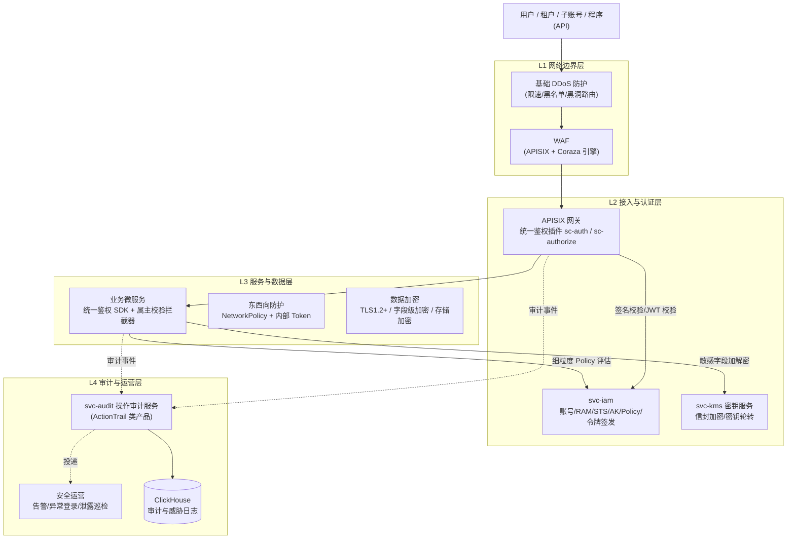
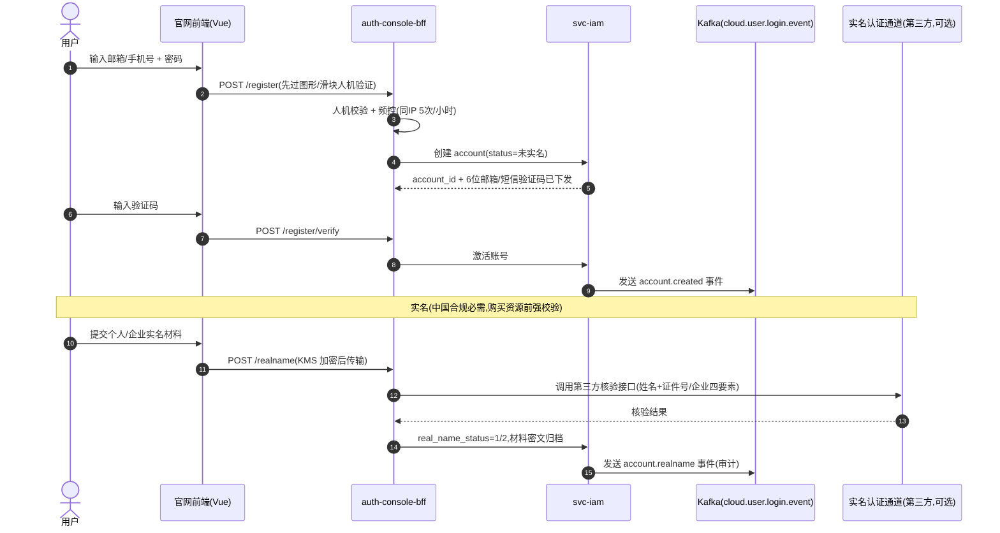
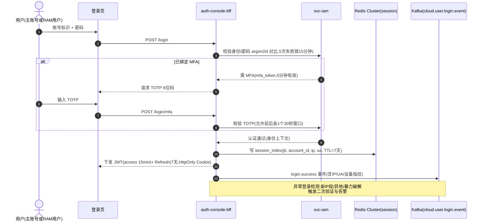
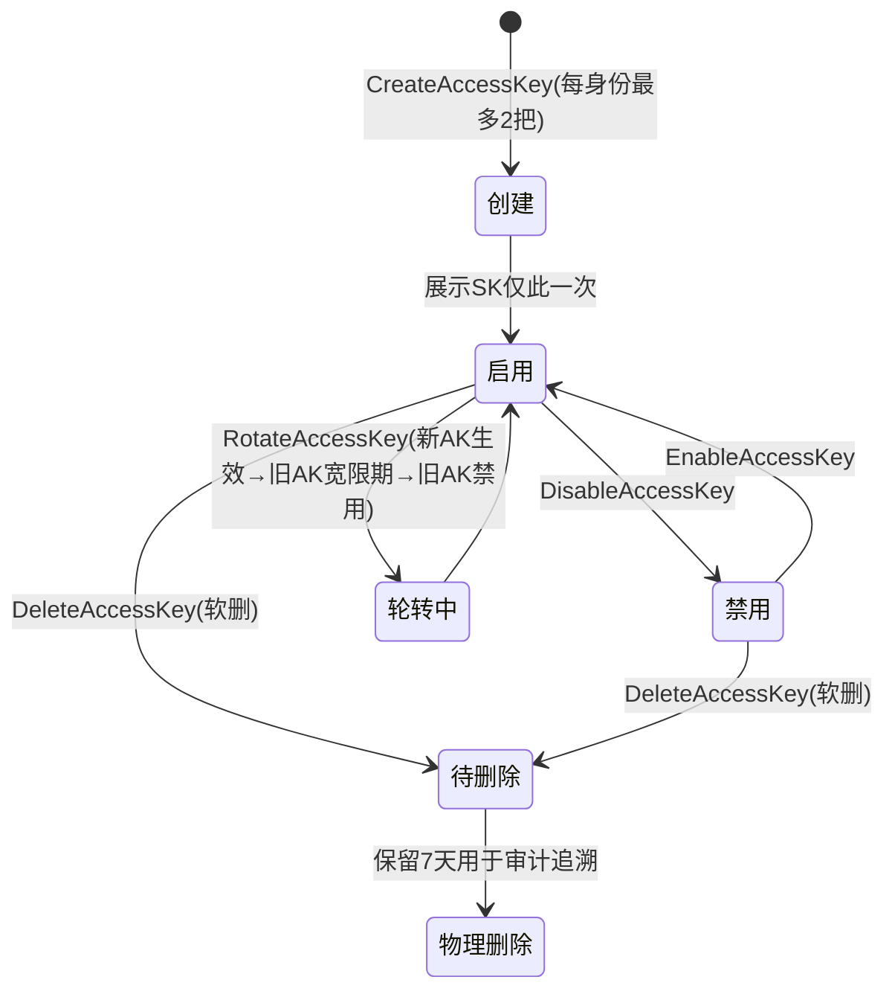
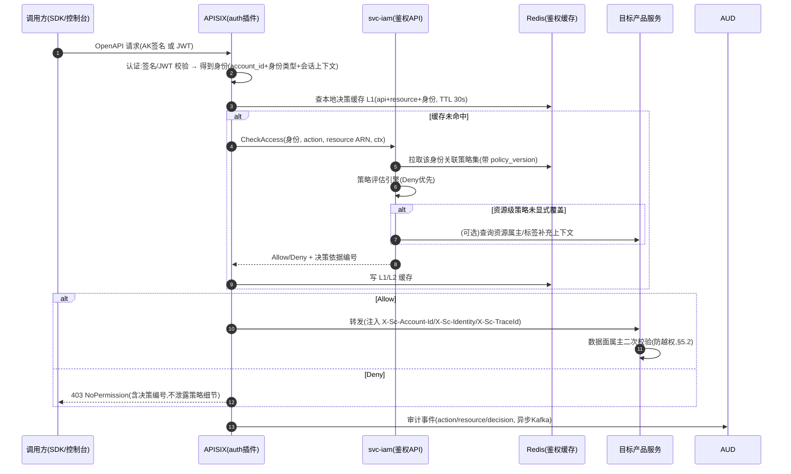
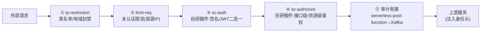
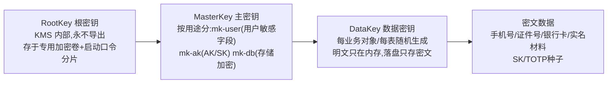
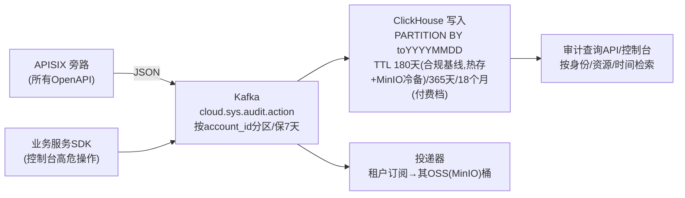

# 07 安全与权限体系

> 所属文档集:云服务平台产品大框架蓝图
> 本章定位:定义平台"身份—权限—密钥—审计—合规"的完整安全底座,同时规划可对外售卖的安全产品线。
> 强关联章节:《03-backend-services.md》(IAM/审计服务归属)、《04-middleware-infrastructure.md》(APISIX/Redis/Kafka)、《05-data-observability.md》(审计日志 ClickHouse 存储)、《06-kubernetes-productization.md》(数据面租户隔离)、《08-devops-delivery.md》(镜像与依赖扫描流水线)、《09-roadmap.md》(分期落地)。

---

## 1. 本章范围与安全体系总览

### 1.1 设计目标

云平台的安全体系必须同时回答四个问题:

1. **谁在访问**(Identity):统一账号、RAM 子账号、角色与临时凭证、AccessKey,一切身份收敛到 IAM。
2. **能否访问**(Authorization):RBAC + Policy 的细粒度授权,资源级鉴权,默认拒绝。
3. **访问是否可信、可查**(Audit):全量操作审计,满足等保三级"日志留存 ≥ 6 个月"与商业信任要求。
4. **平台自身如何不被攻破**(Defense):边界防护、越权防护、密钥管理、供应链安全。

**铁律(对标阿里云 RAM 的启示,见《10-research-and-selection-decisions.md》§3.4):账号与权限是地基,必须 Day 1 存在。** 所有云产品在立项时即按"资源必须归属租户(account_id)、所有 API 必须过统一鉴权、所有写操作必须留审计"三条红线验收,晚做则所有产品返工(参见《09-roadmap.md》里程碑 M0)。

### 1.2 安全分层架构



### 1.3 安全相关模块划分(服务视角)

| 模块 | 职责 | 技术栈 | 归属章节 |
|---|---|---|---|
| `svc-iam` | 账号、RAM 用户/组/角色、STS、AK 管理、Policy 评估、令牌签发 | Go + Kratos(统一后端) | 《03-backend-services.md》§4.0 |
| `auth-console-bff` | 登录/注册/MFA/会话 BFF | Go + Kratos(高并发低延迟) | 《03-backend-services.md》§4.0 |
| `svc-kms` | 主密钥管理、信封加密、密钥轮转 | Go + Kratos | 本章 §5.3 |
| `svc-audit` | 审计事件收集、查询、投递 | Go + Kratos + Kafka + ClickHouse | 本章 §6.2、《05-data-observability.md》 |
| APISIX 安全插件 | 签名鉴权、JWT 校验、限流、WAF、防重放 | APISIX + Lua/Coraza | 本章 §5 |
| `svc-security-product`(二期) | 对外售卖的 DDoS/WAF/证书产品控制面 | Go + Kratos | 本章 §7 |

> 决策:安全核心服务(IAM/KMS/审计)全部自建,不做第三方 IAM 集成。理由:身份是全平台信任根,自建可控且是等保三级刚需;备选 Keycloak 等开源 IAM 仅适合内部工具,不适合作为云租户身份根。改选条件:仅内部 IT 平台场景可考虑 Keycloak 起步。

---

## 2. 账号体系

### 2.1 身份模型全景

对标阿里云 RAM,平台身份对象共五类:

| 身份对象 | 定义 | 登录控制台 | 持有 AK | 典型用途 |
|---|---|---|---|---|
| 主账号(Account) | 资源归属与计费主体,注册即产生,account_id 全局唯一 | 是(强烈建议仅做资金操作) | 是(建议禁用) | 实名认证、付费、授权管理 |
| RAM 用户(User) | 主账号下的子身份,即 IAM 用户 | 可选开启 | 可选开启 | 企业员工、开发者日常操作 |
| 用户组(Group) | RAM 用户集合,授权挂组上 | 否 | 否 | 按职能批量授权(运维组/财务组) |
| 角色(Role) | 无固定凭证的虚拟身份,可被"扮演"(AssumeRole) | 否(扮演后可) | 否(产临时凭证) | 跨账号委托、服务间调用、控制台联合登录 |
| 服务角色(ServiceLinkedRole) | 云产品代为操作租户资源的预置角色 | 否 | 否 | 弹性伸缩代建 ECS、备份服务读 OSS |

**身份命名空间**:主账号 `account_id`(19 位雪花数字);RAM 用户显示名 `username`(账号内唯一);全局身份 ARN 见 §3.1。

### 2.2 核心数据模型(表结构示例)

统一落在 IAM 库(MySQL,按 `account_id` 分库,Vitess,分片键 account_id 单键,参见《04-middleware-infrastructure.md》§6.3/§6.4)。全书租户标识统一为 `account_id`(≡ uid ≡ user_id ≡ tenant_id,详见《00-overview.md》附录A 全局标识规范);下列 DDL 中 `account_id` 列即租户主键。

```sql
-- 主账号(云账号)
CREATE TABLE account (
  id              BIGINT PRIMARY KEY,
  account_id      BIGINT UNSIGNED NOT NULL UNIQUE COMMENT '全局账号ID(≡ uid)',
  email           VARCHAR(128) NOT NULL UNIQUE,
  mobile          VARCHAR(32)  COMMENT '加密存储,密文+密钥版本',
  password_hash   VARCHAR(128) NOT NULL COMMENT 'argon2id',
  account_type    TINYINT      COMMENT '1个人 2企业',
  real_name_status TINYINT     COMMENT '0未实名 1个人实名 2企业实名',
  mfa_bound       TINYINT      DEFAULT 0,
  status          TINYINT      COMMENT '1正常 2冻结 3注销锁定',
  created_at      DATETIME, updated_at DATETIME,
  KEY idx_email (email)
) COMMENT='云账号主表';

-- RAM 用户(子账号)
CREATE TABLE iam_user (
  id            BIGINT PRIMARY KEY,
  account_id    BIGINT UNSIGNED NOT NULL COMMENT '所属主账号',
  username      VARCHAR(64) NOT NULL,
  display_name  VARCHAR(128),
  login_enabled TINYINT DEFAULT 0,
  password_hash VARCHAR(128),
  ak_enabled    TINYINT DEFAULT 0,
  mfa_required  TINYINT DEFAULT 0 COMMENT '登录是否强制MFA',
  last_login_at DATETIME,
  status        TINYINT COMMENT '1启用 2禁用 3删除保留审计',
  created_at    DATETIME, updated_at DATETIME,
  UNIQUE KEY uk_account_name (account_id, username)
) COMMENT='RAM用户';

-- 用户组与成员
CREATE TABLE user_group (
  id BIGINT PRIMARY KEY, account_id BIGINT UNSIGNED NOT NULL,
  group_name VARCHAR(64) NOT NULL, remark VARCHAR(256),
  UNIQUE KEY uk_account_group (account_id, group_name)
);
CREATE TABLE group_member (
  id BIGINT PRIMARY KEY, account_id BIGINT UNSIGNED, group_id BIGINT, member_user_id BIGINT,
  UNIQUE KEY uk_group_user (group_id, member_user_id)
);

-- 角色
CREATE TABLE iam_role (
  id BIGINT PRIMARY KEY, account_id BIGINT UNSIGNED NOT NULL,
  role_name VARCHAR(64) NOT NULL,
  role_type TINYINT COMMENT '1用户角色 2服务角色 3跨账号角色',
  assume_policy JSON NOT NULL COMMENT '信任策略:谁可以扮演',
  max_session_seconds INT DEFAULT 3600,
  UNIQUE KEY uk_account_role (account_id, role_name)
);

-- AccessKey(见 §2.5,secret 只存信封加密密文)
CREATE TABLE access_key (
  id BIGINT PRIMARY KEY, account_id BIGINT UNSIGNED NOT NULL,
  owner_type TINYINT COMMENT '1主账号 2RAM用户 3角色',
  owner_id BIGINT NOT NULL,
  ak_id VARCHAR(32) NOT NULL UNIQUE COMMENT 'AK,前缀 SC(替代阿里云 LTAI)',
  sk_cipher VARBINARY(512) NOT NULL COMMENT 'SK 信封加密密文',
  sk_key_version INT NOT NULL COMMENT 'KMS主密钥版本',
  status TINYINT COMMENT '1启用 2禁用 3已删除(保留7天可恢复)',
  last_used_at DATETIME, created_at DATETIME, rotated_at DATETIME,
  KEY idx_ak (ak_id)
);

-- MFA 设备
CREATE TABLE mfa_device (
  id BIGINT PRIMARY KEY, account_id BIGINT UNSIGNED, owner_type TINYINT, owner_id BIGINT,
  device_type TINYINT COMMENT '1 TOTP 2 短信(仅辅助)',
  secret_cipher VARBINARY(256) COMMENT 'TOTP种子,信封加密',
  status TINYINT, bound_at DATETIME,
  UNIQUE KEY uk_owner (owner_type, owner_id, device_type)
);
```

### 2.3 注册与实名认证流程



要点:
- **人机验证与频控前置在 BFF**,失败请求不打到 IAM。
- 未实名账号可以登录控制台浏览,但**下单、创建资源、开通 API 一律拦截**(由订单与资源服务校验 `real_name_status`,参见《03-backend-services.md》)。
- 实名材料属于敏感个人信息,落库前经 KMS 信封加密(§5.3),展示时脱敏(仅首尾字符)。

### 2.4 登录与多因素认证(MFA)

**决策:控制台登录会话采用"短 TTL JWT + Redis 会话索引"混合模式。**
- 理由:JWT 无状态便于网关本地校验、水平扩展;但注销/踢出/改密立即失效需要吊销能力,故在 Redis 维护 `session_index`(jti → 状态),登录态变更时删除索引项,网关校验 JWT 签名后对敏感操作二次查索引。
- 备选:纯 Redis Session(每次请求查 Redis)。改选条件:若合规要求"任意时刻可全量吊销",且能接受每请求一次 Redis RT(约 1ms),可退回纯 Session 模式。
- MFA 一期实现 **TOTP(兼容 Google Authenticator)**,短信仅作辅助找回通道;不采购硬件 Key,预留 WebAuthn 接口二期实现。



登录安全策略基线:密码强度 ≥ 8 位含三类字符;连续 5 次失败锁定 15 分钟;主账号与开启 MFA 的 RAM 用户登录必须二次验证;Refresh 仅存 HttpOnly + Secure + SameSite=Lax Cookie,禁止 localStorage(与《02-frontend-architecture.md》§5.1 前端安全规范对齐)。

**会话参数统一基线(本章锁定,02§5.1/04§3.4/07§2.4 三章同步执行)**:

| 参数 | 取值 | 说明 |
|---|---|---|
| access_token 时效 | **15 分钟** | JWT(RS256),仅前端内存持有 |
| refresh_token 时效 | **7 天** | 旋转签发:每次续期旧 token 吊销、新 token 签发,7 天内活跃则会话持续延展;session_index(Redis)TTL 与之对齐为 7 天 |
| refresh Cookie 属性 | **HttpOnly + Secure + SameSite=Lax** | JS 不可读;允许跨子域 SSO 携带(根域 Cookie 由 account 域 svc-iam 签发) |
| 签发方 | **account 域 svc-iam** | 统一 04§3.4 的签发口径为 svc-iam(对应 03§4.0 服务总表) |

《02-frontend-architecture.md》§5.1(前端静默续期设计)与《04-middleware-infrastructure.md》§3.4(网关 jwt-auth 校验)按本基线执行;上述参数任何调整须先经安全评审,再三章同步,禁止单章擅改。refresh 锁定 7 天、SameSite=Lax 的理由:7 天时效兼顾活跃用户的连续登录体验与静默续期;Lax 允许跨子域 SSO 携带根域 Cookie(Strict 会阻断 account→console→billing 等子域跳转的跨站请求);配合旋转签发与 session_index 吊销能力,安全性与体验兼得。推翻原 07§2.4"refresh 12h + SameSite=Strict"方案——12h 过短影响静默续期,Strict 阻断跨子域 SSO(见裁决书 S13)。

### 2.5 AccessKey 生命周期

AK/SK 是程序访问 OpenAPI 的凭证,全生命周期状态机:



关键规则:
1. **SK 只在创建时返回一次**,平台不可明文查询;DB 中仅存 KMS 信封加密密文(网关验签时由验签缓存持有解密后的短时副本,见 §5.3)。SK 存储采用信封加密(`sk_cipher` + `sk_key_version`,可逆解密用于验签),不使用单向哈希(本节为 SK 存储事实源,见裁决书 S5,《03》§6.1 已对齐)。
2. **每身份最多 2 把 AK**,强制支持"轮转":新 AK 生效后旧 AK 进入 ≤ 72h 宽限期后自动禁用。
3. **主账号 AK 默认不开放**,控制台强提示;API 访问一律引导使用 RAM 用户 AK 或角色临时凭证。
4. 临时凭证(STS):`AssumeRole` 返回 `AK + SK + SecurityToken + Expiration(900s~3600s)`,凭证不落库、签名校验带 token 校验链(§4.1/§4.2 防重放)。
5. AK 泄露巡检:对接公开泄露情报/GitHub 扫描类能力(二期,可选),发现泄露自动禁用并通知;一期先提供"最后使用时间/来源 IP"报表辅助用户自查。

**AK 验签性能与存储决策**:验签需要真实 SK 计算 HMAC,故 SK 必须可逆(信封加密)而非单向哈希。为不把 svc-kms 打爆,网关侧验签流程采用"AK → (SK 解密结果缓存,Redis,TTL 5min,密文+版本号)"二级缓存,密钥轮转时通过版本号失效。改选条件:若安全评审要求 SK 解密不可缓存,则每次验签直调 svc-kms,svc-kms 需按峰值 QPS × 3 扩容。

---

## 3. 权限模型:RBAC + Policy

### 3.1 模型与 ARN 设计

采用 **RBAC 为骨架(用户→组/角色→系统策略)、JSON Policy 为血肉(自定义细粒度)** 的混合模型,与阿里云 RAM 对齐。

**资源标识 ARN(平台资源名,PRN)格式**:

```
sc:<service>:<region>:<account_id>:<relative-resource>
示例:
sc:ecs:cn-east-1:1001234567890:instance/scecs-cn-east-1-01-a1b2c3d4
sc:oss:cn-east-1:1001234567890:bucket/my-app-data/logs/*
sc:iam:*:1001234567890:user/dev-*
```

- `region` 允许 `*`(全局资源如 IAM);`relative-resource` 由各产品注册时申报,支持 `*` 通配(§3.2 匹配规则)。资源 ID 内嵌 2 位分片因子,格式 `{productCode}-{regionId}-{分片因子2位}-{随机8位}`(如 `scecs-cn-east-1-01-a1b2c3d4`,详见《00-overview.md》附录A 全局标识规范)。
- **新产品接入规范**:立项时必须向 svc-iam 注册 `<service>` 命名空间、资源类型树、Action 清单(格式 `{productCode}:{Operation}`,如 `scecs:StartInstance`),缺注册不予挂网关路由——这是"计量计费先于产品"之外的第二条产品准入红线(参见《01-product-catalog.md》§1.1 决策 D0 产品 code 体系)。

### 3.2 Policy JSON 语法

语法子集对标阿里云 RAM Policy(去掉 Principal,平台内策略均绑定到身份):

```json
{
  "Version": "1",
  "Statement": [
    {
      "Effect": "Allow",
      "Action": ["scecs:Describe*", "scecs:StartInstance", "scecs:StopInstance"],
      "Resource": [
        "sc:ecs:cn-east-1:1001234567890:instance/*"
      ],
      "Condition": {
        "IpAddress": { "sc:SourceIp": ["10.0.0.0/8"] },
        "DateLessThan": { "sc:CurrentTime": "2027-01-01T00:00:00Z" }
      }
    },
    {
      "Effect": "Deny",
      "Action": ["*"],
      "Resource": ["*"],
      "Condition": {
        "NotIpAddress": { "sc:SourceIp": ["203.0.113.0/24"] }
      }
    }
  ]
}
```

**评估规则(与 AWS/阿里云一致的判定序)**:
1. 默认 Deny;
2. 任一策略显式 Deny → 最终 Deny(Deny 优先);
3. 存在匹配 Allow 且无 Deny → Allow;
4. Condition 支持的运算符一期提供:`StringEquals/NotEquals`、`IpAddress/NotIpAddress`、`DateGreaterThan/LessThan`、`Bool`;`sc:` 前缀上下文键一期提供 `SourceIp`、`CurrentTime`、`MFAPresent`、`ResourceGroupId` 四个。

**策略分类**:
| 类型 | 维护方 | 示例 |
|---|---|---|
| 系统策略 | 平台内置,随产品 API 注册自动生成只读/管理两档 | `ScECSFullAccess`、`ScECSReadOnlyAccess`、`ScBillingReadOnlyAccess` |
| 自定义策略 | 租户自建 | 上例"仅允许启动停机且限源 IP" |
| 信任策略 | 挂在角色上 | 声明"允许 account_id=200xxx 的 RAM 用户 AssumeRole 本角色" |
| 权限边界(二期) | 主账号限制子身份的最大权限上限 | 财务组永不能碰 `iam:*` |

### 3.3 鉴权流程(资源级)



**网关鉴权 vs 服务内鉴权分工**:
- **网关层**:认证(签名/JWT)+ "接口级"粗粒度鉴权(action 维度)+ 限流。保证非法身份进不了内网。
- **服务层**:资源属主校验(account_id 必须等于资源 owner)+ 业务语义鉴权(如"该实例是否允许此操作状态")。网关不做资源属主查询,避免鉴权链路依赖所有产品 DB。
- 对需要资源级策略生效的高敏接口(SCECS 删除、SCOSS 下载、RAM 变更),网关调用 svc-iam `CheckAccess` 带上具体 ARN,做细粒度评估。

### 3.4 鉴权缓存策略与失效

| 层级 | 载体 | 内容 | TTL | 失效方式 |
|---|---|---|---|---|
| L1 | 网关节点本地内存 | 单请求决策(api+resource+identity 哈希) | 30s | 被动过期 |
| L2 | Redis Cluster | 身份→策略集快照(含 policy_version)、AK→SK 解密副本 | 5~10min | 版本号比对失效 |
| L3 | MySQL | 策略与绑定关系真源 | - | - |

**失效链路**:策略/绑定关系变更 → svc-iam 写库并 `policy_version++` → 发 Kafka `cloud.sys.authz.policy.changed`(按 account_id 分区) → 网关与 svc-iam 实例消费后删除对应 L1/L2 条目。**收敛承诺:授权变更全局生效 ≤ 60s**(30s L1 过期 + 秒级事件失效双保险),在用户文档中明确标注该语义。

> 决策:缓存失效采用"事件 + 短 TTL 双保险"而非纯事件推送。理由:纯事件在消费堆积时会产生权限放大窗口,短 TTL 兜底;备选纯短 TTL(无事件)改选条件:策略变更频率极低且能接受最长 TTL 的生效延迟时可简化。

### 3.5 资源级权限与项目(资源组)隔离

对标阿里云"资源组",平台提供 **Project(资源组)** 作为租户内的二级隔离单元:

- 每个资源创建时必须携带 `resource_group_id`(默认 `default`);
- ARN 与策略 Condition 键 `sc:ResourceGroupId` 支持按资源组授权:`"Condition":{"StringEquals":{"sc:ResourceGroupId":"rg-002"}}`;
- 控制台所有列表接口强制带资源组过滤器;跨资源组移动 = 资源属主不变、归属组变更,需 `rg:MoveResource` 权限并留审计。

```sql
CREATE TABLE resource_group (
  id BIGINT PRIMARY KEY, account_id BIGINT UNSIGNED NOT NULL,
  rg_id VARCHAR(32) NOT NULL UNIQUE, rg_name VARCHAR(64),
  status TINYINT, created_at DATETIME,
  UNIQUE KEY uk_account_rg (account_id, rg_id)
);
-- 所有云产品资源表必须包含:
--   account_id BIGINT UNSIGNED NOT NULL,  resource_group_id VARCHAR(32) NOT NULL,
--   region VARCHAR(32) NOT NULL,并建立 (account_id, resource_group_id) 联合索引
```

**标签(tag)与 ABAC**:资源表统一挂 `tag` 扩展(JSON 或独立 tag 表),Condition 键 `sc:ResourceTag/<key>` 二期开放;一期仅提供资源组维度的 ABAC 能力,避免评估引擎复杂度失控。

---

## 4. OpenAPI 安全:AK/SK 签名与防重放

### 4.1 签名算法设计(CPS1-HMAC-SHA256,唯一契约)

对标 AWS SigV4 / 阿里云 V3 签名,取二者交集自研一版,**算法即契约,随 SDK 发布,永不兼容破坏**。本节是全平台 OpenAPI 签名算法的**唯一权威定义**(SigV4 风格:Authorization 头 / CanonicalRequest / 分域派生密钥链 / `x-cps-*` 头 / body 哈希绑定),网关自研签名插件仅实现此一套,**否决 03§9.2 的查询参数式 HMAC(AccessKeyId/Signature/Timestamp/SignatureNonce)与 04§3.8 的 `x-acs-*` 阿里云 ACS 风格头名两套并存方案**(见裁决书 S4)。

> **契约权威声明**:本节是全平台 OpenAPI 签名算法(CPS1-HMAC-SHA256)的**唯一权威定义**。《03-backend-services.md》§9.2(OpenAPI 规范,签名节已重写为引用本节 CPS1 契约,不再用查询参数式 HMAC)、《04-middleware-infrastructure.md》§3.4/§3.8(网关认证设计与 forward-auth `request_headers` 清单,已改为 `x-cps-*` 头集,替换 `x-acs-*` 阿里云风格)均按本节实现;SDK 签名模块(见《03-backend-services.md》§9.4)、文档站签名示例与 OpenAPI Explorer 在线调试与本契约同步发布。网关签名实现仅此一套,**任何产品、SDK 或文档不得另行定义或描述第二套签名方案**。`x-cps-` 头前缀为签名协议专用名(与品牌前缀 `sc` 解耦,见裁决书 C9),全书保留不改。

> **域名与路由形态(见裁决书 S6)**:OpenAPI 统一"一产品一子域名 `{productCode}.api.starcloud.cn`"+ RPC 风格 `Action` + 日期型 `Version` 参数(URI 不承载版本号,如 `scecs.api.starcloud.cn/?Action=RunInstances&Version=2026-08-01`);废弃单一主域名 + 查询参数签名、废弃 `/v1/{service}/*` 路径段形态。

**请求头约定**:

| Header | 说明 |
|---|---|
| `Authorization` | `CPS1-HMAC-SHA256 Credential={AK}/{scope}, SignedHeaders={list}, Signature={sig}` |
| `x-cps-date` | ISO8601 UTC,如 `20260804T093000Z` |
| `x-cps-content-sha256` | 请求体 SHA256 十六进制(无 body 为空串的哈希) |
| `x-cps-security-token` | STS 临时凭证时必带 |
| `x-cps-nonce` | 随机串(UUID),防重放 |

**签名四步**:

```
Step 1  构造规范请求 CanonicalRequest
        HTTPMethod\n
        CanonicalURI\n                  # 路径,URI 编码(不编码 / )
        CanonicalQueryString\n          # 按 key 字典序,k/v 均 URL 编码
        CanonicalHeaders\n              # 必含 host;x-cps-date;x-cps-content-sha256,
                                        # 其余 x-cps-* 按字典序,值 trim
        SignedHeaders\n                 # 参与签名的头名小写分号分隔
        Hex(SHA256(Body))

Step 2  构造待签字符串 StringToSign
        CPS1-HMAC-SHA256\n
        x-cps-date\n
        {date}/{region}/{service}/cps1_request\n     # scope
        Hex(SHA256(CanonicalRequest))

Step 3  派生签名密钥(分域派生,泄露面最小化)
        kDate    = HMAC-SHA256("CPS1" + SK, date)
        kRegion  = HMAC-SHA256(kDate, region)
        kService = HMAC-SHA256(kRegion, service)
        kSigning = HMAC-SHA256(kService, "cps1_request")

Step 4  Signature = HexEncode(HMAC-SHA256(kSigning, StringToSign))
```

**服务端验签顺序(网关插件内)**:
① 时间窗校验(§4.2)→ ② AK 存在性与状态(启用/未删除/属主未冻结)→ ③ STS token 有效性与过期 → ④ 重算签名恒定时间比对(`HMAC 恒定时间比较`,防时序攻击)→ ⑤ nonce 去重 → ⑥ 身份上下文注入下游。

### 4.2 防重放

三层联合:

1. **时间窗**:`|now - x-cps-date| ≤ 15 分钟`(网关与 svc-iam 均 NTP 校时,偏差告警);
2. **Nonce 去重**:`SET NX sec:nonce:{ak}:{nonce} TTL=16min`,已存在即拒绝——Redis 单点承载全网 nonce,容量估算:峰值 1 万 QPS × 960s ≈ 960 万键(审计写入峰值 2 万/s 与网关 QPS 8000 见《09-roadmap.md》§3.4 一期规模基线表,此处 nonce 为鉴权请求峰值口径),单键 ~120B,约 1.2GB,Redis Cluster 单分片可承载,超限可切布隆过滤器前置(误判导致合法请求被拒,故仅作洪峰保护开关);
3. **Body 哈希绑定**:body 参与签名,篡改 body 即签名失败。

### 4.3 网关统一鉴权落地(APISIX)



- 自研插件两个:`sc-auth`(认证)、`sc-authorize`(鉴权),Lua 实现,策略计算通过 HTTP 调 svc-iam(连接池 + 本地 L1 缓存),遵循《04-middleware-infrastructure.md》APISIX 部署规范;
- **内网防伪**:网关注入的 `X-Sc-Account-Id` 等身份头,上游服务只信任来自网关 mTLS/内网 CIDR 的连接;非网关来源携带该头直接 403。东西向服务间调用使用短 TTL 内部 JWT(由 svc-iam 签发,`iss=sc-internal`),与外部凭证体系隔离;
- 路由规划:所有 OpenAPI 统一挂"一产品一子域名 `{productCode}.api.starcloud.cn`,RPC 风格 `Action` + 日期型 `Version` 参数(URI 不承载版本号,如 `scecs.api.starcloud.cn/?Action=RunInstances&Version=2026-08-01`)";控制台 BFF 走 `console.starcloud.cn/*`,两类路由分别绑定鉴权插件链,互不混用(域名与版本载体形态以《04-middleware-infrastructure.md》§3.2 为事实源,详见《02-frontend-architecture.md》与《04》路由规划)。

### 4.4 OpenAPI 通用安全规范

- 错误响应统一结构 `{code, message, requestId}`,**禁止回显堆栈/SQL/策略原文**;鉴权失败统一 `403 NoPermission` + 决策编号(工单可查,攻击者不可反推);
- 所有写接口幂等由 `ClientToken` 机制支持(与《03-backend-services.md》订单幂等一致);
- 网关对未认证请求做全局限流(单 IP 100 req/s),认证后按租户配额限流(配额中心,参见费用/配额设计);
- SDK 强制校验服务端证书;文档站提供签名在线调试工具(OpenAPI Explorer 对齐项,参见《01-product-catalog.md》文档即产品)。

---

## 5. 平台自身安全防护

### 5.1 边界防护与 WAF 思路

**决策:一期采用"APISIX 网关 + 开源 Coraza(WAF 引擎,可选集成) + 自研基础 DDoS 策略",不自研 WAF 引擎、不采购商业 WAF。**
- 理由:APISIX 已有 `uaa`/社区 WAF 插件生态,Coraza(ModSecurity 的 Go 实现)规则库兼容 OWASP CRS,能覆盖 SQL 注入/XSS/路径穿越/恶意 UA 等基线;自建云初期攻击面集中于 API,规则运营比引擎自研更重要。
- 备选:商业云 WAF 旁挂、自研引擎。改选条件:当对外售卖 WAF 产品(§7)需要多租户规则隔离与大规模规则热更时,再评估引擎级自研或采购。

配套手段:官网与控制台静态资源走 CDN(可选,自建场景可用 Nginx 缓存层);登录/注册/支付回调接口单独叠加行为频控;网关开启 TLS1.2+,禁用弱套件,证书由证书服务统一管理(§7 SSL 证书服务)。

### 5.2 越权防护(横向/纵向)

| 类型 | 攻击形态 | 防护手段 |
|---|---|---|
| 横向越权 | 租户 A 用合法身份操作租户 B 的资源(改 resourceId 参数) | ① 所有数据访问强制 `WHERE account_id = ?`(Vitess 分片键即 account_id,物理上跨库);② 服务侧统一"属主校验拦截器":操作前查资源属主,不等于调用者 account_id 直接 404(不暴露存在性);③ 公共 SDK 封装,禁止业务代码手写属主过滤 |
| 纵向越权 | RAM 用户执行超出授权的操作(如只读角色发起删除) | ① 网关 action 级鉴权兜底;② 服务端不信任前端按钮/参数中的"角色";③ 管理面高危操作(删库、释放实例、改实名信息)强制二次确认 + MFA 重校验 |
| 身份伪造 | 伪造 `X-Sc-Account-Id` 头直连服务 | 内网防伪(§4.3)+ NetworkPolicy 禁止外部直达 Pod |

**统一鉴权 SDK(Go 版本)**:提供 `RequireAuth(action="scecs:StopInstance")` 拦截器(如 Kratos middleware / gRPC interceptor)与资源属主校验中间件;新产品代码评审必查项:是否使用该 SDK、是否存在裸 SQL 缺 account_id 条件。SDK 发布纳入《08-devops-delivery.md》统一制品库管理。

### 5.3 敏感数据加密与密钥管理(KMS)

**密钥层级(信封加密)**:



- 加解密接口:`Encrypt/Decrypt/GenerateDataKey`,业务侧只持有 DEK 密文,调 svc-kms 换取明文 DEK(结果缓存 ≤ 60s);
- **轮转**:MasterKey 年度轮转,历史版本保留用于旧密文解密;数据重加密用后台批任务渐进迁移,`sk_key_version` 字段标识版本;
- 传输:全链路 TLS;数据库:开启 MySQL TDE(可选,自建 MySQL 用磁盘级加密卷替代);对象存储:MinIO 开启 SSE-S3,用户侧 BYOK 二期(依赖 KMS 对外接口,与 §7 证书/KMS 产品化联动);
- **决策:一期自建软件 KMS 服务(svc-kms),不采购硬件加密机(HSM)。** 理由:成本高、采购周期长,软件方案配合分片口令与审计可满足起步合规;备选 HSM/云厂商 KMS;改选条件:等保三级测评机构明确要求或金融类客户入场时,将 RootKey 迁入 HSM,KMS 接口不变。本节为 SK 信封加密存储事实源(access_key 表 `sk_cipher` + `sk_key_version`,见 §2.2 DDL 与裁决书 S5)。

**敏感字段清单与加密要求(开发基线)**:手机号、证件号、银行卡号、实名材料文件、AK SK、TOTP 种子、工单附件中的凭证——一律 KMS 信封加密落库 + 展示脱敏 + 日志脱敏(Logback/Zap 统一脱敏插件,防止 trace 日志带出明文,与《05-data-observability.md》日志规范对齐)。

### 5.4 镜像安全与供应链

与《08-devops-delivery.md》CI/CD 流水线联动,形成"扫描门禁":

1. **基础镜像治理**:统一内部基础镜像(定期重建),禁止业务镜像直连公网 registry;
2. **CI 扫描门禁**:GitLab CI 流水线强制 `Trivy` 扫描镜像 + 依赖清单(SBOM 生成,可选),Critical 漏洞阻断合入,High 漏洞限期修复白名单审批;
3. **依赖扫描**:`govulncheck`(Go)+ Trivy fs 模式,NVD/CNVD 情报每日更新;新引入第三方库需架构组评审(候选池外组件引入必须走评审,见《00-overview.md》选型纪律);
4. **准入控制**:K8s 侧准入 webhook 拒绝无签名/扫描未过镜像(可选:cosign 签名,ArgoCD 部署链校验);
5. **镜像仓库安全**:仓库凭证短 TTL、按项目最小授权,仓库自身审计接入 svc-audit。

### 5.5 平台自身其他基线

- 堡垒机与运维通道:生产 K8s 仅通过堡垒机 + kubectl OIDC(对接 svc-iam 角色)访问,禁止长期 kubeconfig 外发;所有运维命令留审计(参见《08-devops-delivery.md》);
- 中间件访问:Redis/MySQL/Kafka/Nacos 全部启用认证 + 内网隔离 + 按应用分账号,Nacos 配置按 namespace 权限隔离(与《04-middleware-infrastructure.md》一致);
- 漏洞运营:公网资产季度渗透测试(外包可选)、SRC 漏洞反馈通道(二期)、安全补丁 SLA(Critical 72h)。

---

## 6. 合规基线与审计

### 6.1 等保三级要点自查清单(平台侧摘录)

> 完整定级备案、测评组织由安全团队在《09-roadmap.md》合规里程碑推进;此处为架构可落地项自查。

| 域 | 要点 | 本平台对应设计 | 状态口径 |
|---|---|---|---|
| 安全通信网络 | 网络架构冗余、通信传输加密 | APISIX/中间件多副本跨节点;全链路 TLS | 设计已覆盖 |
| 安全区域边界 | 边界防护、访问控制、入侵防范 | K8s NetworkPolicy、网关 WAF、黑名单、DDoS 基础防护 | §5.1/§6.2 |
| 安全计算环境 | 身份鉴别(双因子)、访问控制(三权分立)、安全审计、剩余信息保护 | MFA、RBAC+Policy、审计服务、会话超时清理 | 本章覆盖 |
| 安全管理中心 | 集中管控、日志集中分析 | SOC 雏形:审计+告警汇聚 ClickHouse | §6.2 |
| 身份鉴别 | 口令复杂度、登录失败处理、双因子 | §2.4 基线全部满足 | 已覆盖 |
| 访问控制 | 最小权限、管理用户三权分立 | 系统管理员/安全保密管理员/安全审计员三员账号分离(IAM 内置三员角色,互不兼任) | 需落地三员流程 |
| 安全审计 | 审计覆盖每个用户、日志留存 ≥ 6 个月、防篡改 | 审计服务 ClickHouse TTL ≥ 180 天(合规基线,热存+MinIO 冷备;付费档 365 天/18 个月)、哈希链防篡改 | §6.2 |
| 数据保密性/完整性 | 传输与存储加密、备份 | KMS 信封加密、MySQL 备份(参见《05-data-observability.md》) | 部分,需测评确认 |
| 个人信息保护 | 最小采集、脱敏展示、可注销 | 实名最小字段、脱敏规范、账号注销流程(数据保留期合规) | 需法务联合评审 |

### 6.2 操作审计产品化(ActionTrail 类)

审计既是合规底座,也是可售卖产品("操作审计":租户可查看/导出自己账号下所有 API 操作记录)。

**事件模型(统一 Schema)**:

```json
{
  "event_id": "ev-20260804-000123",
  "event_time": "2026-08-04T09:30:00Z",
  "event_source": "scecs.api.starcloud.cn",
  "event_name": "StopInstance",
  "source_ip": "203.0.113.9",
  "user_agent": "sc-sdk-go/1.2.0",
  "identity": {
    "type": "ram-user", "account_id": "1001234567890",
    "principal": "user/alice", "ak_id": "SC****3F", "mfa_present": true
  },
  "resource": ["sc:ecs:cn-east-1:1001234567890:instance/scecs-cn-east-1-01-a1b2c3d4"],
  "decision": "allow",
  "request_params": {"InstanceId": "scecs-cn-east-1-01-a1b2c3d4"},
  "response_code": "200",
  "trace_id": "5b8e...c2",
  "chain_hash": "<上一条事件哈希+本事件哈希,防篡改链>"
}
```

**采集与存储链路**:



- Kafka topic 规划:topic 命名以《04-middleware-infrastructure.md》§5.4 清单为唯一事实源,统一 `cloud.*` 规范(topic 名不含环境标识,环境隔离靠集群隔离),安全域引用清单为:`cloud.sys.audit.action`(审计主 topic,按 account_id 分区保证租户内有序)、`cloud.user.login.event`(登录与异常)、`cloud.sys.authz.policy.changed`(策略变更失效广播)、`cloud.sys.threat.event`(WAF 拦截/防重放命中)。审计/安全组消费走独立集群 ACL(与《04-middleware-infrastructure.md》§5.3 topic 命名规范一致);
- **防篡改**:每条事件带 `chain_hash`(租户维度哈希链),任意篡改可被校验发现;审计库账号与业务库三权分立,研发无删改权限;
- **留存期(与 03§4.4.3/05§11 三章同步,见裁决书 S24)**:平台合规基线 ≥180 天(等保三级,热存 ClickHouse)+ MinIO 冷备;售卖产品提供 365 天/18 个月付费档;
- 与《05-data-observability.md》关系:审计复用其 ClickHouse 集群但独立 database 与 TTL 策略;`trace_id` 与链路追踪(OTel)联动,实现"审计记录 → 调用链 → 日志"三跳排查。

### 6.3 合规运营事项(简述)

- 实名认证数据仅用于合规核验目的,遵循《个人信息保护法》最小必要;注销账号进入 30 天冷静期后匿名化(资金/发票按财税法规另行保留);
- 隐私政策、用户协议、SLA 文本由法务维护,官网统一挂载(参见《01-product-catalog.md》官网信息架构);
- 安全事件对外通报流程:发现 → 定级 → 72h 内影响用户通报模板(二期固化)。

---

## 7. 可对外售卖的安全产品规划

对标阿里云安全产品线,按"真做 / 集成 / 后置"三档规划,原则:**平台自身刚需且复用成本低的先产品化;重资产、重运营的先集成第三方或后置**。

| 产品 | 档位 | 一期形态 | 演进 |
|---|---|---|---|
| 基础 DDoS 防护 | **真做(基础版)** | 网关/入口层限速、黑名单、SYN 泛洪由内核参数与 LB 侧兜底;超大流量触发运营商黑洞联动(人工流程) | 二期引入商用清洗设备集成,按"防护带宽"售卖 |
| DDoS 高防 | **集成第三方** | 转售第三方高防(流量牵引 DNS 切换),控制台做开通/报表壳 | 自研清洗仅在客户规模支撑后评估 |
| Web 应用防火墙 | **真做(共享版)** | 平台自身 WAF 能力(§5.1)多租户化:租户域名接入 → 规则开关(Owasp CRS 基线 + 自定义黑白名单)→ 攻击日志进 svc-audit | 独立集群版、Bot 管理二期 |
| SSL 证书服务 | **真做** | 证书管理平台:申请(Let's Encrypt/ACME 自动签发免费证书)、上传自有证书、绑定负载均衡/网关域名、到期提醒;私钥由 svc-kms 信封加密托管 | 商业 CA 渠道代销(DV/OV/EV)二期 |
| 主机安全/云安全中心 | 后置 | 先免费提供基线检查(K8s 节点 agent 可选) | 三期产品化 |
| KMS 对外版 | 后置 | 一期仅内部使用(svc-kms) | 二期 BYOK/密钥托管商品化 |
| 操作审计 | **真做** | §6.2 即是产品本体,合规基线 180 天 + 付费长保留/投递(365 天/18 个月) | - |

**售卖安全产品的通用产品化要求**(与《01-product-catalog.md》产品注册规范一致):独立的资源类型与计量项(如 `scwaf:instance`、`sccert:certificate`,产品 code 前缀统一 `sc`,见《00-overview.md》附录A 全局标识规范)、独立控制台微前端子应用、OpenAPI 与文档同步发布、纳入统一订单/计费(参见计费章节与《03-backend-services.md》订单中心)。

---

## 8. 数据面租户隔离的安全边界总结

> 与《06-kubernetes-productization.md》《04-middleware-infrastructure.md》《05-data-observability.md》中的隔离设计互为表里,此处做安全视角的收口。

| 层面 | 隔离手段 | 边界强度 | 备注 |
|---|---|---|---|
| 身份 | account_id 全局唯一,所有资源强制属主;跨租户访问必须走显式授权(角色/共享策略) | 强 | 一切隔离的逻辑根 |
| 数据库 | Vitess 按 account_id 分库分表,租户间物理分片;单库内统一 `account_id` 列 + 框架级强制过滤 | 强 | 连接账号按服务最小授权 |
| 对象存储 | MinIO 按租户前缀 + Bucket Policy 双保险;跨租户共享仅能走预签名 URL/显式策略 | 中 | 平台侧服务账号与租户账号分离 |
| 消息 | Kafka topic 级 ACL;租户托管消息产品(若提供)独立 topic + 前缀 | 中 | 生产者/消费者凭证按租户签发 |
| 容器(租户工作负载) | K8s namespace 隔离 + NetworkPolicy 默认拒绝 + ResourceQuota;高安全诉求租户用独立节点池(二期) | 中→强 | 详见《06-kubernetes-productization.md》 |
| 网络 | 租户 VPC/子网模型从 Day 1 建模(见《10-research-and-selection-decisions.md》§3.4 对标启示 6);平台管理面与租户数据面网络分区 | 强 | 安全组/ACL 二期产品化 |
| 缓存 | Redis key 强制 `{account_id}:` 前缀 + 按服务分库;禁止跨租户 pipeline 扫描 | 中 | SDK 层强制 |
| 日志与可观测 | 日志带 account_id 标签、查询接口按 account_id 过滤;租户不得检索他人指标 | 强 | 与审计边界一致 |
| 密钥 | DEK 按租户对象生成,跨租户解密在 svc-kms 侧拒绝(策略绑定 account_id) | 强 | §5.3 |

**总结一句话**:平台租户隔离 = "身份(account_id)贯穿一切 + 存储物理分片为主、逻辑过滤兜底 + 网络命名空间隔离 + 密钥按租户绑定",任何新产品上线前必须通过"租户隔离评审"(清单化:资源是否带 account_id/rg、查询是否强制过滤、跨租户路径是否有显式授权)。

> 注:全书租户标识统一为 `account_id`(≡ uid ≡ user_id ≡ tenant_id),详见《00-overview.md》附录A 全局标识规范。本章 DDL 与正文已统一使用 `account_id`。

---

## 9. 容量估算与部署建议(安全域)

| 组件 | 估算依据 | 建议规格(起步) |
|---|---|---|
| svc-iam | 鉴权 QPS ≈ 网关总 QPS 的 20%(其余命中缓存);鉴权目标 5k QPS(缓存命中后,一期网关峰值 8000 见《09-roadmap.md》§3.4 基线表) | 3 副本 × 4C8G,HPA 上限 10 |
| auth-console-bff | 登录峰值 500 QPS | 3 副本 × 2C4G |
| svc-kms | 加解密峰值 1k QPS(大量命中 DEK 缓存) | 3 副本 × 2C4G,独立节点池 |
| svc-audit | 审计事件 ≈ 网关 QPS × 1,审计写入峰值 2 万/s(审计写入峰值,非网关 QPS;网关峰值 8000 见《09-roadmap.md》§3.4 基线表) | 3 副本 × 4C8G + Kafka 独立分区组 |
| Redis(安全相关) | nonce 1.2GB + 鉴权缓存 2GB + 会话 1GB | 复用《04-middleware-infrastructure.md》Redis Cluster,安全键统一 `sec:` 前缀 |
| APISIX 安全插件开销 | 签名验签 HMAC 约 10~20µs/次,可忽略;CheckAccess 缓存命中率目标 ≥ 95% | 网关容量规划见《04-middleware-infrastructure.md》 |

---

## 10. 演进路线(与《09-roadmap.md》对齐)

| 阶段 | 安全里程碑 |
|---|---|
| M0(地基,首个版本前) | 账号/登录/MFA-TOTP、RAM 用户与组、系统策略、AK+签名网关鉴权、属主校验 SDK、审计事件全量采集 |
| M1(商业化可售) | 自定义 Policy、角色/STS、资源组、KMS 信封加密全量落地、WAF 基线上线、等保三级差距评估 |
| M2(安全产品化) | 操作审计售卖、SSL 证书服务、共享版 WAF 售卖、异常登录检测、AK 泄露巡检 |
| M3(纵深) | 权限边界/ABAC 标签鉴权、HSM 集成评估、DDoS 高防集成售卖、WebAuthn、SOC 告警运营常态化 |

**明确后置清单**(与《10-research-and-selection-decisions.md》§3.4 对标启示 10 呼应):Bot 管理、主机安全商业化、BYOK、零信任(mTLS 全量)、云安全中心聚合大盘均可后置;**不可后置**:认证鉴权、AK 签名体系、审计留存、KMS、属主校验——这五项任一缺失都会直接击穿商业可信度。

---

## 附:本章决策速查表

| # | 决策 | 结论 | 核心理由 | 备选 | 改选条件 |
|---|---|---|---|---|---|
| D1 | IAM 实现 | 自建(Go/Kratos) | 身份是信任根,等保与商业刚需 | Keycloak | 仅内部工具平台场景 |
| D2 | 鉴权执行点 | APISIX 统一认证+粗鉴权,服务内属主校验 | 非法身份不入内网;属主校验需业务语义 | OPA 外置引擎 | Condition 运算符 > 50 种或需策略热更灰度时引 OPA |
| D3 | 会话模式 | 短 TTL JWT + Redis 会话索引 | 无状态扩展 + 可吊销 | 纯 Redis Session | 合规要求任意时刻全量吊销 |
| D4 | 签名算法 | CPS1-HMAC-SHA256(类 SigV4) | 业界验证、防重放完备、SDK 可生成 | 简单 HMAC 头签名 | 无(算法即契约) |
| D5 | 缓存失效 | Kafka 事件 + 短 TTL 双保险 | 权限放大窗口可控(≤60s) | 纯 TTL | 变更极少且接受 TTL 延迟 |
| D6 | WAF | APISIX + Coraza 集成 | 复用网关、OWASP CRS 规则现成 | 商业 WAF | 售卖 WAF 需多租户引擎级能力时 |
| D7 | KMS | 自建软件 KMS(svc-kms,信封加密) | 成本与周期,HSM 后置 | 硬件 HSM | 测评强制或金融客户入场 |
| D8 | 审计存储 | ClickHouse,哈希链防篡改,合规基线 ≥ 180 天(热存+MinIO 冷备),付费档 365 天/18 个月 | 成本为 ES 1/10、SQL 分析、与可观测联动 | ES | 需 Kibana 全文检索体验且团队已有 ES 运维 |

> 注:令牌时效/refresh_token/SameSite 见 §2.4 会话参数基线(refresh=7 天/SameSite=Lax,推翻原 12h+Strict,见裁决书 S13)。
