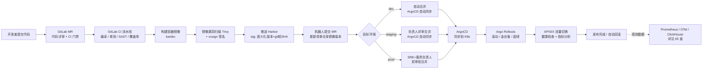
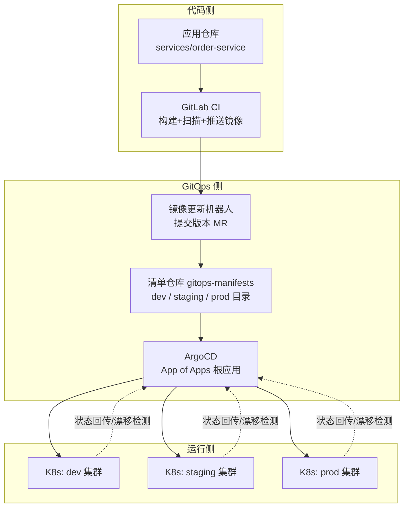
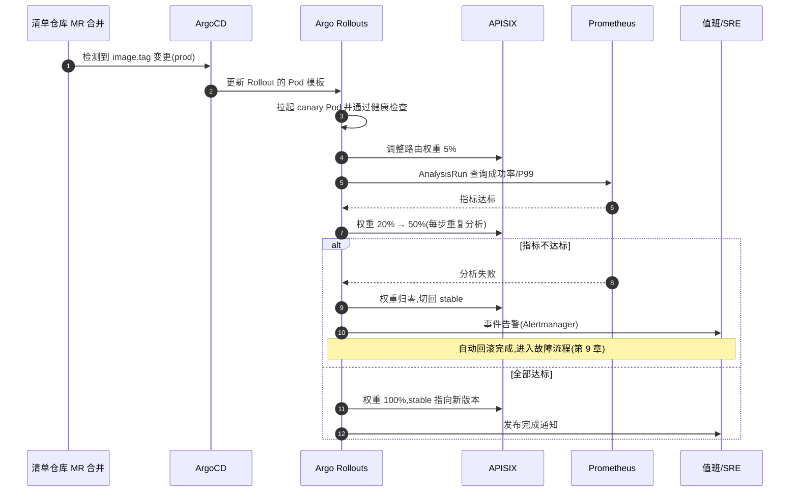
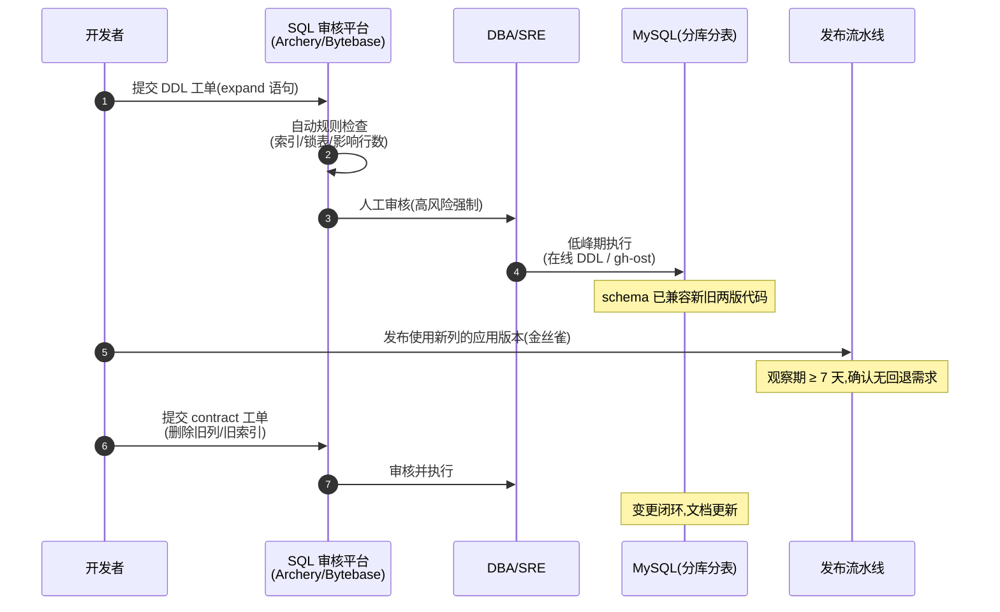
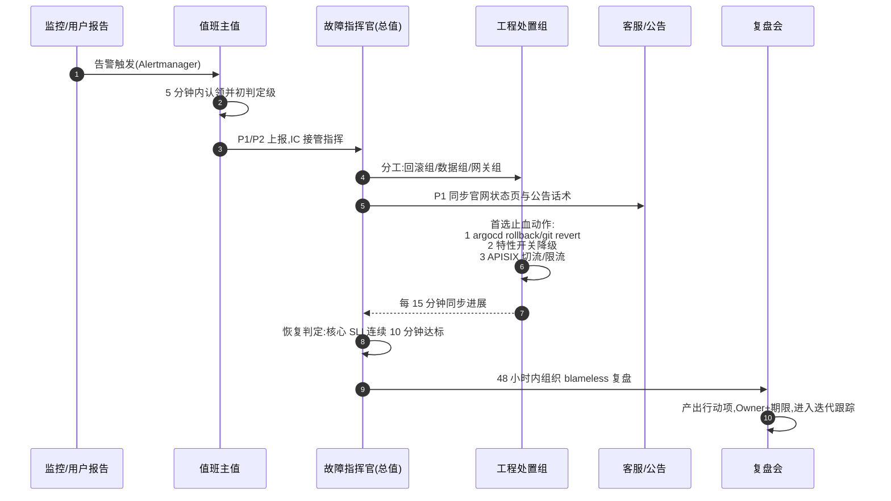

# DevOps 与交付体系

> 本章是《云服务平台产品大框架蓝图》的第八章,定义平台自身软件交付体系的总体设计:从代码提交、持续集成、镜像构建、GitOps 发布,到质量门禁、环境与配置管理、故障应急与 SLO 运营的完整闭环。
>
> **交叉引用**:总体分层参见《00-overview.md》;被交付的微服务划分参见《03-backend-services.md》;前端微前端架构参见《02-frontend-architecture.md》;中间件(Nacos/Kafka/Redis 等)运维参见《04-middleware-infrastructure.md》;可观测体系参见《05-data-observability.md》;Kubernetes 底座与产品化参见《06-kubernetes-productization.md》;安全与权限参见《07-security.md》;实施节奏参见《09-roadmap.md》。

---

## 1. 设计目标与原则

### 1.1 本章解决的问题

我们对外售卖的是云服务,而云服务的质量上限由"平台自身的交付能力"决定:控制台、OpenAPI、计费、资源管控面等(一期 17 个核心服务,二/三期扩至 50+,规模基线见《09-roadmap.md》§3.4)需要高频、安全、可回滚地发布。本章回答四个问题:

1. **代码如何变成线上运行的服务?** —— 端到端交付流水线(CI/CD)。
2. **如何保证每次变更不劣化质量?** —— 质量门禁左移与准入卡点。
3. **出了问题如何快速恢复?** —— 发布策略、回滚机制与故障应急体系。
4. **如何度量平台自身的可靠性?** —— 平台级 SLO 与错误预算。

### 1.2 量化目标(DORA 四指标基线)

| 指标 | P0 期目标 | 成熟期目标 | 说明 |
|---|---|---|---|
| 部署频率(核心服务) | ≥ 每周 1 次 | 按需,每日多次 | 生产环境成功部署次数 |
| 变更前置时间(Commit→Prod) | ≤ 2 个工作日 | ≤ 4 小时 | 体现流水线自动化程度 |
| 变更失败率 | ≤ 15% | ≤ 5% | 需要回滚/热修的比例 |
| 故障恢复时间(MTTR) | ≤ 60 分钟 | ≤ 15 分钟 | P1/P2 级故障口径 |

### 1.3 设计原则

1. **一切皆代码(Everything as Code)**:应用清单、中间件配置、网关路由、告警规则、仪表盘全部进 Git,禁止"控制台手改"成为常态。
2. **Git 是唯一事实来源(GitOps)**:生产集群期望状态只由清单仓库的一个受保护分支描述;任何线上变更必须是一次可审计的 Git 提交。
3. **制品不可变**:同一镜像 tag 构建一次、多处部署;禁止"同 tag 覆盖推送";环境差异只允许来自配置,不允许来自制品。
4. **环境同构**:dev/staging/prod 均为 Kubernetes 集群(或命名空间隔离),同构的底座让"在我环境里是好的"这类问题消失。
5. **部署与发布解耦**:部署(deploy,新代码上集群)与发布(release,用户流量到达新代码)是两个动作,通过金丝雀/蓝绿/开关控制后者。
6. **门禁左移**:安全扫描、SQL 审核、覆盖率检查在 MR 阶段完成,越靠近生产环境的手动审批越少,靠自动化卡点替代人肉评审。

---

## 2. 工具链选型决策

### 2.1 选型总表(与《10-research-and-selection-decisions.md》§4.2 选型决策总表对齐)

| 领域 | 结论 | 核心理由 | 备选 | 改选条件 |
|---|---|---|---|---|
| 代码托管 | GitLab 自建(CE 起步) | 与 GitLab CI 一体,MR/流水线/制品库统一权限模型 | 自建 Gitea + 第三方 CI | 团队极小且只需轻量托管时 |
| CI | **GitLab CI** | 流水线即代码、贴近代码库;MR 触发、变量体系、include 模板复用成熟 | Jenkins | 出现大量存量 VM 脚本/非容器构建链时,Jenkins 承接该部分,ArgoCD 不变 |
| CD | **ArgoCD**(GitOps) | K8s 原生、声明式状态可审计、原生支持回滚与多集群 | Flux | 偏好更轻量的控制器风格且不需要 UI 时 |
| 镜像仓库 | **Harbor**(辅助工具,候选池外,需评审确认引入) | CNCF 毕业项目;RBAC、复制、保留策略、Trivy 扫描集成、cosign 签名验证一体 | 轻量 Distribution Registry(可选) | 仅内部小规模使用、不需要治理特性时 |
| 渐进式发布 | Argo Rollouts(辅助工具) | 与 ArgoCD 同源,金丝雀/蓝绿声明式,支持 Prometheus 指标自动分析 | 原生 Deployment 滚动 + APISIX 手动权重 | 团队初期以简化运维为优先时 |
| 网关配合 | APISIX | 全动态路由/上游,天然支持按权重分流与插件热加载(详见《04-middleware-infrastructure.md》) | Kong | 见《10-research-and-selection-decisions.md》§4.2 选型决策总表 |
| 配置/注册 | Nacos | 注册+配置一体,namespace/group 模型覆盖多环境(详见《04-middleware-infrastructure.md》) | Apollo | 需合规级变更审批+IP 级灰度且已有运维经验 |
| SQL 审核平台 | Archery 或 Bytebase(辅助工具,二选一) | SQL 提交-审核-执行留痕,集成 gh-ost 在线 DDL | 纯人工 DBA 审核 | 早期表少时人工即可 |

> **关于 Harbor 的说明**:对象存储候选池中的 MinIO 定位为业务数据存储(对标 OSS 产品),不适合作为镜像仓库;Harbor 属于交付体系必需的辅助组件,按"辅助小工具需标注"的要求在此显式声明,纳入《09-roadmap.md》的采购/自建评审清单。

### 2.2 关键决策卡

#### 决策 D-08-01:CI 引擎选 GitLab CI,不引入 Jenkins(当前阶段)

- **结论**:全平台统一 GitLab CI;Jenkins 在本平台 **不予引入**。
- **理由**:
  1. 平台从 0 到 1 自建,**没有存量 VM 脚本与非容器构建链**,Jenkins 的历史包袱优势不存在;
  2. GitLab CI 与代码库、MR 评审、流水线状态、制品库(可选 GitLab Registry 做过渡)天然一体,减少一套系统的运维面与权限体系;
  3. 所有交付物最终都是容器镜像 → K8s,GitLab CI 的 K8s executor / Docker-in-Docker / kaniko 构建模式成熟;
  4. 与《10-research-and-selection-decisions.md》§4.2 选型决策总表完全一致:CI/CD 推荐即 "GitLab CI + ArgoCD"。
- **备选**:Jenkins 做 CI + ArgoCD 做 CD(CD 部分不变)。
- **改选条件**:未来并购/接入的团队存在大量 Jenkins 存量流水线(数百条以上)且短期无法容器化改造时,允许 Jenkins 作为第二 CI 承接存量,新服务仍走 GitLab CI;**ArgoCD 作为唯一 CD 入口不变**,即"CI 可以多元,CD 必须一元"。

#### 决策 D-08-02:CD 采用 ArgoCD GitOps 模式,拒绝"CI 直接 kubectl apply"

- **结论**:CI 流水线只负责构建与推送镜像,并将镜像版本号以 MR 方式写入清单仓库;ArgoCD 监听清单仓库并将状态同步到集群。CI 环节禁止持有生产集群 kubeconfig。
- **理由**:
  1. 变更全部留痕在 Git,审计/回滚=一次 `git revert`;
  2. ArgoCD 持续对账,reconcile 漂移的手改资源,保证声明式状态可信;
  3. CI 与集群解耦:Runner 被攻破也不等于生产集群被攻破(与《07-security.md》的纵深防御一致);
  4. 多集群/多地域扩展时只需在 ArgoCD 注册新集群,不需要给每条流水线发凭证。
- **备选**:Flux(GitOps 等价物);或早期 PoC 阶段 CI 直推 dev 集群加速调试。
- **改选条件**:dev 环境为追求秒级反馈,允许 CI 直推 dev 命名空间(见 4.2 节分级策略);staging/prod 永不放开。

#### 决策 D-08-03:镜像仓库选 Harbor

- **结论**:Harbor 双节点高可用部署,承载全部业务镜像、基础镜像与 Helm Chart(Chart Museum 组件)。
- **理由**:① 项目制 RBAC 与 GitLab Group 对齐;② Trivy 扫描器内置集成,与质量门禁(第 8 章)直接打通;③ 支持 cosign 签名与准入策略;④ 镜像保留策略与复制策略(多地域分发)开箱即用。
- **备选**:Distribution Registry + 自建 UI(可选,仅当 Harbor 运维成本被证明过高);或直接使用公有云 ACR(若未来控制面托管在公有云)。
- **改选条件**:平台整体迁移为"控制面租用公有云"模式时改用云厂商 ACR,镜像 tag 规范不变。

---

## 3. 整体交付流水线

### 3.1 端到端流水线总览



关键设计点:

1. **CI 与 CD 之间用"镜像版本 MR"衔接**:CI 完成后由机器人(如 renovate/自研 image-updater,可选)向清单仓库提 MR,变更内容只有一个镜像 tag。这一步让"谁在什么时候把哪个版本推上了哪个环境"全部可审计。
2. **环境晋级方向单向**:dev → staging → prod,镜像只晋级不跨级;prod 上线的版本必须先经过 staging 验证(同 tag 制品复用,见 1.3 原则 3)。
3. **观测闭环**:发布动作本身写入事件(Prometheus annotation / 部署事件 topic),故障时"这次异常是不是某次发布引入的"可在分钟级定位(参见本章第 9 节故障应急流程,《05-data-observability.md》§9 提供多租户监控隔离,不涉及变更关联)。

### 3.2 代码仓库布局

采用 **"业务多仓 + 平台单仓 + 清单单仓"** 的混合模式:

| 仓库 | 内容 | 说明 |
|---|---|---|
| `platform/cloud-console`(前端) | Vue 基座 + 各微前端子应用 | 基座与子应用分目录,monorepo 便于统一依赖;子应用拆分策略见《02-frontend-architecture.md》 |
| `services/<domain>-*`(后端) | 各微服务,按领域一服务一仓 | 服务划分见《03-backend-services.md》;全部 Go/Kratos 服务 |
| `platform/k8s-operators` | 资源管控 operator(Go) | K8s 产品化组件,见《06-kubernetes-productization.md》 |
| `deploy/gitops-manifests` | **清单仓库**:所有环境 K8s 清单/Helm values/网关路由/告警规则 | GitOps 唯一事实来源,结构见 4.3 |
| `platform/ci-templates` | 流水线 include 模板、Dockerfile 基线、lint 规则 | 模板集中升级,各仓库 include 引用 |
| `platform/infra-as-code` | 中间件与集群编排清单(Nacos/Kafka/Redis 等 Operator 清单) | 与《04-middleware-infrastructure.md》对应 |

**仓库权限模型**:服务仓库由领域团队自治;`gitops-manifests` 仓库启用 CODEOWNERS——`prod/` 目录的合并必须由 SRE 与服务 Owner 双审批;任何人(含管理员)禁止绕过 MR 直推受保护分支。

### 3.3 制品与版本规范

**镜像 tag 规范**:

```
<registry>/cloudplatform/<service>:v<MAJOR>.<MINOR>.<PATCH>-<git短SHA>
示例:harbor.internal/cloudplatform/order-service:v1.4.2-a1b2c3d
```

- `MAJOR.MINOR.PATCH` 由 CI 从 `VERSION` 文件或 tag 读取(推荐 tag 触发:Git tag `v1.4.2` → 构建并推送);
- 追加 `-<7位gitSHA>` 保证全局唯一,**禁止覆盖推送**;
- 每个环境清单中固定引用完整 tag,不使用 `latest`;
- `dev` 环境允许 MR 流水线产出 `mr-<iid>-<sha>` 临时 tag,保留策略 7 天自动清理(Harbor retention)。

**语义化约束**:

| 变更类型 | 版本号动作 |
|---|---|
| 仅 bugfix、配置兼容 | PATCH |
| 新增 OpenAPI、向后兼容 | MINOR |
| 破坏性变更(删字段/改语义) | MAJOR,必须走 expand-contract 流程(6.5) |

**基础镜像**:统一维护 `cloudplatform/base-go1.22`、`cloudplatform/base-node20`,由 `ci-templates` 仓库流水线每周自动重建(滚动 CVE 修复),业务 Dockerfile 只 FROM 基线镜像——把"基础镜像补丁"从 N 个服务收敛到 1 条流水线。

---

## 4. GitOps 落地设计

### 4.1 运作模型



### 4.2 环境与分支策略

代码仓库采用 **主干开发(Trunk-Based Development)**:所有变更合入 `main`,长生命周期特性用 Feature Flag 控制,避免发布分支成为回滚障碍。

清单仓库 `gitops-manifests` 采用 **目录即环境 + 单主干** 策略:

| 环境 | 清单目录 | 晋级方式 | ArgoCD 同步策略 | 审批 |
|---|---|---|---|---|
| dev | `envs/dev/` | 机器人 MR 自动合并(仅镜像版本类变更) | 自动同步 + 自动自愈(`selfHeal: true`) | 无 |
| staging | `envs/staging/` | 机器人 MR,服务 Owner 评审 | 自动同步 | 单人评审 |
| prod | `envs/prod/` | 从 staging 已验证版本 cherry-pick/晋级 MR | 自动同步,但 Rollouts 步骤含手工暂停点 | SRE + Owner 双审批 |

备选分支模型(dev/staging/prod 三分支各映射一个环境)的取舍:

- **结论**:选"目录即环境、单主干",不选三分支模型。
- **理由**:单主干下"prod 目录当前内容"即生产现状,不存在分支间漂移;三分支模型在多服务并行晋级时极易产生分支叉开与合并冲突;晋级语义通过 CODEOWNERS + 标签实现已足够。
- **改选条件**:若多地域多集群出现"不同地域跑不同版本"的长期分叉需求,升级为 `envs/<region>/<env>/` 层级目录,仍是单主干。

**分级提速**:dev 环境在平台早期可允许 CI 直推(`kubectl apply` 到 dev 命名空间)换取分钟级调试反馈,但清单仓库仍保留 dev 的完整清单,ArgoCD 周期性对账纠正漂移;staging/prod 永远只经 ArgoCD。

### 4.3 清单仓库目录结构

```
gitops-manifests/
├── apps/                          # 每个服务的"应用定义"(Helm Chart 或 kustomize)
│   ├── order-service/
│   │   ├── Chart.yaml
│   │   ├── values.yaml            # 与环境无关的默认值
│   │   ├── templates/
│   │   │   ├── deployment.yaml    # 或 rollout.yaml(Argo Rollouts)
│   │   │   ├── service.yaml
│   │   │   ├── hpa.yaml
│   │   │   └── servicemonitor.yaml
│   │   └── README.md
│   ├── console-portal/            # 前端基座
│   ├── console-sub-billing/       # 微前端子应用(费用中心),见《02》
│   ├── billing-service/
│   └── ...
├── envs/
│   ├── dev/
│   │   ├── values-overrides/      # 各服务 dev 环境覆盖值
│   │   │   ├── order-service.yaml
│   │   │   └── ...
│   │   └── app-of-apps.yaml       # dev 根应用
│   ├── staging/
│   │   ├── values-overrides/
│   │   └── app-of-apps.yaml
│   └── prod/
│       ├── values-overrides/
│       ├── app-of-apps.yaml
│       └── freeze-window.yaml     # 发布冻结窗口声明(大促/节假日)
├── platform/                      # 平台级组件(网关/中间件/可观测的部署清单)
│   ├── apisix/
│   ├── nacos/
│   ├── argocd/
│   └── observability/             # Prometheus rules / Grafana dashboards,与 05 章联动
├── policies/                      # 准入与同步策略
│   ├── app-project.yaml
│   └── sync-waves.md
└── CODEOWNERS                     # prod/ 目录双审批规则
```

设计要点:

- **环境差异只出现在 `envs/<env>/values-overrides/`**(副本数、资源规格、Nacos namespace、域名),模板零差异,保证环境同构;
- **Sync Wave 编排**(`argocd.argoproj.io/sync-wave` 注解):平台组件 wave -10 → 中间件 wave -5 → 网关 wave 0 → 业务服务 wave 10,保证依赖顺序;
- **AppProject 隔离**:每个领域一个 Project,限制部署目标命名空间、可用仓库与集群角色,与《07-security.md》的最小权限原则对齐。

### 4.4 ArgoCD Application 示例

**App of Apps 根应用(prod)**——`envs/prod/app-of-apps.yaml`:

```yaml
apiVersion: argoproj.io/v1alpha1
kind: Application
metadata:
  name: prod-root
  namespace: argocd
  finalizers:
    - resources-finalizer.argoproj.io
spec:
  project: platform-prod
  source:
    repoURL: https://gitlab.internal/cloudplatform/gitops-manifests.git
    targetRevision: main
    path: envs/prod/applications      # 该目录下每个 yaml 是一个子 Application
  destination:
    server: https://kubernetes.default.svc
    namespace: argocd
  syncPolicy:
    automated:
      prune: true        # 清单删除则资源删除(受 Project 白名单约束)
      selfHeal: true     # 手改集群资源会被拉回 Git 声明状态
    syncOptions:
      - CreateNamespace=true
      - PrunePropagationPolicy=foreground
    retry:
      limit: 3
      backoff:
        duration: 10s
        factor: 2
        maxDuration: 3m
```

**子应用示例(order-service,prod,Helm + 环境覆盖值)**——`envs/prod/applications/order-service.yaml`:

```yaml
apiVersion: argoproj.io/v1alpha1
kind: Application
metadata:
  name: prod-order-service
  namespace: argocd
  annotations:
    # 用于可观测体系发布关联,见《05-data-observability.md》
    argocd.argoproj.io/manifest-generate-paths: /apps/order-service
  finalizers:
    - resources-finalizer.argoproj.io
spec:
  project: business-prod
  source:
    repoURL: https://gitlab.internal/cloudplatform/gitops-manifests.git
    targetRevision: main
    path: apps/order-service
    helm:
      releaseName: order-service
      valueFiles:
        - ../../envs/prod/values-overrides/order-service.yaml
  destination:
    server: https://prod-cluster-01.internal:6443
    namespace: shop-order
  syncPolicy:
    automated:
      prune: true
      selfHeal: true
    syncOptions:
      - CreateNamespace=true
  # 健康判定:Deployment 就绪才算 Synced+Succeeded,Rollouts 由 CRD 自身健康检查接管
  ignoreDifferences:
    - group: apps
      kind: Deployment
      jsonPointers:
        - /spec/replicas        # 副本数交给 HPA,避免 ArgoCD 与 HPA 打架
```

**环境覆盖值示例**——`envs/prod/values-overrides/order-service.yaml`:

```yaml
image:
  repository: harbor.internal/cloudplatform/order-service
  tag: v1.4.2-a1b2c3d          # ← 唯一被机器人 MR 修改的字段
replicaCount: 6
resources:
  requests: { cpu: "500m", memory: "1Gi" }
  limits:   { cpu: "2",    memory: "2Gi" }
env:
  NACOS_NAMESPACE: prod         # 环境映射见第 7.2 节
hpa:
  enabled: true
  minReplicas: 6
  maxReplicas: 30
  targetCPUUtilization: 65
canary:
  enabled: true                 # 启用 Argo Rollouts 金丝雀,见 6.3
```

### 4.5 漂移治理与回滚

| 场景 | 机制 |
|---|---|
| 有人手改了集群资源 | ArgoCD `selfHeal` 自动拉回;若属紧急止血,事后 24h 内必须把改动回写 Git(值班记录强制项) |
| 发布后发现缺陷,需回滚 | **首选**:`git revert` 清单仓库中的版本 MR → ArgoCD 同步旧镜像(不可变制品保证旧版本随时可起);**次选**:`argocd app rollback` 到历史快照(仅用于分钟级止血,事后补 Git revert) |
| 回滚同时需要撤销 DB 变更 | 依赖 6.5 节的兼容性变更纪律:回滚只回代码,不回 schema |
| 发布冻结窗口 | `freeze-window.yaml` 声明大促/节假日窗口,期间合并 prod MR 需要总监级审批(CODEOWNERS 动态增补);ArgoCD 不停机,只是限制入口 |

---

## 5. CI 流水线模板

### 5.1 公共设计

- 所有模板沉淀在 `platform/ci-templates` 仓库,业务仓库用 `include` 引用,模板升级全平台生效;
- Runner 采用 Kubernetes executor(构建 Pod 即起即毁),按标签划分池:`build-go`、`build-fe`、`dind`(kaniko 免 Docker 特权);
- 缓存策略:Go/pnpm 依赖缓存到对象存储(MinIO,见《04-middleware-infrastructure.md》)挂载的 PVC,命中率目标 > 85%;
- 凭证:Harbor 推送凭证、GitLab API token 一律用 CI 变量(masked+protected),禁止写入脚本。

`platform/ci-templates/pipeline-base.yml`(公共骨架):

```yaml
workflow:
  rules:
    - if: $CI_PIPELINE_SOURCE == "merge_request_event"
    - if: $CI_COMMIT_TAG =~ /^v\d+\.\d+\.\d+$/
    - if: $CI_COMMIT_BRANCH == "main"

stages: [build, test, scan, package, publish, promote]

include:
  - local: templates/sast.yml          # SAST/依赖扫描通用 job
  - local: templates/image.yml         # kaniko 构建 + Trivy + cosign 通用 job
  - local: templates/gitops.yml        # 清单仓库版本 MR 机器人通用 job
```

### 5.2 Go(Kratos)服务流水线

适用:全部后端微服务(订单、计费、账号、BFF、数据接入、推送、operator 等,见《03-backend-services.md》)。关键 stage:编译 → 单测(含覆盖率) → SAST → 镜像构建 → 漏洞扫描与签名 → 版本晋级;差异点:静态二进制、CGO 关闭、golangci-lint、多阶段镜像更小。

```yaml
include:
  - project: cloudplatform/ci-templates
    file: pipeline-base.yml

variables:
  IMAGE_NAME: harbor.internal/cloudplatform/order-service
  GOFLAGS: "-mod=vendor"

build:compile:
  stage: build
  tags: [build-go]
  image: cloudplatform/base-go1.22-build:latest
  script:
    - go vet ./...
    - golangci-lint run --timeout 5m        # 统一 lint 规则在 ci-templates 仓库
    - CGO_ENABLED=0 GOOS=linux go build -ldflags "-X main.Version=${CI_COMMIT_SHORT_SHA}" -o bin/app ./cmd/server
  cache:
    key: "$CI_PROJECT_PATH_SLUG-gomod"
    paths: [vendor/]

test:unit:
  stage: test
  tags: [build-go]
  script:
    - go test -race -coverprofile=coverage.out -covermode=atomic ./...
    - go tool cover -func=coverage.out | tail -n1    # 输出总覆盖率供 GitLab 采集
  coverage: '/total:\s+\(statements\)\s+(\d+.\d+)%/'
  artifacts:
    reports: { coverage_report: { coverage_format: cobertura, path: coverage.xml } }

scan:sast:
  stage: scan
  script:
    - gosec -fmt=json -out=gosec-report.json ./...     # 辅助工具
  artifacts:
    reports: { sast: gosec-report.json }

scan:dependency:
  stage: scan
  script:
    - govulncheck ./...
    - trivy fs --severity HIGH,CRITICAL --exit-code 1 --format json -o gl-dep-report.json .
  allow_failure: false

package:image:
  stage: package
  tags: [dind]
  image: gcr.io/kaniko-project/executor:debug
  script:
    - VERSION=$(cat VERSION)
    - TAG="v${VERSION}-${CI_COMMIT_SHORT_SHA}"
    - /kaniko/executor
        --context $CI_PROJECT_DIR
        --dockerfile deploy/Dockerfile
        --destination ${IMAGE_NAME}:${TAG}
        --build-arg GIT_SHA=${CI_COMMIT_SHORT_SHA}
        --cache=true --cache-repo=${IMAGE_NAME}/cache
  rules:
    - if: $CI_COMMIT_TAG =~ /^v\d+\.\d+\.\d+$/
    - if: $CI_COMMIT_BRANCH == "main"

scan:image:
  stage: scan
  script:
    - trivy image --severity CRITICAL --exit-code 1 ${IMAGE_NAME}:${TAG}
    - trivy image --severity HIGH --exit-code 0 --format json -o gl-container-scanning-report.json ${IMAGE_NAME}:${TAG}
  artifacts:
    reports: { container_scanning: gl-container-scanning-report.json }

publish:sign:                          # cosign 签名,准入层校验,见 8.4
  stage: publish
  script:
    - cosign sign --key env://COSIGN_PRIVATE_KEY ${IMAGE_NAME}:${TAG}

promote:gitops-mr:                     # 机器人向清单仓库提 MR
  stage: promote
  image: alpine/git
  script:
    - sh ci-scripts/update-gitops.sh order-service ${TAG} dev,staging
  rules:
    - if: $CI_COMMIT_TAG =~ /^v\d+\.\d+\.\d+$/
```

`update-gitops.sh` 的逻辑:克隆清单仓库 → 用 `yq` 修改 `envs/dev/values-overrides/order-service.yaml` 与 staging 对应文件的 `image.tag` → 以 `bot/order-service-vX.Y.Z` 分支提交并创建 MR,MR 描述自动附上本次变更日志与流水线链接。

### 5.3 前端子应用流水线(Vue + Wujie)

1. **构建产物双通道**:静态资源推 Harbor 镜像(nginx 承载)用于 K8s 部署,同时可选同步到 MinIO+CDN 加速;
2. **微前端约束在 CI 校验**:`publicPath` 必须为绝对路径、子应用产物路径前缀与注册中心登记一致、跨域头由网关统一注入(见《10-research-and-selection-decisions.md》§4.4 兼容性坑清单第 6 条);
3. **子应用独立流水线独立发布**——这正是微前端带来的交付红利:费用中心子应用发版不触碰基座。

```yaml
include:
  - project: cloudplatform/ci-templates
    file: pipeline-base.yml

variables:
  IMAGE_NAME: harbor.internal/cloudplatform/console-sub-billing

build:assets:
  stage: build
  tags: [build-fe]
  image: cloudplatform/base-node20-build:latest
  script:
    - pnpm install --frozen-lockfile
    - pnpm lint                                    # eslint + stylelint
    - pnpm type-check                              # vue-tsc
    - pnpm test:unit -- --coverage                 # vitest
    - pnpm build --mode=$CI_ENV_NAME
    - node ci-scripts/check-mf-conventions.js      # 校验 publicPath/路由前缀/manifest 登记
  artifacts:
    paths: [dist/]
    expire_in: 1 week

test:e2e:                                        # 可选,主干上运行
  stage: test
  image: mcr.microsoft.com/playwright:latest      # 辅助工具
  script:
    - pnpm test:e2e
  rules:
    - if: $CI_COMMIT_BRANCH == "main"
  allow_failure: true                              # 早期不稳定期放行,稳定后改为 false

# package:image 使用统一 nginx 基线镜像 cloudplatform/base-nginx
# scan/image/sign/promote 复用公共模板;dev 环境 MR 预览由 review app 承载
review:preview:
  stage: promote
  script:
    - sh ci-scripts/deploy-review-app.sh $CI_MERGE_REQUEST_IID   # 临时命名空间 + 临时域名
  environment:
    name: review/$CI_MERGE_REQUEST_IID
    on_stop: review:stop
  rules:
    - if: $CI_PIPELINE_SOURCE == "merge_request_event"
```

### 5.4 清单仓库自身的流水线

`gitops-manifests` 仓库也跑 CI,卡住坏清单:

| job | 工具 | 作用 |
|---|---|---|
| lint | kubeconform / kubeval(辅助) | K8s schema 校验 |
| helm-template | helm template + 各环境 values | 确保模板可渲染 |
| policy | OPA/Kyverno dry-run(辅助) | 提前模拟准入策略(资源限额、镜像来源、签名要求) |
| diff | argocd app diff(仅 staging/prod 只读凭证) | MR 中直接展示与线上现状的 diff |
| 审批 | CODEOWNERS | prod/ 变更强制双审批 |

---

## 6. 发布策略

### 6.1 策略总览与选型矩阵

| 策略 | 实现组件 | 回滚速度 | 资源开销 | 适用场景 |
|---|---|---|---|---|
| 滚动发布 | Deployment / Rollouts `maxSurge=25%` | 秒级(镜像回退) | 低 | 无状态后端服务的默认策略 |
| 金丝雀发布 | **Argo Rollouts + APISIX 权重分流** | 秒级(权重归零) | 中 | OpenAPI 网关后端、计费出账等高风险域 |
| 蓝绿发布 | Argo Rollouts bluegreen / 双 Service | 秒级(切回旧 upstream) | 高(双倍资源) | 前端基座、有协议不兼容的大版本、数据库客户端大版本升级 |
| 特性开关 | 应用内 Feature Flag(配置走 Nacos) | 即时 | 无 | 业务逻辑级灰度,与部署完全解耦 |

**选型结论**:默认滚动;OpenAPI 与计费域强制金丝雀;前端基座与跨团队大版本用蓝绿;业务实验用特性开关。理由与改选条件见 6.2~6.4 各节。

### 6.2 滚动发布(默认)

- `maxSurge: 25%`、`maxUnavailable: 0`,配合 `terminationGracePeriodSeconds` ≥ 优雅下线时间(消费者摘流 → 处理完在途请求);
- **就绪门禁**:`readinessProbe` + `startupProbe`(Go 服务编译后二进制启动快,仍配 startupProbe 兜底避免 liveness 过早杀 Pod);
- **优雅下线钩子**:preStop 中先调用网关/注册中心摘流(Nacos 注销 + APISIX upstream 健康探测剔除),sleep 等待在途请求完成——Kratos 统一封装为 SDK 钩子,业务无感;
- 改选条件:服务 QPS 极低(长尾请求多)时放宽 `maxUnavailable=1` 以加速发布。

### 6.3 金丝雀发布(Rollouts + APISIX)

以 order-service 为例,Rollout 定义按步骤推进:5% → 20% → 50% → 100%,每步之间做自动化指标分析:

```yaml
apiVersion: argoproj.io/v1alpha1
kind: Rollout
metadata:
  name: order-service
spec:
  replicas: 6
  selector: { matchLabels: { app: order-service } }
  template: { ... }                      # Pod 模板,同 Deployment
  strategy:
    canary:
      canaryService: order-service-canary
      stableService: order-service
      trafficRouting:
        plugins:
          apisix:                        # Argo Rollouts 官方 APISIX 插件
            route:
              name: order-api-route      # APISIX 路由,由 platform/apisix 清单管理
              namespace: ingress-apisix
      steps:
        - setWeight: 5
        - analysis: { templates: [{ templateName: api-success-rate }], args: [{ name: service-name, value: order-service }] }
        - pause: { duration: 10m }
        - setWeight: 20
        - analysis: { templates: [{ templateName: api-success-rate }] }
        - pause: { duration: 30m }       # 覆盖一个出账/对账观察窗
        - setWeight: 50
        - pause: { duration: 1h }        # 高风险域可改为手工 approval
        - setWeight: 100
```

配套 AnalysisTemplate(数据源为 Prometheus,指标口径与《05-data-observability.md》一致):

```yaml
apiVersion: argoproj.io/v1alpha1
kind: AnalysisTemplate
metadata:
  name: api-success-rate
spec:
  args:
    - name: service-name
  metrics:
    - name: success-rate
      provider:
        prometheus:
          address: http://prometheus.monitoring:9090
          query: |
            sum(rate(apisix_http_status{route=~".*{{args.service-name}}.*", code!~"5.."}[5m]))
            /
            sum(rate(apisix_http_status{route=~".*{{args.service-name}}.*"}[5m]))
      successCondition: result[0] >= 0.995
      failureLimit: 1
      interval: 60s
      count: 5
    - name: p99-latency
      provider:
        prometheus:
          address: http://prometheus.monitoring:9090
          query: |
            histogram_quantile(0.99,
              sum(rate(apisix_http_latency_bucket{route=~".*{{args.service-name}}.*"}[5m])) by (le))
      successCondition: result[0] <= 1.5     # 秒
      failureLimit: 2
      interval: 60s
      count: 5
```

**时序:一次完整金丝雀发布**



### 6.4 蓝绿发布

- **结论**:前端基座(console-portal)、OpenAPI 大版本(MAJOR 升级)、SDK 协议不兼容变更使用蓝绿。
- **理由**:蓝绿在切换瞬间保留完整旧环境,适合"要么整体切、要么整体退"的场景;前端基座承载所有子应用入口,部分流量跑旧基座 + 部分子应用依赖新基座会产生组合爆炸,宁可整切。
- **实现**:Argo Rollouts `strategy: bluegreen`,`autoPromotionEnabled: false`,切换动作由值班 SRE 在确认观测无异常后手动 `argocd argo rollouts promote`;APISIX 侧 upstream 指向 active service。
- **代价与改选条件**:蓝绿期间资源翻倍,资源紧张的集群优先金丝雀;若服务本身多版本兼容(API 向后兼容纪律执行得好),蓝绿降级为金丝雀。

### 6.5 数据库变更流程(发布顺序铁律)

**核心纪律:expand-contract(先兼容后收缩),schema 变更永远领先于应用代码。**



流程规则:

1. **兼容性变更先行**:新增列必须可空或有默认值;禁止"同一发布里删列+发代码";禁止重命名列(用"新列+双写+迁移+删旧列"四步);
2. **SQL 审核平台卡点**:所有 DDL/DML 走工单,平台内置规则(如 `ALTER` 必须评估锁、大表必须 gh-ost/pt-osc、禁止无 WHERE 的 UPDATE);工单与发布单关联,形成"变更三要素"(代码 MR、清单 MR、SQL 工单)互相引用;
3. **分库分表场景**:Vitess 的 schema 变更经 `vtctld ApplySchema` 或 Online DDL 下发并逐分片校验(详见《03-backend-services.md》与《05-data-observability.md》的数据架构);
4. **执行窗口**:生产 DDL 默认在业务低峰(02:00–06:00),与发布冻结窗口互斥;
5. **回滚语义**:代码回滚不附带 schema 回滚——这正是 expand 阶段保持兼容的意义;contract 阶段执行后该变更不可回滚,必须在 MR 描述中显式声明。

**改选条件**:若引入分布式 NewSQL(超出候选池,目前不引入),在线 DDL 模型变化,本节流程需重审。

### 6.6 前端发布特点

- 基座(console-portal):蓝绿,发布前必须完成全部子应用的冒烟回归清单;
- 子应用:独立金丝雀(APISIX 按子应用静态路由权重分流),发布不影响其他子应用;
- **版本兼容约束**:基座与子应用之间的契约(全局状态、路由协议、公共 SDK)变更走"基座先兼容 → 子应用逐步升级 → 基座收缩"的 expand-contract 同款纪律,契约定义见《02-frontend-architecture.md》;
- 静态资源带内容 hash,nginx 基线镜像缓存策略:`index.html` no-cache,hash 资源长缓存,避免切换瞬间拿到新旧混合产物。

---

## 7. 环境与配置管理

### 7.1 环境定义与同构

| 环境 | 用途 | 集群形态 | 数据 | 访问控制 |
|---|---|---|---|---|
| dev | 日常开发联调、MR 预览 | 单集群多命名空间 | 合成数据/脱敏样本 | 开发者直连(kubectl 限命名空间) |
| staging | 准生产验证、压测、故障演练 | 独立集群,拓扑同 prod 缩配 | 脱敏生产快照 | 仅发布流水线与 SRE |
| prod | 生产 | 多集群(按地域,见《00-overview.md》) | 真实数据 | 全量走 GitOps,紧急通道见 9.3 |

同构要求:所有环境 K8s 版本相差 ≤ 1 个小版本;Nacos/Kafka/Redis/MySQL 用同一套 Operator 清单部署(仅规格覆盖值不同);APISIX 路由清单三环境同构,仅域名与上游不同。

### 7.2 Nacos 多环境命名空间映射

**结论:环境用 namespace 隔离,应用用 group 隔离,与《10-research-and-selection-decisions.md》§4.3 多环境与隔离约定一致。**

| 维度 | 规则 | 示例 |
|---|---|---|
| namespace | 一环境一命名空间,名称即环境 | `dev` / `staging` / `prod`(联调合并入 dev) |
| group | = 应用名(=服务名),不使用 `{DOMAIN}_GROUP` 形式 | `svc-order`、`svc-billing` |
| dataId | `<service>-<profile>.<ext>` | `svc-order-prod.yaml`、`svc-billing-rate-rules.json` |
| 多地域(prod 扩展期) | namespace 加地域后缀 | `prod-cn-east` |

应用侧只注入两个变量:`NACOS_ADDR`(各环境不同)与 `NACOS_NAMESPACE`(见 4.4 values),group/dataId 由代码约定,**禁止**把环境差异写进代码。

Nacos 自身的配置变更同样 GitOps 化:配置基线以 YAML 存于 `gitops-manifests/platform/nacos/`,由同步 job(nacos-sync-controller,自研小工具,可选)幂等写入 Nacos;控制台直接修改只允许在故障应急时使用,事后 24h 内回写 Git(与漂移治理同规)。

**Apollo 的改选条件**(与《10-research-and-selection-decisions.md》§4.2 选型决策总表一致,此处落地化):仅当同时满足①合规要求配置变更全量审批留痕②需要 IP 级灰度③配置项达数千且已有 Apollo 运维经验,才切换为 Nacos 注册 + Apollo 配置;切换时本节的"配置基线入 Git + 同步 job"模式原样平移(Apollo 有 open API 支持)。

### 7.3 配置变更流程

配置变更按风险分级:

| 级别 | 示例 | 流程 |
|---|---|---|
| L1 低风险 | 文案、前端开关 | Git MR → 单审 → 同步 job 生效 |
| L2 中风险 | 限流阈值、功能开关 | Git MR → Owner 评审 → 同步 job → 观测 30 分钟 |
| L3 高风险 | 计费费率、账单规则、路由大改 | Git MR → Owner+SRE 双审 → 同步 job **仅 staging 先行** → 验证报告 → prod 执行 → 值守观察一个出账周期 |

配置灰度:利用 Nacos 的 beta 发布(指定 IP 列表)先在部分实例验证;不支持 beta 的项用"特性开关 + 实例分组"替代。所有配置变更事件推入可观测体系,与发布事件同屏展示(《05-data-observability.md》)。

### 7.4 密钥注入

**结论:密钥不进 Git、不进镜像、不进 Nacos 普通配置;以 K8s Secret 为载体,经加密存储 + 运行时注入。**

| 层 | 方案 | 说明 |
|---|---|---|
| 存储 | Sealed Secrets(辅助工具)提交到清单仓库 | 只有目标集群控制器能解密,Git 中存的是密文,保持"一切皆代码" |
| 备选存储 | External Secrets Operator + Vault(辅助,可选) | 密钥数量大、需轮转自动化与跨集群分发时升级 |
| 注入 | Secret → 环境变量 / 挂载卷;应用侧统一 SDK 读取 | 敏感项(数据库口令、AK/SK)优先挂载卷,避免进程环境被日志打印 |
| CI 凭证 | GitLab CI masked+protected 变量,按环境 scope | Harbor 推送 token、cosign 私钥、GitLab API token |
| 轮转 | 数据库口令 90 天轮转 job;泄露即吊销重建 | 轮转走 L3 配置流程 |

与《07-security.md》的边界:本章定义密钥在交付链路中的载体与流程;密钥的分级分类、访问审计、KMS 总体设计以 07 章为准。

---

## 8. 质量门禁

### 8.1 门禁体系总览

门禁按"MR 阶段(CI)→ 制品阶段 → 准入阶段(集群)"三层布防,原则:**越靠后的门禁越应该是机器卡点而非人工评审**。

| 阶段 | 门禁 | 工具 | 卡点阈值/规则 | 失败处理 |
|---|---|---|---|---|
| MR | 静态检查 | golangci-lint / eslint | 规则集在 ci-templates 统一,违规即红 | 阻断合并 |
| MR | 单元测试 | go test / vitest | 全部通过 | 阻断合并 |
| MR | 增量覆盖率 | go cover / c8 | 新增代码行覆盖 ≥ 60%;计费/订单等核心域 ≥ 70% | 阻断合并 |
| MR | 全量覆盖率趋势 | SonarQube(辅助) | 不允许环比下降 > 2% | 警告→第二次阻断 |
| MR | SAST | Semgrep / gosec / SonarQube | High/Critical 0 容忍;Medium 需评审豁免 | 阻断合并(豁免需 Owner 签核留痕) |
| MR | 依赖漏洞 | trivy fs / govulncheck | Critical 阻断;High 阻断或限期豁免(≤7 天) | 阻断合并 |
| 制品 | 镜像漏洞 | Trivy(Harbor 内置) | Critical 阻断晋级 staging/prod | 阻断版本 MR |
| 制品 | 镜像签名 | cosign | prod 镜像必须带签名 | 准入层强制 |
| 清单 | Schema/策略 | kubeconform + OPA/Kyverno | 违规阻断 | 阻断清单 MR |
| 准入 | 镜像来源与签名 | Admission Webhook(自研小控制器,或 Kyverno 策略) | 只允许 `harbor.internal/cloudplatform/*`;prod 命名空间强制验签+扫描通过标签 | 拒绝创建 Pod |

### 8.2 单元测试与覆盖率细则

- 覆盖率统计口径统一为**新增/变更代码行覆盖率**(防止存量稀释),CI 从 MR diff 计算;
- 核心域清单(覆盖率 70% + 强制 mutation 抽检,可选):订单(order)、计费(metering)、出账(billing)、支付网关对接(payment-gw)、账号鉴权(iam-core);
- 依赖外部中间件的测试:优先 Testcontainers(MySQL/Redis/Kafka),CI Runner 池预留 `testcontainers` 标签节点;
- 契约测试:跨服务 gRPC/OpenAPI 契约用 pact 或 proto breaking-check(buf,辅助),防止"编译过但接口破坏"。

### 8.3 SAST 与供应链

- SAST 规则集平台统一维护,业务仓库只 include,禁止私自放宽;
- 依赖清单锁文件(go.mod / pnpm-lock.yaml)变更触发强制依赖扫描 diff,新增引入的依赖需在 MR 描述说明用途;
- 基础镜像每周重建并自动向下游触发重建流水线,把 CVE 修复变成例行事件而不是救火。

### 8.4 镜像扫描与签名验证

- Trivy 数据库离线镜像仓库内网分发(每日增量同步,避免构建依赖外网);
- Harbor 策略:prod 项目开启"未扫描禁止拉取"与"保留策略(非 tag 版本 30 天清理)";
- 准入层验签链:Webhook 校验 `cosign verify` 通过 + Harbor 扫描状态 API 返回无 Critical;紧急通道见 9.3 的"破窗流程"(需双人授权且全程录屏审计)。

---

## 9. 故障应急与稳定性运营

### 9.1 值班(on-call)体系

| 项 | 规则 |
|---|---|
| 排班 | 每域(交易/计费/网关/数据/前端)主值+备值各 1 人,一周轮换;平台级 SRE 总值 7×24 |
| 工具 | Alertmanager 统一告警出口 → 值班平台(电话/短信/IM 机器人升级,辅助工具选型落地时评估) |
| 升级路径 | 告警 5 分钟未认领 → 备值;15 分钟未定级 → 总值 + 域负责人;P1 立即拉群并通报值班总监 |
| 值班纪律 | 值班期内发布冻结权:主值有权叫停本域任何非紧急发布 |
| 补偿 | 值班负荷纳入排期保护,夜间处理故障次日弹性休息 |

告警质量要求:**告警必须对应一条 runbook**(存于清单仓库 `runbooks/` 目录,Git 管理);连续 3 次误报的告警必须在下个迭代整改,否则降级为工单不电话——防止告警疲劳,告警口径与《05-data-observability.md》的告警分层一致。

### 9.2 故障分级

| 级别 | 定义(满足其一) | 响应时限 | 恢复目标 | 通报范围 |
|---|---|---|---|---|
| P1 | 核心链路不可用:无法下单/开通资源;计费停止出账;控制台全面不可访问;数据丢失风险 | 5 分钟响应 | ≤ 30 分钟止血 | 全员通报 + 管理层 |
| P2 | 核心功能部分受损或关键 OpenAPI 错误率 > 1%;单产品管控面不可用 | 15 分钟响应 | ≤ 2 小时 | 相关域 + 客服口径 |
| P3 | 非核心功能异常、性能劣化但有绕行方案 | 1 小时响应 | ≤ 24 小时 | 域内 |
| P4 | 隐患/轻微缺陷,不影响用户 | 正常迭代 | 排期修复 | 工单 |

定级权在总值,先定级恢复、后复盘定责;故障期间**恢复优先于定位**——任何能在 10 分钟内完成的回滚/降级/切流动作,优先于根因分析执行。

### 9.3 故障处理流程



**紧急破窗流程**(绕过常规门禁的唯一合法通道):P1 处置中确需跳过门禁(如紧急 hotfix 直发 prod),须总值 + 域负责人双人口头授权 → 操作全程录屏 → 事后 24 小时内补齐 MR、扫描豁免签核与复盘记录。任何未经破窗流程的门禁绕过,按安全事件处理(《07-security.md》)。

### 9.4 复盘机制(Blameless Postmortem)

- **触发**:所有 P1/P2 必须复盘;P3 中"变更引发"的也必须复盘;
- **时限**:48 小时内出复盘文档(模板存于清单仓库 `postmortems/_template.md`),1 周内行动项全部立项;
- **原则**:对事不对人;必须回答"为什么监控没有在用户之前发现""为什么门禁没有拦住";
- **模板要点**:时间线(分钟级)→ 影响面(用户数/订单数/金额)→ 根因(五问法)→ 处置评价(哪里慢了)→ 行动项(每项 Owner + 期限 + 验收标准)→ 预防性规则回写(告警规则/门禁规则/预案库更新);
- **运营**:每月稳定性周会盘点行动项完成率,完成率 < 90% 的域暂停新功能排期(可靠性债务优先)。

### 9.5 混沌演练建议

| 项 | 建议 |
|---|---|
| 工具 | ChaosBlade / LitmusChaos(辅助工具,可选);优先利用 K8s 原生能力(杀 Pod、驱逐节点)做低成本演练 |
| 频率 | 每季度 1 次平台级演练;每月 1 次域内小演练 |
| 必练科目 | ① Nacos 集群脑裂/不可用时服务是否降级可用(注册中心挂了不影响存量调用)② Redis Cluster 主从切换 ③ MySQL 主库切换与分库分表场景的恢复 ④ APISIX/etcd 故障时网关自愈 ⑤ Kafka broker 宕机时计量数据不丢(补偿重放)⑥ 单可用区整体不可用 |
| 纪律 | 演练前报备并避开出账等关键时窗;staging 先行;prod 演练限定爆炸半径并有 10 分钟内终止手段;演练结论回写预案库 |
| 度量 | 每次演练记录"预期恢复时间 vs 实际恢复时间",偏差 > 50% 立项整改 |

### 9.6 与可观测体系的接入

故障应急完全构建在第 05 章的三支柱之上,本章只定义消费方式:

- **发现**:Prometheus + Alertmanager 负责指标告警;ClickHouse 日志异常模式(错误日志突增)作为补充检测源;OTel 链路用于定位;
- **定位**:值班视角的"黄金三板斧"——Grafana 核心大盘看面(SLO 燃烧率)→ 按 trace_id 下钻调用链 → 关联日志检索;大盘与 runbook 链接互挂;
- **记录**:发布事件、配置变更事件、演练事件全部打到统一事件流,故障时间线上自动叠加"最近变更",这是"变更引发 vs 非变更引发"快速分诊的依据;
- **SLO 联动**:错误预算燃尽告警(见 10.3)是值班输入之一。

---

## 10. 平台自身 SLO 体系

### 10.1 定义方法

- **SLI**(指标):从用户视角选"好/坏"的可测比例——可用性(成功请求/总请求)、延迟(P99 分位)、正确性(结果一致比例);
- **SLO**(目标):SLI 的季度目标值,留出错误预算;**先定 SLO 再定告警**,告警围绕错误预算燃烧率设计,而非裸阈值;
- **SLA**(对外承诺):仅对已 GA 且 SLO 连续两个季度达成的服务对外承诺并配赔付条款——这是对标阿里云 SLA 体系、控制商业风险的关键纪律(对外口径与《01-product-catalog.md》联动);
- 口径示例:可用性按"网关侧 5xx + 业务错误码"统计,排除用户侧参数错误(4xx)与计划内维护窗口(提前 48h 公告)。

### 10.2 平台 SLO 示例(首年目标)

| 对象 | SLI 定义 | SLO 目标 | 统计窗口 |
|---|---|---|---|
| OpenAPI 网关(APISIX 入口) | 非 5xx 请求占比 | ≥ 99.95% | 滚动 30 天 |
| OpenAPI P99 延迟 | 网关侧端到端 P99 | ≤ 500ms(不含后端长耗时业务接口,后者单列) | 滚动 30 天 |
| 控制台门户(基座首屏) | 可交互时间 P90 | ≤ 3s | 滚动 30 天 |
| 资源管控面(创建/变更 API) | 成功率 | ≥ 99.9% | 滚动 30 天 |
| 计量采集链路 | 计量事件端到端不丢率(Kafka ack + 对账差异) | ≥ 99.99% | 每日对账 |
| 出账任务 | 小时级出账按时完成率 | ≥ 99.5% | 自然月 |
| 账号登录/鉴权 | 成功率 | ≥ 99.95% | 滚动 30 天 |
| CI 流水线 | 排队+执行 P95 时长 | ≤ 15 分钟 | 滚动 7 天 |
| 发布系统(ArgoCD) | 同步成功率 | ≥ 99.9% | 滚动 30 天 |
| 工单系统 | 首次响应及时率(按支持等级) | ≥ 98% | 自然月 |

> 计量 99.99% 与出账按时完成率直接关系商业信任(对标《10-research-and-selection-decisions.md》§3.4 启示的"出账链路"与"欠费状态机透明"要求),是平台最高优先级的内部 SLO。

### 10.3 错误预算与决策机制

- 错误预算 = 1 − SLO。例:99.95% 的网关可用性,30 天窗口预算约 21.6 分钟不可用;
- **燃烧率告警**(多窗口多燃烧率,规则模板沉淀在 `gitops-manifests/platform/observability/`,与《05-data-observability.md》联动):
  - 快速燃烧(1h 窗口、14.4× 燃烧率)→ 电话级告警,立即处置;
  - 慢速燃烧(3d 窗口、1× 以上持续)→ 工单级,迭代内处理;
- **预算政策**:
  - 预算剩余 < 50%:该域发布频率降为每周一次,金丝雀观察窗加倍;
  - 预算耗尽:冻结该域一切非可靠性功能发布,全员转入稳定性专项,直至下个窗口;
  - 预算长期富余(连续两窗口用量 < 20%):允许下调 SLO 严格度或加快发布节奏——SLO 每季度评审一次,目标不是越严越好,而是与用户期望匹配;
- SLO 达成情况每月向产品委员会汇报,作为对外 SLA 承诺与资源投入的决策输入。

---

## 11. 部署与容量建议

> 交付体系组件自身的部署位置与网络规划从属于《00-overview.md》的分区设计与《06-kubernetes-productization.md》的集群规划,此处给出规格基线。

### 11.1 组件部署基线

| 组件 | 部署形态 | 规格基线(首期) | 高可用要点 |
|---|---|---|---|
| GitLab | 独立 VM/独立集群(与业务集群隔离) | 8C16G 起步 + 外挂 PostgreSQL/Gitaly;对象存储放 MinIO | 每日全量备份(etcd/pg/仓库)+ 备份恢复演练每季度 1 次 |
| GitLab Runner | K8s executor,部署于管理集群 | 池化:go×8、fe×4、dind×4 并发起步,按流水线 P95 排队时长扩缩 | Runner 无状态,随时重建 |
| Harbor | 独立 VM 双节点 + 共享 MinIO 后端存储 | 各 4C8G;镜像盘独立 | registry/database/redis 组件副本 ≥ 2;每日 DB 备份 |
| ArgoCD | 管理集群 argocd 命名空间 | HA 模式:api-server×2、repo-server×2、controller 分片(shard×2) | 配置存 Git,重建可恢复;etcd 依赖 K8s 自身 |
| Argo Rollouts | 管理集群单控制器 | 2C4G×2(leader 选举) | 控制器挂了不影响已运行 Rollout,只暂停新推进 |
| 镜像构建缓存 | MinIO bucket + Runner PVC | 500GB 起步 | 缓存失效只影响速度不影响正确性 |

### 11.2 容量估算口径(团队规模 30~60 名工程师)

- 日均 MR 约 80~150 条,峰值并发流水线约 30 条 → 上表 Runner 并发基线足够,扩容信号:**流水线排队 P95 > 5 分钟**;
- Harbor 存储:按 60 个服务 × 每服务保留 30 个版本 × 平均 300MB ≈ 540GB,加基础镜像与 chart,首期 2TB 可用(含副本);
- ArgoCD 应用规模:按 100 个 Application(3 环境 × 30+ 服务 + 平台组件)评估,远低于单实例上限,瓶颈通常在 repo-server 渲染,Helm 模板渲染加缓存;
- GitLab 侧开启容器清理策略与 MR 合并后分支自动删除,控制仓库膨胀。

### 11.3 网络与权限

- 网络分区:CI 构建区(可出外网拉依赖,经代理白名单)→ 镜像仓库区 → 生产集群区,**区间单向**:构建区可推镜像,不可访问生产 API;生产集群 pull 镜像用只读 robot 账号;
- ArgoCD 集群凭证用专属 ServiceAccount + 最小 RBAC,按 AppProject 限定命名空间;
- 所有交付系统纳入统一 SSO 与 MFA(《07-security.md》),管理员操作审计日志接入 ClickHouse 留存。

---

## 12. 演进路线(与《09-roadmap.md》对齐)

| 阶段 | 交付能力 | 关键里程碑 |
|---|---|---|
| P0 骨架期(M1~M3) | GitLab + 基础 CI 模板 + Harbor 单节点 + ArgoCD(dev 自动/prod 人工)+ 滚动发布 | 首个服务走完 MR→prod 全链路;质量门禁仅保留单测+镜像扫描 |
| P1 规范期(M3~M6) | 全部 CI 模板化、SAST/覆盖率门禁上线、金丝雀进入计费与 OpenAPI 域、SQL 审核平台上线、staging 准生产环境就绪 | 核心域 DORA 指标达到 1.2 节 P0 目标 |
| P2 精细化(M6~M12) | 蓝绿覆盖前端基座、混沌演练常态化、错误预算政策生效、密钥轮转自动化、基础镜像自动重建 | SLO 体系对外可承诺首批 SLA |
| P3 规模化(M12+) | 多地域集群 GitOps 扩展(App of Apps 分地域)、发布编排平台化(自助发布门户)、AI 辅助根因分析试点 | 发布不再依赖 SRE 人肉值守 |

---

## 13. 附录:与其他章节的交叉引用汇总

| 主题 | 关联章节 |
|---|---|
| 交付对象:微服务划分、领域边界、数据库分库分表 | 《03-backend-services.md》 |
| 交付对象:前端基座/子应用、微前端契约 | 《02-frontend-architecture.md》 |
| 部署底座:K8s 集群规划、节点池、Operator 体系 | 《06-kubernetes-productization.md》 |
| 中间件部署形态(Nacos/Kafka/Redis/MySQL/APISIX) | 《04-middleware-infrastructure.md》 |
| 监控告警、日志、链路、变更事件、SLO 大盘 | 《05-data-observability.md》 |
| 密钥分级、SSO/MFA、审计、供应链安全总体要求 | 《07-security.md》 |
| 对外 SLA 与产品发布节奏 | 《01-product-catalog.md》《09-roadmap.md》 |
| 总体分层与网络分区 | 《00-overview.md》 |

---

*本章遵循《10-research-and-selection-decisions.md》§4.2 选型决策总表:CI/CD 为 GitLab CI + ArgoCD;Jenkins 仅在出现大量存量 VM 脚本/非容器构建链时作为第二 CI 引入且 ArgoCD 地位不变;Harbor、Argo Rollouts、Sealed Secrets、Trivy、Semgrep、SQL 审核平台等均为候选池外辅助工具(见《10-research-and-selection-decisions.md》§4.5),已按要求显式标注,引入需经《09-roadmap.md》定义的评审流程。*
