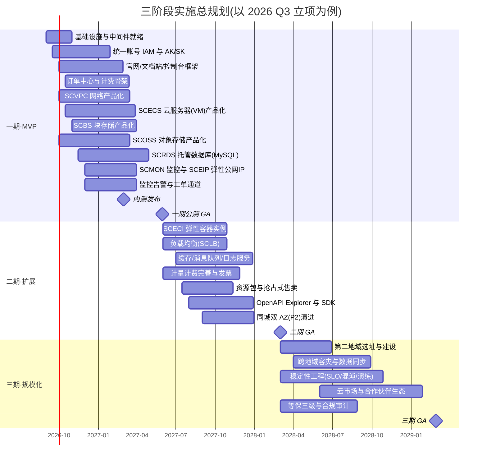
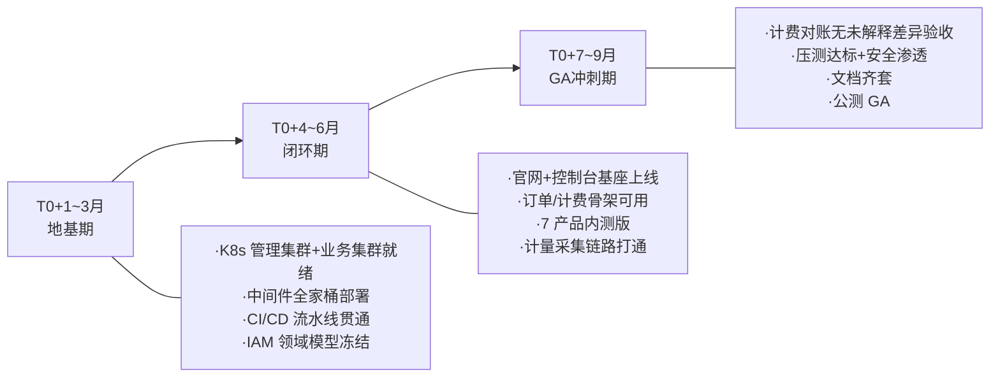
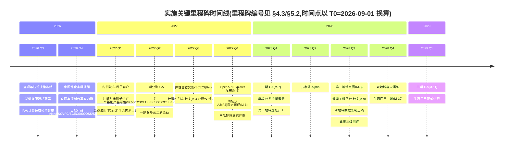
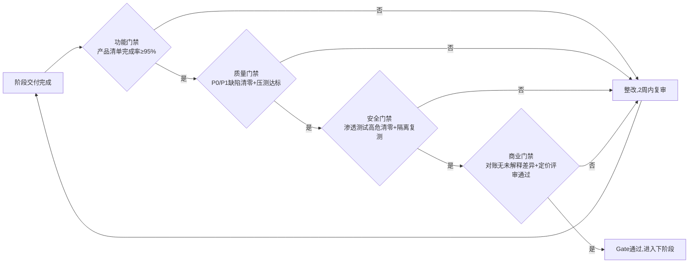
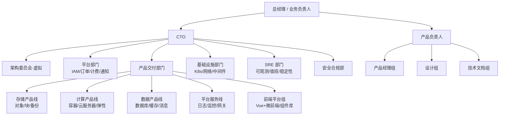
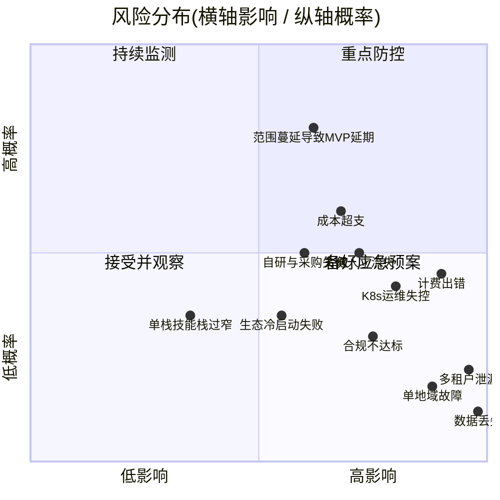
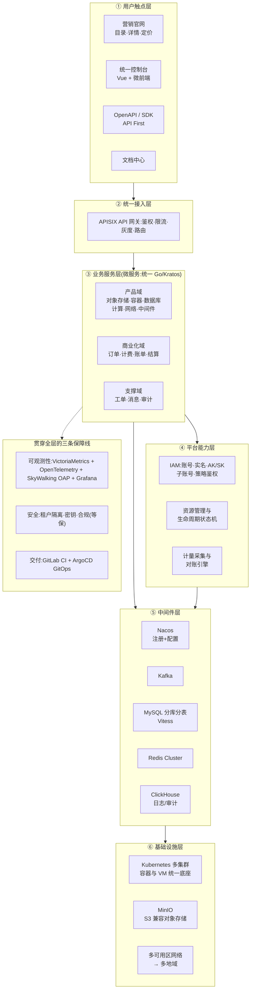

# 实施路线图与组织规划(09-roadmap)

> 本章是全书的收尾章节:把前九章沉淀的架构蓝图转化为"可执行的工程计划"。
> 内容覆盖:三阶段实施路线图、组织架构与人力配置、关键风险与应对、成本结构估算框架、Build vs Buy 决策清单,以及面向管理层的一页纸架构速览。
>
> 前置阅读建议:总体分层见《00-overview.md》,产品规划见《01-product-catalog.md》,技术选型基线见《04-middleware-infrastructure.md》。

---

## 目录

1. [本章定位与路线图设计原则](#1-本章定位与路线图设计原则)
2. [三阶段路线图总览](#2-三阶段路线图总览)
3. [一期(MVP):商业闭环最小骨架](#3-一期mvp商业闭环最小骨架)
4. [二期(扩展):产品矩阵与计费完善](#4-二期扩展产品矩阵与计费完善)
5. [三期(规模化):多地域、稳定性工程与生态](#5-三期规模化多地域稳定性工程与生态)
6. [里程碑时间线与阶段门禁](#6-里程碑时间线与阶段门禁)
7. [组织架构与人力配置](#7-组织架构与人力配置)
8. [关键风险清单与应对](#8-关键风险清单与应对)
9. [成本结构估算框架](#9-成本结构估算框架)
10. [Build vs Buy 决策清单](#10-build-vs-buy-决策清单)
11. [全书收尾:一页纸架构速览与章节索引](#11-全书收尾一页纸架构速览与章节索引)

---

## 1. 本章定位与路线图设计原则

### 1.1 本章解决什么问题

前面各章回答了"系统长什么样"(架构)、"由什么构成"(产品与模块)、"怎么保障"(安全/可观测/交付)。本章回答最后三个问题:

- **按什么顺序做**(三阶段路线图与阶段门禁);
- **谁来做、需要多少人**(组织架构与人力配置);
- **会踩什么坑、花多少钱、哪些不做**(风险清单、成本框架、Build vs Buy)。

> **本章权威性声明**:全书各章的**产品上架批次、阶段时间窗与可用性门禁值**以本章为**唯一事实源**——尤其是一期产品集(决策 D-01)、部署形态映射(§2.3,与《00-overview.md》§4.2 P1/P2/P3 一一映射)与一期 GA 验收(§3.5)。**部署拓扑以《00-overview.md》§4.2 为事实源,本章 §2.3 为其映射载体**(见《11-adjudication-decisions.md》裁决 C8+S15)。其他章节的批次/排期/口径描述若与本章不一致,以本章为准并回写该章。
>
> **编号约定**:本章路线图决策编号为 **D-0x**(D-01~D-05);§8 风险矩阵编号为 **Rxx**(R01~R15)。两套编号体系相互独立,不得混用。

### 1.2 路线图设计五原则

| # | 原则 | 含义 | 对应决策落点 |
|---|---|---|---|
| P1 | 商业闭环先于产品广度 | 账号→购买→计量→账单→欠费状态机这条链路,比任何单个云产品都优先 | 一期把 IAM+订单+计费列为与产品同级的交付物 |
| P2 | API First 贯穿始终 | 每个上线能力必须先有 OpenAPI 再有控制台,不允许"控制台先行、API 后补" | 阶段门禁硬性检查项,参见《03-backend-services.md》API 规范 |
| P3 | 模型 Day1 预留、实现按需 | region/可用区、多租户、分库分表键、AK/SK 等模型第一天建模,但部署形态单地域起步 | 一期 P1 单机房单 AZ(对齐《00-overview.md》§4.2),P2 起同城双 AZ,三期多地域 |
| P4 | 能封装开源就不自研内核 | 产品化 = 在成熟开源内核(MinIO/K8s/MySQL/Kafka)之上构建控制面、计量面、运维面 | Build vs Buy 清单(第 10 节) |
| P5 | 每阶段有明确"不做清单" | 范围蔓延是自建云平台第一大死因,每阶段显式列出推迟项 | 各阶段"非目标"小节 |

---

## 2. 三阶段路线图总览

### 2.1 三阶段一句话定义

| 阶段 | 时间窗(以 T0=立项为基准) | 主题 | 一句话目标 |
|---|---|---|---|
| 一期 MVP | T0 ~ T0+9 个月 | **跑通商业闭环** | 官网+控制台+账号+计费骨架+7 个可售产品(SCVPC/SCECS/SCBS/SCOSS/SCRDS/SCMON/SCEIP),实现"注册→购买→使用→出账→欠费治理"完整闭环 |
| 二期 扩展 | T0+9 ~ T0+18 个月 | **补齐产品矩阵与计费深度** | 产品数翻倍至 10+,四种计费形态齐备,OpenAPI 生态成形,完成同城双 AZ(P2)演进 |
| 三期 规模化 | T0+18 ~ T0+30 个月 | **规模化与可信度** | 多地域部署、稳定性工程(SLO/混沌/容灾演练)、生态与市场,具备对外规模化售卖条件 |

### 2.2 总体规划甘特图



> 日期为示例锚点。实际排期以立项日 T0 平移,关键约束是"一期 9 个月、二期再 9 个月、三期 12 个月+"的节奏比例,而不是绝对日期。换算示例:以 T0=2026-09-01 计,T0+6 月=2027-03(GA 内测)、T0+9 月=2027-05-31(GA 正式);全书统一使用"T0+N 月"表述,不使用裸日历月。
>
> 内测发布基于各产品 Alpha 版;甘特图任务条终点为该产品的产品化完成(GA 口径),故个别任务终点晚于内测里程碑属预期。**关键路径**:基础设施 → IAM → 订单/计费骨架 → SCECS/SCVPC 产品化 → 内测/GA(最长依赖链),其余任务条带浮动余量,关键路径延误将直接平移里程碑。

### 2.3 三阶段能力演进对照表

> 本表是 C8+S15 裁决的载体,09 一期/二期/三期 与《00-overview.md》§4.2 的 P1/P2/P3 一一映射,部署事实源为《00-overview.md》§4.2。

| 阶段 | 09 命名 | 00 命名 | 时间窗(以 T0=立项为基准) | 拓扑 | 可用性承诺 | AZ 形态 |
|---|---|---|---|---|---|---|
| 一期 MVP | 一期(内测→GA) | P1 | T0 ~ T0+9 月(T0+6 月 GA 内测、T0+9 月 GA 正式) | 单 IDC 单可用区 | 控制面≥99.9%、对象存储数据面≥99.95% | 单机房单 AZ |
| 二期 扩展 | 二期 | P2 | T0+9 ~ T0+18 月 | 同城双可用区双活 | 控制面≥99.95%、核心数据面≥99.99%(P2 目标) | 同城双 AZ |
| 三期 规模化 | 三期 | P3 | T0+18 月+ | 两地三中心(同城双活+异地灾备) | 关键数据 RPO≈0、RTO≤30min | 两地三中心(异地多活属 P3) |

**关键修正**:一期(0–9 月)对应 P1 单机房单 AZ(原"单地域双机房(同城)"修正为此);二期"同城三机房/三可用区"修正为"同城双 AZ(P2)",三 AZ 不在本期规划;异地多活写能力属 P3;MySQL HA 跨 AZ 用 MGR 单主(AZ 间 RTT<2ms,否则降级半同步,见《04-middleware-infrastructure.md》§6.9)。

| 能力域 | 一期 MVP | 二期 扩展 | 三期 规模化 |
|---|---|---|---|
| 可售产品数 | 7(SCVPC/SCECS/SCBS/SCOSS/SCRDS/SCMON/SCEIP) | 10~12(+SCECI/SCLB/缓存/消息队列/日志/云监控完整版) | 15~20(+CDN/域名 DNS/弹性伸缩进阶/AI 推理托管等) |
| 计费形态 | 包年包月 + 按量(两形态 Day1);免费试用=代金券(内测上线) | 四种形态齐备(含抢占式/资源包)+发票+成本分析 | 商务定价体系、大客户折扣、渠道分账 |
| IAM | 主账号+实名+AK/SK+基础策略 | RAM 式子账号、角色、策略模拟器 | 多账号组织、SSO/SAML、审计日志全量 |
| 部署形态 | 单 IDC 单可用区(P1) | 同城双可用区双活(P2) | 两地三中心(异地多活属 P3) |
| OpenAPI | 内部规范+每个产品全覆盖 | Explorer 在线调试+Go/Python SDK | Terraform Provider、生态集成 |
| 稳定性目标 | 控制面 99.9%/对象存储数据面 99.95% | 整体 99.95%(P2 目标),SLO 体系落地 | 99.99% 关键链路,混沌工程常态化 |
| 合规 | ICP 备案+实名+数据分级起步 | 等保二级 | 等保三级+定期渗透测试 |

---

## 3. 一期(MVP):商业闭环最小骨架

### 3.1 阶段目标与非目标

**目标(T0 ~ T0+9 个月)**

1. 打通"注册 → 实名认证 → 充值/下单 → 开通资源 → 计量采集 → 小时级出账 → 欠费锁定/释放"完整商业闭环;
2. 上线 7 个可售产品:**SCVPC(网络)、SCECS(云服务器 VM)、SCBS(块存储)、SCOSS(对象存储)、SCRDS(托管 MySQL)、SCMON(监控)、SCEIP(弹性公网 IP)**;
3. 官网 IA 三件套(目录→详情→定价)+ 文档中心骨架 + 统一控制台(微前端基座);
4. 平台底座:K8s 集群、APISIX 网关、Nacos、Kafka、MySQL/Redis、GitLab CI+ArgoCD、VictoriaMetrics+SkyWalking OAP+ClickHouse 可观测基线全部就绪。

**非目标(一期显式不做)**

| 推迟项 | 推迟理由 | 何时重提 |
|---|---|---|
| 弹性容器实例(SCECI) | 依赖 K8s 高级调度与弹性伸缩,工程难度高;VM 形态(SCECS)已是用户预期旗舰产品 | 二期(见 3.2 决策) |
| 资源包/抢占式售卖 | Day1 仅包年包月+按量两形态,资源包+抢占式后置二期(见《01-product-catalog.md》D6) | 二期 |
| 满减/折扣券 | 免费试用一期以代金券最小实现落地,满减/折扣券后置二期 | 二期 |
| 多地域 | 模型预留 region 字段,部署单 IDC 单 AZ(P1) | 三期 |
| 价格计算器 | 定价页先给静态档位表即可 | 二期可选 |
| 大数据/AI 类产品 | 依赖大量前置产品(存储/计算/调度),ROI 最低 | 三期之后 |

### 3.2 首批产品取舍决策(结论 + 理由 + 备选 + 改选条件)

> **决策 D-01:首批可售产品 = SCVPC(网络) + SCECS(云服务器 VM) + SCBS(块存储) + SCOSS(对象存储) + SCRDS(托管 MySQL) + SCMON(监控) + SCEIP(弹性公网 IP),共 7 个。SCECI(弹性容器实例)后置二期。**
>
> **理由**
> 1. VPC 是所有资源的网络边界与 ECS 前置依赖,ECS 需块存储做系统盘,VM 是用户预期的旗舰计算产品,这套组合满足《00-overview.md》§1.1"计算+存储+网络+托管数据库"最小可售闭环,与《01-product-catalog.md》§3.2 第一批矩阵一致;
> 2. 各产品的内核均为成熟开源组件(MinIO / K8s+KubeVirt / MySQL),自建部分集中在**控制面、计量面、运维面**,交付路径可控;
> 3. 对象存储是生态锚点(S3 兼容),开发者迁移成本最低,适合作为获客第一单品;
> 4. 产品运行在 K8s 之上,与《06-kubernetes-productization.md》的容器平台产品化路线天然复用,避免同时维护两套资源底座;
> 5. SCECI 依赖 K8s 高级调度与弹性伸缩,工程难度高,后置二期(见二期新增清单)。
>
> **备选方案 A**(已否决):以对象存储+弹性容器实例+托管 MySQL 为一期组合、VM 与 VPC 后置二期——本方案被否决,理由是 VM 是用户预期旗舰产品、VPC 是 ECS 前置依赖、ECI 依赖 K8s 高级调度难度高(裁决见《11-adjudication-decisions.md》C1+S1)。
> **备选方案 B**:只做对象存储单产品,极致收敛,6 个月上线。
>
> **何时改选**
> - 改选 B:团队规模 < 15 人或融资节奏要求 6 个月内必须有收入,先以对象存储单品验证商业闭环,其余产品顺延。

> **决策 D-02:一期网络能力以 SCVPC(VPC+子网+安全组+弹性公网 IP)落地,基于 K8s 网络模型 + Calico/Cilium 承载。**
>
> **理由**:VPC 是 ECS 及后续所有资源的网络边界与前置依赖,一期必须随计算同步上线;一期用户规模下,K8s NetworkPolicy + APISIX(七层)+ NodePort/LB(四层)即可交付"隔离 + 负载均衡"的核心体验,SDN(Overlay/虚拟交换机)深度特性后置二期完善。
> **备选**:直接上 Calico BGP + 自研控制面模拟 VPC。
> **何时改选**:二期产品清单包含"专有网络 VPC 进阶特性"时,按《06-kubernetes-productization.md》网络产品化方案落地;一期代码中资源模型必须已带 `vpc_id` 占位字段。

### 3.3 一期上线清单(按交付域)

| 交付域 | 交付物 | 负责团队 | 交叉引用 |
|---|---|---|---|
| 官网 | 首页、全部产品页、7 个产品详情页、定价页、注册/登录 | 前端组+产品组 | 《01-product-catalog.md》《02-frontend-architecture.md》 |
| 文档站 | 文档框架、每产品产品简介+计费说明+快速入门+API 参考(自动生成)、FAQ | 技术文档工程师+各产品组 | 《01-product-catalog.md》 |
| 控制台 | Wujie 微前端基座、全局导航/搜索/最近访问、按产品大类合并的子应用(console-compute/console-network/console-storage/console-database/console-security/console-account/console-billing/console-monitor) | 前端组 | 《02-frontend-architecture.md》 |
| IAM | 注册/登录/实名认证、AK/SK 管理、基础 RBAC 策略、MFA(二期完善) | 平台组 | 《07-security.md》 |
| 商业化 | 订单中心(新购/续费/退订)、包年包月+按量计费、小时级出账、余额/充值、欠费状态机;免费试用代金券最小实现 | 计费组 | 《03-backend-services.md》 |
| 产品×7 | SCVPC(网络)、SCECS(云服务器 VM)、SCBS(块存储)、SCOSS(对象存储)、SCRDS(托管 MySQL)、SCMON(监控)、SCEIP(弹性公网 IP) | 产品线组 | 《06-kubernetes-productization.md》 |
| 平台底座 | K8s 多集群、APISIX、Nacos、Kafka、MySQL 分库分表(Vitess,account_id 单键分片)、Redis Cluster | 基础设施组 | 《04-middleware-infrastructure.md》 |
| 可观测 | VictoriaMetrics(长期指标)+ SkyWalking OAP(trace,trace-ES 存储)+ 搜索 ES(三类搜索)+ ClickHouse 日志、统一告警出口 | SRE 组 | 《05-data-observability.md》 |
| 交付体系 | GitLab CI 流水线模板、ArgoCD GitOps、灰度发布规范 | SRE 组 | 《08-devops-delivery.md》 |
| 支持通道 | 工单系统(一期可用成熟开源/轻量自研)+ 值班响应 SLA;支持计划模型四档,一期先开放基础/商业两档 | 平台组 | 《01-product-catalog.md》 |

### 3.4 一期架构里程碑(季度分解)



一期基础设施部署规模建议(起步配置,按《04-middleware-infrastructure.md》容量方法扩展;本表即 S22 裁决"一期规模假设基线表"的载体,各章容量估算统一引用):

| 组件 | 一期规模 | 说明 |
|---|---|---|
| K8s 管理集群 | 3 master + 3 worker(各 8C16G) | 承载平台控制面服务 |
| K8s 业务集群 | 6~10 worker(32C128G) | 承载租户容器实例与托管数据库实例(非 12~20 台 16C64G)
| 数据库 | MySQL account_db/trade_db 各 2×16 起步(二期扩至 8×16,见《04-middleware-infrastructure.md》§6.3 基线与本章 §4.3),account_id 单键分片,Vitess | 每库 1 主 2 从 MGR |
| Redis Cluster | 6 节点(3 主 3 从,16GB) | 会话/缓存/限流 |
| Kafka | 3 broker(8C16G,2×1TB NVMe,KRaft) | 计量事件/订单事件 topic,环境隔离靠集群隔离(见《04-middleware-infrastructure.md》§5.3) |
| MinIO | 4~8 节点,纠删码 EC:4 | 对象存储底座 + 平台自身备份桶 |
| ClickHouse | 6 节点(3 分片×2 副本,16C/64G/2TB) | 日志+计量+审计 |
| APISIX | 4 节点(4C8G)+ etcd 3 节点(独立 PV 50GB) | 南北向统一入口 |
| 搜索 ES | 3 master+3 data(8C32G/500GB) | 三类搜索专用 |
| trace-ES | 3 节点(16C/64G/2TB,保留 7~15 天) | SkyWalking OAP 专用,与搜索 ES 物理隔离 |

**一期规模假设基线表**(S22 裁决载体,各章容量估算统一引用):

| 指标 | 一期(MVP)取值 | 说明 |
|---|---|---|
| 注册租户数 | 1000 | 含活跃付费约 500 |
| 活跃用户 | 1 万 | 日活 |
| 在管资源实例数 | 5 万 | 计费资源口径 |
| 微服务数 | 17(一期) | 二/三期扩至 50+(名单以《03-backend-services.md》§4.0 总表为准) |
| Pod 数 | 约 200 | 管控面 |
| OpenAPI 峰值 QPS | 2000 | 鉴权目标 5k QPS(缓存命中后) |
| 网关峰值 QPS | 8000 | = OpenAPI 2000 + 控制台 + BFF 合计 |
| 审计写入峰值 | 2 万/s | 审计写入峰值(非网关 QPS) |
| 计量吞吐 | 均值 250 条/s、峰值 1250 条/s | 组件设计容量 10k msg/s(见《03-backend-services.md》§4.2.5) |
| Trace 采样 | 网关 10% 采样 + 错误/慢调用 100% 尾采样 | — |

### 3.5 一期验收标准(GA 门禁,量化)

| # | 验收项 | 标准 | 验收方式 |
|---|---|---|---|
| A1 | 商业闭环 | 注册→下单→开通→计量→出账→欠费停服→释放,全流程演练通过 | 端到端测试报告 |
| A2 | 计费正确性 | 计量→账单**无未解释差异(covered_ratio=100%)**;多计费/少计费缺陷 0 个未关闭 | 7 天影子对账+财务签字 |
| A3 | OpenAPI 覆盖 | 7 产品全部能力 API 化,控制台无 API 外特权操作 | API 清单审计 |
| A4 | 可用性 | 控制面 ≥99.9%(月度),对象存储数据面 ≥99.95%,数据持久性 ≥99.9999999%(纠删码设计口径,与《00-overview.md》§1.4 一致) | 压测+SLO 试算 |
| A5 | 性能 | 控制台 P95 < 2s;创建云服务器实例 P95 < 60s;对象存储单桶 1 万 QPS 无降级 | 压测报告 |
| A6 | 安全 | 第三方渗透测试高危 0;租户隔离用例(跨租户读写/列举)100% 拦截 | 渗透报告 |
| A7 | 文档 | 每产品:产品简介+计费说明+快速入门+API 参考四篇;文档评审通过 | 文档清单 |
| A8 | 故障恢复 | P0 故障 MTTR ≤ 30min,完成 1 次全链路故障演练 | 演练复盘 |
| A9 | 交付 | 全部服务 GitOps 化,从合并到生产 ≤ 30min,可一键回滚 | 流水线审计 |
| A10 | 商业验证(观察项,非一票否决) | 种子客户 ≥10 家完成真实下单→开通→出账全流程;欠费状态机已对客透明公示 | 种子客户清单+出账抽样对账报告 |

---

## 4. 二期(扩展):产品矩阵与计费完善

### 4.0 二期实装状态回写(2026-08)

> 本小节是**实装追溯**(what was built),与 §4.1~§4.4 的**规划意图**(what is planned)并存。路线图保留前瞻性表述(T0+N 月…上线);实装结果在此单点回写,供全书交叉引用。口径与一期一致:**Go-first source-only**——Go 代码静态校验通过即视为本里程碑达成,非 Go 产物交付完整源码 + 静态校验,不声称已构建。

**里程碑实装状态(截至 2026-08-16):**

| 里程碑 | 规划时间点 | 实装状态 | 实装证据(代码路径) |
|---|---|---|---|
| M-4 计费四形态 | T0+12 月 | ✅ 已交付 | `pkg-go/reservepack`(额度账本 Consume/Refund/Expire/SweepExpired + `ToPool` 适配 billing.Pool rank 0)+ `pkg-go/spot`(浮动价引擎 + provision `Preemptor` 可选接口 + resource `StatePreempting`)+ `pkg-go/invoice`(Book 红冲=全额负数发票,原票 VOIDED 终态不可逆)+ `billing.CostReport`/`CostAnalysis`;svc-billing 接入资源包购买/到期扫描/发票/成本分析端点;DDL V2/V3 |
| M-5 OpenAPI 生态 | T0+13 月 | ✅ 已交付 | `pkg-go/scsdk`(Go SDK,Call 用 cps1.Sign)+ `sdk/python`(独立实现,7 golden vectors 跨语言逐字节回归通过)+ svc-api-meta Explorer(`/api/v1/apimeta/explorer` 复用 cps1 单源)+ `proto-hub/VERSIONING.md` + `tools/check-proto-breaking.py`(CI 门禁,699 fields) |
| M-6 双可用区(P2) | T0+15 月 | ✅ 已交付 | `pkg-go/topology`(Region/AZ 模型 + 失效存活推理,断言 2-AZ MGR 只在较轻侧存活)+ svc-catalog `RegionScope`(ZONAL 询价强制 zoneId)+ DDL `az_id` + `deploy/.../middleware/`(Kafka KRaft/MySQL MGR/Redis Cluster 跨 AZ manifest)+ Helm `topologySpreadConstraints` + `tools/check-topology-spread.py`(CI 门禁)+ `tools/az-failover-drill.md` |
| M-7 产品矩阵 GA | T0+18 月 | ✅ 已交付 | 6 新产品经四构件范式(CRD + Operator MockDriver 门槛 06§6.3 + 前端子应用):SCECI/SCLB/SCAS/SCBACKUP/SCREDIS + RAM 子账号(策略模拟器复用 authz Deny-first 引擎);新增域包 `autoscaling`/`backup`;`pkg-go` 26 包 353 测试全绿;5 `rc-*` demo 全部通过 MockDriver 验收 |

**二期新增产品实装清单(对应 §4.2):**

| §4.2 计划产品 | 优先级 | 实装状态 | 说明 |
|---|---|---|---|
| 弹性容器实例 SCECI | P0 | ✅ 已交付(M-7.1) | ZONAL 按秒计费,`DriverK8s`;询价 DurationUnit 从规则派生(`pricing.PricingRule.Active/Specificity` 导出)——新计费粒度=目录行非代码分支 |
| 负载均衡 SCLB | P0 | ✅ 已交付(M-7.2) | REGIONAL CrossAZ,四层+七层按用量计费(LCU/traffic) |
| 缓存 SCRedis 托管版 | P1 | ✅ 已交付(M-7.5) | 复用 M-6.2a redis-cluster 跨 AZ 拓扑,ZONAL HA 主备,prepay/postpay 双形态 |
| 消息队列 SCKafka 托管版 | P1 | ✅ 已交付(M-7.5) | 复用 M-6.2a kafka-kraft 跨 AZ 拓扑,ZONAL,prepay/postpay |
| 日志服务 | P1 | ✅ 已交付(M-7.5) | REGIONAL,Vector+ClickHouse 内核,`ingestion_gb` 按量 + `storage_gb_hour` |
| 云监控完整版 | P1 | ⏸ 延后三期 | 一期 SCMON 已售卖基础监控告警;高级告警(alert-center)产品化未在二期实装,落三期 |
| 弹性伸缩 SCAS | P2 | ✅ 已交付(M-7.3) | `pkg-go/autoscaling` 策略引擎(deny-first + cooldown + min/max 钳制),策略层(WHAT)与 HPA/VPA/CA 执行面分离 |
| 云备份 SCBACKUP | P2 | ✅ 已交付(M-7.4) | `pkg-go/backup`(NextRun/IsDue/ExpiredSnapshots 保留期强制,0=永久) |

**二期验收门禁(§4.4)实装核对:**

| # | 验收项 | 实装状态 | 实装证据 |
|---|---|---|---|
| B1 | 计费深度 | ✅ 通过 | 四形态全流程单测绿;资源包抵扣 `TestWaterfallIntegration` rank 0 优先 700/现金 300;抢占式回收链路 `PREEMPTING` 态 |
| B2 | 产品数 | ✅ 通过 | GA 产品 13 个(一期 7 + 二期 SCECI/SCLB/SCAS/SCBACKUP/SCREDIS/SCKafka/SCLog)> 10,全部经 MockDriver 门槛 |
| B3 | 可用性 | ✅ 模型层通过 | RTO≤5min:topology 失效存活数学断言 + az-failover-drill.md runbook(2-AZ MGR 只在较轻侧存活是 P2 边界,完整 either-AZ 需 3 AZ P3) |
| B4 | OpenAPI | ✅ 通过 | Explorer 覆盖 5 seed actions;SDK Go+Python;`check-proto-breaking.py` CI 检测破坏性变更 0 |
| B5 | 租户隔离 | ✅ 通过 | 新增产品四元标签 + account_id 上下文拦截;account_id 网关注入 `X-Sc-Account-Id`,缺则 403 |
| B6 | 财务合规 | ✅ 模型层通过 | invoice 红冲(全额负数发票,原票 VOIDED 终态不可逆,幂等 void)+ 退款 `ledger.Refund` + `order.TypeRefund` |
| B7 | 运营能力 | ✅ 通过 | 免费试用防薅引擎 `pkg-go/trial`(六规则固定次序逐条裁定:实名前置→在途/终身限额→证件去重→冷静期→全局预算)+ 三类代金券 `pricing.CouponKind`(满减/折扣含封顶/定额,抵扣次序固定 RATE→THRESHOLD→VOUCHER)+ svc-order `/api/v1/trial/{claim,status}` + svc-catalog V3 DDL;异常用量检测已随三期交付(`pkg-go/anomaly`) |

> **延后三期的项**:云监控高级告警产品化、异常用量检测、第二物理地域、云市场/ISV、大数据/AI 平台。其中 SCKafka/日志服务原计划为"M-7.5 可选扩展(时间允许则做,否则落三期)",二期已补做交付(详见 §4.2)。
>
> **关键实装原则**(供三期与新产品参考):① 新计费粒度是目录行而非代码分支(询价 DurationUnit 从规则派生);② 导出引擎内部选择逻辑而非 fork(`PricingRule.Active/Specificity`、cps1 单源签名、authz 模拟器复用引擎 Deny-first);③ 托管产品=平台中间件运维经验产品化(SCRedis/SCKafka 直接复用 M-6.2a 跨 AZ manifest);④ MockDriver 验收门槛是 source-only 期唯一的真供给全链路测试。

**二期收尾实装(2026-08-28 补充)— B7 试用体系 / MFA / VMDriver / IPAM:**

| 项 | 实装状态 | 实装证据(代码路径) |
|---|---|---|
| B7 免费试用体系(§4.1 目标 2"免费试用代金券扩展为完整试用体系") | ✅ 已交付 | `pkg-go/trial`(六规则防薅引擎,`Admit` 固定次序返回首个拒绝规则:实名前置→在途限额→终身限额→证件去重→冷静期→全局预算)+ `pricing.CouponKind` 三类券(THRESHOLD 满减/RATE 折扣含封顶/VOUCHER 定额;`applyCoupons` 固定次序 RATE→THRESHOLD→VOUCHER,同类不叠加;`Kind ""` 按 VOUCHER 兼容一期存量行)+ svc-order `POST /api/v1/trial/claim`/`GET /api/v1/trial/status`(领取即发券入 t_coupon,幂等;状态端点事前预检资格)+ svc-catalog `sql/V3__b7_coupon_kinds_and_trial.sql`(`t_trial_activity`/`t_trial_record`/`t_trial_identity` 三表 + `t_coupon` 加 kind/threshold/rate_bp/cap_amount) |
| MFA 强制登录(§3.3 IAM 行"MFA 二期完善") | ✅ 已交付 | `pkg-go/totp`(RFC 6238,±1 窗口,`Verifier` 防重放——同一时间步的码仅可消费一次)+ svc-iam web-auth 登录两步流(密码正确且 mfaEnabled → 返回 `mfa_required` 挑战令牌,挑战令牌≠访问令牌,不可当 Bearer 用)+ `POST /api/mfa/{bind,verify,unbind}`(TOTP 种子仅以 `kms.PurposeUser` 信封密文落库,验证时解密;绑定需激活码生效,解绑需活体码);`TestMFALoginCodeReplayRejected`/`TestMFAChallengeTokenIsNotAnAccessToken` 断言两条底线 |
| VMDriver 真实实现(§4.2 决策 D-03/R-03:KubeVirt) | ✅ 已交付 | `provision.NewVMDriver`(KubeVirt 对象契约:VirtualMachine=客户持有对象,Halted=欠费冻结停机不删盘;VMI Ready=计费起点;冻结/恢复=runStrategy 一个字段;`CollectUsage` 按秒窗口整数算术输出 `cpu_core_hour`/`mem_gb_hour`,非 Ready 不计费)+ `MemoryVMClient`(进程内 KubeVirt 控制回路,含异步启动;集群部署换 kubevirt client-go 适配器,接口不变;rc-compute 场景[5] 在退役前已实跑"改绑虚拟化后端→下发→就绪→计量"全链路,此后由 `vmdriver_test.go` 承接) |
| VPC 子网 IPAM(§3.2 D-02 改选条件"二期 VPC 进阶特性"的第一步:CIDR 规划) | ✅ 已交付 | `pkg-go/ipam`(`SubnetAllocator`:VPC 必须 RFC1918 且 /8~/24;first-fit 确定性分配天然对齐;`Reserve` 用户指定段过同一防重叠检查;`Release` 幂等且回洞复用;`IPAllocator`:网络/网关/广播三地址保留,客户地址自 base+2 起,`AllocateSpecific` 拒绝保留/占用地址;测试含 64 块两两不重叠暴力断言) |

### 4.1 阶段目标与非目标

**目标(T0+9 ~ T0+18 个月)**

1. 产品数从 7 扩展到 10~12,形成"计算+存储+网络+数据库+中间件+可观测"的完整骨架类目;
2. 计费形态齐备:在 Day1 包年包月+按量基础上,补齐抢占式实例、资源包/储值卡;上线发票、成本分析;免费试用代金券在二期扩展为完整试用体系;
3. OpenAPI 生态成形:OpenAPI Explorer 在线调试、Go/Python SDK、API 版本化与兼容性承诺(语义化版本+弃用政策);
4. 完成同城双 AZ(P2)演进,托管 MySQL/云服务器支持跨可用区高可用(三 AZ 不在本期规划,异地多活属 P3);
5. RAM 式子账号与角色体系上线(见《07-security.md》)。

**非目标(二期显式不做)**

| 推迟项 | 推迟理由 | 何时重提 |
|---|---|---|
| 第二物理地域 | 可用区级高可用先满足,地域级灾备投入大 | 三期 |
| 云市场/第三方 ISV | 自营产品未站稳前开放市场,稀释质量口碑 | 三期 |
| 大数据/AI 平台类 | 依赖产品矩阵成熟度 | 三期之后 |
| 混合云/专有云输出 | 交付形态剧变,组织不具备 | 三期评估,默认不做 |

### 4.2 二期新增产品清单

| 产品 | 内核策略 | 优先级 | 说明 |
|---|---|---|---|
| 弹性容器实例(SCECI) | 基于 K8s 高级调度与弹性伸缩封装 | P0 | 一期后置;按量计费最佳搭档,补齐"弹性计算"心智 |
| 负载均衡(SCLB,四七层) | APISIX(七层)+ LVS/IPVS(四层)产品化 | P0 | 与 SCVPC 联动 |
| 缓存(SCRedis 托管版) | Redis 集群托管化 | P1 | 复用平台自身 Redis 运维经验 |
| 消息队列(SCKafka 托管版) | Kafka 集群托管化 | P1 | 复用平台自身 Kafka 运维经验 |
| 日志服务 | Vector + ClickHouse 产品化(多租户 topic/表) | P1 | 与《05-data-observability.md》同构,吃自己的狗粮 |
| 云监控完整版 | 多租户指标与对客高级告警规则产品化(alert-center;alert-engine 一期已上线) | P1 | 一期 SCMON 已售卖基础监控与告警,二期产品化高级告警并对客 |
| 弹性伸缩 | 基于云服务器/容器实例的策略引擎 | P2 | 按量计费最佳搭档 |
| 云备份/快照策略 | 定时快照+跨可用区备份 | P2 | 数据可靠性卖点 |

> **决策 D-03:弹性容器实例(SCECI)与二期云服务器增强统一复用一期已建成的 K8s 运维体系,VM 形态(SCECS)在一期已以 KubeVirt on K8s 路线交付。**
>
> **理由**:① 复用一期已建成的 K8s 运维体系(调度/监控/发布/多集群),不新建一套虚拟化管理栈;② KubeVirt 将 VM 抽象为 K8s CRD,与容器实例共享控制面框架,计量/生命周期状态机直接复用;③ 团队技能收敛在 K8s 一条线上,降低多栈运维风险(见第 8 节风险 R03)。
> **备选**:自研 IaaS 控制面(libvirt+KVM+自研调度)或 OpenStack 封装。
> **何时改选**:当 VM 规模超过 5000 台、出现 KubeVirt 性能/网络特性硬瓶颈,或需要裸金属/嵌套虚拟化等 KubeVirt 不支持的形态时,启动自研 IaaS 控制面评估,届时按《06-kubernetes-productization.md》的演进口径立项。

### 4.3 二期架构里程碑

| 里程碑 | 时间点 | 内容 |
|---|---|---|
| M-4 计费四形态 | T0+12 月 | 抢占式回收链路、资源包抵扣引擎上线(承接一期决策 D6 后置项);对账扩展到"抵扣→账单→发票"三段 |
| M-5 OpenAPI 生态 | T0+13 月 | Explorer 上线;SDK Go/Python 发布;API 网关层统一签名鉴权(见《07-security.md》§4.1 CPS1-HMAC-SHA256) |
| M-6 双可用区(P2) | T0+15 月 | 同城双 AZ:Kafka/MySQL/Redis 全部跨 AZ 部署;数据面故障域切换演练通过(三 AZ 不在本期规划,异地多活属 P3) |
| M-7 产品矩阵 GA | T0+18 月 | 10+ 产品通过统一 GA 门禁(第 6 节);NPS 与工单 SLA 达标 |

二期基础设施扩容方向:MySQL 扩至 8×16 基线、Kafka 6 broker、ClickHouse 维持 6 节点(3 分片×2 副本)并按产品线拆库、VictoriaMetrics 引入多租户(accountID)能力并对客切流(一期已自用长周期指标;remote_write 双写对比 ≥1 周后切流,见《10-research-and-selection-decisions.md》§4.4 兼容性坑清单)、APISIX 按业务域拆集群隔离爆炸半径。

### 4.4 二期验收标准

| # | 验收项 | 标准 |
|---|---|---|
| B1 | 计费深度 | 四种计费形态全流程无未解释差异;资源包抵扣准确率 100% |
| B2 | 产品数 | ≥10 个 GA 产品,全部通过统一 GA 门禁 |
| B3 | 可用性 | 关键产品 SLA 对外承诺 99.95%;可用区级故障切换 RTO ≤ 5min |
| B4 | OpenAPI | Explorer 覆盖 100% API;SDK 覆盖 Go/Python;破坏性变更 0 次 |
| B5 | 租户隔离 | 网络(VPC)+数据+控制面三维度隔离复测通过,含新增 7 个产品 |
| B6 | 财务合规 | 发票、红冲、退款链路通过财务与税务评审 |
| B7 | 运营能力 | 免费试用(代金券)限额防薅羊毛策略生效;异常用量检测上线 |

---

## 5. 三期(规模化):多地域、稳定性工程与生态

### 5.0 三期实装状态回写(2026-08)

> 本小节是**实装追溯**(what was built),与 §5.1~§5.3 的**规划意图**(what is planned)并存。路线图保留前瞻性表述(T0+N 月…上线);实装结果在此单点回写,供全书交叉引用。口径与一期/二期一致:**Go-first source-only**——Go 代码静态校验通过即视为本里程碑达成,非 Go 产物交付完整源码 + 静态校验,不声称已构建。

**里程碑实装状态(截至 2026-08-19):**

| 里程碑 | 规划时间点 | 实装状态 | 实装证据(代码路径) |
|---|---|---|---|
| M-8 第二地域点亮 | T0+22 月 | ✅ 已交付 | `pkg-go/multiregion`(Region 主备/`Classify` 全局vs地域/`ClassifyState` 共享·复制·重建/`MeetsRPO`·`MeetsRTO`≤30min,region 命名委托 identifier 不 fork)+ `pkg-go/event.SysReplicationStatus` + `deploy/gitops-manifests/envs/` 重构为 `envs/<region>/<env>/`(applicationset 加 region 维度)+ `platform/middleware/minio-replication.yaml`(异地对象存储异步复制)+ `svc-orchestrator/sql/V3__resource_db_region_topology.sql`(`region_replication_status` 复制水位 + `v_resource_by_region`/`v_resource_region_failover_impact`) |
| M-9 稳定性平台 | T0+24 月 | ✅ 已交付 | `pkg-go/slo`(错误预算=1−SLO、多窗口多燃烧率 1h·14.4× page / 3d·1× ticket、预算政策 <50% 降频/耗尽冻结、`CanCommitSLA` 两季门禁)+ `pkg-go/chaos`(6 必练科目、prod 演练 10min 终止 + 限定爆炸半径、偏差>50% 立项)+ `tools/chaos-drill-runbook.md`(季度演练载体:6 科目/staging 先行/prod 终止手段/归档判定)+ `pkg-go/release`(金丝雀 5→20→50→100、门禁 success≥0.995/p99≤1.5s、expand-contract 观察 ≥7 天、git revert 优先) |
| M-10 生态门户 | T0+27 月 | ✅ 已交付 | `pkg-go/settlement`(分账 partner+platform≡gross 精确)+ `services/svc-marketplace`(上架审核 PENDING→APPROVED/REJECTED + 分账幂等,proto `marketplace/v1` + DDL + Helm + :9212)+ `sdk/terraform`(Provider 骨架,复用 scsdk/cps1 单源签名,SCECS/SCOSS/SCVPC/SCRDS 四资源,source-only)+ 开发者社区(`devops-explorer` Community 视图:文档/示例/社区入口,M-10.3) |
| M-11 三期 GA | T0+30 月 | ✅ 模型层通过 | `tools/cross-region-failover-drill.md`(异地冷转热+DNS 切换,RPO≤5min/RTO≤30min,分层于 az-failover-drill)+ `tools/dengbao-level3-checklist.md`(等保三级要点自查 + 审计留存三档口径) |

**三期验收门禁(§5.3)实装核对:**

| # | 验收项 | 实装状态 | 实装证据 |
|---|---|---|---|
| C1 | 多地域 | ✅ 模型层通过 | `multiregion.Validate`(恰一 PRIMARY、standby>300km)+ `Classify`(IAM/计费 GLOBAL 单例)+ 跨地域演练 runbook;全局服务主备自动切换由 cn-east-1 冷备 override 建模 |
| C2 | 稳定性 | ✅ 模型层通过 | `slo`(99.99% 关键链路可用性目标进平台 SLO seed)+ `chaos`(季度演练 6 科目 + prod 10min 终止)+ `tools/chaos-drill-runbook.md`(演练载体);P0 MTTR ≤15min 为 08§1.2 成熟期目标,slo/chaos 是达成载体 |
| C3 | 生态 | ✅ 模型层通过 | `svc-marketplace` 上架/分账闭环 + `sdk/terraform` 覆盖 4 核心产品 + `devops-explorer` 开发者社区入口(≥20 第三方上架是运营指标,交易闭环模型已备) |
| C4 | 合规 | ✅ 模型层通过 | `dengbao-level3-checklist.md` + 审计留存口径(03§4.4.3 权威:180 天热存+MinIO 冷备,365 天/18 个月付费档)三章同步 |
| C5 | 成本 | ✅ 模型层通过 | `settlement` 分账金额精确(pricing.Amount 固定点);FinOps 产品线成本分摊的计量面由 `pkg-go/metering` + `billing.CostReport` 承接 |

**二期延后项(§4.0"延后三期的项")三期补做:**

| 延后项 | 实装状态 | 实装证据 |
|---|---|---|
| 云监控高级告警产品化(alert-center) | ✅ 已交付 | `pkg-go/alertcenter`(4 级收敛 去重/分组/抑制/静默 + 单租户 10 条/分钟限流)+ `services/alert-center`(:9213,ingest/flush/alerts,ClickHouse 告警历史 DDL)+ Helm chart |
| 异常用量检测 | ✅ 已交付 | `pkg-go/anomaly`(z-score 检测,平基线除零→有限哨兵分数)+ `svc-metering /api/v1/metering/anomaly-scan`(判决是信号,非计费决定) |
| 第二物理地域 | ✅ 已交付(M-8) | 见 M-8 行(`multiregion` + 多地域 IaC) |
| 云市场/ISV | ✅ 已交付(M-10) | 见 M-10 行(`svc-marketplace`) |
| STS 临时凭证 | ✅ 已交付 | `pkg-go/sts`(AssumeRole → 临时 AK/SK/Token,TTL 必正、到期即失效)+ `svc-iam /api/sts/assume-role` |
| 大数据/AI 平台 | ⏸ 仍后置 | 09§5.1 非目标/01§1.2 决策 D1"第三批或更后";三期不启动(规划口径不变) |

> **关键实装原则**(供四期/新产品参考):① region 模型"预留→实装"靠新包分层而非改旧包——`multiregion` 管跨地域、`topology` 仍管 AZ 级,两套承诺(00§4.4 vs §4.5)不混;② 全局服务集是封闭小集合,`Classify` 列全量目录、未知名拒绝(防 typo 静默误放);③ Kafka 跨地域是"重建"不是"复制"(00§4.5),`ClassifyState` 显式编码 REBUILT;④ 稳定性/生态/合规的"模型层通过"延续 source-only 口径——引擎与门禁是 tested Go 代码,演练与测评是静态 runbook/清单,不声称已在真实集群执行。

### 5.1 阶段目标与非目标

**目标(T0+18 ~ T0+30 个月)**

1. **多地域**:第二地域(异地)建成,核心产品(IAM/计费/对象存储/容器/数据库)支持跨地域部署与数据复制;region 模型从"预留"转为"实装";
2. **稳定性工程**:SLO 体系全产品覆盖、混沌工程常态化(季度级故障演练)、变更三板斧(可灰度/可监控/可回滚)强制执行、P0 MTTR ≤ 15min;
3. **生态与市场**:云市场(镜像/SaaS/服务)最小版、合作伙伴与渠道分账、Terraform Provider、API 集成生态;
4. **合规升级**:等保三级、年度渗透测试、数据出境/个人信息保护流程化;
5. **FinOps**:内部成本核算到产品线,毛利率报表,容量水位驱动的采购预测。

**非目标**:自建 IDC(优先租赁合规机房/合作机房)、出海地域、端侧/边缘计算——均留待三期之后的独立立项评估。

### 5.2 三期架构里程碑

| 里程碑 | 时间点 | 内容 |
|---|---|---|
| M-8 第二地域点亮 | T0+22 月 | 新地域 K8s+中间件全家桶复制部署( IaC 一键拉起,见《08-devops-delivery.md》);IAM/计费全局单例 + 地域级数据复制方案上线 |
| M-9 稳定性平台 | T0+24 月 | 混沌演练平台、预案库、故障注入常态化;SLO 燃尽看板进管理层周会 |
| M-10 生态门户 | T0+27 月 | 云市场交易闭环(上架审核/分账/结算)、开发者社区 |
| M-11 三期 GA | T0+30 月 | 双地域容灾切换演练通过(RPO ≤ 5min / RTO ≤ 30min 核心链路);等保三级测评通过 |

### 5.3 三期验收标准

| # | 验收项 | 标准 |
|---|---|---|
| C1 | 多地域 | 核心链路地域级故障切换演练通过;全局服务(IAM/计费)双活或主备自动切换 |
| C2 | 稳定性 | 全年 P0 ≤ 2 次;关键产品对外 SLA 99.99% 档可售;混沌演练每季度 ≥1 次 |
| C3 | 生态 | ≥ 20 个第三方镜像/应用上架;Terraform Provider 覆盖核心产品 |
| C4 | 合规 | 等保三级测评通过;审计日志留存满足监管要求(平台合规基线 ≥180 天热存 ClickHouse+MinIO 冷备,售卖产品提供 365 天/18 个月付费档,见《03-backend-services.md》§4.4.3) |
| C5 | 成本 | 产品线成本分摊误差 ≤5%;单位收入基础设施成本环比下降 |

---

## 6. 里程碑时间线与阶段门禁

### 6.1 关键里程碑时间线



### 6.2 阶段门禁(Gate)机制

每个阶段出口设一次正式 Gate 评审,未过 Gate 不得进入下一阶段规模化投入。评审由架构委员会主持,产品、SRE、安全、财务四方会签。



| 门禁 | 一票否决项(任一不满足即失败) |
|---|---|
| 功能 | OpenAPI 覆盖率 100%(控制台无 API 外特权);文档齐套 |
| 质量 | 未关闭 P0/P1;SLO 未达标;回滚不可用 |
| 安全 | 高危漏洞未修复;跨租户隔离用例失败;密钥明文存储 |
| 商业 | 计量对账存在未解释差异;欠费状态机未对用户透明公示 |
---

## 7. 组织架构与人力配置

### 7.1 组织设计原则

1. **一期按职能,二期起按产品线**:一期人少,按职能组队(平台/产品/前端/SRE)最大化复用;二期产品数翻倍后,产品线组转为"产品小队(产品+研发+测试三角)",平台组转为共享平台部门;
2. **商业化团队独立建制**:IAM+订单+计费是全局中枢,必须独立团队+资深负责人,不允许摊派到产品线兼职(对标启示 2:计量计费先于产品规划,见《10-research-and-selection-decisions.md》§3.4);
3. **SRE 与研发责任共担**:SRE 不兜底一切故障;产品线对自己的 SLO 负责,SRE 提供平台、工具与值守框架(见《08-devops-delivery.md》on-call 体系);
4. **技能收敛于统一 Go 栈**:全平台后端统一 Go(Kratos),按《10-research-and-selection-decisions.md》§4.2 选型决策总表执行,消除多语言维护成本、收敛招聘面与代码风格分裂。

### 7.2 团队划分与职责

| 团队 | 职责范围 | 技术栈倾向 | 交叉引用 |
|---|---|---|---|
| 架构委员会(虚拟) | 技术决策、产品接入规范评审、Gate 评审主持 | 全栈资深 | 《03-backend-services.md》《01-product-catalog.md》 |
| 平台组 | IAM、订单中心、计量计费、消息/通知中心、工单 | Go(Kratos) | 《03-backend-services.md》《07-security.md》 |
| 产品线组(存储/计算/数据/中间件) | 各云产品控制面、数据面、运维工具 | Go(Kratos) | 《06-kubernetes-productization.md》 |
| 前端组 | 官网、控制台微前端基座、组件库、文档站前端 | Vue + Wujie | 《02-frontend-architecture.md》 |
| 基础设施组 | K8s、网络、中间件全家桶、机房与容量 | Go/运维开发 | 《04-middleware-infrastructure.md》 |
| SRE 组 | 可观测平台、值班体系、故障管理、稳定性工程 | 平台开发+值班 | 《05-data-observability.md》《08-devops-delivery.md》 |
| 安全组 | 安全基线、渗透测试、合规、密钥与审计 | 安全工程 | 《07-security.md》 |
| 数据组(二期组建) | 成本分析、经营报表、用量风控 | Go/数据工程 | 《05-data-observability.md》 |
| 产品与设计 | 产品规划、定价、UX 设计、文档策略 | — | 《01-product-catalog.md》 |
| 技术文档工程师 | 文档中心运营、API 文档自动化、快速入门质量 | 文档即代码 | 《01-product-catalog.md》 |

### 7.3 各阶段人力配置建议

| 团队 | 一期(39 人) | 二期(73 人) | 三期(111 人) |
|---|---|---|---|
| 架构委员会 | 2(兼) | 3(兼) | 3(兼) |
| 平台组(IAM/订单/计费) | 8 | 14 | 18 |
| 产品线组 | 10(7 产品按大类分摊 3~4) | 22(7~8 产品) | 38(12~15 产品) |
| 前端组 | 5 | 8 | 10 |
| 基础设施组 | 4 | 6 | 10 |
| SRE 组 | 3 | 5 | 8 |
| 安全组 | 2 | 3 | 5 |
| 数据组 | — | 3 | 5 |
| 产品与设计 | 3 | 5 | 8 |
| 技术文档工程师 | 1 | 2 | 3 |
| QA(质量工程师) | 3 | 5 | 6 |
| **合计** | **39†** | **73†** | **111†** |

> 人力口径说明:① 上表为研发侧编制,不含销售/市场/客服,商业化运营团队在三期前另行规划;② QA 随自动化成熟度逐步并入产品线小队;③ 每阶段人力增长率(约 87%/约 52%)与产品数增长率(7→10~12→15~20)大致匹配,防止"人比产品先到"造成空转;④ 关键岗位(计费架构师、K8s 平台专家 ≥2 名、云安全工程师)须于 T0+2 月前到岗,缺任一则按 §7.5 推迟对应里程碑。
>
> † 合计不含兼任的架构委员(一期 2 名、二/三期各 3 名);含兼任分别为 41/76/114 人。

### 7.4 组织架构图(二期稳态)



### 7.5 关键岗位与技能管理

> **决策 D-04:招聘与技能策略——全栈统一 Go(Kratos)。**
>
> **结论**:全平台后端统一 Go(Kratos),工程师围绕单一 Go/Kratos 技术栈招聘与培养,消除多语言维护成本,收敛招聘面与代码风格分裂。
> **理由**:《10-research-and-selection-decisions.md》§4.2 选型决策总表已确立统一 Go 栈;单栈显著降低招聘门槛、运维面与跨域协作成本。
> **备选**:多语言混合栈(历史双栈为 Java/Go 按域分工)。
> **何时改选**:若出现候选池之外的新重型组件硬诉求或域级技术特性确需另一语言,由架构评审重新裁定。

**三个不可替代的关键岗位(缺任一则建议推迟对应里程碑)**:

| 关键岗位 | 职责 | 缺失的后果 |
|---|---|---|
| 计费架构师 | 计量模型、出账引擎、对账体系设计 | 计费错误风险失控(GA 门禁 A2 无法通过) |
| K8s 平台专家(≥2 人) | 多集群、调度定制、operator 开发 | 容器产品与托管数据库交付停滞 |
| 安全工程师(云安全方向) | 租户隔离、密钥体系、渗透测试 | 安全门禁无法通过,合规风险 |

### 7.6 协作机制

| 机制 | 频率 | 参与方 | 产出 |
|---|---|---|---|
| 架构评审会 | 按需(重大设计必须过会) | 架构委员会+相关团队 | 评审结论记录,沉淀进对应章节文档 |
| 产品接入评审 | 每个新产品立项时 | 架构委员会+计费+安全+SRE | 产品接入检查单(资源类型/计量项/API/运维面/文档槽位) |
| 发布评审(Release Train) | 双周 | 全体研发 | 发布清单与回滚预案,见《08-devops-delivery.md》 |
| 稳定性周会 | 每周 | SRE 主持,产品线参加 | SLO 燃尽、故障复盘、预案更新 |
| Gate 评审 | 每阶段末 | 架构+产品+SRE+安全+财务 | 阶段放行决议 |

> **决策 D-05:发布节奏采用"双周发布列车 + 基础设施月度窗口 + 紧急热修随时"三级制。**
> **理由**:业务产品需要稳定节奏支撑产品迭代;基础设施(K8s/中间件)变更爆炸半径大,需更保守的月度窗口并强制灰度;计费类变更必须搭列车且附对账预案。
> **备选**:按需发布(成熟度高的团队)或月度发布(更保守)。
> **何时改选**:当双周列车的变更回滚率连续两月 > 10%,降频为月度;当自动化测试覆盖率 > 80% 且变更失败率 < 2%,可申请升级为每周列车。

---

## 8. 关键风险清单与应对

### 8.1 风险矩阵总览



### 8.2 风险明细(概率/影响/应对/触发信号)

| # | 风险 | 概率 | 影响 | 应对策略 | 触发信号(出现即升级) |
|---|---|---|---|---|---|
| R01 | **计费出错**(多计/少计/重复出账) | 中 | 极高——直接损失客户信任与收入,可能引发退款潮 | ① 计量→出账全链路幂等设计;② 上线前 ≥7 天影子对账,财务签字放行(Gate 硬门禁);③ 每日自动对账+差异工单 24h 内闭环;④ 计费代码变更强制双人评审+灰度 | 对账差异金额 >0 且无法当日解释 |
| R02 | **多租户数据泄漏/越权** | 低 | 极高——平台生存级事故 | ① 所有数据面请求强制 account_id 上下文(account_id ≡ uid ≡ user_id ≡ tenant_id,见《00-overview.md》附录A),框架层拦截而非业务自觉;② 隔离用例进 CI 回归;③ 每季度红队演练跨租户访问;④ 对象存储/数据库默认最小权限 | 任一隔离用例失败或渗透发现跨租户路径 |
| R03 | **K8s 运维复杂度失控**(集群故障/升级翻车) | 中 | 高——同时压垮多个产品 | ① 管理面与租户负载物理隔离多集群;② K8s 版本 N-1 保守策略,升级先灰度集群;③ operator 变更走 GitOps 回滚;④ 至少 2 名 K8s 专家,禁止单点 | 集群级故障月均 >1 次或升级回滚发生 |
| R04 | **统一 Go 栈人才供给不足**(拖慢交付、推高招聘成本) | 中 | 中——单栈收敛后主要靠招聘达成 | ① 内部 Go/Kratos 培训与基建沉淀(决策 D-04);② 统一治理面(Nacos/APISIX/OTel/Vitess)降低运维面;③ 季度复盘招聘 ROI 与技能缺口 | Go 工程师招聘达成率连续两季 <50% |
| R05 | **自研与采购失衡**(过度自研延误上线,或过度采购丧失差异化) | 中 | 高——战略级偏航 | ① 以第 10 节 Build vs Buy 清单为准入准出依据,新组件引入需架构委员会评审;② 每季度复核清单;③ 内核自研立项需过"差异化论证" | 任一自研项连续两个里程碑延期 |
| R06 | **数据丢失**(存储故障/误删/备份失效) | 低 | 极高——不可逆 | ① 对象存储纠删码+版本控制;② 数据库跨 AZ 副本+每日备份+**每季度恢复演练**;③ 关键表 binlog 归档;④ 删除操作冷静期(回收站) | 备份恢复演练失败任一次 |
| R07 | **合规不达标**(等保/实名/个保法/ICP) | 中 | 高——影响上线资格与经营 | ① 法务顾问前置介入一期立项;② 实名认证接入持牌供应商;③ 日志与审计留存按等保三级标准提前设计(不要事后补);④ 数据分类分级制度随 IAM 一期上线 | 监管问询或备案材料被退回 |
| R08 | **范围蔓延导致 MVP 延期** | 高 | 高——窗口期与士气双输 | ① 每阶段显式"非目标"清单(3.1/4.1/5.1)并全员公示;② Gate 评审一票否决项不含"锦上添花功能";③ 新需求一律进二期 Backlog,插队需 CTO 签字 | 一期里程碑漂移 >3 周 |
| R09 | **关键人才流失**(计费架构师/K8s 专家) | 中 | 高——单点知识断层 | ① 关键岗位 AB 角强制配置;② 设计文档强制沉淀(知识不过夜在人脑);③ 核心岗位长期激励;④ 招聘管道常开 | 关键岗位无合格继任者且提出离职 |
| R10 | **财务对账与税务合规问题**(发票/退款/收入确认) | 中 | 中高——财务审计风险 | ① 计费系统与财务系统间标准对账接口,月度三方对账(计量/账单/收款);② 发票流程二期上线前通过财务评审;③ 退款走订单中心统一逆向流程 | 月度对账差异率 >0.1% |
| R11 | **开源组件许可证风险**(典型:MinIO 为 AGPLv3,商用分发需评估) | 中 | 中——法务风险与被动采购 | ① 一期立项即完成全组件许可证审计,建立组件清单台账;② AGPL 组件仅作为服务端自用(SaaS 形态不分发)并留存法务意见;③ 对象存储预留 Ceph 替换路径(接口 S3 化使替换成本可控) | 许可证条款变更或收到权利方函件 |
| R12 | **单地域/单机房故障导致全站不可用** | 低 | 极高——一期到二期前最大暴露面 | ① 一期 P1 单机房单 AZ 部署控制面(对齐《00-overview.md》§4.2 P1),P2 起同城双 AZ 双活;② 对外 SLA 承诺与架构现状严格一致,不虚标;③ 二期完成同城双 AZ(P2)演进;④ 故障期间用户补偿预案提前制定 | 机房级供电/网络告警 |
| R13 | **基础设施成本超支**(资源先于收入扩张) | 中高 | 中高——现金流风险 | ① 第 9 节成本框架按季滚动测算;② 容量采购按"水位 60% 触发"而非一次性囤积;③ 内部成本分摊到产品线,超预算需评审;④ 测试环境夜间缩容常态化 | 季度基础设施成本增速 > 收入增速 ×1.5 |
| R14 | **OpenAPI 破坏性变更损害早期生态** | 中 | 中高——生态信任不可逆 | ① API 版本化+至少一个大版本的弃用窗口;② Explorer 提供兼容性回归用例;③ 破坏性变更架构委员会审批一票否决 | 收到 SDK 用户兼容性投诉 >3 起/月 |
| R15 | **生态冷启动失败**(产品少→开发者不来→收入不足) | 中 | 中——三期目标受挫 | ① 一期就用免费额度+文档质量经营开发者口碑;② 种子客户共创计划(深度支持换反馈);③ 三期生态预算独立列支,不与产品预算混用 | 公测 6 个月后活跃开发者增速停滞 |

### 8.3 风险运营机制

- 风险清单为**活文档**:每月稳定性周会增删改,每项风险有唯一 Owner;
- "触发信号"出现即自动升级为专项(指定负责人+时间表),而非等待季度复盘;
- R01/R02/R06/R12 四项"生存级风险"的应对措施落实情况,纳入每次 Gate 评审必查项。

---

## 9. 成本结构估算框架

> 本节不给出具体金额(金额随地域、时间、议价剧烈波动),而是给出**估算维度、公式与模板**,供立项预算与每季滚动预测使用。

### 9.1 成本构成总览

```
总成本
├── A. 基础设施成本(机房/硬件/带宽)          —— 按容量模型自下而上估算
│   ├── A1 计算(节点数 × 单节点成本)
│   ├── A2 存储(裸容量 × 冗余系数 × 单位成本)
│   ├── A3 网络带宽(峰值带宽 × 单位成本 + 专线/互联)
│   └── A4 冗余与容灾系数(多可用区 ×1.4~1.8)
├── B. 人力成本(最大头,通常占 60~75%)       —— 按 7.3 节编制 × 全口径人力单价
├── C. 第三方依赖(按量/按年订阅)              —— 逐项按用量模型
├── D. 软件许可与合规                          —— 台账制,年度复核
└── E. 应急储备金                              —— (A+C)× 15%,人力不乘
```

### 9.2 基础设施成本估算方法

**A1 计算节点数推导公式**

```
业务节点数 = ceil( 预期租户负载总量 × (1 + 超卖安全边际) ÷ 单节点可售容量 )
平台节点数 = K8s 管理集群 + 中间件全家桶固定开销(见 3.4 节规模表)
采购节点数 = (业务节点数 + 平台节点数) × 多可用区冗余系数 × (1 + 预留水位 20%)
```

其中"预期租户负载总量"由产品目标推导:如一期目标 500 个活跃租户 × 平均 4 云服务器实例 × 2C4G → 得出租户算力需求,再除以单节点(32C128G)的可售容量(按 1.5~2 倍超卖)。

**A2 存储容量推导公式**

```
对象存储裸采购容量 = 预期存量数据 × 纠删码膨胀系数(EC:4 约 1.33)× (1 + 年增长预留)
数据库存储 = 实例数 × 平均规格 × 副本数(×2~3)
日志存储 = 日写入量(GB)× 热保留天数 + 冷数据(压缩比约 10:1)× 冷保留天数
```

**A3 带宽**:按"峰值 Mbps/总 Gbps × 单价"计,注意公网出口、跨机房专线、BGP 与静态带宽的价格差异;CDN 若外采则计入第三方(C 类)。

**租赁 vs 自建机房**:三期前一律租赁托管机柜/合作机房(决策见 10 节),估算维度为"机柜月租 + 电力超额 + IP 资源",避免 CAPEX 一次性投入。

### 9.3 人力成本估算方法

```
阶段人力成本 = Σ(各职级人数 × 职级全口径单价 × 阶段月数)
全口径单价 = 薪资 × 1.3~1.4(社保公积金/福利/办公摊销系数)
```

- 按 7.3 节编制表分阶段代入;注意人力是**阶梯函数**(到岗即全成本)而非线性,预算按"编制×满期"计,不因招聘节奏打折;
- 关键岗位(计费架构师/K8s 专家)按市场分位上浮单独列支,避免按均值低估导致招不到人;
- 外包/驻场仅允许用于文档、测试执行等非核心域,核心架构与计费域禁止外包。

### 9.4 第三方依赖成本(外采项估算维度)

| 依赖项 | 计费维度 | 估算方法 | 备注 |
|---|---|---|---|
| 短信服务(验证码/通知) | 按条 | 预估月活 × 人均条数 × 单价,双供应商比价 | 营销短信另计且需用户授权 |
| 支付通道(支付宝/微信/银联) | 交易费率 | 预估 GMV × 费率(各通道费率不同) | 关注单笔封顶与退款费率 |
| 实名认证接口 | 按次 | 预估新注册数 × 通过率 × 单价 | 选持牌服务商,留存合规凭证 |
| CA/SSL 证书 | 按年按域名 | 泛域名 OV 证书 × 域名数 | 内部服务间 mTLS 用自签 CA 免费 |
| 发票/税务对接 | 按年订阅+按张 | 预估开票量 | 二期上线前完成选型 |
| 客服工作台(一期过渡) | 按坐席按年 | 客服人数 | 三期评估自研回迁 |
| DDoS 清洗(初期) | 保底带宽+弹性 | 按历史攻击峰值 × 单价 | 三期评估自建清洗 |
| CDN(二期前外采) | 按流量/带宽峰值 | 预估官网与分发流量 | 三期评估自建/转售 |
| 企业邮箱/协作工具 | 按席位 | 全员编制 | 非生产性,从低配置 |

### 9.5 软件许可与合规成本

- 建立**开源组件许可证台账**(含 MinIO AGPLv3 评估、各组件版本),年度法务复核,成本项=法务咨询费+潜在商业许可费;
- 候选池内组件全部开源自部署,商业支持版(如数据库原厂支持)默认不买,仅当 R03 类运维风险实际发生时评估购买;
- 等保测评、渗透测试服务按年计,纳入 D 类。

### 9.6 估算模板与滚动机制

| 阶段 | 估算方式 | 精度要求 | 复核频率 |
|---|---|---|---|
| 立项(一期前) | 三档估算:乐观/基准/悲观,取基准+15% 储备金 | ±30% | 立项评审一次 |
| 一期运行中 | 按季度滚动:实际账单+水位趋势外推 | ±15% | 每季度 |
| 二期起 | 成本分摊到产品线(FinOps),单位经济模型(每租户/每 GB/每 vCPU 成本) | ±10% | 每月 |

**红线规则**:基础设施支出增速连续两季超过收入增速 1.5 倍,自动触发成本专项(风险 R13)。

**分季成本曲线模板**:立项时按 §7.3 编制表 × 人力单价、§9.4 基础设施容量公式与 §9.5 第三方成本,输出一条 30 个月的分季成本曲线(人力阶梯 + 基础设施水位 + 第三方用量);每季度以实际账单回填并外推,与收入预测同图对照,曲线增速触发红线即启动成本专项评审。

---

## 10. Build vs Buy 决策清单

### 10.1 决策标准

对每个候选项,按四个维度打分后归类:

| 维度 | 倾向自建 | 倾向采购 |
|---|---|---|
| 差异化价值 | 是平台核心竞争力/商业闭环 | 通用能力,供应商间无差异 |
| 数据主权 | 涉及租户核心数据/计费数据 | 数据可出域且低敏感 |
| 成本曲线 | 自研边际成本随规模下降 | 按量付费长期更省 |
| 运维复杂度 | 团队已有同构能力 | 自运维需新建团队 |

### 10.2 决策总表

| 类别 | 决策 | 理由 | 回迁/重估条件 |
|---|---|---|---|
| 统一账号/IAM | **坚持自建** | 一切产品的地基(对标启示 1,见《10-research-and-selection-decisions.md》§3.4),不可外包信任根 | 不回迁 |
| 计量/计费/订单 | **坚持自建** | 商业中枢与定价权,对账能力是核心壁垒 | 不回迁;发票税控仅做对接 |
| 产品控制面(各云产品) | **坚持自建** | 产品即差异化;内核用开源,控制面必须自有 | 不回迁 |
| 官网/控制台/文档站 | **坚持自建** | 品牌与转化主阵地 | 不回迁 |
| 对象存储内核 | 封装 **MinIO**(自建控制面) | S3 兼容+运维轻(P4 原则) | 存量超 PB 级或 AGPL 风险升级时评估 Ceph/自研(接口 S3 化保证可切换) |
| 容器底座 | 自建 K8s 集群(开源自管) | 产品化核心依赖 | 不回迁 |
| 虚拟化 | 一期 **KubeVirt**(决策 D-03,SCECS 数据面) | 复用 K8s 运维体系 | VM 规模 >5000 台或特性瓶颈时评估自研 IaaS 面 |
| 短信网关 | **外采**(双供应商热备) | 通道资源无差异化,自建需运营商对接成本 | 短信成本占营收 >2% 时评估直连运营商 |
| 支付通道 | **外采**(支付宝/微信/银联) | 牌照与金融基础设施不可自建 | 不回迁,仅做聚合层自建 |
| 实名认证 | **外采**持牌服务商 | 合规要求必须持牌 | 不回迁 |
| CA 证书 | **外采**(公网证书);内部 mTLS 自签 | 公网信任链必须 CA | 不回迁 |
| DDoS 防护 | 一期**外采**高防 | 清洗中心规模效应,自建极不经济 | 三期带宽规模上来后评估自建清洗+高防外采混合 |
| CDN | 一二期**外采/转售** | 节点网络是重资产 | 三期评估转售合作,自建仅在流量极大时 |
| 客服工作台 | 一期**外采**成熟产品 | 非核心差异化 | 三期坐席 >20 且与工单/计费深度联动需求明确时评估自研回迁 |
| 监控告警通道(电话/语音) | **外采** | 运营商资源 | 不回迁 |
| 办公协作/企业邮箱 | **外采** | 非生产系统 | 不回迁 |
| 测试/压测平台 | 基于开源**自建薄层** | 需与发布体系(Gate)集成 | — |
| 混沌工程平台 | 一期用开源工具,**三期自建薄层编排** | 演练流程与预案库是自有资产 | — |

### 10.3 回迁总原则

1. **接口先行**:所有外采项通过防腐层(内部抽象接口)接入,确保换供应商或自研替换只改适配层;
2. **数据不出红线**:租户资源数据、计费数据、审计日志任何情况下不进入外采系统;
3. **回迁三条件同时满足才启动**:外采成本 > 自建摊销成本、具备承接团队、回迁不影响当期 Gate;
4. **每个外采项在引入时即写明退出条款**(数据导出格式、过渡期),写入采购合同评审清单。

---

## 11. 全书收尾:一页纸架构速览与章节索引

### 11.1 一页纸架构速览(管理层版)

> 将《00-overview.md》的完整分层架构浓缩为一页。核心信息:**我们用什么结构,交付什么产品,靠什么保障可信。**



**给管理层的十个关键事实**

1. 商业闭环(账号→订单→计量→账单→欠费治理)是一期最高优先级,先于任何产品广度;
2. 一期 9 个月交付 7 个可售产品(SCVPC/SCECS/SCBS/SCOSS/SCRDS/SCMON/SCEIP),二期扩至 10+,三期双地域+生态;
3. 产品策略 = 成熟开源内核 + 自研控制面/计量面,不做"从零发明存储或数据库";
4. 技术栈锁定候选池:APISIX / Nacos / Kafka / MySQL(Vitess 分库分表)/ Redis / ClickHouse / K8s / MinIO / VictoriaMetrics+OTel+SkyWalking OAP / GitLab CI+ArgoCD,统一 Go/Kratos 后端;
5. 组织从约 40 人起步,三期约 110 人;计费团队独立建制,K8s 与计费专家为不可替代关键岗;
6. 每阶段设 Gate 门禁:计费对账无未解释差异与租户隔离复测是一票否决项;
7. 15 项登记风险中,计费出错、多租户泄漏、数据丢失、单地域故障为四项生存级风险,应对措施纳入每次 Gate 必查;
8. 成本以人力为主(60~75%),基础设施按容量公式滚动估算,设 15% 储备金与"成本增速红线";
9. Build vs Buy 原则:IAM/计费/控制面坚决自建,短信/支付/实名/DDoS 等通道类坚决外采,全部经防腐层接入;
10. 可信度三支柱:对用户透明的资源生命周期状态机、可审计的对账体系、对标的 SLA 承诺——不虚标、不跳票。

### 11.2 全书章节索引

| 章节文件 | 主题 | 与本章的关系 |
|---|---|---|
| 《00-overview.md》 | 总体架构总览与分层 | 本章 11.1 一页纸速览即其浓缩版 |
| 《01-product-catalog.md》 | 云产品体系规划与官网信息架构 | 第 2~5 节各阶段上线产品清单的产品定义来源 |
| 《02-frontend-architecture.md》 | 前端架构(Vue + 微前端) | 官网/控制台交付排期依据 |
| 《03-backend-services.md》 | 后端微服务划分与领域架构 | 商业化域/平台域模块与 API 规范依据 |
| 《04-middleware-infrastructure.md》 | 中间件与基础设施架构 | 3.4 节部署规模与各阶段扩容路径依据 |
| 《05-data-observability.md》 | 数据架构与可观测性体系 | 可观测基线里程碑与日志/监控产品化依据 |
| 《06-kubernetes-productization.md》 | Kubernetes 容器平台与云服务产品化 | 一期云服务器(SCECS,KubeVirt 路线)与二期弹性容器实例(SCECI)的技术依据 |
| 《07-security.md》 | 安全与权限体系 | IAM 里程碑、安全门禁与合规风险(R07)依据 |
| 《08-devops-delivery.md》 | DevOps 与交付体系 | 发布列车(D-05)、GitOps 验收项与多地域 IaC 复制依据 |
| 《10-research-and-selection-decisions.md》 | 技术选型研究与决策 | §7/§10 选型与对标启示引用来源;统一 Go 栈(决策 D-04)与 KubeVirt 路线(决策 D-03)依据 |
| 《11-adjudication-decisions.md》 | 裁决决议记录 | C1+S1/C8+S15/S22/S29 等裁决及载体声明的来源 |
| 《09-roadmap.md》 | 实施路线图与组织规划(本章) | 全书执行计划的汇总 |

### 11.3 结语

自建云服务平台是一项以"年"为单位的工程,成败不取决于单点技术的先进,而取决于**顺序的正确**与**边界的克制**:

- 顺序上,先商业闭环、再产品广度、后规模生态——任何倒置都会造成返工;
- 边界上,坚持"内核复用开源、控制面自建、通道类外购",把有限的人力压在 IAM、计费与产品控制面这三处真正的差异化上。

本蓝图的十章内容提供了完整的架构与计划基线。立项之后,第一件事不是写代码,而是按第 6 节召开第一次架构评审:冻结一期范围、任命三位关键岗位负责人、启动基础设施进场。

> 全书完。各章节以 Git 仓库 docs/architecture/ 目录为准,修订走同一套架构评审与 GitOps 流程。
