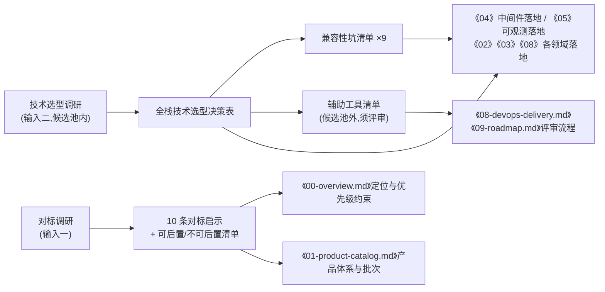

# 附录 · 对标调研与全栈技术选型决策表(调研输入汇编)

> **文档定位**:本文件是全书调研结论的**权威源文档**。调研产出分为两大输入:
> - **调研输入一:对标调研**——对标阿里云的完整拆解,产出"10 条对标启示"与"可后置/不可后置清单";
> - **调研输入二:全栈技术选型**——在用户给定候选池内的选型决策,产出《全栈技术选型决策表》(含"兼容性坑清单"与"辅助工具清单")。
>
> 全书各章对调研结论的编号引用(如"对标启示 N""调研启示 N""启示 #N""选型坑清单 #N""选型表坑清单 N""调研输入二坑清单 N""调研兼容性坑清单第 N 条""选型决策表兼容性坑 #N""调研输入二第二节""选型决策表第三节"等)**均以本文件为准**。
>
> **与各章的关系**:本文件结论对全书具有上游约束力;各专章的落地细化比本文件更具体时以专章为准;发现专章与本文件冲突时,由归属章节提请架构评审裁决,裁决后回写本文件与相关章节(与《00-overview.md》"交叉引用冲突处理"规则一致)。
>
> **版本**:v1.0(2026-08) · **状态**:架构委员会已裁决(见《11-adjudication-decisions.md》),进入传播修复阶段 · **评审通过后变更须走变更流程(见 §5)**
>
> **与裁决书的一致性声明**:本文件作为"对标启示/选型决策/兼容性坑清单"的权威源,与《11-adjudication-decisions.md》§1 事实源归属表一致;裁决书 S6 推翻推荐"URI 路径版本 /v1/"所援引的依据即本文件 §3.4 启示 5(RPC 风格、Action、参数显式),本文件维持该启示口径不变。本文件涉及的命名/环境/trace-ES 等口径已按裁决书 C4/S18/S28 回写:服务名 `svc-{domain}`、Nacos Group=应用名、Nacos 环境 namespace 收敛为 `dev/staging/prod`、trace 存储使用与搜索 ES 物理隔离的独立 trace-ES 集群。

---

## 目录

- [1. 引用约定:编号引用如何落到本文件](#1-引用约定编号引用如何落到本文件)
- [2. 调研背景与方法](#2-调研背景与方法)
- [3. 调研输入一:对标调研拆解](#3-调研输入一对标调研拆解)
- [4. 调研输入二:全栈技术选型决策表](#4-调研输入二全栈技术选型决策表)
- [5. 变更流程与责任](#5-变更流程与责任)

---

## 1. 引用约定:编号引用如何落到本文件

| 各章引用写法 | 权威出处(本文件锚点) |
|---|---|
| 对标启示 N / 调研启示 N / 启示 #N | [§3.4 十条对标启示](#34-十条对标启示)第 N 条 |
| "不可后置清单" / "可后置清单" | [§3.5 可后置/不可后置清单](#35-可后置不可后置清单归属启示-10) |
| 调研输入二第二节 / 选型决策表"语言分工" | [§4.2 第二节 · 选型决策总表](#42-第二节--全栈选型决策总表) |
| 选型决策表第三节 / 环境隔离约定 | [§4.3 第三节 · 多环境与隔离约定](#43-第三节--多环境与隔离约定) |
| 选型坑清单 #N / 选型表坑清单 N / 调研输入二坑清单 N / 调研兼容性坑清单第 N 条 / 选型决策表兼容性坑 #N | [§4.4 第四节 · 兼容性坑清单](#44-第四节--兼容性坑清单)第 N 条 |
| 候选池闭环 / 辅助工具须评审 | [§4.1 第一节 · 选型纪律与候选池](#41-第一节--选型纪律与候选池) |
| 辅助工具清单 / 候选池外小工具 | [§4.5 第五节 · 辅助工具清单](#45-第五节--辅助工具清单候选池外可选引入须评审) |
| 全栈技术选型决策表(总表) | [§4.2 第二节 · 选型决策总表](#42-第二节--全栈选型决策总表) |

---

## 2. 调研背景与方法

- **调研对象**:以阿里云为主对标(产品形态、官网 IA、商业模式、API 风格),辅以腾讯云、华为云公开资料交叉验证;技术选型调研覆盖用户给定候选池内全部组件的自建适配性。
- **调研时间**:2026-Q2,结论随本文件进入架构评审基线。
- **对标策略三档**:照搬(模式照抄)/ 裁剪(简化实现)/ 不做(明确放弃),三档划分在《00-overview.md》§1.2 落地为约束性结论;本文件 §3.1~§3.3 给出其调研依据。
- **选型原则**:所有技术决策按统一决策卡格式输出——**结论 + 理由 + 备选方案 + 什么条件下改选备选**;不允许出现只有结论没有改选条件的决策。

---

## 3. 调研输入一:对标调研拆解

### 3.1 产品大类全景(结论级)

| 产品大类 | 阿里云对标 | 本平台策略 | 调研依据 | 落地章节 |
|---|---|---|---|---|
| 计算 | ECS/ACK/函数计算 | **裁剪**:容器化计算先行,虚机形态模型预留、KubeVirt 二期;全品类 Serverless 不做 | 虚机全栈自研成本不可承受,K8s 同时是底座与产品 | 《01》§2.1、《06》、《09》决策 R-03 |
| 存储 | OSS/块存储/NAS | **裁剪**:MinIO 封装对象存储(自建控制面),块存储随计算演进;文件存储后置 | S3 生态兼容成本最低 | 《01》§2.2、《04》§9 |
| 网络 | VPC/SLB/EIP | **照搬模型、裁剪实现**:VPC/子网/EIP 模型 Day 1 建模,安全组二期产品化 | 网络模型是多租户隔离前提 | 《01》§2.3、《07》 |
| 数据库 | RDS MySQL/Redis | **裁剪**:托管 MySQL/Redis 起步(K8s Operator 形态),其他引擎后置 | 两大品类覆盖 80% 场景 | 《01》§2.4、《06》 |
| 大数据与 AI | MaxCompute/PAI 全家桶 | **不做**(一期):监控类(云监控对标)保留,以 Prometheus/VictoriaMetrics 多租户化实现 | 团队规模不支撑 | 《01》§2.6 |
| 安全 | 云盾全家桶 | **裁剪**:平台自身安全基线 + AK/RAM 先做;商业化安全产品后置 | 见 §3.5 不可后置项 | 《01》§2.7、《07》 |
| 域名与建站 | 域名/备案/建站 | **裁剪过渡**:上游注册商代理 + 自建控制台与订单流,解析自建 | 注册局资质审批周期长 | 《01》§2.9 |
| 云市场/行业方案 | 云市场/解决方案 | **不做**(写入可后置清单) | 无存量生态,需求未验证 | 《01》§3.2 |

> 品类明细、依赖关系与批次规划以《01-product-catalog.md》§2、§3 为准,本表仅为调研结论快照。

### 3.2 官网信息架构要点

1. **"目录三件套"是官网 IA 骨架**:分类目录页 → 产品详情页 → 定价页;新产品上架 = 按固定模板"填槽",模板稳定比页面华丽重要(详见《01-product-catalog.md》§4.2 页面模板决策)。
2. **转化漏斗四段**:浏览(营销官网/SEO)→ 试用(免费试用额度)→ 购买(下单页/费用中心)→ 留存(续费提醒/资源生命周期透明)。
3. **文档站是准入门槛而非附属**:快速入门 + API 参考先行,最佳实践后补;文档与 OpenAPI 元数据同源生成。
4. **控制台体验对标项**:地域选择器全局一等公民、最近访问、全局搜索、微前端子应用保活(切产品不丢表单)。

### 3.3 商业模式要点

1. **计费四形态必须 Day 1 对齐**:包年包月、按量付费、抢占式、资源包——这是云厂商商业沉淀,自建无捷径(《00-overview.md》§1.2"照搬"档、《01》§5.1)。
2. **出账链路**:计量 → 小时出账 → 抵扣(代金券/资源包)→ 月账单 → 对账;任何"明细→汇总"口径必须在计量/计费域内闭环对账。
3. **欠费生命周期状态机**:欠费 → 宽限期 → 停服锁定 → 到期释放,配合数据保留政策与多渠道到期通知;状态透明 = 商业信任(《01》§5.4、《03》生命周期域)。
4. **免费试用策略**:以低门槛试用产品作为获客主路径之一,试用额度与计量管道同源(《01》§5.3)。

### 3.4 十条对标启示

> 全书按编号引用本清单。每条含"启示内容 + 调研依据 + 本书落地点"。

| # | 启示 | 调研依据 | 本书落地点 |
|---|---|---|---|
| **1** | **账号/IAM 是一切产品的地基,Day 1 自建、不可外包信任根,晚做则全平台返工** | 账号体系承载实名、RAM、AK/SK、审计,是所有商业与资源操作的信任根;后补将导致全量服务改造 | 《03》账号/RAM 服务(Day 1 服务)、《07》、《09》Build-vs-Buy"坚持自建" |
| **2** | **计量计费先于产品规划**:计量项注册制是产品上架前置门禁,缺计量字段后期补齐成本极高 | 对标厂商每个产品注册即带计量项定义;后补建模需要回刷存量数据,成本是前期 5 倍以上 | 《01》§1.3 上架注册规范、《03》svc-catalog 三件套注册、《05》§2 Schema 注册制与 §11 依赖提示 |
| **3** | **计费四形态与出账链路是商业底盘,Day 1 照搬,不自创简化版** | 客户心智与竞对对齐;形态缺失会直接造成商机流失与对账口径混乱 | 《00》§1.2 照搬档、《01》§5.1、《03》计费出账域 |
| **4** | **文档可简陋不可缺**:文档站与 OpenAPI 同版本发布,杜绝"文档滞后于接口" | 开发者体验是云平台获客主路径;文档滞后直接劝退集成 | 《03》API 元数据/SDK 规则③、《02》文档站、《01》文档站页面地图 |
| **5** | **"目录三件套"(分类目录→产品详情→定价)是官网 IA 与产品填槽模板;控制面 OpenAPI 以命令式操作为主(CreateXxx/DescribeXxx/DeleteXxx),RPC 风格参数显式、签名简单、文档模板统一** | 对标阿里云 API 风格与官网模板:统一范式使新产品接入边际成本趋近于零 | 《01》§4.2 页面模板决策、《03》OpenAPI 规范 |
| **6** | **Region/AZ 模型 Day 1 建模**:数据模型强制带 region/az 作用域字段,物理部署可以单地域起步("模型先行、部署后置") | 后补地域字段的改造波及全部表与 API;对标厂商地域模型从第一天贯穿 | 《00》§4.1、《01》§1.4、《03》、《05》标签规范、《06》集群标签、《07》网络建模 |
| **7** | **计算形态 MVP 先容器、虚拟化后置,但资源模型必须现在预留虚机形态**:模型必须现在预留,实现可以后做 | 全栈虚拟化自研成本不可承受;K8s 同时是底座与产品,二期以 KubeVirt 承接虚机(《09》决策 R-03) | 《06》资源抽象驱动层、《09》二期 KubeVirt |
| **8** | **资源生命周期状态机与数据保留政策是商业可信度底线**:欠费/到期通知必须可达可追溯,绝不误删客户数据;状态透明 = 信任 | 一次误删客户数据的事故足以摧毁新平台的信任;对标厂商"宽限→锁定→保留期→释放"全透明 | 《01》§5.4、《03》生命周期与通知约束、《05》监控数据与资源生命周期联动、《06》suspend 语义 |
| **9** | **订单中心是商业化复杂度的中枢**:统一订单模型覆盖五种交易类型(新购/续费/升配/降配/退订),各产品线不得自建订单 | 订单分散导致优惠、发票、对账口径碎片化 | 《01》§5.2、《03》订单中心 |
| **10** | **建立"可后置/不可后置"清单防止需求蔓延**:不可后置项任何批次规划不得侵占,可后置项明确写入清单接受监督(清单见 §3.5) | 对标厂商功能面过宽,自建团队必须用清单对抗范围蔓延 | 《01》§3.4、《03》工单/STS 边界、《06》后置清单、《07》安全后置清单 |

### 3.5 可后置/不可后置清单(归属启示 10)

**不可后置(任何批次规划都不得后置)**:

| 能力 | 理由 |
|---|---|
| 认证鉴权(IAM/RAM) | 启示 1,信任根 |
| 计量计费与账单 | 启示 2/3,商业闭环 |
| OpenAPI 体系(含 AK/SK 签名) | 启示 4/5,开发者准入门槛 |
| 文档站(可简陋不可缺) | 启示 4 |
| 工单通道 | 客户求助底线,MVP 以最简形态上线 |
| 审计留存、属主校验、KMS | 安全可信度底线(《07》细化:这五项任一缺失直接击穿商业可信度) |

**明确可后置(接受监督,出现明确需求再启动)**:

活动运营体系、资源包商城、推荐返佣、云市场雏形、行业解决方案页、高级价格计算器、购物车、STS 临时凭证之外的凭证增强、Bot 管理、主机安全商业化、BYOK、零信任(mTLS 全量)、云安全中心聚合大盘、Kata 沙箱运行时、Cilium 替换、多集群联邦调度、GPU 池精细化调度(各章细化清单见对应章节)。

### 3.6 未编号的调研结论(补充)

以下结论在调研中形成、已被个别章节引用但未进入十条编号启示,登记于此以便核验:

- **域名/备案是上云入口**:域名是获客入口产品,以"上游注册商代理 + 自建控制台与订单流"过渡(《01》§2.9)。
- **免费试用是转化标配**:试用额度与计量管道同源,转化漏斗第二段(《01》§5.3)。
- **控制台体验对标项**:地域切换广播、最近访问、子应用保活等体验项直接对标阿里云控制台(《02》)。

---

## 4. 调研输入二:全栈技术选型决策表

### 4.1 第一节 · 选型纪律与候选池

**候选池(用户给定,选型闭环边界)**:

| 领域 | 候选池 |
|---|---|
| 前端 | Vue + 微前端 |
| 后端框架 | Go-Zero / Kratos |
| API 网关 | APISIX / Kong |
| 注册中心 | Nacos / Consul |
| 配置中心 | Nacos / Apollo |
| 消息队列 | Kafka |
| 数据库 | MySQL 分库分表(Vitess 承载) |
| 缓存 | Redis Cluster |
| 搜索 | Elasticsearch |
| 时序数据 | Prometheus / VictoriaMetrics |
| 对象存储 | OSS / Ceph / MinIO(自建场景) |
| 容器平台 | Kubernetes |
| 日志 | ELK / ClickHouse |
| 链路追踪 | SkyWalking / OpenTelemetry |
| CI/CD | GitLab CI / Jenkins / ArgoCD |

**三条选型纪律**:

1. **候选池闭环**:不引入候选池之外的重型组件;任何新增重型组件必须先修订本决策表并经架构评审。
2. **决策卡格式**:每项决策必须包含"结论 + 理由 + 备选方案 + 什么条件下改选备选",改选条件触发即启动重新评审,不允许私自切换。
3. **辅助小工具须标注且须评审**:候选池外的小工具(采集器、扫描器、声明式 CLI 等)允许使用,但必须显式标注"可选",纳入 §4.5 清单,并按《09-roadmap.md》定义的评审流程由 SRE 评审运维成本后引入。

### 4.2 第二节 · 全栈选型决策总表

| # | 领域 | 决策(结论) | 核心理由 | 备选 | 改选条件 | 落地章节 |
|---|---|---|---|---|---|---|
| 1 | 前端框架 | **Vue3 + Vite** | 团队生态与招聘面;SSR 官网需求;与微前端基线一致 | — | — | 《02》 |
| 2 | 微前端 | **Wujie** | 隔离最彻底(WebComponent + iframe 沙箱)、Vite/Vue3 子应用零改造、alive 保活体验对标阿里云控制台 | qiankun / Module Federation | 已有 qiankun 存量基座且子应用以 Webpack/React 为主改 qiankun;运行期共享有状态实例场景局部用 MF 补充,不整体替换 | 《02》§3 |
| 3 | 后端框架 | **Go + Kratos(全部微服务统一栈)**;按域分三类:业务规则域(IAM/订单/计费/编排)、高吞吐接入域(计量/审计/通知/BFF)、资源动手域(rc-\* 控制器/Operator) | 单语言收敛运维面与技能栈;Kratos gRPC-first、编译产物小、内存占用低;统一 Nacos 注册、东西向统一 gRPC + Protobuf(IDL-first) | Go-Zero | Go 团队需要开箱即用(内置缓存/限流/代码生成)快速起步时改 Go-Zero;**一旦定下不允许两框架混用** | 《03》§2、《06》§1(所有直接操作 K8s API 的组件用 Go) |
| 4 | API 网关 | **APISIX** | 全动态配置、插件热加载、语言中立统一承接 Go 服务;限流/认证/灰度插件成熟、K8s 友好 | Kong | 需商业支持合同才考虑 Kong | 《04》§3、《00》§2.4 |
| 5 | 注册 + 配置 | **Nacos 一体化**(注册与配置一套栈) | 一套 HA 集群一套权限,运维成本减半;SCA 原生集成、Go SDK 成熟;namespace/group 覆盖多环境 | Consul(注册)/ Apollo(配置) | 需多数据中心联邦/服务网格选 Consul;同时满足①合规级变更审批留痕②IP 级灰度③数千配置项且已有 Apollo 运维经验,才拆 Apollo 配置 | 《04》§4、《08》配置基线 |
| 6 | 消息队列 | **Kafka(KRaft)** | 候选池唯一 MQ;高吞吐、生态最全,计量/审计/日志类大流量场景天然适配 | (池内无) | — | 《04》§5 |
| 7 | 关系数据库 | **MySQL 分库分表 + Vitess(集中式分片代理)** | Go 原生组件;vtgate 以 MySQL 协议统一供 Go 服务接入,无语言耦合;vindex 按 account_id 分片;支持 Reshard 扩容、读写分离 | ShardingSphere-Proxy(已废止,Java 承载) | 出现跨库强一致事务硬诉求时评估 Proxy,但默认维持 Vitess(架构原则为"本地事务+Outbox",避免跨分片强一致) | 《04》§6、《05》§3 |
| 8 | 缓存 | **Redis Cluster**(3 主 3 从起步) | 候选池结论;热数据、分布式协调、会话与黑名单 | — | — | 《04》§7 |
| 9 | 搜索 | **Elasticsearch(仅搜索,搜索 ES 集群)** | 官网/产品/文档三类搜索;日志检索按选型走 ClickHouse,搜索 ES 不承担日志负载;trace 存储由 SkyWalking OAP 使用独立的 trace-ES 集群,与搜索 ES 物理隔离(见 #12) | ELK 全家桶 | 强依赖 Kibana 开箱体验与全文检索为第一诉求时 | 《04》§8、《05》§2.3 |
| 10 | OLAP / 日志存储 | **ClickHouse**(承接计量明细/账单分析/日志/审计四类负载)+ Vector 采集 | 列存压缩成本约为 ES 1/10;SQL 分析、高吞吐写入;一套引擎收敛运维面 | ELK | 同 #9 | 《05》§2.3、§5、§7.2 |
| 11 | 指标 | **Prometheus(短期热数据)+ VictoriaMetrics(长期,remote_write 承接)**;Grafana 展示、Alertmanager 统一告警出口 | 单机 Prometheus 只留 2~6h~7d 热数据;VM 提供长保留、高压缩比与多租户 accountID 能力(二期引入) | Prometheus 自身长保留 | 数据量小、保留期 ≤30 天且无多租户诉求时可用 Prometheus 长保留 | 《05》§7.1、《09》二期扩容 |
| 12 | 链路追踪 | **OpenTelemetry 统一埋点 + SkyWalking OAP 接收存储(Otel receiver,存储用独立的 trace-ES 集群)** | OTel 行业标准、Go SDK 成熟、厂商中立;OAP 提供一体化 APM UI 与存储;trace 存储使用独立的 trace-ES 集群,与搜索 ES 物理隔离 | 纯 OTel Collector + 自研存储 | 全平台统一口径优先,维持 OTel Go SDK | 《05》§7.3 |
| 13 | 对象存储 | **MinIO**(自建场景;内部使用 + 对外售卖双角色) | S3 兼容、K8s Operator 成熟、自建运维轻 | Ceph / 公有云 OSS | 需块+文件+对象统一存储且规模很大选 Ceph;整体托管上公有云则直接买 OSS(接口 S3 化保证可切换) | 《04》§9、《09》Build-vs-Buy |
| 14 | 容器平台 | **Kubernetes** | 同时是管控面运行底座与数据面资源池,一套平台两面复用 | 无(候选池内唯一) | — | 《06》、《04》§2 |
| 15 | CI | **GitLab CI** | 流水线即代码、与代码库/MR/制品库一体;平台从 0 到 1 无存量 VM 脚本包袱 | Jenkins | 并购/接入团队带来大量 Jenkins 存量流水线时作为第二 CI 承接存量,新服务仍走 GitLab CI;**CD 必须一元** | 《08》§2 |
| 16 | CD | **ArgoCD(GitOps)** | K8s 原生、声明式状态可审计、回滚与多集群支持;CI 禁止持有生产集群 kubeconfig | Flux | 偏好更轻量控制器风格且不需要 UI 时 | 《08》§2 |
| 17 | 代码托管 | **GitLab 自建(CE 起步)** | 与 GitLab CI 一体,MR/流水线/制品库统一权限模型 | 自建 Gitea + 第三方 CI | 团队极小且只需轻量托管时 | 《08》§2 |

> 南北向统一 HTTP/OpenAPI(JSON),东西向统一 gRPC + Protobuf(IDL-first,跨 Go 服务生成),与本表 #3 一致(《00》§2.3.2、《03》、《04》)。

### 4.3 第三节 · 多环境与隔离约定

1. **环境隔离**:dev / staging / prod 各自独立中间件实例(联调合并入 dev,不设 test/unit/dev-test),不做跨环境共享。
2. **Nacos 约定**:环境用 **namespace** 隔离(`dev/staging/prod`),应用用 **group** 隔离(Group=应用名,即与服务名同,如 `svc-order`);服务名规范 `svc-{domain}`,Go 服务注册名统一;敏感配置不入 Nacos 明文(K8s Secret 注入)。
3. **网关订阅边界**:prod 网关只订阅 `prod` namespace;APISIX `service_name` 必须写成 `{GROUP}@@{serviceName}` 且与服务注册端完全一致(见坑 #2)。
4. **Kafka 约定**:topic 名中**不含环境标识**,环境隔离靠集群隔离,避免"测试流量写进生产 topic"类事故。
5. **K8s 约定**:环境/组件以 namespace 隔离,中间件分节点池(`pool-gateway/middleware/business/observability`)taint 隔离。

### 4.4 第四节 · 兼容性坑清单

> 全书按编号引用本清单;各章落地处以 **⚠ 兼容性** 标注对应编号。

| # | 坑(现象/根因) | 规避措施 | 落地章节 |
|---|---|---|---|
| **1** | **禁止多路 trace 上报并存**——双份上报且上下文(trace context)传播断裂 | CI 镜像构建基线只内置 OTel exporter,把该红线做成构建约束;全平台统一 OTel 埋点口径 | 《05》§7.3 |
| **2** | **APISIX↔Nacos 服务发现兼容性**:discovery 走 Nacos 1.x 风格 HTTP Open API,版本漂移/未鉴权会导致订阅失败 | Nacos 锁定 **2.4.x LTS**,启用鉴权并为 `apisix_ro` 配只读权限;`service_name` 必须 `{GROUP}@@{serviceName}` 且与注册端一致;升级 Nacos 3.x 前必须在 staging 验证 discovery 兼容性 | 《04》§3.7 |
| **3** | **APISIX 依赖 etcd**,etcd 缺管会成为网关单点 | etcd 纳入中间件运维清单(备份/监控/版本升级);三个 APISIX 分区集群共享一套 3 节点 etcd;OpenAPI 区 QPS > 2 万或合规要求强隔离时 etcd 随集群一并拆分 | 《04》§3.1 |
| **4** | **Filebeat 的 ClickHouse 输出是社区插件**,稳定性无保障 | 日志采集统一 **Vector**(官方支持 ClickHouse sink),DaemonSet 形态与 K8s 对齐 | 《05》§7.2 |
| **5** | **MySQL 驱动/vtgate 连接耦合坑**:Go MySQL driver 与 vtgate 版本组合漂移、长连接被中间设备掐断、连接池不设 keepalive 导致连接泄漏误报 | Go driver 与 vtgate 版本组合在基础镜像中固化并回归;连接池开启 `keepalive`;统一经 vtgate 访问分片,不直连 vttablet | 《04》§6 |
| **6** | **qiankun 对 Vite ESM 子应用需插件侵入**(部分 HMR 不支持),微前端产物约束易被遗漏 | 选 Wujie(entry 模式零改造);CI 校验:`publicPath` 必须绝对路径、子应用产物路径前缀与注册中心登记一致、跨域头由网关统一注入 | 《02》§3、《08》质量门禁 |
| **7** | **Prometheus→VictoriaMetrics 迁移行为差异**:直接切流会造成指标口径漂移 | remote_write **双写对比 ≥ 1 周**后切流;recording rule 尽量留在 Prometheus 侧,VM 只存结果 | 《05》§7.1、《09》二期扩容 |
| **8** | **MinIO 升级与最小拓扑约束**:跨大版本滚动升级有数据风险;纠删码盘数不足无法提供冗余 | MinIO **Operator 部署**;纠删码**最少 4 盘**起步;**禁止跨大版本滚动升级**(升级路径逐级进行) | 《04》§9、《06》 |
| **9** | **ClickHouse 不擅长高频删除/更新**,手工 DELETE 会拖垮合并 | 生命周期一律靠 **TTL(分区级淘汰)** 承担,不做手工删除;CK 表设计避免更新型负载,修正类数据用新版本行覆盖语义 | 《05》§5 |

### 4.5 第五节 · 辅助工具清单(候选池外,"可选",引入须评审)

> 以下工具不属于候选池重型组件,按"辅助小工具"纪律管理:显式标注、SRE 评审运维成本、纳入《09-roadmap.md》采购/自建评审清单。

| 工具 | 用途 | 引入理由 | 状态/落地章节 |
|---|---|---|---|
| Vector | 日志采集(K8s DaemonSet → Kafka/ClickHouse) | 官方支持 ClickHouse sink(坑 #4) | 采用,《05》§7.2 |
| Harbor | 镜像仓库(RBAC/扫描/签名/复制) | MinIO 定位业务数据不适合做镜像仓库;交付体系必需 | 采用,《08》§2 决策 D-08-03 |
| Argo Rollouts | 渐进式发布(金丝雀/蓝绿 + 指标自动分析) | 与 ArgoCD 同源 | 采用,《08》 |
| Trivy / Semgrep | 镜像漏洞扫描 / SAST 门禁 | 安全左移原则 | 采用,《08》质量门禁、《07》 |
| Sealed Secrets | 加密 Secret 入 Git(GitOps 闭环) | 声明式密钥管理 | 采用,《08》 |
| Archery 或 Bytebase(二选一) | SQL 审核平台(提交-审核-执行留痕 + gh-ost 在线 DDL) | 变更留痕与 DBA 审核自动化 | 采用(二选一),《08》 |
| canal / Debezium(可选) | binlog 同步(异地灾备/存量库整库同步) | P3 两地三中心账务数据同步;事务 Outbox 优先,canal 为可选兜底 | 可选,《00》§4.5、《05》§2.3 |
| local-static-provisioner | 本地 NVMe PV 静态供给 | Kafka/ES/CK/MinIO 本地盘需求 | 采用,《04》§2.1 |
| Vitess | 集中式 MySQL 分片代理(vtgate/vttablet/vtctld) | Go 原生、vtgate 以 MySQL 协议统一供 Go 服务接入,替代 Java 内嵌 ShardingSphere,随统一 Go 栈引入 | 采用,《04》§6 |
| Flink | 流式复杂聚合 | 候选池无;一期自研消费者(SDKafka + Redis 状态)即可 | **备选不引入**,出现复杂多流 join/CEP 需求时重评,《05》§2.3 |

---

## 5. 变更流程与责任

1. **本文件是调研基线**:任何章节发现需要新增选型、推翻某条启示或坑清单失效时,不得私改本文件,须向架构评审委员会提交变更申请(含:变更内容、影响章节清单、回归验证方案)。
2. **裁决后回写**:评审通过后更新本文件版本号与修订记录,并同步回写受影响章节(各章"与选型决策表一致"的声明随更新重新核验)。
3. **编号只增不删**:启示与坑清单编号只增补、不复用;被废止的条目保留编号并标注"已废止 + 替代条目",保证历史引用可追溯。
4. **责任人**:本文件由总负责人(架构评审委员会秘书)维护;调研输入一责任人为产品架构负责人,调研输入二责任人为基础设施架构负责人。

> **变更登记(2026-08):统一后端为 Go。** 经架构评审裁决:选型表 #3 后端框架由"Java/Spring Cloud + Go/Kratos 双栈"改为"统一 Go + Kratos";#7 关系数据库由 ShardingSphere-JDBC 改为 **Vitess**(候选池外重型组件,已在 §4.5 登记);#12 链路追踪改为纯 OTel Go SDK;坑清单 #5 由 Java 驱动坑改为 Vitess/Go driver 坑。#3/#7/#12 原编号保留,正文改写并标注替代关系。受影响章节:00/02/03/04/05/06/07/08/09/11,由各章 fixer 按本表回写。
